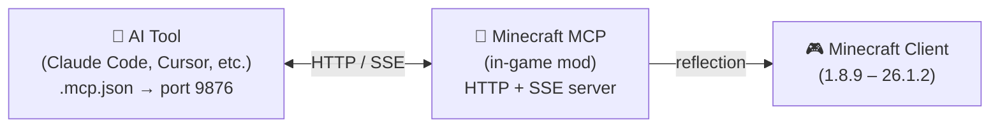

<!-- markdownlint-disable MD033 MD041 MD036 -->
<div align="center">


# Minecraft MCP

**Let AI Play Minecraft — Control Any Version, Any Modloader**

[](#license)
[](https://www.java.com/)
[](https://github.com/langyo/minecraft-mcp/releases)

**English** &bull; **[简体中文](docs/guides/zhs/README.md)** &bull; **[繁體中文](docs/guides/zht/README.md)** &bull; **[日本語](docs/guides/ja/README.md)** &bull; **[한국어](docs/guides/ko/README.md)** &bull; **[Français](docs/guides/fr/README.md)** &bull; **[Español](docs/guides/es/README.md)** &bull; **[Русский](docs/guides/ru/README.md)**

</div>
<!-- markdownlint-enable MD033 MD041 MD036 -->

## What is Minecraft MCP

Minecraft MCP is a bridge between AI assistants and Minecraft. It runs as a mod inside the game, exposing an HTTP server that AI tools — **Claude Code, Cursor, Cline, GitHub Copilot, and 20+ others** — can connect to via the standard MCP protocol. Through this bridge, AI can see the game, click buttons, type commands, and interact with the world.

> Want your AI to build a castle? Run a smoke test? Navigate a modpack menu? Minecraft MCP makes it possible.

- **See** — capture screenshots with coordinate grids
- **Act** — click, type, scroll, drag, and press any key
- **Know** — query player position, world info, screen buttons, and debug fields
- **Record** — stream events in real time via SSE, capture video frames

[AI Tool Integration Guide →](docs/guides/en/AI-TOOLS.md)

## Supported Versions

| MC Version | Forge | Fabric | NeoForge |
|------------|:-----:|:------:|:--------:|
| 1.8.9 | ✓ | | |
| 1.9.4 | ✓ | | |
| 1.10.2 | ✓ | | |
| 1.11.2 | ✓ | | |
| 1.12.2 | ✓ | | |
| 1.13.2 | ✓ | | |
| 1.14.4 | ✓ | 🚧 | |
| 1.15.2 | ✓ | 🚧 | |
| 1.16.5 | ✓ | 🚧 | |
| 1.17.1 | ✓ | 🚧 | |
| 1.18.2 | ✓ | 🚧 | |
| 1.19.4 | ✓ | 🚧 | |
| 1.20.6 | ✓ | 🚧 | 🚧 |
| 1.21.7 | ✓ | | |
| 26.1.2 | ✓ | | 🚧 |

> 🚧 = Work In Progress

## Quick Start

### Prerequisites

- JDK 21 (Corretto recommended)

### Setup & Build

```bash
# Install dependencies
pip install -r scripts/requirements.txt

# Build everything
just full
```

### Run

```bash
# Start the daemon and launch Minecraft
just daemon
just launch 1.21.7 forge

# Or run an end-to-end smoke test
just smoke 1.21.7
```

## How It Works



The mod runs an HTTP server on port 9876 inside Minecraft. Your AI tool connects via the standard MCP protocol (SSE transport), and every command — click, type, screenshot, etc. — uses Java reflection to work across all Minecraft versions without version-specific code.

## Contributing

Issues and pull requests are welcome.

## License

Licensed under either of:

- Apache License, Version 2.0 ([LICENSE-APACHE](LICENSE-APACHE) or http://www.apache.org/licenses/LICENSE-2.0)
- MIT License ([LICENSE-MIT](LICENSE-MIT) or http://opensource.org/licenses/MIT)

at your option.
