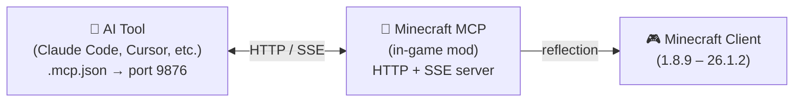

<!-- markdownlint-disable MD033 MD041 MD036 -->
<div align="center">


# Minecraft MCP

**Let AI play Minecraft**

[](#license)
[](https://www.java.com/)
[](https://github.com/langyo/minecraft-mod-mcp/releases)
[](https://www.npmjs.com/package/minecraft-mod-mcp)

**English** &bull; **[简体中文](docs/guides/zhs/README.md)** &bull; **[繁體中文](docs/guides/zht/README.md)** &bull; **[日本語](docs/guides/ja/README.md)** &bull; **[한국어](docs/guides/ko/README.md)** &bull; **[Français](docs/guides/fr/README.md)** &bull; **[Español](docs/guides/es/README.md)** &bull; **[Русский](docs/guides/ru/README.md)**

</div>
<!-- markdownlint-enable MD033 MD041 MD036 -->

## 🤖 Connect Your AI to Minecraft

**Copy this link and paste it to your AI agent — it will configure itself automatically:**

```
https://github.com/langyo/minecraft-mod-mcp/blob/main/docs/guides/en/AI-TOOLS.md
```

Your AI reads the guide, sets up the MCP connection, and starts controlling the game. No manual config needed.

> Already have the mod installed? That one link is all you need.

---

## What is Minecraft MCP

Minecraft MCP is a mod that lets AI assistants control Minecraft. Drop it in your `mods` folder, launch the game, and your AI can see the screen, click buttons, type commands, and interact with the world — all through the standard MCP protocol.

- **See** — capture screenshots with coordinate grids
- **Act** — click, type, scroll, drag, and press any key
- **Know** — query player position, world info, screen buttons, and debug fields
- **Record** — stream events in real time via SSE, capture video frames

> Want your AI to build a castle? Run a smoke test? Navigate a modpack menu? Minecraft MCP makes it possible.

---

## Supported Versions

| MC Version | Forge | Fabric | NeoForge |
|------------|:-----:|:------:|:--------:|
| 1.8.9 | ✓ | — | — |
| 1.9.4 | ✓ | — | — |
| 1.10.2 | ✓ | — | — |
| 1.11.2 | ✓ | — | — |
| 1.12.2 | ✓ | — | — |
| 1.13.2 | ✓ | — | — |
| 1.14.4 | ✓ | 🚧 | — |
| 1.15.2 | ✓ | 🚧 | — |
| 1.16.5 | ✓ | 🚧 | — |
| 1.17.1 | ✓ | 🚧 | — |
| 1.18.2 | ✓ | 🚧 | — |
| 1.19.4 | ✓ | 🚧 | — |
| 1.20.6 | ✓ | 🚧 | 🚧 |
| 1.21.7 | ✓ | — | — |
| 26.1.2 | ✓ | — | 🚧 |

> 🚧 = Work In Progress

---

## Getting Started

### 1. Install the Mod

Download the JAR from [GitHub Releases](https://github.com/langyo/minecraft-mod-mcp/releases) and place it in your Minecraft `mods` folder.

- Requires **Forge**, **Fabric**, or **NeoForge** (see supported versions above)
- Works with Minecraft **1.8.9** through **26.1.2**

### 2. Install the MCP Bridge

```bash
npm install -g minecraft-mod-mcp
```

Or run without installing:

```bash
npx minecraft-mod-mcp
```

### 3. Launch Minecraft

Launch the game with your modloader. The mod starts an HTTP server on port 9876 automatically.

### 4. Connect Your AI

**[→ AI Tool Integration Guide](docs/guides/en/AI-TOOLS.md)** — step-by-step for Claude Code, Cursor, Cline, Copilot, and 20+ other AI tools.

Or paste this link to your AI agent and let it handle the setup:

```
https://github.com/langyo/minecraft-mod-mcp/blob/main/docs/guides/en/AI-TOOLS.md
```

---

## How It Works



The mod runs an HTTP server on port 9876 inside Minecraft. Your AI tool connects via the standard MCP protocol (SSE transport), and every command — click, type, screenshot, etc. — uses Java reflection to work across all Minecraft versions without version-specific code.

---

## Building from Source

> This section is for contributors. If you just want to use the mod, see [Getting Started](#getting-started) above.

See [CONTRIBUTING.md](CONTRIBUTING.md) for development setup, project structure, and guidelines.

---

## License

Licensed under either of:

- Apache License, Version 2.0 ([LICENSE-APACHE](LICENSE-APACHE) or http://www.apache.org/licenses/LICENSE-2.0)
- MIT License ([LICENSE-MIT](LICENSE-MIT) or http://opensource.org/licenses/MIT)

at your option.
