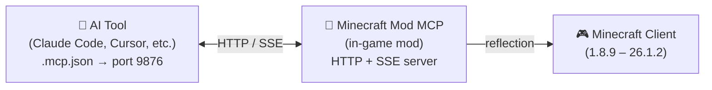

<!-- markdownlint-disable MD033 MD041 MD036 -->
<div align="center">


# Minecraft Mod MCP

**AI-powered mod development toolkit — build, test, and debug Minecraft mods with AI**

[](#license)
[](https://www.java.com/)
[](https://github.com/langyo/minecraft-mod-mcp/releases)
[](https://www.npmjs.com/package/minecraft-mod-mcp)

**English** &bull; **[简体中文](docs/guides/zhs/README.md)** &bull; **[繁體中文](docs/guides/zht/README.md)** &bull; **[日本語](docs/guides/ja/README.md)** &bull; **[한국어](docs/guides/ko/README.md)** &bull; **[Français](docs/guides/fr/README.md)** &bull; **[Español](docs/guides/es/README.md)** &bull; **[Русский](docs/guides/ru/README.md)**

</div>
<!-- markdownlint-enable MD033 MD041 MD036 -->

## 🤖 Connect Your AI to Minecraft

**Copy this link and paste it to your AI agent — it will configure itself automatically:**

```
https://github.com/langyo/minecraft-mod-mcp/blob/main/docs/guides/en/AI-TOOLS.md
```

Your AI reads the guide, sets up the MCP connection, and starts controlling the game. No manual config needed.

> Already have the mod installed? That one link is all you need.

---

## What is Minecraft Mod MCP

Minecraft Mod MCP is a mod designed for **AI-assisted mod development**. It exposes Minecraft's internals to AI tools via the MCP protocol, letting your AI agent inspect screens, click through GUIs, and run commands — perfect for testing mods, verifying behavior, and automating repetitive workflows.

> Built for mod developers — test your GUIs, verify block/item behavior, and run smoke tests on new features.

- **See** — capture screenshots with coordinate grids
- **Act** — click, type, scroll, drag, and press any key
- **Know** — query player position, world info, screen buttons, and debug fields
- **Record** — stream events in real time via SSE, capture video frames

---

## Supported Versions

| MC Version | Forge | Fabric | NeoForge |
|------------|:-----:|:------:|:--------:|
| 26.1.2 | [⬇](https://github.com/langyo/minecraft-mod-mcp/releases/latest/download/minecraft-mcp-26.1.2-forge.jar) | — | [⬇](https://github.com/langyo/minecraft-mod-mcp/releases/latest/download/minecraft-mcp-26.1.2-neoforge.jar) |
| 1.21.11 | [⬇](https://github.com/langyo/minecraft-mod-mcp/releases/latest/download/minecraft-mcp-1.21.11-forge.jar) | [⬇](https://github.com/langyo/minecraft-mod-mcp/releases/latest/download/minecraft-mcp-1.21.11-fabric.jar) | [⬇](https://github.com/langyo/minecraft-mod-mcp/releases/latest/download/minecraft-mcp-1.21.11-neoforge.jar) |

> Older versions (1.7.2 – 1.20.6) are available on the [releases page](https://github.com/langyo/minecraft-mod-mcp/releases).

---

## Getting Started

### 1. Install the Mod

Download the JAR from [GitHub Releases](https://github.com/langyo/minecraft-mod-mcp/releases) and place it in your Minecraft `mods` folder.

- Requires **Forge**, **Fabric**, or **NeoForge** (see supported versions above)
- Works with Minecraft **1.7.2** through **26.1.2**

### 2. Install the MCP Bridge

```bash
npm install -g minecraft-mod-mcp
```

Or run without installing:

```bash
npx minecraft-mod-mcp
```

### 3. Launch Minecraft

Launch the game with your modloader. The mod starts an HTTP server on port 9876 automatically.

### 4. Connect Your AI

**[→ AI Tool Integration Guide](docs/guides/en/AI-TOOLS.md)** — step-by-step for Claude Code, Cursor, Cline, Copilot, and 20+ other AI tools.

Or paste this link to your AI agent and let it handle the setup:

```
https://github.com/langyo/minecraft-mod-mcp/blob/main/docs/guides/en/AI-TOOLS.md
```

### 5. Using the CLI

**[→ CLI Usage Guide](docs/guides/en/CLI.md)** — launch clients, servers, manage versions, accounts, and build SDKs all from the command line.

---

## Usage Tips

### Working alongside the mod

Normally, switching away from Minecraft opens the pause screen, which can interrupt MCP commands. Use either method to break free:

- **Pause screen**: Press `Esc` to open the pause screen, then click the MCP overlay's **release mouse** button. This lets you switch windows freely without re-triggering the pause screen.
- **In-game overlay**: In the 3D view, click the MCP overlay button in the **top-right corner** to temporarily detach the mouse cursor. Once released, you can `Alt+Tab` away and the game won't auto-pause — perfect for working in your IDE or AI tool while the MCP connection stays alive.

### Port & HTTP server

The mod starts an HTTP server when the game loads. It tries port **9876** first; if occupied it falls back through **9875 → 9874 → ... → 9000** until it finds a free one. Set a fixed port with `-Dmcp.port=XXXX` (JVM arg) or `MC_MCP_PORT` (env).

To confirm which port the mod chose:
- The game prints `[MCP-MOD] Debug page: http://127.0.0.1:{port}/debug` to the console
- A clickable chat message with the debug page URL appears in-game
- `GET /api/status` returns `version`, `loader`, `port`, `pid`, `uptime` — the Node.js bridge uses this to auto-discover the mod on any port
- Open `http://localhost:{port}/debug` in your browser for a live dashboard with MCP logs, SSE events, and connection status

The version and loader (Forge/Fabric/NeoForge) are confirmed at handshake via `/api/status` so both the bridge and the debug page know exactly which mod environment they're talking to.

---

## How It Works

<details>
<summary>📸 Screenshot — click to expand</summary>


</details>



The mod runs an HTTP server on port 9876 inside Minecraft. Your AI tool connects via the standard MCP protocol (SSE transport), and every command — click, type, screenshot, etc. — uses Java reflection to work across all Minecraft versions without version-specific code.

---

## Building from Source

> This section is for contributors. If you just want to use the mod, see [Getting Started](#getting-started) above.

See [CONTRIBUTING.md](CONTRIBUTING.md) for development setup, project structure, and guidelines.

---

## License

Licensed under any of:

- Apache License, Version 2.0 ([LICENSE-APACHE](LICENSE-APACHE) or http://www.apache.org/licenses/LICENSE-2.0)
- MIT License ([LICENSE-MIT](LICENSE-MIT) or http://opensource.org/licenses/MIT)
- CC0 1.0 Universal ([LICENSE-CC0](LICENSE-CC0) or http://creativecommons.org/publicdomain/zero/1.0/)

at your option.
