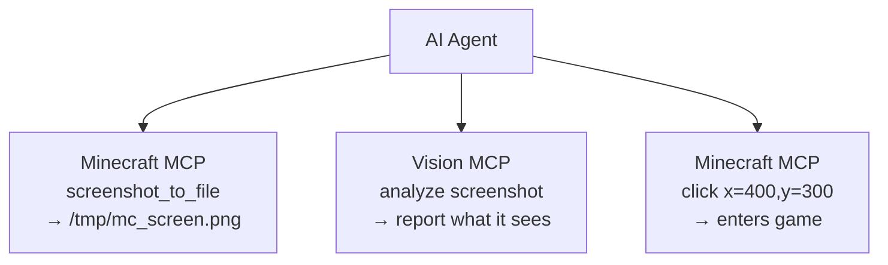

# AI Tool Integration Guide

**[English](./AI-TOOLS.md)** &bull; **[简体中文](../zhs/AI-TOOLS.md)** &bull; **[繁體中文](../zht/AI-TOOLS.md)** &bull; **[日本語](../ja/AI-TOOLS.md)** &bull; **[한국어](../ko/AI-TOOLS.md)** &bull; **[Français](../fr/AI-TOOLS.md)** &bull; **[Español](../es/AI-TOOLS.md)** &bull; **[Русский](../ru/AI-TOOLS.md)**

> **Tip**: You can simply ask your AI agent assistant to read this guide directly from this repository's URL. In most cases the agent will configure the MCP connection automatically — no manual setup is needed on your part.

This guide explains how to configure mainstream AI coding tools to connect to the Minecraft MCP server via HTTP.

## Minecraft MCP HTTP Endpoints

The Minecraft MCP server exposes the following HTTP endpoints (default port: **9876**):

| Endpoint | Method | Description |
|----------|--------|-------------|
| `/api/status` | GET | Health check |
| `/api/cmd` | POST | JSON-RPC command dispatch (body: `{"cmd":"...", "params":{...}}`) |
| `/api/screenshot` | GET | Take a screenshot, returns PNG base64 |
| `/api/events` | GET | SSE (Server-Sent Events) stream for real-time call history |
| `/api/calls` | GET | Returns last 50 call events as JSON array |

> **Prerequisites**: Ensure the Minecraft MCP daemon is running and a Minecraft client with the MCP mod is connected. Run `just daemon` then `just launch <version> <loader>`.

---

## Integration Methods

Most AI coding tools support the **Model Context Protocol (MCP)** for connecting to external servers. The Minecraft MCP server can be connected via:

- **SSE Transport**: Point the tool's MCP client to `http://localhost:9876/api/events`
- **HTTP REST API**: Send POST requests directly to `http://localhost:9876/api/cmd`

The sections below provide tool-specific configuration instructions.

---

## Coding Agent Tools

### Claude Code

Anthropic's terminal-based AI coding assistant.

**Configuration**: Create or edit `.mcp.json` in your project root:

```json
{
  "mcpServers": {
    "minecraft-mcp": {
      "type": "sse",
      "url": "http://localhost:9876/api/events"
    }
  }
}
```

Alternatively, use `claude mcp add minecraft-mcp --transport sse http://localhost:9876/api/events`.

### Claude Desktop / Claude for IDE

The desktop app and VS Code/JetBrains IDE plugin versions of Claude.

**Configuration**: Edit `claude_desktop_config.json`:

- **macOS**: `~/Library/Application Support/Claude/claude_desktop_config.json`
- **Windows**: `%APPDATA%\Claude\claude_desktop_config.json`

```json
{
  "mcpServers": {
    "minecraft-mcp": {
      "type": "sse",
      "url": "http://localhost:9876/api/events"
    }
  }
}
```

For **Claude for IDE** (VS Code / JetBrains), the configuration is the same — use the `.mcp.json` file in your project root.

### OpenCode

Open-source terminal coding agent.

**Configuration**: Create `.opencode.json` in your project root or edit `~/.config/opencode/config.json`:

```json
{
  "mcpServers": {
    "minecraft-mcp": {
      "type": "sse",
      "url": "http://localhost:9876/api/events"
    }
  }
}
```

### Cursor

AI-first code editor with custom model support.

**Configuration**: Create `.cursor/mcp.json` in your project root:

```json
{
  "mcpServers": {
    "minecraft-mcp": {
      "url": "http://localhost:9876/api/events",
      "transport": "sse"
    }
  }
}
```

Or via UI: **Cursor Settings → MCP → Add new MCP Server**, set transport type to **SSE** and enter the URL.

### Cline

VS Code AI coding extension.

**Configuration**: Open VS Code Settings (`Ctrl+,`), search for `cline.mcpServers`, or add to `settings.json`:

```json
{
  "cline.mcpServers": {
    "minecraft-mcp": {
      "url": "http://localhost:9876/api/events",
      "transport": "sse"
    }
  }
}
```

### Roo Code

Intelligent VS Code extension for code writing and refactoring.

**Configuration**: Add to VS Code `settings.json` (same format as Cline):

```json
{
  "roo.mcpServers": {
    "minecraft-mcp": {
      "url": "http://localhost:9876/api/events",
      "transport": "sse"
    }
  }
}
```

### Kilo Code

Efficient VS Code plugin for code generation and project management.

**Configuration**: Add to VS Code `settings.json`:

```json
{
  "kilo.mcpServers": {
    "minecraft-mcp": {
      "url": "http://localhost:9876/api/events",
      "transport": "sse"
    }
  }
}
```

### GitHub Copilot

GitHub's AI pair programmer in VS Code.

**Configuration**: Create `.github/copilot-instructions.md` in your workspace, or configure MCP via VS Code settings:

```json
{
  "github.copilot.mcpServers": {
    "minecraft-mcp": {
      "url": "http://localhost:9876/api/events",
      "transport": "sse"
    }
  }
}
```

### GitHub Copilot CLI

GitHub Copilot for the command line.

**Configuration**: Set environment variables or use `gh copilot config`:

```bash
export MCP_SERVER_URL="http://localhost:9876/api/events"
```

### CodeBuddy / WorkBuddy

AI-powered full-stack intelligent programming tool.

**Configuration**: Create `mcp.json` in your project root or workspace:

```json
{
  "mcpServers": {
    "minecraft-mcp": {
      "url": "http://localhost:9876/api/events",
      "transport": "sse"
    }
  }
}
```

### TRAE

AI editor capable of independently completing various development tasks.

**Configuration**: Navigate to **Settings → MCP Servers → Add Server**:

- **Name**: `minecraft-mcp`
- **Transport**: SSE
- **URL**: `http://localhost:9876/api/events`

### ZCode

Combines powerful AI agents with existing toolchains.

**Configuration**: Edit `~/.zcode/config.json`:

```json
{
  "mcpServers": {
    "minecraft-mcp": {
      "type": "sse",
      "url": "http://localhost:9876/api/events"
    }
  }
}
```

### Lingma

Intelligent programming assistant.

**Configuration**: Navigate to **Settings → MCP → Add Server**:

- **Name**: `minecraft-mcp`
- **Transport**: SSE
- **URL**: `http://localhost:9876/api/events`

### Qoder

Agent programming platform for real-world software.

**Configuration**: Edit `~/.qoder/mcp.json`:

```json
{
  "mcpServers": {
    "minecraft-mcp": {
      "type": "sse",
      "url": "http://localhost:9876/api/events"
    }
  }
}
```

### Droid

Enterprise-grade terminal AI coding agent for end-to-end workflows.

**Configuration**: Edit `~/.droid/mcp.json`:

```json
{
  "mcpServers": {
    "minecraft-mcp": {
      "type": "sse",
      "url": "http://localhost:9876/api/events"
    }
  }
}
```

### Crush

Terminal AI programming tool supporting CLI and TUI interfaces.

**Configuration**: Edit `~/.crush/config.json`:

```json
{
  "mcpServers": {
    "minecraft-mcp": {
      "type": "sse",
      "url": "http://localhost:9876/api/events"
    }
  }
}
```

### Goose

AI Agent tool supporting local execution and automated engineering tasks.

**Configuration**: Edit `~/.config/goose/mcp.json`:

```json
{
  "mcpServers": {
    "minecraft-mcp": {
      "type": "sse",
      "url": "http://localhost:9876/api/events"
    }
  }
}
```

### Deep Code

DeepSeek-powered coding assistant.

**Configuration**: Edit `~/.deepcode/config.json`:

```json
{
  "mcpServers": {
    "minecraft-mcp": {
      "type": "sse",
      "url": "http://localhost:9876/api/events"
    }
  }
}
```

### Reasonix

Reasoning-focused AI coding tool.

**Configuration**: Edit `~/.reasonix/config.json`:

```json
{
  "mcpServers": {
    "minecraft-mcp": {
      "type": "sse",
      "url": "http://localhost:9876/api/events"
    }
  }
}
```

### Langcli

CLI-based AI coding assistant.

**Configuration**: Edit `~/.langcli/config.yaml`:

```yaml
mcp_servers:
  minecraft-mcp:
    type: sse
    url: http://localhost:9876/api/events
```

### Oh My Pi

Versatile AI agent platform.

**Configuration**: Edit `~/.oh-my-pi/mcp.json`:

```json
{
  "mcpServers": {
    "minecraft-mcp": {
      "type": "sse",
      "url": "http://localhost:9876/api/events"
    }
  }
}
```

### Pi

Lightweight AI coding companion.

**Configuration**: Edit `~/.pi/config.json`:

```json
{
  "mcpServers": {
    "minecraft-mcp": {
      "type": "sse",
      "url": "http://localhost:9876/api/events"
    }
  }
}
```

---

## General Agent Tools

### OpenClaw

Open-source AI assistant that runs locally with Skills extensibility.

**Configuration**: Edit `openclaw.json` in your workspace:

```json
{
  "mcpServers": {
    "minecraft-mcp": {
      "type": "sse",
      "url": "http://localhost:9876/api/events"
    }
  }
}
```

### Cherry Studio

AI application IDE supporting multiple model integrations.

**Configuration**: Navigate to **Settings → MCP Servers → Add**:

- **Name**: `minecraft-mcp`
- **Transport**: SSE
- **URL**: `http://localhost:9876/api/events`

### Hermes Agent

Open-source self-evolving AI agent with persistent memory.

**Configuration**: Edit `~/.hermes/config.json`:

```json
{
  "mcpServers": {
    "minecraft-mcp": {
      "type": "sse",
      "url": "http://localhost:9876/api/events"
    }
  }
}
```

### AstrBot

AI-powered bot framework.

**Configuration**: Edit `astrbot_config.json`:

```json
{
  "mcp_servers": {
    "minecraft-mcp": {
      "type": "sse",
      "url": "http://localhost:9876/api/events"
    }
  }
}
```

### nanobot

Lightweight AI agent for various tasks.

**Configuration**: Edit `~/.nanobot/config.json`:

```json
{
  "mcpServers": {
    "minecraft-mcp": {
      "type": "sse",
      "url": "http://localhost:9876/api/events"
    }
  }
}
```

---

## Direct HTTP REST API Access

For tools that do not natively support the MCP protocol, you can interact with the Minecraft MCP server directly via its HTTP REST API:

```bash
# Health check
curl http://localhost:9876/api/status

# Execute a command
curl -X POST http://localhost:9876/api/cmd \
  -H "Content-Type: application/json" \
  -d '{"cmd":"screenshot","params":{}}'

# Take a screenshot
curl http://localhost:9876/api/screenshot

# Subscribe to events (SSE stream)
curl http://localhost:9876/api/events
```

### Common Commands

| Command | Description |
|---------|-------------|
| `screenshot` | Take a screenshot, returns base64 data URI |
| `screenshot_to_file` | Take a screenshot and save to a local file (`{"cmd":"screenshot_to_file","params":{"path":"/tmp/mc.png"}}`) |
| `click` | Click at (x, y) coordinates |
| `press_key` | Press a keyboard key |
| `type_text` | Type a text string |
| `scroll` | Perform mouse scroll |
| `execute_command` | Execute a Minecraft slash command |
| `get_player_info` | Get player position and status |
| `get_world_info` | Get world information |

---

## Visual Recognition Integration

You can pair Minecraft MCP with **vision-capable MCP servers** to let AI agents *see and understand* what's happening in the game — reading UI text, diagnosing errors, analyzing layouts, and more.

### How It Works

1. Minecraft MCP takes a screenshot and saves it to a local file via `screenshot_to_file`
2. A vision MCP server reads that file and analyzes it
3. The AI agent coordinates both — screenshot → analyze → act



### GLM Vision MCP Server

[GLM Vision MCP Server](https://docs.bigmodel.cn/cn/coding-plan/mcp/vision-mcp-server) (`@z_ai/mcp-server`) is a local MCP server powered by GLM-4.6V, providing:

| Tool | Use Case |
|------|----------|
| `ui_to_artifact` | Convert UI screenshots into code, prompts, or design specs |
| `extract_text_from_screenshot` | OCR text from game UI (chat, signs, menus) |
| `diagnose_error_screenshot` | Parse error dialogs and stack traces in-game |
| `understand_technical_diagram` | Read redstone circuits, schematics |
| `analyze_data_visualization` | Read in-game stats, dashboards |
| `image_analysis` | General visual understanding of game scenes |
| `ui_diff_check` | Compare before/after screenshots |

**Installation** (requires Node.js >= 18):

```bash
# Claude Code
claude mcp add -s user zai-mcp-server --env Z_AI_API_KEY=<your_zhipu_api_key> -- npx -y "@z_ai/mcp-server"

# Manual config (Cline, Roo Code, Kilo Code, etc.)
{
  "mcpServers": {
    "zai-mcp-server": {
      "type": "stdio",
      "command": "npx",
      "args": ["-y", "@z_ai/mcp-server"],
      "env": {
        "Z_AI_API_KEY": "<your_zhipu_api_key>",
        "Z_AI_MODE": "ZHIPU"
      }
    }
  }
}
```

> **Note**: The vision MCP reads files from disk, so always use `screenshot_to_file` (not `screenshot`) before calling vision tools. Your AI agent can request a specific file path when calling `screenshot_to_file`.

### Example Workflow

1. Ask your AI agent: *"Take a screenshot of Minecraft, save it to `/tmp/mc.png`, then analyze what's on screen and tell me what button to click to start a new game."*
2. The agent calls `minecraft-mcp` → `screenshot_to_file` → file saved
3. The agent calls `zai-mcp-server` → `extract_text_from_screenshot` → reads UI text
4. The agent tells you what it sees and what to do next

### Other Vision Tools

| Tool | Description |
|------|-------------|
| [Claude built-in vision](https://docs.anthropic.com/en/docs/claude/vision) | Claude natively understands images — simply paste or reference a screenshot file |
| [GPT-4o / GPT-4V](https://platform.openai.com/docs/guides/vision) | OpenAI vision models accessible via any OpenAI-compatible client |
| [Gemini Vision](https://ai.google.dev/gemini-api/docs/vision) | Google's vision API, usable in Gemini-compatible tools |
| [Qwen-VL](https://github.com/QwenLM/Qwen-VL) | Open-source vision-language model for self-hosted setups |

> Any vision-capable LLM or MCP server can be used in the same pipeline — the key is using `screenshot_to_file` to persist the screenshot to disk first.

---

## Troubleshooting

1. **Connection refused**: Ensure the MCP daemon is running (`just daemon`) and a Minecraft client is launched.
2. **SSE timeout**: Some tools may disconnect from SSE after a period of inactivity. Restart the tool or the SSE connection.
3. **Port conflict**: If port 9876 is in use, configure a different port via the `MCP_PORT` environment variable or system property `mcp.server.port`.
4. **Firewall**: Ensure your firewall allows connections to `localhost:9876`.

> For issues or questions, please open an issue on the [GitHub repository](https://github.com/langyo/minecraft-mod-mcp).
