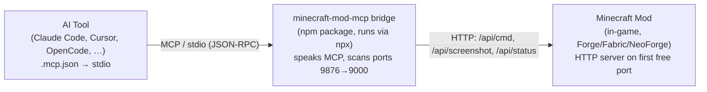
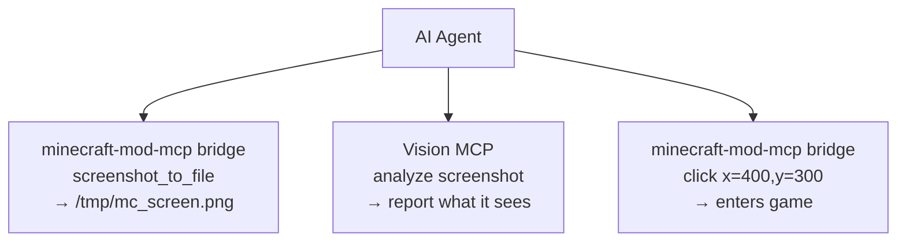

# AI Tool Integration Guide

**[English](./AI-TOOLS.md)** &bull; **[简体中文](../zhs/AI-TOOLS.md)** &bull; **[繁體中文](../zht/AI-TOOLS.md)** &bull; **[日本語](../ja/AI-TOOLS.md)** &bull; **[한국어](../ko/AI-TOOLS.md)** &bull; **[Français](../fr/AI-TOOLS.md)** &bull; **[Español](../es/AI-TOOLS.md)** &bull; **[Русский](../ru/AI-TOOLS.md)**

> **🤖 For AI Agents — read this first**
>
> Connect to Minecraft through the **`minecraft-mod-mcp` stdio bridge**, NOT by pointing an MCP/SSE client at a port directly. The bridge is the only component that speaks the MCP protocol; it also auto-discovers which port the running game is on, so you never have to guess.
>
> Add this MCP server config (stdio, launched via `npx`), then use the 45 tools the bridge exposes:
>
> ```json
> {
>   "mcpServers": {
>     "minecraft-mod-mcp": {
>       "type": "local",
>       "command": ["npx", "-y", "minecraft-mod-mcp"]
>     }
>   }
> }
> ```
>
> **Why a bridge, and not a URL?** The in-game mod runs an HTTP server but it does **not** implement the MCP protocol. Pointing `"type":"sse"`/`"url"` at the mod will fail to list tools or call them. The `npx minecraft-mod-mcp` bridge is what actually speaks MCP (over stdio) and forwards each call to the mod.
>
> **For humans**: paste this page's URL to your AI agent and it will configure the bridge itself. The only other thing it needs is a Minecraft client running with the mod — the bridge can even launch that for you (see [Launching Minecraft](#launching-minecraft)).

---

## How it actually works



1. Your AI tool spawns the bridge as a child process (`npx -y minecraft-mod-mcp`) and talks MCP to it over stdio.
2. The bridge scans ports **9876 → 9000**, hits `/api/status` on each, and latches onto the first port that answers with `type:"minecraft-mod"`. This is how it finds the game even when 9876 is taken.
3. Each MCP tool call (`screenshot`, `click`, `execute_command`, …) is translated into an HTTP request to the mod. The bridge also exposes `launch_minecraft` / `serve` tools so it can start the game itself.

> **Key point**: the bridge is the single source of truth for "which Minecraft client am I talking to". It reads `version`, `loader`, `pid`, and `port` from `/api/status` during discovery. You never hard-code a port.

---

## Quick setup

### 1. Add the bridge to your AI tool

Most MCP-compatible tools read a config file in the project root. Use the **stdio** form:

```json
{
  "mcpServers": {
    "minecraft-mod-mcp": {
      "type": "local",
      "command": ["npx", "-y", "minecraft-mod-mcp"]
    }
  }
}
```

If you prefer it installed globally first (`npm install -g minecraft-mod-mcp`), the command can simply be `["minecraft-mod-mcp"]`.

Common config file locations:

| Tool | Config file |
|------|-------------|
| Claude Code, OpenCode, CodeBuddy, WorkBuddy | `.mcp.json` in project root |
| Cursor | `.cursor/mcp.json` in project root |
| Cline, Roo Code, Kilo Code | VS Code `settings.json` |
| Claude Desktop | `claude_desktop_config.json` (see OS paths below) |
| Others | see [Coding agent tools](#coding-agent-tools) |

### 2. Have a Minecraft client running with the mod

Either launch the game yourself (install the mod JAR from [Releases](https://github.com/langyo/minecraft-mod-mcp/releases) into your `mods` folder), or **let the bridge do it** — once connected, call the `launch_minecraft` MCP tool:

```
launch_minecraft(version="1.21.7", loader="forge")
```

The bridge downloads the version, picks a free MCP port, injects the mod, and starts the client. See [Launching Minecraft](#launching-minecraft).

### 3. Verify the connection

Call the `ping` or `get_minecraft_status` MCP tool. The bridge reports whether it found the mod and on which port. Alternatively run the CLI directly:

```bash
npx -y minecraft-mod-mcp status
```

---

## Requirements

- **Node.js ≥ 20** (for the `npx` bridge). Deno and Bun also work.
- **A Minecraft client with the mod installed** — OR just let the bridge launch one (`launch_minecraft` / `serve`), in which case you also need **Java** (the bridge auto-downloads the right JDK per version).
- **No Python, no `just` required.** The `just`/Python commands in the repo are for project contributors only, not for end users or AI agents.

> ⚠️ **Do not follow old instructions that say `just daemon`.** That command (`scripts/mc_vtty.py`) is an internal development/test harness and is not part of the published toolchain. The bridge replaces it entirely.

---

## Linux & headless environments

The `npx` bridge itself is **fully headless** — it is a stdio process with no GUI of its own. It runs fine over SSH, in containers, and in WSL. There are only two environment-specific things to be aware of:

### The bridge needs nothing but Node

```bash
# Works with no DISPLAY set:
npx -y minecraft-mod-mcp status
npx -y minecraft-mod-mcp mcp --no-discover   # starts the stdio server, no game needed
```

You can confirm the MCP server is alive by feeding it a handshake (the bridge replies with its tool list even before any game is running):

```bash
printf '%s\n' \
  '{"jsonrpc":"2.0","id":1,"method":"initialize","params":{"protocolVersion":"2025-06-18","capabilities":{},"clientInfo":{"name":"t","version":"1"}}}' \
  '{"jsonrpc":"2.0","method":"notifications/initialized"}' \
  '{"jsonrpc":"2.0","id":2,"method":"tools/list","params":{}}' \
  | npx -y minecraft-mod-mcp mcp --no-discover
```

### The Minecraft *client* needs a display

Minecraft is a GUI app. To run it on a headless Linux box you need one of:

- A real X11/Wayland session (e.g. an XFCE desktop — `echo $DISPLAY` should be set, e.g. `:0`).
- **Xvfb** (virtual framebuffer) if there is no physical/remote display:
  ```bash
  xvfb-run -a -s "-screen 0 1280x720x24" npx -y minecraft-mod-mcp launch 1.21.7 --loader forge
  ```
  Screenshots still work under Xvfb, so this is enough for automated/agent-driven testing.
- A dedicated server only (no client GUI): use the `server` / `launch_server` tools or `npx minecraft-mod-mcp server <version>`. This needs no display at all.

If `launch_minecraft` fails with a display/AWT error, set `DISPLAY` or wrap the launch in `xvfb-run`. The bridge inherits your environment, so `export DISPLAY=:0` (or running inside an XFCE session) is usually all that's needed.

---

## Launching Minecraft

The bridge can bring up a whole game session through MCP tools or the CLI — no manual version/loader wrangling:

| Goal | MCP tool | CLI equivalent |
|------|----------|----------------|
| List supported versions | `list_supported_versions` | `npx minecraft-mod-mcp list` |
| Install a version+loader | `install_version` | `npx minecraft-mod-mcp install 1.21.7 --loader forge` |
| Start a client | `launch_minecraft` | `npx minecraft-mod-mcp launch 1.21.7 --loader forge` |
| Start a dedicated server | `launch_server` | `npx minecraft-mod-mcp server 1.21.7` |
| Server + auto-connected client | `serve` | `npx minecraft-mod-mcp serve 1.21.7` |
| Create an offline account | `create_offline_account` | `npx minecraft-mod-mcp auth offline Player` |
| Kill the running client | `kill_minecraft` | — |

Full CLI reference: **[CLI Usage Guide](./CLI.md)**.

> After `launch_minecraft`, the bridge automatically discovers the freshly-started mod (it scans 9876→9000 on every tool call until it finds one). You don't need to tell it the port.

---

## Coding agent tools

### Claude Code

**Config** (`.mcp.json` in project root):

```json
{
  "mcpServers": {
    "minecraft-mod-mcp": {
      "type": "local",
      "command": ["npx", "-y", "minecraft-mod-mcp"]
    }
  }
}
```

Or via CLI: `claude mcp add minecraft-mod-mcp -- npx -y minecraft-mod-mcp`.

### Claude Desktop / Claude for IDE

**Config** (`claude_desktop_config.json`):

- **macOS**: `~/Library/Application Support/Claude/claude_desktop_config.json`
- **Windows**: `%APPDATA%\Claude\claude_desktop_config.json`

```json
{
  "mcpServers": {
    "minecraft-mod-mcp": {
      "command": "npx",
      "args": ["-y", "minecraft-mod-mcp"]
    }
  }
}
```

For **Claude for IDE** (VS Code / JetBrains), use the same `.mcp.json` form as Claude Code.

### OpenCode

**Config**: `.opencode.json` in project root, or `~/.config/opencode/config.json`:

```json
{
  "mcpServers": {
    "minecraft-mod-mcp": {
      "type": "local",
      "command": ["npx", "-y", "minecraft-mod-mcp"]
    }
  }
}
```

### Cursor

**Config** (`.cursor/mcp.json` in project root):

```json
{
  "mcpServers": {
    "minecraft-mod-mcp": {
      "command": "npx",
      "args": ["-y", "minecraft-mod-mcp"]
    }
  }
}
```

Or via UI: **Cursor Settings → MCP → Add new MCP Server**, type **stdio**, command `npx -y minecraft-mod-mcp`.

### Cline

**Config** (VS Code `settings.json`):

```json
{
  "cline.mcpServers": {
    "minecraft-mod-mcp": {
      "command": "npx",
      "args": ["-y", "minecraft-mod-mcp"],
      "disabled": false,
      "autoApprove": []
    }
  }
}
```

### Roo Code

**Config** (VS Code `settings.json`, same shape as Cline):

```json
{
  "roo.mcpServers": {
    "minecraft-mod-mcp": {
      "command": "npx",
      "args": ["-y", "minecraft-mod-mcp"]
    }
  }
}
```

### Kilo Code

**Config** (VS Code `settings.json`):

```json
{
  "kilo.mcpServers": {
    "minecraft-mod-mcp": {
      "command": "npx",
      "args": ["-y", "minecraft-mod-mcp"]
    }
  }
}
```

### GitHub Copilot

**Config** (VS Code `settings.json`):

```json
{
  "github.copilot.mcpServers": {
    "minecraft-mod-mcp": {
      "command": "npx",
      "args": ["-y", "minecraft-mod-mcp"]
    }
  }
}
```

### CodeBuddy / WorkBuddy

**Config** (`mcp.json` in project root):

```json
{
  "mcpServers": {
    "minecraft-mod-mcp": {
      "type": "local",
      "command": ["npx", "-y", "minecraft-mod-mcp"]
    }
  }
}
```

### TRAE

**Settings → MCP Servers → Add**:

- **Name**: `minecraft-mod-mcp`
- **Transport**: stdio
- **Command**: `npx -y minecraft-mod-mcp`

### ZCode

**Config** (`~/.zcode/config.json`):

```json
{
  "mcpServers": {
    "minecraft-mod-mcp": {
      "type": "local",
      "command": ["npx", "-y", "minecraft-mod-mcp"]
    }
  }
}
```

### Lingma

**Settings → MCP → Add Server**:

- **Name**: `minecraft-mod-mcp`
- **Transport**: stdio
- **Command**: `npx -y minecraft-mod-mcp`

### Qoder

**Config** (`~/.qoder/mcp.json`):

```json
{
  "mcpServers": {
    "minecraft-mod-mcp": {
      "type": "local",
      "command": ["npx", "-y", "minecraft-mod-mcp"]
    }
  }
}
```

### Droid

**Config** (`~/.droid/mcp.json`):

```json
{
  "mcpServers": {
    "minecraft-mod-mcp": {
      "type": "local",
      "command": ["npx", "-y", "minecraft-mod-mcp"]
    }
  }
}
```

### Crush

**Config** (`~/.crush/config.json`):

```json
{
  "mcpServers": {
    "minecraft-mod-mcp": {
      "type": "local",
      "command": ["npx", "-y", "minecraft-mod-mcp"]
    }
  }
}
```

### Goose

**Config** (`~/.config/goose/mcp.json`):

```json
{
  "mcpServers": {
    "minecraft-mod-mcp": {
      "type": "local",
      "command": ["npx", "-y", "minecraft-mod-mcp"]
    }
  }
}
```

### Deep Code

**Config** (`~/.deepcode/config.json`):

```json
{
  "mcpServers": {
    "minecraft-mod-mcp": {
      "type": "local",
      "command": ["npx", "-y", "minecraft-mod-mcp"]
    }
  }
}
```

### Reasonix

**Config** (`~/.reasonix/config.json`):

```json
{
  "mcpServers": {
    "minecraft-mod-mcp": {
      "type": "local",
      "command": ["npx", "-y", "minecraft-mod-mcp"]
    }
  }
}
```

### Langcli

**Config** (`~/.langcli/config.yaml`):

```yaml
mcp_servers:
  minecraft-mod-mcp:
    type: stdio
    command: ["npx", "-y", "minecraft-mod-mcp"]
```

### Oh My Pi

**Config** (`~/.oh-my-pi/mcp.json`):

```json
{
  "mcpServers": {
    "minecraft-mod-mcp": {
      "type": "local",
      "command": ["npx", "-y", "minecraft-mod-mcp"]
    }
  }
}
```

### Pi

**Config** (`~/.pi/config.json`):

```json
{
  "mcpServers": {
    "minecraft-mod-mcp": {
      "type": "local",
      "command": ["npx", "-y", "minecraft-mod-mcp"]
    }
  }
}
```

---

## General agent tools

### OpenClaw

**Config** (`openclaw.json` in workspace):

```json
{
  "mcpServers": {
    "minecraft-mod-mcp": {
      "type": "local",
      "command": ["npx", "-y", "minecraft-mod-mcp"]
    }
  }
}
```

### Cherry Studio

**Settings → MCP Servers → Add**:

- **Name**: `minecraft-mod-mcp`
- **Transport**: stdio
- **Command**: `npx -y minecraft-mod-mcp`

### Hermes Agent

**Config** (`~/.hermes/config.json`):

```json
{
  "mcpServers": {
    "minecraft-mod-mcp": {
      "type": "local",
      "command": ["npx", "-y", "minecraft-mod-mcp"]
    }
  }
}
```

### AstrBot

**Config** (`astrbot_config.json`):

```json
{
  "mcp_servers": {
    "minecraft-mod-mcp": {
      "type": "local",
      "command": ["npx", "-y", "minecraft-mod-mcp"]
    }
  }
}
```

### nanobot

**Config** (`~/.nanobot/config.json`):

```json
{
  "mcpServers": {
    "minecraft-mod-mcp": {
      "type": "local",
      "command": ["npx", "-y", "minecraft-mod-mcp"]
    }
  }
}
```

---

## Direct HTTP REST API (advanced)

If you are not using MCP at all, you can talk to the mod's HTTP server directly with `curl`. You must first find the port (the bridge scans 9876→9000; `/api/status` tells you which one is the mod):

```bash
# Find the running mod's port
for p in $(seq 9876 -1 9000); do
  curl -s "http://localhost:$p/api/status" | grep -q '"type":"minecraft-mod"' && echo "mod on port $p" && break
done

# Health check
curl http://localhost:9876/api/status

# Run a command
curl -X POST http://localhost:9876/api/cmd \
  -H "Content-Type: application/json" \
  -d '{"cmd":"screenshot","params":{}}'

# Take a screenshot
curl http://localhost:9876/api/screenshot
```

> **Note**: the `/api/events` endpoint is a plain **debug SSE stream** of call history (for the in-game `/debug` dashboard). It is **not** an MCP transport — do not configure it as an MCP `"type":"sse"` server. Use the stdio bridge above for MCP.

### Common commands

| Command | Description |
|---------|-------------|
| `screenshot` | Capture a screenshot, returns a base64 data URI |
| `screenshot_to_file` | Capture a screenshot and save to a local file (`{"cmd":"screenshot_to_file","params":{"path":"/tmp/mc.png"}}`) |
| `click` | Click at (x, y) |
| `press_key` | Press a keyboard key |
| `type_text` | Type a text string |
| `scroll` | Scroll the mouse wheel |
| `execute_command` | Run a Minecraft slash command |
| `get_player_info` | Get player position and state |
| `get_world_info` | Get world info |

---

## Visual recognition integration

You can pair Minecraft Mod MCP with a **vision-capable MCP server** so the agent can *see and understand* what's on screen — read UI text, diagnose errors, analyze layout.

### How it works

1. The bridge's `screenshot_to_file` tool saves a frame to disk.
2. A vision MCP server reads that file and analyzes it.
3. The agent coordinates both — screenshot → analyze → act.



### GLM Vision MCP Server

[GLM Vision MCP Server](https://docs.bigmodel.cn/cn/coding-plan/mcp/vision-mcp-server) (`@z_ai/mcp-server`) is a local MCP server powered by GLM-4.6V:

| Tool | Use |
|------|-----|
| `ui_to_artifact` | Convert a UI screenshot into code, prompts, or design specs |
| `extract_text_from_screenshot` | OCR text from in-game UI (chat, signs, menus) |
| `diagnose_error_screenshot` | Parse in-game error dialogs and stack traces |
| `understand_technical_diagram` | Interpret redstone circuits, schematics |
| `analyze_data_visualization` | Read in-game statistics, dashboards |
| `image_analysis` | General visual understanding of a game scene |
| `ui_diff_check` | Compare before/after screenshots |

**Setup** (requires Node.js ≥ 18):

```bash
# Claude Code
claude mcp add -s user zai-mcp-server --env Z_AI_API_KEY=<your_zhipu_api_key> -- npx -y "@z_ai/mcp-server"

# Manual config (Cline, Roo Code, Kilo Code, etc.)
{
  "mcpServers": {
    "zai-mcp-server": {
      "type": "local",
      "command": ["npx", "-y", "@z_ai/mcp-server"],
      "env": {
        "Z_AI_API_KEY": "<your_zhipu_api_key>",
        "Z_AI_MODE": "ZHIPU"
      }
    }
  }
}
```

> **Note**: the vision MCP reads files from disk, so always call `screenshot_to_file` (not `screenshot`) before a vision tool. Your agent can pass a file path to `screenshot_to_file`.

### Example flow

1. Ask your agent: *"Take a screenshot of Minecraft, save it to `/tmp/mc.png`, then analyze what's on screen and tell me which button to click to start a new game."*
2. Agent calls `minecraft-mod-mcp` → `screenshot_to_file` → file saved.
3. Agent calls `zai-mcp-server` → `extract_text_from_screenshot` → reads UI text.
4. Agent reports what it sees and the next step.

### Other vision tools

| Tool | Description |
|------|-------------|
| [Claude built-in vision](https://docs.anthropic.com/en/docs/claude/vision) | Claude understands images natively — paste or reference the screenshot file |
| [GPT-4o / GPT-4V](https://platform.openai.com/docs/guides/vision) | OpenAI vision models, usable via any OpenAI-compatible client |
| [Gemini Vision](https://ai.google.dev/gemini-api/docs/vision) | Google's vision API, usable in Gemini-compatible tools |
| [Qwen-VL](https://github.com/QwenLM/Qwen-VL) | Open-source vision-language model for self-hosting |

> Any vision-capable LLM or MCP server works with the same flow — the key is `screenshot_to_file` saving a frame to disk first.

---

## Troubleshooting

1. **"Mod not connected" / no tools work**
   Ensure a Minecraft client with the mod is running. Check with `npx -y minecraft-mod-mcp status`. The bridge scans ports 9876→9000 every tool call; if nothing answers, launch a client first (`launch_minecraft` tool or `npx minecraft-mod-mcp launch <version>`).

2. **Wrong port / "which client am I controlling?"**
   You don't pick a port — the bridge does. It scans 9876→9000 and locks onto the first `/api/status` that returns `type:"minecraft-mod"`, reporting that client's `version`, `loader`, and `pid`. If multiple clients run, only the first-found one is controlled; stop extras or set a fixed port with `-Dmcp.port=<port>` / `MC_MCP_PORT`.

3. **Configured `"type":"sse"` / `"url":"http://localhost:9876/api/events"` and nothing works**
   That configuration is incorrect. The mod's `/api/events` is a debug event stream, not an MCP transport. Switch to the **stdio bridge** (`npx -y minecraft-mod-mcp`) shown in [Quick setup](#quick-setup).

4. **npx not found / bridge won't start**
   Install Node.js ≥ 20. Verify with `npx -y minecraft-mod-mcp --help`. On a fresh machine the first `npx` run downloads the package, so allow network access.

5. **Client won't launch on headless Linux**
   Minecraft needs a display. Run inside an X11/Wayland session (`export DISPLAY=:0`), or wrap the launch in Xvfb: `xvfb-run -a -s "-screen 0 1280x720x24" npx -y minecraft-mod-mcp launch <version>`. A dedicated server (`launch_server` / `server` command) needs no display.

6. **Port conflict on 9876**
   Not a problem for the bridge — it auto-falls back to 9875, 9874, … 9000. To pin a port, pass `-Dmcp.port=<port>` as a JVM arg or set `MC_MCP_PORT`.

7. **Firewall**
   The bridge and mod communicate over loopback only (`127.0.0.1`). No external firewall rule is needed unless you expose the mod's HTTP server on purpose.

> For issues or questions, open an issue on the [GitHub repo](https://github.com/langyo/minecraft-mod-mcp).
