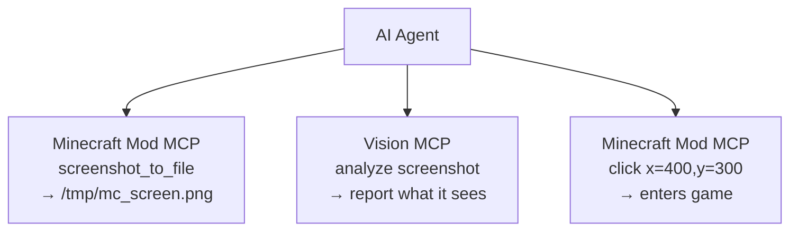

# Guía de Integración de Herramientas de IA

**[English](../en/AI-TOOLS.md)** &bull; **[简体中文](../zhs/AI-TOOLS.md)** &bull; **[繁體中文](../zht/AI-TOOLS.md)** &bull; **[日本語](../ja/AI-TOOLS.md)** &bull; **[한국어](../ko/AI-TOOLS.md)** &bull; **[Français](../fr/AI-TOOLS.md)** &bull; **Español** &bull; **[Русский](../ru/AI-TOOLS.md)**

> **🤖 Para agentes de IA**: Si un usuario te pide que te conectes a Minecraft, añade esta configuración de servidor MCP y usa las más de 35 herramientas listadas al final de esta guía:
>
> ```json
> {
>   "mcpServers": {
>     "minecraft-mcp": {
>       "type": "local",
>       "command": ["npx", "-y", "minecraft-mod-mcp"]
>     }
>   }
> }
> ```
>
> **Para usuarios**: Simplemente pega la URL de esta página a tu agente de IA y se configurará automáticamente. No necesitas configuración manual.

<!-- bridge-fix -->
> ⚠️ **Important / 重要 / Важно**: Connect via the **stdio bridge** `npx -y minecraft-mod-mcp` (MCP `type: "local"`),
> **not** by pointing `"type":"sse"` at `http://localhost:9876/api/events`. The mod's `/api/events` is a plain
> debug SSE stream and is **not** an MCP transport — an SSE config will fail to list or call any tool.
> The bridge is the only component that speaks MCP and auto-discovers which port the game is on (9876→9000).
> See the [English guide](../en/AI-TOOLS.md) for the authoritative, up-to-date instructions.

---

## Configuración rápida

La mayoría de las herramientas de codificación con IA usan la misma configuración MCP basada en SSE. Añade esto al archivo de configuración de tu herramienta:

```json
{
  "mcpServers": {
    "minecraft-mcp": {
      "type": "local",
      "command": ["npx", "-y", "minecraft-mod-mcp"]
    }
  }
}
```

Ubicaciones comunes de archivos de configuración:

| Herramienta | Archivo de configuración |
|------|-------------|
| Claude Code, OpenCode, CodeBuddy, WorkBuddy | `.mcp.json` en la raíz del proyecto |
| Cursor | `.cursor/mcp.json` en la raíz del proyecto |
| Cline, Roo Code, Kilo Code | `settings.json` de VS Code |
| Claude Desktop | `claude_desktop_config.json` (rutas del SO abajo) |
| Otros | Ver secciones específicas abajo |

> Consulta las [instrucciones por herramienta](#herramientas-agentes-de-codificación) abajo para rutas exactas, configuración por interfaz y formatos específicos.

---

## Endpoints HTTP de Minecraft Mod MCP

El servidor MCP de Minecraft expone los siguientes endpoints HTTP (puerto por defecto: **9876**):

| Endpoint | Método | Descripción |
|----------|--------|-------------|
| `/api/status` | GET | Verificación de estado |
| `/api/cmd` | POST | Despacho de comandos JSON-RPC (cuerpo: `{"cmd":"...", "params":{...}}`) |
| `/api/screenshot` | GET | Toma una captura de pantalla, devuelve PNG en base64 |
| `/api/events` | GET | Flujo SSE (Server-Sent Events) para historial de llamadas en tiempo real |
| `/api/calls` | GET | Devuelve los últimos 50 eventos de llamada como array JSON |

> **Requisitos previos**: Asegúrate de que el daemon de Minecraft Mod MCP esté en ejecución y que un cliente de Minecraft con el mod MCP esté conectado. Ejecuta `npx -y minecraft-mod-mcp` (the bridge auto-discovers the game) or launch a client via the `launch_minecraft` tool.

---

## Métodos de Integración

La mayoría de las herramientas de codificación con IA soportan el **Protocolo de Contexto de Modelo (MCP)** para conectarse a servidores externos. El servidor MCP de Minecraft se puede conectar mediante:

- **MCP (stdio bridge — required)**: run `npx -y minecraft-mod-mcp`. This is the only MCP-compatible transport; the bridge auto-discovers the game's port (9876→9000). The mod's `/api/events` is not an MCP transport.
- **API REST HTTP**: Envía solicitudes POST directamente a `http://localhost:9876/api/cmd`

Las secciones siguientes proporcionan instrucciones de configuración específicas para cada herramienta.

---

## Herramientas de Agentes de Codificación

### Claude Code

Asistente de codificación con IA basado en terminal de Anthropic.

**Configuración**: Crea o edita `.mcp.json` en la raíz de tu proyecto:

```json
{
  "mcpServers": {
    "minecraft-mcp": {
      "type": "local",
      "command": ["npx", "-y", "minecraft-mod-mcp"]
    }
  }
}
```

Alternativamente, usa `claude mcp add minecraft-mod-mcp -- npx -y minecraft-mod-mcp`.

### Claude Desktop / Claude for IDE

La aplicación de escritorio y las versiones del plugin para VS Code/JetBrains IDE de Claude.

**Configuración**: Edita `claude_desktop_config.json`:

- **macOS**: `~/Library/Application Support/Claude/claude_desktop_config.json`
- **Windows**: `%APPDATA%\Claude\claude_desktop_config.json`

```json
{
  "mcpServers": {
    "minecraft-mcp": {
      "type": "local",
      "command": ["npx", "-y", "minecraft-mod-mcp"]
    }
  }
}
```

Para **Claude for IDE** (VS Code / JetBrains), la configuración es la misma — usa el archivo `.mcp.json` en la raíz de tu proyecto.

### OpenCode

Agente de codificación de terminal de código abierto.

**Configuración**: Crea `.opencode.json` en la raíz de tu proyecto o edita `~/.config/opencode/config.json`:

```json
{
  "mcpServers": {
    "minecraft-mcp": {
      "type": "local",
      "command": ["npx", "-y", "minecraft-mod-mcp"]
    }
  }
}
```

### Cursor

Editor de código con IA que prioriza la inteligencia artificial, con soporte para modelos personalizados.

**Configuración**: Crea `.cursor/mcp.json` en la raíz de tu proyecto:

```json
{
  "mcpServers": {
    "minecraft-mcp": {
      "command": "npx",
      "args": ["-y", "minecraft-mod-mcp"]
    }
  }
}
```

O mediante la interfaz de usuario: **Cursor Settings → MCP → Add new MCP Server**, type **stdio**, command `npx -y minecraft-mod-mcp`.

### Cline

Extensión de codificación con IA para VS Code.

**Configuración**: Abre Configuración de VS Code (`Ctrl+,`), busca `cline.mcpServers`, o añade a `settings.json`:

```json
{
  "cline.mcpServers": {
    "minecraft-mcp": {
      "command": "npx",
      "args": ["-y", "minecraft-mod-mcp"]
    }
  }
}
```

### Roo Code

Extensión inteligente para VS Code para escritura y refactorización de código.

**Configuración**: Añade al archivo `settings.json` de VS Code (mismo formato que Cline):

```json
{
  "roo.mcpServers": {
    "minecraft-mcp": {
      "command": "npx",
      "args": ["-y", "minecraft-mod-mcp"]
    }
  }
}
```

### Kilo Code

Plugin eficiente para VS Code para generación de código y gestión de proyectos.

**Configuración**: Añade al archivo `settings.json` de VS Code:

```json
{
  "kilo.mcpServers": {
    "minecraft-mcp": {
      "command": "npx",
      "args": ["-y", "minecraft-mod-mcp"]
    }
  }
}
```

### GitHub Copilot

Programador de pares con IA de GitHub en VS Code.

**Configuración**: Crea `.github/copilot-instructions.md` en tu espacio de trabajo, o configura MCP mediante la configuración de VS Code:

```json
{
  "github.copilot.mcpServers": {
    "minecraft-mcp": {
      "command": "npx",
      "args": ["-y", "minecraft-mod-mcp"]
    }
  }
}
```

### GitHub Copilot CLI

GitHub Copilot para la línea de comandos.

**Configuración**: Establece variables de entorno o usa `gh copilot config`:

```bash
# GitHub Copilot CLI does not load MCP servers from an env var.
# Use a stdio-capable MCP host instead, e.g. Claude Code:
#   claude mcp add minecraft-mod-mcp -- npx -y minecraft-mod-mcp
```

### CodeBuddy / WorkBuddy

Herramienta de programación inteligente full-stack potenciada por IA.

**Configuración**: Crea `mcp.json` en la raíz de tu proyecto o espacio de trabajo:

```json
{
  "mcpServers": {
    "minecraft-mcp": {
      "command": "npx",
      "args": ["-y", "minecraft-mod-mcp"]
    }
  }
}
```

### TRAE

Editor con IA capaz de completar de forma independiente diversas tareas de desarrollo.

**Configuración**: Navega a **Settings → MCP Servers → Add Server**:

- **Name**: `minecraft-mcp`
- **Transport**: stdio
- **URL**: `npx -y minecraft-mod-mcp`

### ZCode

Combina potentes agentes de IA con cadenas de herramientas existentes.

**Configuración**: Edita `~/.zcode/config.json`:

```json
{
  "mcpServers": {
    "minecraft-mcp": {
      "type": "local",
      "command": ["npx", "-y", "minecraft-mod-mcp"]
    }
  }
}
```

### Lingma

Asistente de programación inteligente.

**Configuración**: Navega a **Settings → MCP → Add Server**:

- **Name**: `minecraft-mcp`
- **Transport**: stdio
- **URL**: `npx -y minecraft-mod-mcp`

### Qoder

Plataforma de programación con agentes para software del mundo real.

**Configuración**: Edita `~/.qoder/mcp.json`:

```json
{
  "mcpServers": {
    "minecraft-mcp": {
      "type": "local",
      "command": ["npx", "-y", "minecraft-mod-mcp"]
    }
  }
}
```

### Droid

Agente de codificación con IA de terminal, de nivel empresarial, para flujos de trabajo completos.

**Configuración**: Edita `~/.droid/mcp.json`:

```json
{
  "mcpServers": {
    "minecraft-mcp": {
      "type": "local",
      "command": ["npx", "-y", "minecraft-mod-mcp"]
    }
  }
}
```

### Crush

Herramienta de programación con IA para terminal, compatible con interfaces CLI y TUI.

**Configuración**: Edita `~/.crush/config.json`:

```json
{
  "mcpServers": {
    "minecraft-mcp": {
      "type": "local",
      "command": ["npx", "-y", "minecraft-mod-mcp"]
    }
  }
}
```

### Goose

Herramienta de Agente de IA que soporta ejecución local y tareas de ingeniería automatizadas.

**Configuración**: Edita `~/.config/goose/mcp.json`:

```json
{
  "mcpServers": {
    "minecraft-mcp": {
      "type": "local",
      "command": ["npx", "-y", "minecraft-mod-mcp"]
    }
  }
}
```

### Deep Code

Asistente de codificación potenciado por DeepSeek.

**Configuración**: Edita `~/.deepcode/config.json`:

```json
{
  "mcpServers": {
    "minecraft-mcp": {
      "type": "local",
      "command": ["npx", "-y", "minecraft-mod-mcp"]
    }
  }
}
```

### Reasonix

Herramienta de codificación con IA enfocada en razonamiento.

**Configuración**: Edita `~/.reasonix/config.json`:

```json
{
  "mcpServers": {
    "minecraft-mcp": {
      "type": "local",
      "command": ["npx", "-y", "minecraft-mod-mcp"]
    }
  }
}
```

### Langcli

Asistente de codificación con IA basado en CLI.

**Configuración**: Edita `~/.langcli/config.yaml`:

```yaml
mcp_servers:
  minecraft-mcp:
    type: stdio
    command: ["npx", "-y", "minecraft-mod-mcp"]
```

### Oh My Pi

Plataforma versátil de agentes de IA.

**Configuración**: Edita `~/.oh-my-pi/mcp.json`:

```json
{
  "mcpServers": {
    "minecraft-mcp": {
      "type": "local",
      "command": ["npx", "-y", "minecraft-mod-mcp"]
    }
  }
}
```

### Pi

Compañero de codificación ligero con IA.

**Configuración**: Edita `~/.pi/config.json`:

```json
{
  "mcpServers": {
    "minecraft-mcp": {
      "type": "local",
      "command": ["npx", "-y", "minecraft-mod-mcp"]
    }
  }
}
```

---

## Herramientas de Agentes Generales

### OpenClaw

Asistente de IA de código abierto que se ejecuta localmente con extensibilidad mediante Skills.

**Configuración**: Edita `openclaw.json` en tu espacio de trabajo:

```json
{
  "mcpServers": {
    "minecraft-mcp": {
      "type": "local",
      "command": ["npx", "-y", "minecraft-mod-mcp"]
    }
  }
}
```

### Cherry Studio

IDE de aplicaciones de IA con soporte para múltiples integraciones de modelos.

**Configuración**: Navega a **Settings → MCP Servers → Add**:

- **Name**: `minecraft-mcp`
- **Transport**: stdio
- **URL**: `npx -y minecraft-mod-mcp`

### Hermes Agent

Agente de IA de código abierto con auto-evolución y memoria persistente.

**Configuración**: Edita `~/.hermes/config.json`:

```json
{
  "mcpServers": {
    "minecraft-mcp": {
      "type": "local",
      "command": ["npx", "-y", "minecraft-mod-mcp"]
    }
  }
}
```

### AstrBot

Framework de bots potenciado por IA.

**Configuración**: Edita `astrbot_config.json`:

```json
{
  "mcp_servers": {
    "minecraft-mcp": {
      "type": "local",
      "command": ["npx", "-y", "minecraft-mod-mcp"]
    }
  }
}
```

### nanobot

Agente de IA ligero para diversas tareas.

**Configuración**: Edita `~/.nanobot/config.json`:

```json
{
  "mcpServers": {
    "minecraft-mcp": {
      "type": "local",
      "command": ["npx", "-y", "minecraft-mod-mcp"]
    }
  }
}
```

---

## Acceso Directo a la API REST HTTP

Para herramientas que no soportan nativamente el protocolo MCP, puedes interactuar con el servidor MCP de Minecraft directamente a través de su API REST HTTP:

```bash
# Verificación de estado
curl http://localhost:9876/api/status

# Ejecutar un comando
curl -X POST http://localhost:9876/api/cmd \
  -H "Content-Type: application/json" \
  -d '{"cmd":"screenshot","params":{}}'

# Tomar una captura de pantalla
curl http://localhost:9876/api/screenshot

# Suscribirse a eventos (flujo SSE)
curl http://localhost:9876/api/events
```

### Comandos Comunes

| Comando | Descripción |
|---------|-------------|
| `screenshot` | Toma una captura de pantalla de la ventana de Minecraft |
| `screenshot_to_file` | Toma una captura de pantalla y la guarda en un archivo local (`{"cmd":"screenshot_to_file","params":{"path":"/tmp/mc.png"}}`) |
| `click` | Hace clic en las coordenadas (x, y) |
| `press_key` | Presiona una tecla del teclado |
| `type_text` | Escribe una cadena de texto |
| `scroll` | Realiza un desplazamiento con el ratón |
| `execute_command` | Ejecuta un comando slash de Minecraft |
| `get_player_info` | Obtiene la posición y el estado del jugador |
| `get_world_info` | Obtiene información del mundo |

---

## Integración de Reconocimiento Visual

Puedes combinar Minecraft Mod MCP con **servidores MCP con capacidad de visión** para que los agentes de IA puedan *ver y entender* lo que sucede en el juego — leer texto de la IU, diagnosticar errores, analizar diseños y más.

### Cómo Funciona

1. Minecraft Mod MCP toma una captura de pantalla y la guarda en un archivo local mediante `screenshot_to_file`
2. Un servidor MCP de visión lee ese archivo y lo analiza
3. El agente de IA coordina ambos — captura → analizar → actuar



### Servidor MCP GLM Vision

[GLM Vision MCP Server](https://docs.bigmodel.cn/cn/coding-plan/mcp/vision-mcp-server) (`@z_ai/mcp-server`) es un servidor MCP local impulsado por GLM-4.6V que proporciona:

| Herramienta | Caso de uso |
|------|----------|
| `ui_to_artifact` | Convertir capturas de pantalla de IU en código, prompts o especificaciones de diseño |
| `extract_text_from_screenshot` | OCR de texto de la IU del juego (chat, carteles, menús) |
| `diagnose_error_screenshot` | Analizar diálogos de error y trazas de pila en el juego |
| `understand_technical_diagram` | Leer circuitos de redstone, esquemas |
| `analyze_data_visualization` | Leer estadísticas y paneles del juego |
| `image_analysis` | Comprensión visual general de escenas del juego |
| `ui_diff_check` | Comparar capturas de pantalla antes/después |

**Instalación** (requiere Node.js >= 18):

```bash
# Claude Code
claude mcp add -s user zai-mcp-server --env Z_AI_API_KEY=<your_zhipu_api_key> -- npx -y "@z_ai/mcp-server"

# Manual config (Cline, Roo Code, Kilo Code, etc.)
{
  "mcpServers": {
    "zai-mcp-server": {
      "type": "stdio",
      "command": "npx",
      "args": ["-y", "@z_ai/mcp-server"],
      "env": {
        "Z_AI_API_KEY": "<your_zhipu_api_key>",
        "Z_AI_MODE": "ZHIPU"
      }
    }
  }
}
```

> **Nota**: El MCP de visión lee archivos desde el disco, así que usa siempre `screenshot_to_file` (no `screenshot`) antes de llamar a las herramientas de visión. Tu agente de IA puede especificar una ruta de archivo al llamar a `screenshot_to_file`.

### Ejemplo de flujo de trabajo

1. Pide a tu agente de IA: *"Toma una captura de pantalla de Minecraft, guárdala en `/tmp/mc.png`, luego analiza lo que aparece en pantalla y dime qué botón hacer clic para empezar un juego nuevo."*
2. El agente llama a `minecraft-mcp` → `screenshot_to_file` → archivo guardado
3. El agente llama a `zai-mcp-server` → `extract_text_from_screenshot` → lee el texto de la IU
4. El agente te dice lo que ve y qué hacer a continuación

### Otras herramientas de visión

| Herramienta | Descripción |
|------|------|
| [Claude built-in vision](https://docs.anthropic.com/en/docs/claude/vision) | Claude entiende imágenes de forma nativa — simplemente pega o referencia un archivo de captura de pantalla |
| [GPT-4o / GPT-4V](https://platform.openai.com/docs/guides/vision) | Modelos de visión de OpenAI accesibles vía cualquier cliente compatible con OpenAI |
| [Gemini Vision](https://ai.google.dev/gemini-api/docs/vision) | API de visión de Google, utilizable en herramientas compatibles con Gemini |
| [Qwen-VL](https://github.com/QwenLM/Qwen-VL) | Modelo de visión-lenguaje de código abierto para entornos autoalojados |

> Cualquier LLM o servidor MCP con capacidad de visión puede usarse en el mismo pipeline — la clave es usar `screenshot_to_file` para guardar primero la captura de pantalla en disco.

---

## Solución de Problemas

1. **Conexión rechazada**: Asegúrate de que el daemon MCP esté en ejecución (`just daemon`) y que un cliente de Minecraft esté iniciado.
2. **Timeout de SSE**: Algunas herramientas pueden desconectarse del SSE tras un período de inactividad. Reinicia la herramienta o la conexión SSE.
3. **Conflicto de puerto**: Si el puerto 9876 está en uso, configura un puerto diferente mediante la variable de entorno `MCP_PORT` o la propiedad del sistema `mcp.server.port`.
4. **Firewall**: Asegúrate de que tu firewall permita conexiones a `localhost:9876`.

> Para problemas o preguntas, por favor abre un issue en el [repositorio de GitHub](https://github.com/langyo/minecraft-mod-mcp).
