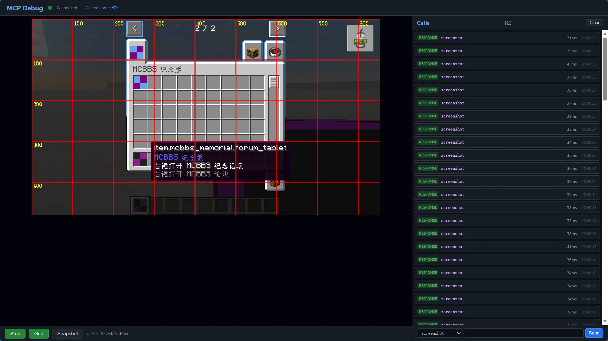
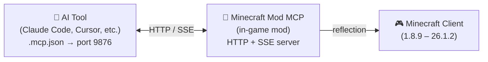

<!-- markdownlint-disable MD033 MD041 MD036 -->
<div align="center">


# Minecraft Mod MCP

**Kit de desarrollo de mods potenciado por IA**

[](../../LICENSE-MIT)
[](https://www.java.com/)
[](https://github.com/langyo/minecraft-mod-mcp/releases)
[](https://www.npmjs.com/package/minecraft-mod-mcp)

**[English](../../README.md)** &bull; **[简体中文](../zhs/README.md)** &bull; **[繁體中文](../zht/README.md)** &bull; **[日本語](../ja/README.md)** &bull; **[한국어](../ko/README.md)** &bull; **[Français](../fr/README.md)** &bull; **Español** &bull; **[Русский](../ru/README.md)**

</div>
<!-- markdownlint-enable MD033 MD041 MD036 -->

## 🤖 Conecta tu IA a Minecraft

**Copia este enlace y pégalo a tu agente de IA — se configurará automáticamente:**

```
https://github.com/langyo/minecraft-mod-mcp/blob/main/docs/guides/es/AI-TOOLS.md
```

Tu IA leerá la guía, configurará la conexión MCP y empezará a controlar el juego. Sin configuración manual.

> ¿Ya tienes el mod instalado? Solo necesitas ese enlace.

---

## ¿Qué es Minecraft Mod MCP

Minecraft Mod MCP es una herramienta de asistencia IA **para desarrolladores de mods**. Ponlo en tu carpeta `mods`, inicia el juego, y tu IA podrá ver el juego, hacer clic en botones GUI, escribir comandos e interactuar con el mundo — todo mediante el protocolo MCP estándar. Diseñado para probar mods, verificar comportamientos y automatizar flujos repetitivos.

- **Ver** — captura capturas de pantalla con cuadrículas de coordenadas
- **Actuar** — hacer clic, escribir, desplazar, arrastrar y presionar cualquier tecla
- **Saber** — consultar la posición del jugador, información del mundo, botones de la pantalla y campos de depuración
- **Grabar** — transmitir eventos en tiempo real mediante SSE, capturar fotogramas de video

> ¿Quieres que tu IA pruebe la GUI de tu mod? ¿Ejecute una prueba de humo? ¿Verifique la interacción de un nuevo bloque? Minecraft Mod MCP lo hace posible.

---

## Versiones compatibles

| Versión MC | Forge | Fabric | NeoForge |
|------------|:-----:|:------:|:--------:|
| 26.1.2 | [⬇](https://github.com/langyo/minecraft-mod-mcp/releases/latest/download/minecraft-mcp-26.1.2-forge.jar) | — | [⬇](https://github.com/langyo/minecraft-mod-mcp/releases/latest/download/minecraft-mcp-26.1.2-neoforge.jar) |
| 1.21.11 | [⬇](https://github.com/langyo/minecraft-mod-mcp/releases/latest/download/minecraft-mcp-1.21.11-forge.jar) | [⬇](https://github.com/langyo/minecraft-mod-mcp/releases/latest/download/minecraft-mcp-1.21.11-fabric.jar) | [⬇](https://github.com/langyo/minecraft-mod-mcp/releases/latest/download/minecraft-mcp-1.21.11-neoforge.jar) |

> Las versiones anteriores (1.8.9 – 1.20.6) están disponibles en la [página de releases](https://github.com/langyo/minecraft-mod-mcp/releases).

---

## Primeros pasos

### 1. Instala el mod

Descarga el JAR desde [GitHub Releases](https://github.com/langyo/minecraft-mod-mcp/releases) y colócalo en la carpeta `mods` de Minecraft.

- Requiere **Forge**, **Fabric** o **NeoForge** (consulta las versiones compatibles arriba)
- Funciona con Minecraft **1.8.9** hasta **26.1.2**

### 2. Instala el puente MCP

```bash
npm install -g minecraft-mod-mcp
```

O ejecútalo sin instalar:

```bash
npx minecraft-mod-mcp
```

### 3. Inicia Minecraft

Abre el juego con tu modloader. El mod iniciará automáticamente un servidor HTTP en el puerto 9876.

### 4. Conecta tu IA

**[→ Guía de integración de herramientas de IA](./AI-TOOLS.md)** — paso a paso para Claude Code, Cursor, Cline, Copilot y más de 20 herramientas de IA.

O pega este enlace a tu agente de IA y deja que él se encargue de la configuración:

```
https://github.com/langyo/minecraft-mod-mcp/blob/main/docs/guides/es/AI-TOOLS.md
```

### 5. Uso de la CLI

**[→ Guía de uso de la CLI](./CLI.md)** — lanza clientes y servidores, gestiona versiones y cuentas, compila SDKs, todo desde la línea de comandos.

---

## Consejos de uso

### Trabajar junto al mod

Normalmente, al cambiar de Minecraft a otra ventana se abre la pantalla de pausa, lo que puede interrumpir los comandos MCP. Usa uno de estos métodos para evitarlo:

- **Pantalla de pausa**: Presiona `Esc` para abrir la pantalla de pausa, luego haz clic en el botón **liberar ratón** del overlay MCP. Esto te permite cambiar de ventana libremente sin que se reactive la pantalla de pausa.
- **Overlay en juego**: En la vista 3D, haz clic en el botón del overlay MCP en la **esquina superior derecha** para soltar temporalmente el cursor. Una vez liberado, puedes hacer `Alt+Tab` y el juego no se pausará automáticamente — perfecto para trabajar en tu IDE o herramienta de IA mientras la conexión MCP sigue activa.

### Puerto y servidor HTTP

El mod inicia un servidor HTTP al cargar el juego. Primero intenta el puerto **9876**; si está ocupado, retrocede por **9875 → 9874 → ... → 9000** hasta encontrar uno libre. Puedes fijar un puerto con `-Dmcp.port=XXXX` (argumento JVM) o `MC_MCP_PORT` (variable de entorno).

Para confirmar qué puerto eligió el mod:
- La consola imprime `[MCP-MOD] Debug page: http://127.0.0.1:{port}/debug`
- Aparece un mensaje cliqueable en el chat del juego con la URL de depuración
- `GET /api/status` devuelve `version`, `loader`, `port`, `pid`, `uptime` — el puente Node.js lo usa para la detección automática
- Abre `http://localhost:{port}/debug` en tu navegador para un panel en vivo con logs MCP, eventos SSE y estado de conexión

La versión de MC y el loader se confirman en el handshake vía `/api/status`, permitiendo que tanto el puente como la página de depuración sepan con qué entorno MC están conectados.

---

## Cómo funciona

<details>
<summary>📸 Captura de pantalla — clic para expandir</summary>



</details>



El mod ejecuta un servidor HTTP en el puerto 9876 dentro de Minecraft. Tu herramienta de IA se conecta mediante el protocolo estándar MCP (transporte SSE), y cada comando — clic, escribir, captura de pantalla, etc. — utiliza Java reflection para funcionar en todas las versiones de Minecraft sin código específico para cada versión.

---

## Compilar desde el código fuente

> Esta sección es para colaboradores. Si solo quieres usar el mod, consulta los [Primeros pasos](#primeros-pasos) arriba.

Consulta [CONTRIBUTING.md](../../CONTRIBUTING.md) para la configuración de desarrollo, la estructura del proyecto y las pautas.

---

## Licencia

Licenciado bajo cualquiera de las siguientes:

- Apache License, Version 2.0 ([LICENSE-APACHE](../../LICENSE-APACHE) o http://www.apache.org/licenses/LICENSE-2.0)
- MIT License ([LICENSE-MIT](../../LICENSE-MIT) o http://opensource.org/licenses/MIT)

a su elección.
