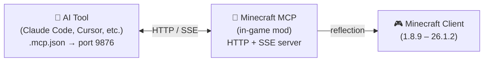

<!-- markdownlint-disable MD033 MD041 MD036 -->
<div align="center">


# Minecraft MCP

**Deja que la IA juegue a Minecraft**

[](../../LICENSE-MIT)
[](https://www.java.com/)
[](https://github.com/langyo/minecraft-mod-mcp/releases)
[](https://www.npmjs.com/package/minecraft-mod-mcp)

**[English](../../README.md)** &bull; **[简体中文](../zhs/README.md)** &bull; **[繁體中文](../zht/README.md)** &bull; **[日本語](../ja/README.md)** &bull; **[한국어](../ko/README.md)** &bull; **[Français](../fr/README.md)** &bull; **Español** &bull; **[Русский](../ru/README.md)**

</div>
<!-- markdownlint-enable MD033 MD041 MD036 -->

## 🤖 Conecta tu IA a Minecraft

**Copia este enlace y pégalo a tu agente de IA — se configurará automáticamente:**

```
https://github.com/langyo/minecraft-mod-mcp/blob/main/docs/guides/es/AI-TOOLS.md
```

Tu IA leerá la guía, configurará la conexión MCP y empezará a controlar el juego. Sin configuración manual.

> ¿Ya tienes el mod instalado? Solo necesitas ese enlace.

---

## ¿Qué es Minecraft MCP

Minecraft MCP es un puente entre los asistentes de IA y Minecraft. Se ejecuta como un mod dentro del juego, exponiendo un servidor HTTP al que las herramientas de IA pueden conectarse mediante el protocolo estándar MCP. A través de este puente, la IA puede ver el juego, hacer clic en botones, escribir comandos e interactuar con el mundo.

- **Ver** — captura capturas de pantalla con cuadrículas de coordenadas
- **Actuar** — hacer clic, escribir, desplazar, arrastrar y presionar cualquier tecla
- **Saber** — consultar la posición del jugador, información del mundo, botones de la pantalla y campos de depuración
- **Grabar** — transmitir eventos en tiempo real mediante SSE, capturar fotogramas de video

> ¿Quieres que tu IA construya un castillo? ¿Ejecute una prueba de humo? ¿Navegue por el menú de un modpack? Minecraft MCP lo hace posible.

---

## Versiones compatibles

| Versión MC | Forge | Fabric | NeoForge |
|------------|:-----:|:------:|:--------:|
| 1.8.9 | ✓ | — | — |
| 1.9.4 | ✓ | — | — |
| 1.10.2 | ✓ | — | — |
| 1.11.2 | ✓ | — | — |
| 1.12.2 | ✓ | — | — |
| 1.13.2 | ✓ | — | — |
| 1.14.4 | ✓ | 🚧 | — |
| 1.15.2 | ✓ | 🚧 | — |
| 1.16.5 | ✓ | 🚧 | — |
| 1.17.1 | ✓ | 🚧 | — |
| 1.18.2 | ✓ | 🚧 | — |
| 1.19.4 | ✓ | 🚧 | — |
| 1.20.6 | ✓ | 🚧 | 🚧 |
| 1.21.7 | ✓ | — | — |
| 26.1.2 | ✓ | — | 🚧 |

> 🚧 = Trabajo en progreso

---

## Primeros pasos

### 1. Instala el mod

Descarga el JAR desde [GitHub Releases](https://github.com/langyo/minecraft-mod-mcp/releases) y colócalo en la carpeta `mods` de Minecraft.

- Requiere **Forge**, **Fabric** o **NeoForge** (consulta las versiones compatibles arriba)
- Funciona con Minecraft **1.8.9** hasta **26.1.2**

### 2. Instala el puente MCP

```bash
npm install -g minecraft-mod-mcp
```

O ejecútalo sin instalar:

```bash
npx minecraft-mod-mcp
```

### 3. Inicia Minecraft

Abre el juego con tu modloader. El mod iniciará automáticamente un servidor HTTP en el puerto 9876.

### 4. Conecta tu IA

**[→ Guía de integración de herramientas de IA](./AI-TOOLS.md)** — paso a paso para Claude Code, Cursor, Cline, Copilot y más de 20 herramientas de IA.

O pega este enlace a tu agente de IA y deja que él se encargue de la configuración:

```
https://github.com/langyo/minecraft-mod-mcp/blob/main/docs/guides/es/AI-TOOLS.md
```

---

## Cómo funciona



El mod ejecuta un servidor HTTP en el puerto 9876 dentro de Minecraft. Tu herramienta de IA se conecta mediante el protocolo estándar MCP (transporte SSE), y cada comando — clic, escribir, captura de pantalla, etc. — utiliza Java reflection para funcionar en todas las versiones de Minecraft sin código específico para cada versión.

---

## Compilar desde el código fuente

> Esta sección es para colaboradores. Si solo quieres usar el mod, consulta los [Primeros pasos](#primeros-pasos) arriba.

Consulta [CONTRIBUTING.md](../../CONTRIBUTING.md) para la configuración de desarrollo, la estructura del proyecto y las pautas.

---

## Licencia

Licenciado bajo cualquiera de las siguientes:

- Apache License, Version 2.0 ([LICENSE-APACHE](../../LICENSE-APACHE) o http://www.apache.org/licenses/LICENSE-2.0)
- MIT License ([LICENSE-MIT](../../LICENSE-MIT) o http://opensource.org/licenses/MIT)

a su elección.
