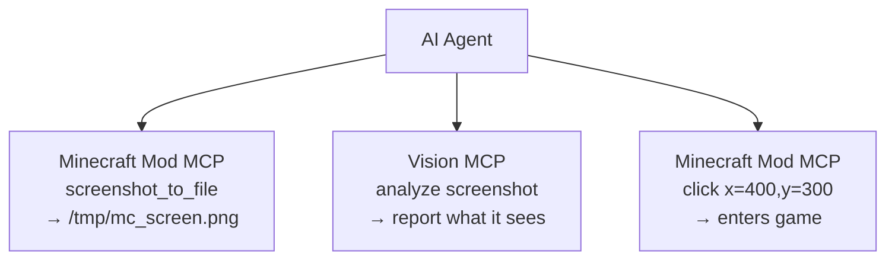

# Guide d'intégration des outils d'IA

**[English](../en/AI-TOOLS.md)** &bull; **[简体中文](../zhs/AI-TOOLS.md)** &bull; **[繁體中文](../zht/AI-TOOLS.md)** &bull; **[日本語](../ja/AI-TOOLS.md)** &bull; **[한국어](../ko/AI-TOOLS.md)** &bull; **Français** &bull; **[Español](../es/AI-TOOLS.md)** &bull; **[Русский](../ru/AI-TOOLS.md)**

> **🤖 Pour les agents IA** : Si un utilisateur vous demande de vous connecter à Minecraft, ajoutez cette configuration de serveur MCP et utilisez les plus de 35 outils listés à la fin de ce guide :
>
> ```json
> {
>   "mcpServers": {
>     "minecraft-mcp": {
>       "type": "sse",
>       "url": "http://localhost:9876/api/events"
>     }
>   }
> }
> ```
>
> **Pour les utilisateurs** : Collez simplement l'URL de cette page à votre agent IA et il se configurera automatiquement. Aucune configuration manuelle n'est nécessaire.

---

## Configuration rapide

La plupart des outils de codage IA utilisent la même configuration MCP basée sur SSE. Ajoutez ceci au fichier de configuration de votre outil :

```json
{
  "mcpServers": {
    "minecraft-mcp": {
      "type": "sse",
      "url": "http://localhost:9876/api/events"
    }
  }
}
```

Emplacements courants des fichiers de configuration :

| Outil | Fichier de configuration |
|------|-------------|
| Claude Code, OpenCode, CodeBuddy, WorkBuddy | `.mcp.json` à la racine du projet |
| Cursor | `.cursor/mcp.json` à la racine du projet |
| Cline, Roo Code, Kilo Code | `settings.json` de VS Code |
| Claude Desktop | `claude_desktop_config.json` (chemins OS ci-dessous) |
| Autres | Voir les sections spécifiques ci-dessous |

> Consultez les [instructions par outil](#outils-agent-de-codage) ci-dessous pour les chemins exacts, la configuration via l'interface et les formats spécifiques.

## Points de terminaison HTTP de Minecraft Mod MCP

Le serveur Minecraft Mod MCP expose les points de terminaison HTTP suivants (port par défaut : **9876**) :

| Point de terminaison | Méthode | Description |
|----------|--------|-------------|
| `/api/status` | GET | Vérification de l'état |
| `/api/cmd` | POST | Envoi de commandes JSON-RPC (corps : `{"cmd":"...", "params":{...}}`) |
| `/api/screenshot` | GET | Prendre une capture d'écran, retourne du PNG en base64 |
| `/api/events` | GET | Flux SSE (Server-Sent Events) pour l'historique des appels en temps réel |
| `/api/calls` | GET | Retourne les 50 derniers événements d'appel sous forme de tableau JSON |

> **Prérequis** : Assurez-vous que le démon Minecraft Mod MCP est en cours d'exécution et qu'un client Minecraft avec le mod MCP est connecté. Exécutez `just daemon` puis `just launch <version> <loader>`.

---

## Méthodes d'intégration

La plupart des outils de codage IA prennent en charge le **Model Context Protocol (MCP)** pour se connecter à des serveurs externes. Le serveur Minecraft Mod MCP peut être connecté via :

- **Transport SSE** : Pointer le client MCP de l'outil vers `http://localhost:9876/api/events`
- **API REST HTTP** : Envoyer des requêtes POST directement à `http://localhost:9876/api/cmd`

Les sections ci-dessous fournissent des instructions de configuration spécifiques à chaque outil.

---

## Outils d'agent de codage

### Claude Code

Assistant de codage IA en terminal d'Anthropic.

**Configuration** : Créez ou modifiez `.mcp.json` à la racine de votre projet :

```json
{
  "mcpServers": {
    "minecraft-mcp": {
      "type": "sse",
      "url": "http://localhost:9876/api/events"
    }
  }
}
```

Vous pouvez également utiliser `claude mcp add minecraft-mcp --transport sse http://localhost:9876/api/events`.

### Claude Desktop / Claude for IDE

L'application de bureau et les versions plugin VS Code/JetBrains IDE de Claude.

**Configuration** : Modifiez `claude_desktop_config.json` :

- **macOS** : `~/Library/Application Support/Claude/claude_desktop_config.json`
- **Windows** : `%APPDATA%\Claude\claude_desktop_config.json`

```json
{
  "mcpServers": {
    "minecraft-mcp": {
      "type": "sse",
      "url": "http://localhost:9876/api/events"
    }
  }
}
```

Pour **Claude for IDE** (VS Code / JetBrains), la configuration est identique — utilisez le fichier `.mcp.json` à la racine de votre projet.

### OpenCode

Agent de codage en terminal open source.

**Configuration** : Créez `.opencode.json` à la racine de votre projet ou modifiez `~/.config/opencode/config.json` :

```json
{
  "mcpServers": {
    "minecraft-mcp": {
      "type": "sse",
      "url": "http://localhost:9876/api/events"
    }
  }
}
```

### Cursor

Éditeur de code orienté IA avec prise en charge de modèles personnalisés.

**Configuration** : Créez `.cursor/mcp.json` à la racine de votre projet :

```json
{
  "mcpServers": {
    "minecraft-mcp": {
      "url": "http://localhost:9876/api/events",
      "transport": "sse"
    }
  }
}
```

Ou via l'interface : **Cursor Settings → MCP → Add new MCP Server**, définissez le type de transport sur **SSE** et saisissez l'URL.

### Cline

Extension de codage IA pour VS Code.

**Configuration** : Ouvrez les paramètres VS Code (`Ctrl+,`), recherchez `cline.mcpServers`, ou ajoutez dans `settings.json` :

```json
{
  "cline.mcpServers": {
    "minecraft-mcp": {
      "url": "http://localhost:9876/api/events",
      "transport": "sse"
    }
  }
}
```

### Roo Code

Extension VS Code intelligente pour l'écriture et la refactorisation de code.

**Configuration** : Ajoutez dans `settings.json` de VS Code (même format que Cline) :

```json
{
  "roo.mcpServers": {
    "minecraft-mcp": {
      "url": "http://localhost:9876/api/events",
      "transport": "sse"
    }
  }
}
```

### Kilo Code

Plugin VS Code efficace pour la génération de code et la gestion de projet.

**Configuration** : Ajoutez dans `settings.json` de VS Code :

```json
{
  "kilo.mcpServers": {
    "minecraft-mcp": {
      "url": "http://localhost:9876/api/events",
      "transport": "sse"
    }
  }
}
```

### GitHub Copilot

Programmeur pair IA de GitHub dans VS Code.

**Configuration** : Créez `.github/copilot-instructions.md` dans votre espace de travail, ou configurez MCP via les paramètres VS Code :

```json
{
  "github.copilot.mcpServers": {
    "minecraft-mcp": {
      "url": "http://localhost:9876/api/events",
      "transport": "sse"
    }
  }
}
```

### GitHub Copilot CLI

GitHub Copilot pour la ligne de commande.

**Configuration** : Définissez des variables d'environnement ou utilisez `gh copilot config` :

```bash
export MCP_SERVER_URL="http://localhost:9876/api/events"
```

### CodeBuddy / WorkBuddy

Outil de programmation full-stack intelligent optimisé par l'IA.

**Configuration** : Créez `mcp.json` à la racine de votre projet ou espace de travail :

```json
{
  "mcpServers": {
    "minecraft-mcp": {
      "url": "http://localhost:9876/api/events",
      "transport": "sse"
    }
  }
}
```

### TRAE

Éditeur IA capable d'accomplir de manière autonome diverses tâches de développement.

**Configuration** : Accédez à **Settings → MCP Servers → Add Server** :

- **Name** : `minecraft-mcp`
- **Transport** : SSE
- **URL** : `http://localhost:9876/api/events`

### ZCode

Combine de puissants agents IA avec les chaînes d'outils existantes.

**Configuration** : Modifiez `~/.zcode/config.json` :

```json
{
  "mcpServers": {
    "minecraft-mcp": {
      "type": "sse",
      "url": "http://localhost:9876/api/events"
    }
  }
}
```

### Lingma

Assistant de programmation intelligent.

**Configuration** : Accédez à **Settings → MCP → Add Server** :

- **Name** : `minecraft-mcp`
- **Transport** : SSE
- **URL** : `http://localhost:9876/api/events`

### Qoder

Plateforme de programmation par agent pour les logiciels du monde réel.

**Configuration** : Modifiez `~/.qoder/mcp.json` :

```json
{
  "mcpServers": {
    "minecraft-mcp": {
      "type": "sse",
      "url": "http://localhost:9876/api/events"
    }
  }
}
```

### Droid

Agent de codage IA en terminal de niveau entreprise pour des flux de travail de bout en bout.

**Configuration** : Modifiez `~/.droid/mcp.json` :

```json
{
  "mcpServers": {
    "minecraft-mcp": {
      "type": "sse",
      "url": "http://localhost:9876/api/events"
    }
  }
}
```

### Crush

Outil de programmation IA en terminal prenant en charge les interfaces CLI et TUI.

**Configuration** : Modifiez `~/.crush/config.json` :

```json
{
  "mcpServers": {
    "minecraft-mcp": {
      "type": "sse",
      "url": "http://localhost:9876/api/events"
    }
  }
}
```

### Goose

Outil d'agent IA prenant en charge l'exécution locale et les tâches d'ingénierie automatisées.

**Configuration** : Modifiez `~/.config/goose/mcp.json` :

```json
{
  "mcpServers": {
    "minecraft-mcp": {
      "type": "sse",
      "url": "http://localhost:9876/api/events"
    }
  }
}
```

### Deep Code

Assistant de codage optimisé par DeepSeek.

**Configuration** : Modifiez `~/.deepcode/config.json` :

```json
{
  "mcpServers": {
    "minecraft-mcp": {
      "type": "sse",
      "url": "http://localhost:9876/api/events"
    }
  }
}
```

### Reasonix

Outil de codage IA axé sur le raisonnement.

**Configuration** : Modifiez `~/.reasonix/config.json` :

```json
{
  "mcpServers": {
    "minecraft-mcp": {
      "type": "sse",
      "url": "http://localhost:9876/api/events"
    }
  }
}
```

### Langcli

Assistant de codage IA en CLI.

**Configuration** : Modifiez `~/.langcli/config.yaml` :

```yaml
mcp_servers:
  minecraft-mcp:
    type: sse
    url: http://localhost:9876/api/events
```

### Oh My Pi

Plateforme d'agent IA polyvalente.

**Configuration** : Modifiez `~/.oh-my-pi/mcp.json` :

```json
{
  "mcpServers": {
    "minecraft-mcp": {
      "type": "sse",
      "url": "http://localhost:9876/api/events"
    }
  }
}
```

### Pi

Compagnon de codage IA léger.

**Configuration** : Modifiez `~/.pi/config.json` :

```json
{
  "mcpServers": {
    "minecraft-mcp": {
      "type": "sse",
      "url": "http://localhost:9876/api/events"
    }
  }
}
```

---

## Outils d'agent général

### OpenClaw

Assistant IA open source qui s'exécute localement avec une extensibilité par Skills.

**Configuration** : Modifiez `openclaw.json` dans votre espace de travail :

```json
{
  "mcpServers": {
    "minecraft-mcp": {
      "type": "sse",
      "url": "http://localhost:9876/api/events"
    }
  }
}
```

### Cherry Studio

IDE d'application IA prenant en charge plusieurs intégrations de modèles.

**Configuration** : Accédez à **Settings → MCP Servers → Add** :

- **Name** : `minecraft-mcp`
- **Transport** : SSE
- **URL** : `http://localhost:9876/api/events`

### Hermes Agent

Agent IA auto-évolutif open source avec mémoire persistante.

**Configuration** : Modifiez `~/.hermes/config.json` :

```json
{
  "mcpServers": {
    "minecraft-mcp": {
      "type": "sse",
      "url": "http://localhost:9876/api/events"
    }
  }
}
```

### AstrBot

Framework de bot optimisé par l'IA.

**Configuration** : Modifiez `astrbot_config.json` :

```json
{
  "mcp_servers": {
    "minecraft-mcp": {
      "type": "sse",
      "url": "http://localhost:9876/api/events"
    }
  }
}
```

### nanobot

Agent IA léger pour diverses tâches.

**Configuration** : Modifiez `~/.nanobot/config.json` :

```json
{
  "mcpServers": {
    "minecraft-mcp": {
      "type": "sse",
      "url": "http://localhost:9876/api/events"
    }
  }
}
```

---

## Accès direct à l'API REST HTTP

Pour les outils qui ne prennent pas en charge nativement le protocole MCP, vous pouvez interagir directement avec le serveur Minecraft Mod MCP via son API REST HTTP :

```bash
# Vérification de l'état
curl http://localhost:9876/api/status

# Exécuter une commande
curl -X POST http://localhost:9876/api/cmd \
  -H "Content-Type: application/json" \
  -d '{"cmd":"screenshot","params":{}}'

# Prendre une capture d'écran
curl http://localhost:9876/api/screenshot

# S'abonner aux événements (flux SSE)
curl http://localhost:9876/api/events
```

### Commandes courantes

| Commande | Description |
|---------|-------------|
| `screenshot` | Prendre une capture d'écran de la fenêtre Minecraft |
| `screenshot_to_file` | Prendre une capture d'écran et l'enregistrer dans un fichier local (`{"cmd":"screenshot_to_file","params":{"path":"/tmp/mc.png"}}`) |
| `click` | Cliquer aux coordonnées (x, y) |
| `press_key` | Appuyer sur une touche du clavier |
| `type_text` | Saisir une chaîne de texte |
| `scroll` | Effectuer un défilement de la souris |
| `execute_command` | Exécuter une commande slash Minecraft |
| `get_player_info` | Obtenir la position et l'état du joueur |
| `get_world_info` | Obtenir les informations du monde |

---

## Intégration de la reconnaissance visuelle

Vous pouvez associer Minecraft Mod MCP à des **serveurs MCP compatibles vision** pour permettre aux agents IA de *voir et comprendre* ce qui se passe dans le jeu — lire le texte de l'IU, diagnostiquer les erreurs, analyser les dispositions, et plus encore.

### Comment ça fonctionne

1. Minecraft Mod MCP prend une capture d'écran et l'enregistre dans un fichier local via `screenshot_to_file`
2. Un serveur MCP vision lit ce fichier et l'analyse
3. L'agent IA coordonne les deux — capture → analyser → agir



### Serveur MCP GLM Vision

[GLM Vision MCP Server](https://docs.bigmodel.cn/cn/coding-plan/mcp/vision-mcp-server) (`@z_ai/mcp-server`) est un serveur MCP local propulsé par GLM-4.6V, offrant :

| Outil | Cas d'utilisation |
|------|----------|
| `ui_to_artifact` | Convertir des captures d'écran d'IU en code, invites ou spécifications de conception |
| `extract_text_from_screenshot` | OCR du texte de l'IU du jeu (chat, panneaux, menus) |
| `diagnose_error_screenshot` | Analyser les boîtes de dialogue d'erreur et les traces d'appels dans le jeu |
| `understand_technical_diagram` | Lire les circuits de redstone, les schémas |
| `analyze_data_visualization` | Lire les statistiques et tableaux de bord du jeu |
| `image_analysis` | Compréhension visuelle générale des scènes de jeu |
| `ui_diff_check` | Comparer des captures d'écran avant/après |

**Installation** (nécessite Node.js >= 18) :

```bash
# Claude Code
claude mcp add -s user zai-mcp-server --env Z_AI_API_KEY=<your_zhipu_api_key> -- npx -y "@z_ai/mcp-server"

# Manual config (Cline, Roo Code, Kilo Code, etc.)
{
  "mcpServers": {
    "zai-mcp-server": {
      "type": "stdio",
      "command": "npx",
      "args": ["-y", "@z_ai/mcp-server"],
      "env": {
        "Z_AI_API_KEY": "<your_zhipu_api_key>",
        "Z_AI_MODE": "ZHIPU"
      }
    }
  }
}
```

> **Note** : Le serveur MCP de vision lit les fichiers depuis le disque, utilisez donc toujours `screenshot_to_file` (et non `screenshot`) avant d'appeler les outils de vision. Votre agent IA peut spécifier un chemin de fichier lors de l'appel à `screenshot_to_file`.

### Exemple de flux de travail

1. Demandez à votre agent IA : *"Prenez une capture d'écran de Minecraft, enregistrez-la dans `/tmp/mc.png`, puis analysez ce qui s'affiche à l'écran et dites-moi quel bouton cliquer pour démarrer une nouvelle partie."*
2. L'agent appelle `minecraft-mcp` → `screenshot_to_file` → fichier enregistré
3. L'agent appelle `zai-mcp-server` → `extract_text_from_screenshot` → lecture du texte de l'IU
4. L'agent vous indique ce qu'il voit et ce qu'il faut faire ensuite

### Autres outils de vision

| Outil | Description |
|------|------|
| [Claude built-in vision](https://docs.anthropic.com/en/docs/claude/vision) | Claude comprend nativement les images — collez ou référencez simplement un fichier de capture d'écran |
| [GPT-4o / GPT-4V](https://platform.openai.com/docs/guides/vision) | Modèles de vision OpenAI accessibles via tout client compatible OpenAI |
| [Gemini Vision](https://ai.google.dev/gemini-api/docs/vision) | API de vision de Google, utilisable dans les outils compatibles Gemini |
| [Qwen-VL](https://github.com/QwenLM/Qwen-VL) | Modèle vision-langage open source pour les environnements auto-hébergés |

> Tout LLM ou serveur MCP capable de vision peut être utilisé dans le même pipeline — la clé est d'utiliser `screenshot_to_file` pour d'abord enregistrer la capture d'écran sur le disque.

---

## Dépannage

1. **Connexion refusée** : Assurez-vous que le démon MCP est en cours d'exécution (`just daemon`) et qu'un client Minecraft est lancé.
2. **Délai d'attente SSE** : Certains outils peuvent se déconnecter du SSE après une période d'inactivité. Redémarrez l'outil ou la connexion SSE.
3. **Conflit de port** : Si le port 9876 est utilisé, configurez un port différent via la variable d'environnement `MCP_PORT` ou la propriété système `mcp.server.port`.
4. **Pare-feu** : Assurez-vous que votre pare-feu autorise les connexions vers `localhost:9876`.

> Pour toute question ou problème, veuillez ouvrir une issue sur le [dépôt GitHub](https://github.com/langyo/minecraft-mod-mcp).
