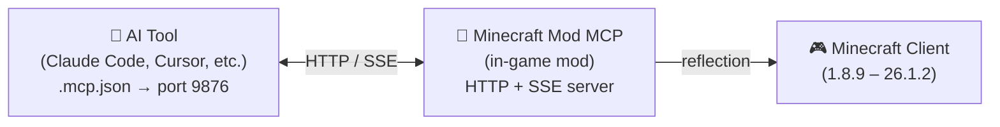

<!-- markdownlint-disable MD033 MD041 MD036 -->
<div align="center">


# Minecraft Mod MCP

**Laissez l'IA jouer à Minecraft**

[](../../LICENSE-MIT)
[](https://www.java.com/)
[](https://github.com/langyo/minecraft-mod-mcp/releases)
[](https://www.npmjs.com/package/minecraft-mod-mcp)

**[English](../../README.md)** &bull; **[简体中文](../zhs/README.md)** &bull; **[繁體中文](../zht/README.md)** &bull; **[日本語](../ja/README.md)** &bull; **[한국어](../ko/README.md)** &bull; **Français** &bull; **[Español](../es/README.md)** &bull; **[Русский](../ru/README.md)**

</div>
<!-- markdownlint-enable MD033 MD041 MD036 -->

## 🤖 Connectez votre IA à Minecraft

**Copiez ce lien et collez-le à votre agent IA — il se configurera automatiquement :**

```
https://github.com/langyo/minecraft-mod-mcp/blob/main/docs/guides/fr/AI-TOOLS.md
```

Votre IA lit le guide, configure la connexion MCP et commence à contrôler le jeu. Aucune configuration manuelle n'est nécessaire.

> Vous avez déjà installé le mod ? Ce lien est tout ce dont vous avez besoin.

---

## Qu'est-ce que Minecraft Mod MCP

Minecraft Mod MCP est un pont entre les assistants IA et Minecraft. Il s'exécute comme un mod à l'intérieur du jeu, exposant un serveur HTTP auquel les outils IA peuvent se connecter via le protocole MCP standard. Grâce à ce pont, l'IA peut voir le jeu, cliquer sur des boutons, taper des commandes et interagir avec le monde.

- **Voir** — capturer des captures d'écran avec des grilles de coordonnées
- **Agir** — cliquer, taper, faire défiler, glisser et appuyer sur n'importe quelle touche
- **Savoir** — interroger la position du joueur, les informations du monde, les boutons de l'écran et les champs de débogage
- **Enregistrer** — diffuser des événements en temps réel via SSE, capturer des images vidéo

> Vous voulez que votre IA construise un château ? Lance un test de fumée ? Navigue dans le menu d'un modpack ? Minecraft Mod MCP rend cela possible.

---

## Versions supportées

| Version MC | Forge | Fabric | NeoForge |
|------------|:-----:|:------:|:--------:|
| 26.1.2 | [⬇](https://github.com/langyo/minecraft-mod-mcp/releases/latest/download/minecraft-mcp-26.1.2-forge.jar) | — | [⬇](https://github.com/langyo/minecraft-mod-mcp/releases/latest/download/minecraft-mcp-26.1.2-neoforge.jar) |
| 1.21.11 | [⬇](https://github.com/langyo/minecraft-mod-mcp/releases/latest/download/minecraft-mcp-1.21.11-forge.jar) | [⬇](https://github.com/langyo/minecraft-mod-mcp/releases/latest/download/minecraft-mcp-1.21.11-fabric.jar) | [⬇](https://github.com/langyo/minecraft-mod-mcp/releases/latest/download/minecraft-mcp-1.21.11-neoforge.jar) |

> Les versions antérieures (1.8.9 – 1.20.6) sont disponibles sur la [page des releases](https://github.com/langyo/minecraft-mod-mcp/releases).

---

## Pour commencer

### 1. Installer le mod

Téléchargez le JAR depuis les [Releases GitHub](https://github.com/langyo/minecraft-mod-mcp/releases) et placez-le dans votre dossier `mods` de Minecraft.

- Nécessite **Forge**, **Fabric** ou **NeoForge** (voir les versions supportées ci-dessus)
- Compatible avec Minecraft **1.8.9** jusqu'à **26.1.2**

### 2. Installer le pont MCP (Bridge)

```bash
npm install -g minecraft-mod-mcp
```

Ou exécutez-le sans installation :

```bash
npx minecraft-mod-mcp
```

### 3. Lancer Minecraft

Lancez le jeu avec votre modloader. Le mod démarre automatiquement un serveur HTTP sur le port 9876.

### 4. Connecter votre IA

**[→ Guide d'intégration des outils IA](./AI-TOOLS.md)** — instructions pas à pas pour Claude Code, Cursor, Cline, Copilot et plus de 20 autres outils IA.

Ou collez ce lien à votre agent IA et laissez-le gérer la configuration :

```
https://github.com/langyo/minecraft-mod-mcp/blob/main/docs/guides/fr/AI-TOOLS.md
```

---

## Astuces d'utilisation

### Travailler à côté du mod

Normalement, basculer hors de Minecraft ouvre l'écran de pause, ce qui peut interrompre les commandes MCP. Utilisez l'une de ces méthodes pour l'éviter :

- **Écran de pause** : Appuyez sur `Échap` pour ouvrir l'écran de pause, puis cliquez sur le bouton **libérer la souris** de l'overlay MCP. Cela vous permet de changer de fenêtre librement sans réactiver l'écran de pause.
- **Overlay en jeu** : En vue 3D, cliquez sur le bouton de l'overlay MCP dans le **coin supérieur droit** pour détacher temporairement le curseur. Une fois libéré, vous pouvez faire `Alt+Tab` sans que le jeu ne se mette en pause — idéal pour travailler dans votre IDE ou outil IA tout en gardant la connexion MCP active.

### Page web de débogage intégrée

Le mod démarre un serveur HTTP sur `http://localhost:9876` au lancement du jeu, avec un tableau de bord de débogage en direct — c'est ce que montre la capture ci-dessus. Ouvrez-le dans votre navigateur pour voir les logs MCP, l'état de la connexion et d'autres diagnostics en temps réel pendant que vous codez.

---

## Comment ça fonctionne

<details>
<summary>📸 Capture d'écran — cliquer pour agrandir</summary>


</details>



Le mod exécute un serveur HTTP sur le port 9876 dans Minecraft. Votre outil IA se connecte via le protocole MCP standard (transport SSE), et chaque commande — clic, saisie, capture d'écran, etc. — utilise la réflexion Java pour fonctionner sur toutes les versions de Minecraft sans code spécifique à chaque version.

---

## Compilation depuis les sources

> Cette section s'adresse aux contributeurs. Si vous souhaitez simplement utiliser le mod, consultez [Pour commencer](#pour-commencer) ci-dessus.

Consultez [CONTRIBUTING.md](../../CONTRIBUTING.md) pour la configuration de développement, la structure du projet et les directives de contribution.

---

## Licence

Sous licence, au choix :

- Licence Apache, Version 2.0 ([LICENSE-APACHE](../../LICENSE-APACHE) ou http://www.apache.org/licenses/LICENSE-2.0)
- Licence MIT ([LICENSE-MIT](../../LICENSE-MIT) ou http://opensource.org/licenses/MIT)

à votre convenance.
