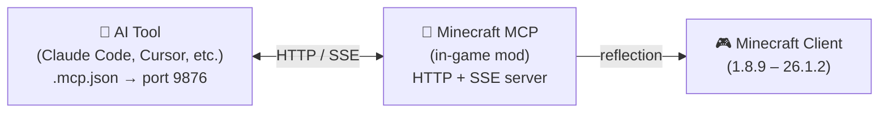

<!-- markdownlint-disable MD033 MD041 MD036 -->
<div align="center">


# Minecraft MCP

**Mod Minecraft MCP (Model Context Protocol) multi-version et multi-modloader pour construire des mods**

[](../../LICENSE-MIT)
[](https://www.java.com/)
[](https://github.com/langyo/minecraft-mod-mcp/releases)

**[English](../en/README.md)** &bull; **[简体中文](../zhs/README.md)** &bull; **[繁體中文](../zht/README.md)** &bull; **[日本語](../ja/README.md)** &bull; **[한국어](../ko/README.md)** &bull; **Français** &bull; **[Español](../es/README.md)** &bull; **[Русский](../ru/README.md)**

</div>
<!-- markdownlint-enable MD033 MD041 MD036 -->

## Qu'est-ce que Minecraft MCP

Minecraft MCP est un pont entre les assistants IA et Minecraft. Il s'exécute comme un mod à l'intérieur du jeu, exposant un serveur HTTP auquel les outils IA peuvent se connecter via le protocole MCP standard. Grâce à ce pont, l'IA peut voir le jeu, cliquer sur des boutons, taper des commandes et interagir avec le monde.

> Vous voulez que votre IA construise un château ? Lance un test de fumée ? Navigue dans le menu d'un modpack ? Minecraft MCP rend cela possible.

- **Voir** — capturer des captures d'écran avec des grilles de coordonnées
- **Agir** — cliquer, taper, faire défiler, glisser et appuyer sur n'importe quelle touche
- **Savoir** — interroger la position du joueur, les informations du monde, les boutons de l'écran et les champs de débogage
- **Enregistrer** — diffuser des événements en temps réel via SSE, capturer des images vidéo

[Guide d'intégration des outils IA →](./AI-TOOLS.md)

## Versions supportées

| Version MC | Forge | Fabric | NeoForge |
|------------|:-----:|:------:|:--------:|
| 1.8.9 | ✓ | — | — |
| 1.9.4 | ✓ | — | — |
| 1.10.2 | ✓ | — | — |
| 1.11.2 | ✓ | — | — |
| 1.12.2 | ✓ | — | — |
| 1.13.2 | ✓ | — | — |
| 1.14.4 | ✓ | 🚧 | — |
| 1.15.2 | ✓ | 🚧 | — |
| 1.16.5 | ✓ | 🚧 | — |
| 1.17.1 | ✓ | 🚧 | — |
| 1.18.2 | ✓ | 🚧 | — |
| 1.19.4 | ✓ | 🚧 | — |
| 1.20.6 | ✓ | 🚧 | 🚧 |
| 1.21.7 | ✓ | — | — |
| 26.1.2 | ✓ | — | 🚧 |

> 🚧 = En cours de développement

## Démarrage rapide

### Prérequis

- JDK 21 (Corretto recommandé)

### Installation & Compilation

```bash
# Installer les dépendances
pip install -r scripts/requirements.txt

# Tout compiler
just full
```

### Lancer

```bash
# Démarrer le démon et lancer Minecraft
just daemon
just launch 1.21.7 forge

# Ou exécuter un test de fumée de bout en bout
just smoke 1.21.7
```

## Comment ça fonctionne



Le mod exécute un serveur HTTP sur le port 9876 dans Minecraft. Votre outil IA se connecte via le protocole MCP standard (transport SSE), et chaque commande — clic, saisie, capture d'écran, etc. — utilise la réflexion Java pour fonctionner sur toutes les versions de Minecraft sans code spécifique à chaque version.

## Contribuer

Les issues et pull requests sont les bienvenues.

## Licence

Sous licence, au choix :

- Licence Apache, Version 2.0 ([LICENSE-APACHE](../../LICENSE-APACHE) ou http://www.apache.org/licenses/LICENSE-2.0)
- Licence MIT ([LICENSE-MIT](../../LICENSE-MIT) ou http://opensource.org/licenses/MIT)

à votre convenance.
