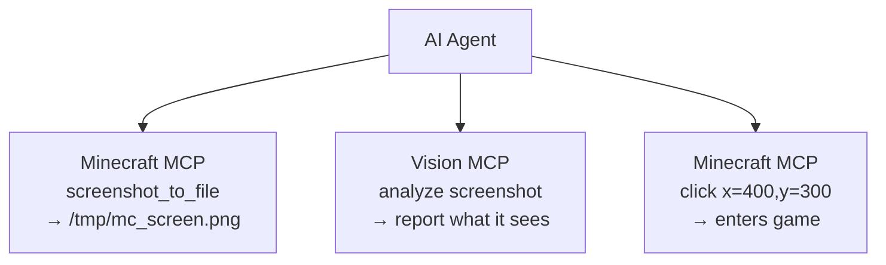

# AIツール統合ガイド

**[English](../en/AI-TOOLS.md)** &bull; **[简体中文](../zhs/AI-TOOLS.md)** &bull; **[繁體中文](../zht/AI-TOOLS.md)** &bull; **日本語** &bull; **[한국어](../ko/AI-TOOLS.md)** &bull; **[Français](../fr/AI-TOOLS.md)** &bull; **[Español](../es/AI-TOOLS.md)** &bull; **[Русский](../ru/AI-TOOLS.md)**

> **ヒント**：あなたのAIエージェントアシスタントに、このリポジトリの本ガイドのURLを直接読ませるだけで接続できます。通常、手動での設定は不要です。

このガイドでは、主要なAIコーディングツールをHTTP経由でMinecraft MCPサーバーに接続する設定方法を説明します。

## Minecraft MCP HTTPエンドポイント

Minecraft MCPサーバーは以下のHTTPエンドポイントを公開しています（デフォルトポート: **9876**）:

| エンドポイント | メソッド | 説明 |
|----------|--------|-------------|
| `/api/status` | GET | ヘルスチェック |
| `/api/cmd` | POST | JSON-RPCコマンドディスパッチ（body: `{"cmd":"...", "params":{...}}`） |
| `/api/screenshot` | GET | スクリーンショットを撮影し、PNG base64を返す |
| `/api/events` | GET | リアルタイムコール履歴のためのSSE（Server-Sent Events）ストリーム |
| `/api/calls` | GET | 直近50件のコールイベントをJSON配列で返す |

> **前提条件**: Minecraft MCPデーモンが実行中で、MCP MODを導入したMinecraftクライアントが接続されていることを確認してください。`just daemon`を実行した後、`just launch <version> <loader>`を実行します。

---

## 統合方法

ほとんどのAIコーディングツールは、外部サーバーに接続するための**Model Context Protocol (MCP)**をサポートしています。Minecraft MCPサーバーには以下の方法で接続できます：

- **SSEトランスポート**: ツールのMCPクライアントを`http://localhost:9876/api/events`に向ける
- **HTTP REST API**: `http://localhost:9876/api/cmd`に直接POSTリクエストを送信する

以下のセクションでは、ツールごとの設定手順を説明します。

---

## コーディングエージェントツール

### Claude Code

Anthropic製のターミナルベースAIコーディングアシスタント。

**設定方法**: プロジェクトルートに`.mcp.json`を作成または編集します:

```json
{
  "mcpServers": {
    "minecraft-mcp": {
      "type": "sse",
      "url": "http://localhost:9876/api/events"
    }
  }
}
```

または、`claude mcp add minecraft-mcp --transport sse http://localhost:9876/api/events`を使用します。

### Claude Desktop / Claude for IDE

デスクトップアプリおよびVS Code/JetBrains IDEプラグイン版のClaude。

**設定方法**: `claude_desktop_config.json`を編集します:

- **macOS**: `~/Library/Application Support/Claude/claude_desktop_config.json`
- **Windows**: `%APPDATA%\Claude\claude_desktop_config.json`

```json
{
  "mcpServers": {
    "minecraft-mcp": {
      "type": "sse",
      "url": "http://localhost:9876/api/events"
    }
  }
}
```

**Claude for IDE** (VS Code / JetBrains)の場合も設定は同じです — プロジェクトルートの`.mcp.json`ファイルを使用します。

### OpenCode

オープンソースのターミナルコーディングエージェント。

**設定方法**: プロジェクトルートに`.opencode.json`を作成するか、`~/.config/opencode/config.json`を編集します:

```json
{
  "mcpServers": {
    "minecraft-mcp": {
      "type": "sse",
      "url": "http://localhost:9876/api/events"
    }
  }
}
```

### Cursor

カスタムモデル対応のAIファーストコードエディタ。

**設定方法**: プロジェクトルートに`.cursor/mcp.json`を作成します:

```json
{
  "mcpServers": {
    "minecraft-mcp": {
      "url": "http://localhost:9876/api/events",
      "transport": "sse"
    }
  }
}
```

またはUIから: **Cursor Settings → MCP → Add new MCP Server**で、トランスポートタイプを**SSE**に設定し、URLを入力します。

### Cline

VS Code AIコーディング拡張機能。

**設定方法**: VS Codeの設定（`Ctrl+,`）を開き、`cline.mcpServers`を検索するか、`settings.json`に追加します:

```json
{
  "cline.mcpServers": {
    "minecraft-mcp": {
      "url": "http://localhost:9876/api/events",
      "transport": "sse"
    }
  }
}
```

### Roo Code

コード作成とリファクタリングのためのインテリジェントなVS Code拡張機能。

**設定方法**: VS Codeの`settings.json`に追加します（Clineと同じ形式）:

```json
{
  "roo.mcpServers": {
    "minecraft-mcp": {
      "url": "http://localhost:9876/api/events",
      "transport": "sse"
    }
  }
}
```

### Kilo Code

コード生成とプロジェクト管理のための効率的なVS Codeプラグイン。

**設定方法**: VS Codeの`settings.json`に追加します:

```json
{
  "kilo.mcpServers": {
    "minecraft-mcp": {
      "url": "http://localhost:9876/api/events",
      "transport": "sse"
    }
  }
}
```

### GitHub Copilot

GitHubのVS Code向けAIペアプログラマー。

**設定方法**: ワークスペースに`.github/copilot-instructions.md`を作成するか、VS Codeの設定からMCPを構成します:

```json
{
  "github.copilot.mcpServers": {
    "minecraft-mcp": {
      "url": "http://localhost:9876/api/events",
      "transport": "sse"
    }
  }
}
```

### GitHub Copilot CLI

コマンドライン向けGitHub Copilot。

**設定方法**: 環境変数を設定するか、`gh copilot config`を使用します:

```bash
export MCP_SERVER_URL="http://localhost:9876/api/events"
```

### CodeBuddy / WorkBuddy

AI駆動のフルスタックインテリジェントプログラミングツール。

**設定方法**: プロジェクトルートまたはワークスペースに`mcp.json`を作成します:

```json
{
  "mcpServers": {
    "minecraft-mcp": {
      "url": "http://localhost:9876/api/events",
      "transport": "sse"
    }
  }
}
```

### TRAE

様々な開発タスクを自律的に完了できるAIエディタ。

**設定方法**: **Settings → MCP Servers → Add Server**に移動します:

- **Name**: `minecraft-mcp`
- **Transport**: SSE
- **URL**: `http://localhost:9876/api/events`

### ZCode

強力なAIエージェントと既存のツールチェーンを組み合わせます。

**設定方法**: `~/.zcode/config.json`を編集します:

```json
{
  "mcpServers": {
    "minecraft-mcp": {
      "type": "sse",
      "url": "http://localhost:9876/api/events"
    }
  }
}
```

### Lingma

インテリジェントプログラミングアシスタント。

**設定方法**: **Settings → MCP → Add Server**に移動します:

- **Name**: `minecraft-mcp`
- **Transport**: SSE
- **URL**: `http://localhost:9876/api/events`

### Qoder

実用的なソフトウェアのためのエージェントプログラミングプラットフォーム。

**設定方法**: `~/.qoder/mcp.json`を編集します:

```json
{
  "mcpServers": {
    "minecraft-mcp": {
      "type": "sse",
      "url": "http://localhost:9876/api/events"
    }
  }
}
```

### Droid

エンドツーエンドのワークフロー向けエンタープライズ級ターミナルAIコーディングエージェント。

**設定方法**: `~/.droid/mcp.json`を編集します:

```json
{
  "mcpServers": {
    "minecraft-mcp": {
      "type": "sse",
      "url": "http://localhost:9876/api/events"
    }
  }
}
```

### Crush

CLIとTUIインターフェースをサポートするターミナルAIプログラミングツール。

**設定方法**: `~/.crush/config.json`を編集します:

```json
{
  "mcpServers": {
    "minecraft-mcp": {
      "type": "sse",
      "url": "http://localhost:9876/api/events"
    }
  }
}
```

### Goose

ローカル実行と自動化エンジニアリングタスクをサポートするAIエージェントツール。

**設定方法**: `~/.config/goose/mcp.json`を編集します:

```json
{
  "mcpServers": {
    "minecraft-mcp": {
      "type": "sse",
      "url": "http://localhost:9876/api/events"
    }
  }
}
```

### Deep Code

DeepSeek搭載のコーディングアシスタント。

**設定方法**: `~/.deepcode/config.json`を編集します:

```json
{
  "mcpServers": {
    "minecraft-mcp": {
      "type": "sse",
      "url": "http://localhost:9876/api/events"
    }
  }
}
```

### Reasonix

推論特化型AIコーディングツール。

**設定方法**: `~/.reasonix/config.json`を編集します:

```json
{
  "mcpServers": {
    "minecraft-mcp": {
      "type": "sse",
      "url": "http://localhost:9876/api/events"
    }
  }
}
```

### Langcli

CLIベースのAIコーディングアシスタント。

**設定方法**: `~/.langcli/config.yaml`を編集します:

```yaml
mcp_servers:
  minecraft-mcp:
    type: sse
    url: http://localhost:9876/api/events
```

### Oh My Pi

多目的AIエージェントプラットフォーム。

**設定方法**: `~/.oh-my-pi/mcp.json`を編集します:

```json
{
  "mcpServers": {
    "minecraft-mcp": {
      "type": "sse",
      "url": "http://localhost:9876/api/events"
    }
  }
}
```

### Pi

軽量AIコーディングコンパニオン。

**設定方法**: `~/.pi/config.json`を編集します:

```json
{
  "mcpServers": {
    "minecraft-mcp": {
      "type": "sse",
      "url": "http://localhost:9876/api/events"
    }
  }
}
```

---

## 汎用エージェントツール

### OpenClaw

Skills拡張機能を備えたローカル実行型オープンソースAIアシスタント。

**設定方法**: ワークスペースの`openclaw.json`を編集します:

```json
{
  "mcpServers": {
    "minecraft-mcp": {
      "type": "sse",
      "url": "http://localhost:9876/api/events"
    }
  }
}
```

### Cherry Studio

複数モデル統合をサポートするAIアプリケーションIDE。

**設定方法**: **Settings → MCP Servers → Add**に移動します:

- **Name**: `minecraft-mcp`
- **Transport**: SSE
- **URL**: `http://localhost:9876/api/events`

### Hermes Agent

永続的メモリを備えたオープンソースの自己進化型AIエージェント。

**設定方法**: `~/.hermes/config.json`を編集します:

```json
{
  "mcpServers": {
    "minecraft-mcp": {
      "type": "sse",
      "url": "http://localhost:9876/api/events"
    }
  }
}
```

### AstrBot

AI駆動のボットフレームワーク。

**設定方法**: `astrbot_config.json`を編集します:

```json
{
  "mcp_servers": {
    "minecraft-mcp": {
      "type": "sse",
      "url": "http://localhost:9876/api/events"
    }
  }
}
```

### nanobot

様々なタスク向けの軽量AIエージェント。

**設定方法**: `~/.nanobot/config.json`を編集します:

```json
{
  "mcpServers": {
    "minecraft-mcp": {
      "type": "sse",
      "url": "http://localhost:9876/api/events"
    }
  }
}
```

---

## HTTP REST API直接アクセス

MCPプロトコルをネイティブサポートしていないツールの場合、HTTP REST APIを介してMinecraft MCPサーバーと直接やり取りできます:

```bash
# ヘルスチェック
curl http://localhost:9876/api/status

# コマンドを実行
curl -X POST http://localhost:9876/api/cmd \
  -H "Content-Type: application/json" \
  -d '{"cmd":"screenshot","params":{}}'

# スクリーンショットを撮影
curl http://localhost:9876/api/screenshot

# イベントを購読（SSEストリーム）
curl http://localhost:9876/api/events
```

### 一般的なコマンド

| コマンド | 説明 |
|---------|-------------|
| `screenshot` | Minecraftウィンドウのスクリーンショットを撮影 |
| `screenshot_to_file` | スクリーンショットを撮影し、ローカルファイルに保存（`{"cmd":"screenshot_to_file","params":{"path":"/tmp/mc.png"}}`） |
| `click` | (x, y)座標をクリック |
| `press_key` | キーボードキーを押す |
| `type_text` | テキスト文字列を入力 |
| `scroll` | マウススクロールを実行 |
| `execute_command` | Minecraftのスラッシュコマンドを実行 |
| `get_player_info` | プレイヤーの位置と状態を取得 |
| `get_world_info` | ワールド情報を取得 |

---

## ビジュアル認識統合

Minecraft MCPを**視覚対応MCPサーバー**と組み合わせることで、AIエージェントがゲーム内で起きていることを*見て理解*できるようになります — UIテキストの読み取り、エラーの診断、レイアウトの分析などが可能です。

### 仕組み

1. Minecraft MCPが`screenshot_to_file`でスクリーンショットを撮影し、ローカルファイルに保存します
2. 視覚MCPサーバーがそのファイルを読み取り、分析します
3. AIエージェントが両方を調整します — スクリーンショット → 分析 → アクション



### GLM Vision MCP Server

[GLM Vision MCP Server](https://docs.bigmodel.cn/cn/coding-plan/mcp/vision-mcp-server) (`@z_ai/mcp-server`) は、GLM-4.6Vを搭載したローカルMCPサーバーで、以下の機能を提供します：

| ツール | ユースケース |
|------|----------|
| `ui_to_artifact` | UIスクリーンショットをコード、プロンプト、デザイン仕様に変換 |
| `extract_text_from_screenshot` | ゲームUI（チャット、看板、メニュー）からテキストをOCR抽出 |
| `diagnose_error_screenshot` | ゲーム内のエラーダイアログとスタックトレースを解析 |
| `understand_technical_diagram` | レッドストーン回路や設計図を読み取り |
| `analyze_data_visualization` | ゲーム内の統計情報やダッシュボードを読み取り |
| `image_analysis` | ゲームシーンの一般的な視覚理解 |
| `ui_diff_check` | ビフォー/アフターのスクリーンショットを比較 |

**インストール** (Node.js >= 18が必要):

```bash
# Claude Code
claude mcp add -s user zai-mcp-server --env Z_AI_API_KEY=<your_zhipu_api_key> -- npx -y "@z_ai/mcp-server"

# Manual config (Cline, Roo Code, Kilo Code, etc.)
{
  "mcpServers": {
    "zai-mcp-server": {
      "type": "stdio",
      "command": "npx",
      "args": ["-y", "@z_ai/mcp-server"],
      "env": {
        "Z_AI_API_KEY": "<your_zhipu_api_key>",
        "Z_AI_MODE": "ZHIPU"
      }
    }
  }
}
```

---

## トラブルシューティング

1. **接続拒否**: MCPデーモンが実行中（`just daemon`）で、Minecraftクライアントが起動していることを確認してください。
2. **SSEタイムアウト**: 一部のツールは、一定時間操作がないとSSEから切断される場合があります。ツールまたはSSE接続を再起動してください。
3. **ポート競合**: ポート9876が使用中の場合は、`MCP_PORT`環境変数またはシステムプロパティ`mcp.server.port`で別のポートを設定してください。
4. **ファイアウォール**: ファイアウォールが`localhost:9876`への接続を許可していることを確認してください。

> 問題や質問がある場合は、[GitHubリポジトリ](https://github.com/langyo/minecraft-mod-mcp)でIssueを作成してください。
