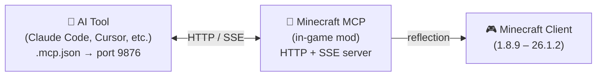

<!-- markdownlint-disable MD033 MD041 MD036 -->
<div align="center">


# Minecraft MCP

**AIにMinecraftをプレイさせよう**

[](../../LICENSE-MIT)
[](https://www.java.com/)
[](https://github.com/langyo/minecraft-mod-mcp/releases)
[](https://www.npmjs.com/package/minecraft-mod-mcp)

**[English](../en/README.md)** &bull; **[简体中文](../zhs/README.md)** &bull; **[繁體中文](../zht/README.md)** &bull; **日本語** &bull; **[한국어](../ko/README.md)** &bull; **[Français](../fr/README.md)** &bull; **[Español](../es/README.md)** &bull; **[Русский](../ru/README.md)**

</div>
<!-- markdownlint-enable MD033 MD041 MD036 -->

## 🤖 AIをMinecraftに接続

**以下のリンクをAIエージェントに貼り付けるだけで、自動的に設定されます：**

```
https://github.com/langyo/minecraft-mod-mcp/blob/main/docs/guides/ja/AI-TOOLS.md
```

AIがガイドを読み取り、MCP接続をセットアップし、ゲームの操作を開始します。手動設定は不要です。

> 既にModをインストール済みですか？そのリンク一つで十分です。

---

## Minecraft MCPとは

Minecraft MCPは、AIアシスタントとMinecraftをつなぐ架け橋です。ゲーム内でModとして動作し、HTTPサーバーを公開することでAIツールが標準のMCPプロトコルを通じて接続できます。この架け橋を通じて、AIは画面を見て、ボタンをクリックし、コマンドを入力し、ワールドと対話することができます。

> AIに城を建てさせたい？スモークテストを実行したい？Modパックのメニューを操作したい？Minecraft MCPなら可能です。

- **見る** — 座標グリッド付きのスクリーンショットを撮影
- **操作する** — クリック、入力、スクロール、ドラッグ、任意のキー入力
- **知る** — プレイヤーの位置、ワールド情報、画面ボタン、デバッグフィールドの照会
- **記録する** — SSEによるリアルタイムイベントのストリーミング、動画フレームのキャプチャ

---

## 対応バージョン

| MC Version | Forge | Fabric | NeoForge |
|------------|:-----:|:------:|:--------:|
| 1.8.9 | ✓ | — | — |
| 1.9.4 | ✓ | — | — |
| 1.10.2 | ✓ | — | — |
| 1.11.2 | ✓ | — | — |
| 1.12.2 | ✓ | — | — |
| 1.13.2 | ✓ | — | — |
| 1.14.4 | ✓ | 🚧 | — |
| 1.15.2 | ✓ | 🚧 | — |
| 1.16.5 | ✓ | 🚧 | — |
| 1.17.1 | ✓ | 🚧 | — |
| 1.18.2 | ✓ | 🚧 | — |
| 1.19.4 | ✓ | 🚧 | — |
| 1.20.6 | ✓ | 🚧 | 🚧 |
| 1.21.7 | ✓ | — | — |
| 26.1.2 | ✓ | — | 🚧 |

> 🚧 = 開発中

---

## はじめに

### 1. Modをインストール

[GitHub Releases](https://github.com/langyo/minecraft-mod-mcp/releases)からJARファイルをダウンロードし、Minecraftの`mods`フォルダに配置してください。

- **Forge**、**Fabric**、または**NeoForge**が必要です（上記の対応バージョンをご確認ください）
- Minecraft **1.8.9**から**26.1.2**まで対応

### 2. MCPブリッジをインストール

```bash
npm install -g minecraft-mod-mcp
```

または、インストールせずに実行：

```bash
npx minecraft-mod-mcp
```

### 3. Minecraftを起動

Modローダーでゲームを起動します。Modは自動的にポート9876でHTTPサーバーを起動します。

### 4. AIを接続

**[→ AIツール統合ガイド](./AI-TOOLS.md)** — Claude Code、Cursor、Cline、Copilotなど20以上のAIツールに対応したステップバイステップガイド。

または、以下のリンクをAIエージェントに貼り付けて自動設定させることもできます：

```
https://github.com/langyo/minecraft-mod-mcp/blob/main/docs/guides/ja/AI-TOOLS.md
```

---

## 仕組み



このModはMinecraft内でポート9876のHTTPサーバーを実行します。お使いのAIツールは標準のMCPプロトコル（SSEトランスポート）で接続し、クリック、入力、スクリーンショットなどのすべてのコマンドはJavaリフレクションを使用して、バージョン固有のコードなしですべてのMinecraftバージョンで動作します。

---

## ソースからのビルド

> このセクションはコントリビューター向けです。Modを使用するだけの場合は、上記の[はじめに](#はじめに)をご覧ください。

[CONTRIBUTING.md](../../CONTRIBUTING.md)で開発環境のセットアップ、プロジェクト構成、ガイドラインをご確認ください。

---

## コントリビューション

[CONTRIBUTING.md](../../CONTRIBUTING.md)をご覧ください。

---

## ライセンス

以下のいずれかのライセンスの下で提供されます：

- Apache License, Version 2.0 ([LICENSE-APACHE](../../LICENSE-APACHE) または http://www.apache.org/licenses/LICENSE-2.0)
- MIT License ([LICENSE-MIT](../../LICENSE-MIT) または http://opensource.org/licenses/MIT)

お好みで選択してください。
