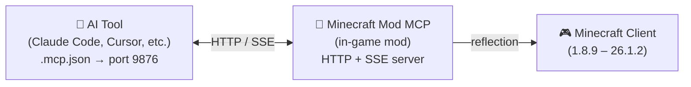

<!-- markdownlint-disable MD033 MD041 MD036 -->
<div align="center">


# Minecraft Mod MCP

**AI支援のMod開発ツールキット**

[](../../LICENSE-MIT)
[](https://www.java.com/)
[](https://github.com/langyo/minecraft-mod-mcp/releases)
[](https://www.npmjs.com/package/minecraft-mod-mcp)

**[English](../../README.md)** &bull; **[简体中文](../zhs/README.md)** &bull; **[繁體中文](../zht/README.md)** &bull; **日本語** &bull; **[한국어](../ko/README.md)** &bull; **[Français](../fr/README.md)** &bull; **[Español](../es/README.md)** &bull; **[Русский](../ru/README.md)**

</div>
<!-- markdownlint-enable MD033 MD041 MD036 -->

## 🤖 AIをMinecraftに接続

**以下のリンクをAIエージェントに貼り付けるだけで、自動的に設定されます：**

```
https://github.com/langyo/minecraft-mod-mcp/blob/main/docs/guides/ja/AI-TOOLS.md
```

AIがガイドを読み取り、MCP接続をセットアップし、ゲームの操作を開始します。手動設定は不要です。

> 既にModをインストール済みですか？そのリンク一つで十分です。

---

## Minecraft Mod MCPとは

Minecraft Mod MCPは、**Mod開発者向け**のAI支援ツールです。`mods`フォルダに入れてゲームを起動すると、AIが画面を見て、GUIボタンをクリックし、コマンドを入力し、ワールドと対話できるようになります——すべて標準のMCPプロトコルで。Modのテスト、動作検証、自動化ワークフローに最適です。

- **見る** — 座標グリッド付きのスクリーンショットを撮影
- **操作する** — クリック、入力、スクロール、ドラッグ、任意のキー入力
- **知る** — プレイヤーの位置、ワールド情報、画面ボタン、デバッグフィールドの照会
- **記録する** — SSEによるリアルタイムイベントのストリーミング、動画フレームのキャプチャ

> AIにModのGUIをテストさせたい？スモークテストを実行したい？新しいブロックの動作を検証したい？Minecraft Mod MCPなら可能です。

---

## 対応バージョン

| MC バージョン | Forge | Fabric | NeoForge |
|------------|:-----:|:------:|:--------:|
| 26.1.2 | [⬇](https://github.com/langyo/minecraft-mod-mcp/releases/latest/download/minecraft-mcp-26.1.2-forge.jar) | — | [⬇](https://github.com/langyo/minecraft-mod-mcp/releases/latest/download/minecraft-mcp-26.1.2-neoforge.jar) |
| 1.21.11 | [⬇](https://github.com/langyo/minecraft-mod-mcp/releases/latest/download/minecraft-mcp-1.21.11-forge.jar) | [⬇](https://github.com/langyo/minecraft-mod-mcp/releases/latest/download/minecraft-mcp-1.21.11-fabric.jar) | [⬇](https://github.com/langyo/minecraft-mod-mcp/releases/latest/download/minecraft-mcp-1.21.11-neoforge.jar) |

> 古いバージョン（1.8.9 – 1.20.6）は [Releases ページ](https://github.com/langyo/minecraft-mod-mcp/releases) をご覧ください。

---

## はじめに

### 1. Modをインストール

[GitHub Releases](https://github.com/langyo/minecraft-mod-mcp/releases)からJARファイルをダウンロードし、Minecraftの`mods`フォルダに配置してください。

- **Forge**、**Fabric**、または**NeoForge**が必要です（上記の対応バージョンをご確認ください）
- Minecraft **1.8.9**から**26.1.2**まで対応

### 2. MCPブリッジをインストール

```bash
npm install -g minecraft-mod-mcp
```

または、インストールせずに実行：

```bash
npx minecraft-mod-mcp
```

### 3. Minecraftを起動

Modローダーでゲームを起動します。Modは自動的にポート9876でHTTPサーバーを起動します。

### 4. AIを接続

**[→ AIツール統合ガイド](./AI-TOOLS.md)** — Claude Code、Cursor、Cline、Copilotなど20以上のAIツールに対応したステップバイステップガイド。

または、以下のリンクをAIエージェントに貼り付けて自動設定させることもできます：

```
https://github.com/langyo/minecraft-mod-mcp/blob/main/docs/guides/ja/AI-TOOLS.md
```

---

## 使い方のヒント

### ゲームとの並行作業

通常、Minecraft から他のウィンドウに切り替えると一時停止画面が開き、MCP コマンドが中断されることがあります。以下のいずれかの方法で回避できます：

- **一時停止画面**：`Esc` を押して一時停止画面を開き、MCP オーバーレイの**マウス解放**ボタンをクリックします。これにより、一時停止画面が再表示されることなく自由にウィンドウを切り替えられます。
- **ゲーム内オーバーレイ**：3D 視点で**右上隅**の MCP オーバーレイボタンをクリックすると、一時的にマウスカーソルが解放されます。解放後は `Alt+Tab` でゲームから切り替えても自動停止しません——MCP 接続を維持したまま IDE や AI ツールで作業を続けるのに最適です。

### ポートとHTTPサーバー

ゲーム起動時に、ModはHTTPサーバーを起動します。デフォルトではポート **9876** を試行し、使用中の場合は **9875 → 9874 → ... → 9000** まで空きポートを探してフォールバックします。JVM引数 `-Dmcp.port=XXXX` または環境変数 `MC_MCP_PORT` で固定ポートを指定できます。

選択されたポートの確認方法：
- コンソールに `[MCP-MOD] Debug page: http://127.0.0.1:{port}/debug` が表示されます
- ゲーム内チャットにクリック可能なデバッグページURLが表示されます
- `GET /api/status` が `version`、`loader`、`port`、`pid`、`uptime` を返します——Node.jsブリッジはこれで自動検出します
- ブラウザで `http://localhost:{port}/debug` を開くと、MCPログやSSEイベント、接続状態を表示するライブダッシュボードが確認できます

MCバージョンとローダー情報はハンドシェイク時に `/api/status` で確認され、ブリッジとデバッグページの両方がどのMC環境に接続しているかを認識します。

---

## 仕組み

<details>
<summary>📸 スクリーンショット — クリックで展開</summary>


</details>



このModはMinecraft内でポート9876のHTTPサーバーを実行します。お使いのAIツールは標準のMCPプロトコル（SSEトランスポート）で接続し、クリック、入力、スクリーンショットなどのすべてのコマンドはJavaリフレクションを使用して、バージョン固有のコードなしですべてのMinecraftバージョンで動作します。

---

## ソースからのビルド

> このセクションはコントリビューター向けです。Modを使用するだけの場合は、上記の[はじめに](#はじめに)をご覧ください。

[CONTRIBUTING.md](../../CONTRIBUTING.md)で開発環境のセットアップ、プロジェクト構成、ガイドラインをご確認ください。

---

## ライセンス

以下のいずれかのライセンスの下で提供されます：

- Apache License, Version 2.0 ([LICENSE-APACHE](../../LICENSE-APACHE) または http://www.apache.org/licenses/LICENSE-2.0)
- MIT License ([LICENSE-MIT](../../LICENSE-MIT) または http://opensource.org/licenses/MIT)

お好みで選択してください。
