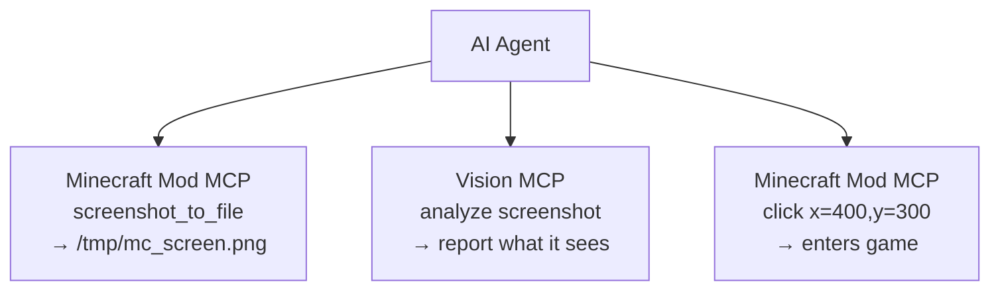

# AI 도구 통합 가이드

**[English](../en/AI-TOOLS.md)** &bull; **[简体中文](../zhs/AI-TOOLS.md)** &bull; **[繁體中文](../zht/AI-TOOLS.md)** &bull; **[日本語](../ja/AI-TOOLS.md)** &bull; **한국어** &bull; **[Français](../fr/AI-TOOLS.md)** &bull; **[Español](../es/AI-TOOLS.md)** &bull; **[Русский](../ru/AI-TOOLS.md)**

> **🤖 AI 에이전트용**: 사용자가 Minecraft 연결을 요청하면 다음 MCP 서버 설정을 추가하고 이 가이드 끝에 나열된 35개 이상의 도구를 사용하세요:
>
> ```json
> {
>   "mcpServers": {
>     "minecraft-mcp": {
>       "type": "local",
>       "command": ["npx", "-y", "minecraft-mod-mcp"]
>     }
>   }
> }
> ```
>
> **사용자용**: 이 페이지의 URL을 AI 에이전트에 붙여넣기만 하면 자동으로 설정됩니다. 수동 설정이 필요하지 않습니다.

<!-- bridge-fix -->
> ⚠️ **Important / 重要 / Важно**: Connect via the **stdio bridge** `npx -y minecraft-mod-mcp` (MCP `type: "local"`),
> **not** by pointing `"type":"sse"` at `http://localhost:9876/api/events`. The mod's `/api/events` is a plain
> debug SSE stream and is **not** an MCP transport — an SSE config will fail to list or call any tool.
> The bridge is the only component that speaks MCP and auto-discovers which port the game is on (9876→9000).
> See the [English guide](../en/AI-TOOLS.md) for the authoritative, up-to-date instructions.

---

## 빠른 설정

대부분의 AI 코딩 도구는 동일한 SSE 기반 MCP 설정을 사용합니다. 도구의 설정 파일에 다음을 추가하세요:

```json
{
  "mcpServers": {
    "minecraft-mcp": {
      "type": "local",
      "command": ["npx", "-y", "minecraft-mod-mcp"]
    }
  }
}
```

일반적인 설정 파일 위치:

| 도구 | 설정 파일 |
|------|-------------|
| Claude Code, OpenCode, CodeBuddy, WorkBuddy | 프로젝트 루트의 `.mcp.json` |
| Cursor | 프로젝트 루트의 `.cursor/mcp.json` |
| Cline, Roo Code, Kilo Code | VS Code `settings.json` |
| Claude Desktop | `claude_desktop_config.json` (OS별 경로는 아래 참조) |
| 기타 | 아래 도구별 설명 참조 |

> 정확한 경로, UI 기반 설정, 도구별 형식은 [도구별 설명](#코딩-에이전트-도구)을 참조하세요.

## Minecraft Mod MCP HTTP 엔드포인트

Minecraft Mod MCP 서버는 다음과 같은 HTTP 엔드포인트를 제공합니다 (기본 포트: **9876**):

| 엔드포인트 | 메서드 | 설명 |
|----------|--------|-------------|
| `/api/status` | GET | 상태 확인 |
| `/api/cmd` | POST | JSON-RPC 명령어 디스패치 (본문: `{"cmd":"...", "params":{...}}`) |
| `/api/screenshot` | GET | 스크린샷 촬영, PNG base64 반환 |
| `/api/events` | GET | 실시간 호출 내역을 위한 SSE(Server-Sent Events) 스트림 |
| `/api/calls` | GET | 최근 50개의 호출 이벤트를 JSON 배열로 반환 |

> **사전 준비**: Minecraft Mod MCP 데몬이 실행 중이고 MCP 모드가 적용된 Minecraft 클라이언트가 연결되어 있어야 합니다. `npx -y minecraft-mod-mcp` (the bridge auto-discovers the game) or launch a client via the `launch_minecraft` tool를 실행하세요.

---

## 통합 방법

대부분의 AI 코딩 도구는 외부 서버 연결을 위해 **Model Context Protocol (MCP)**을 지원합니다. Minecraft Mod MCP 서버는 다음 방식으로 연결할 수 있습니다:

- **MCP (stdio bridge — required)**: run `npx -y minecraft-mod-mcp`. This is the only MCP-compatible transport; the bridge auto-discovers the game's port (9876→9000). The mod's `/api/events` is not an MCP transport.
- **HTTP REST API**: `http://localhost:9876/api/cmd`로 직접 POST 요청 전송

아래 섹션에서는 각 도구별 설정 방법을 안내합니다.

---

## 코딩 에이전트 도구

### Claude Code

Anthropic의 터미널 기반 AI 코딩 어시스턴트입니다.

**설정 방법**: 프로젝트 루트에 `.mcp.json` 파일을 생성하거나 편집합니다:

```json
{
  "mcpServers": {
    "minecraft-mcp": {
      "type": "local",
      "command": ["npx", "-y", "minecraft-mod-mcp"]
    }
  }
}
```

또는 `claude mcp add minecraft-mod-mcp -- npx -y minecraft-mod-mcp` 명령어를 사용할 수도 있습니다.

### Claude Desktop / Claude for IDE

Claude의 데스크톱 앱 및 VS Code/JetBrains IDE 플러그인 버전입니다.

**설정 방법**: `claude_desktop_config.json` 파일을 편집합니다:

- **macOS**: `~/Library/Application Support/Claude/claude_desktop_config.json`
- **Windows**: `%APPDATA%\Claude\claude_desktop_config.json`

```json
{
  "mcpServers": {
    "minecraft-mcp": {
      "type": "local",
      "command": ["npx", "-y", "minecraft-mod-mcp"]
    }
  }
}
```

**Claude for IDE** (VS Code / JetBrains)의 경우 설정은 동일합니다 — 프로젝트 루트의 `.mcp.json` 파일을 사용하세요.

### OpenCode

오픈소스 터미널 코딩 에이전트입니다.

**설정 방법**: 프로젝트 루트에 `.opencode.json` 파일을 생성하거나 `~/.config/opencode/config.json` 파일을 편집합니다:

```json
{
  "mcpServers": {
    "minecraft-mcp": {
      "type": "local",
      "command": ["npx", "-y", "minecraft-mod-mcp"]
    }
  }
}
```

### Cursor

커스텀 모델을 지원하는 AI 중심 코드 편집기입니다.

**설정 방법**: 프로젝트 루트에 `.cursor/mcp.json` 파일을 생성합니다:

```json
{
  "mcpServers": {
    "minecraft-mcp": {
      "command": "npx",
      "args": ["-y", "minecraft-mod-mcp"]
    }
  }
}
```

또는 UI를 통해: **Cursor Settings → MCP → Add new MCP Server**, type **stdio**, command `npx -y minecraft-mod-mcp`.

### Cline

VS Code AI 코딩 확장 프로그램입니다.

**설정 방법**: VS Code 설정(`Ctrl+,`)을 열고 `cline.mcpServers`를 검색하거나 `settings.json`에 추가합니다:

```json
{
  "cline.mcpServers": {
    "minecraft-mcp": {
      "command": "npx",
      "args": ["-y", "minecraft-mod-mcp"]
    }
  }
}
```

### Roo Code

코드 작성 및 리팩토링을 위한 지능형 VS Code 확장 프로그램입니다.

**설정 방법**: VS Code `settings.json`에 추가합니다 (Cline과 동일한 형식):

```json
{
  "roo.mcpServers": {
    "minecraft-mcp": {
      "command": "npx",
      "args": ["-y", "minecraft-mod-mcp"]
    }
  }
}
```

### Kilo Code

코드 생성 및 프로젝트 관리를 위한 효율적인 VS Code 플러그인입니다.

**설정 방법**: VS Code `settings.json`에 추가합니다:

```json
{
  "kilo.mcpServers": {
    "minecraft-mcp": {
      "command": "npx",
      "args": ["-y", "minecraft-mod-mcp"]
    }
  }
}
```

### GitHub Copilot

VS Code의 GitHub AI 페어 프로그래머입니다.

**설정 방법**: 작업 영역에 `.github/copilot-instructions.md` 파일을 생성하거나 VS Code 설정을 통해 MCP를 구성합니다:

```json
{
  "github.copilot.mcpServers": {
    "minecraft-mcp": {
      "command": "npx",
      "args": ["-y", "minecraft-mod-mcp"]
    }
  }
}
```

### GitHub Copilot CLI

명령줄용 GitHub Copilot입니다.

**설정 방법**: 환경 변수를 설정하거나 `gh copilot config`를 사용합니다:

```bash
# GitHub Copilot CLI does not load MCP servers from an env var.
# Use a stdio-capable MCP host instead, e.g. Claude Code:
#   claude mcp add minecraft-mod-mcp -- npx -y minecraft-mod-mcp
```

### CodeBuddy / WorkBuddy

AI 기반 풀스택 지능형 프로그래밍 도구입니다.

**설정 방법**: 프로젝트 루트 또는 작업 영역에 `mcp.json` 파일을 생성합니다:

```json
{
  "mcpServers": {
    "minecraft-mcp": {
      "command": "npx",
      "args": ["-y", "minecraft-mod-mcp"]
    }
  }
}
```

### TRAE

다양한 개발 작업을 독립적으로 수행할 수 있는 AI 편집기입니다.

**설정 방법**: **설정 → MCP Servers → Add Server**로 이동합니다:

- **Name**: `minecraft-mcp`
- **Transport**: stdio
- **URL**: `npx -y minecraft-mod-mcp`

### ZCode

강력한 AI 에이전트와 기존 도구 체인을 결합합니다.

**설정 방법**: `~/.zcode/config.json` 파일을 편집합니다:

```json
{
  "mcpServers": {
    "minecraft-mcp": {
      "type": "local",
      "command": ["npx", "-y", "minecraft-mod-mcp"]
    }
  }
}
```

### Lingma

지능형 프로그래밍 어시스턴트입니다.

**설정 방법**: **설정 → MCP → Add Server**로 이동합니다:

- **Name**: `minecraft-mcp`
- **Transport**: stdio
- **URL**: `npx -y minecraft-mod-mcp`

### Qoder

실무 소프트웨어를 위한 에이전트 프로그래밍 플랫폼입니다.

**설정 방법**: `~/.qoder/mcp.json` 파일을 편집합니다:

```json
{
  "mcpServers": {
    "minecraft-mcp": {
      "type": "local",
      "command": ["npx", "-y", "minecraft-mod-mcp"]
    }
  }
}
```

### Droid

엔드투엔드 워크플로우를 위한 엔터프라이즈급 터미널 AI 코딩 에이전트입니다.

**설정 방법**: `~/.droid/mcp.json` 파일을 편집합니다:

```json
{
  "mcpServers": {
    "minecraft-mcp": {
      "type": "local",
      "command": ["npx", "-y", "minecraft-mod-mcp"]
    }
  }
}
```

### Crush

CLI 및 TUI 인터페이스를 지원하는 터미널 AI 프로그래밍 도구입니다.

**설정 방법**: `~/.crush/config.json` 파일을 편집합니다:

```json
{
  "mcpServers": {
    "minecraft-mcp": {
      "type": "local",
      "command": ["npx", "-y", "minecraft-mod-mcp"]
    }
  }
}
```

### Goose

로컬 실행 및 자동화된 엔지니어링 작업을 지원하는 AI 에이전트 도구입니다.

**설정 방법**: `~/.config/goose/mcp.json` 파일을 편집합니다:

```json
{
  "mcpServers": {
    "minecraft-mcp": {
      "type": "local",
      "command": ["npx", "-y", "minecraft-mod-mcp"]
    }
  }
}
```

### Deep Code

DeepSeek 기반 코딩 어시스턴트입니다.

**설정 방법**: `~/.deepcode/config.json` 파일을 편집합니다:

```json
{
  "mcpServers": {
    "minecraft-mcp": {
      "type": "local",
      "command": ["npx", "-y", "minecraft-mod-mcp"]
    }
  }
}
```

### Reasonix

추론 중심 AI 코딩 도구입니다.

**설정 방법**: `~/.reasonix/config.json` 파일을 편집합니다:

```json
{
  "mcpServers": {
    "minecraft-mcp": {
      "type": "local",
      "command": ["npx", "-y", "minecraft-mod-mcp"]
    }
  }
}
```

### Langcli

CLI 기반 AI 코딩 어시스턴트입니다.

**설정 방법**: `~/.langcli/config.yaml` 파일을 편집합니다:

```yaml
mcp_servers:
  minecraft-mcp:
    type: stdio
    command: ["npx", "-y", "minecraft-mod-mcp"]
```

### Oh My Pi

다목적 AI 에이전트 플랫폼입니다.

**설정 방법**: `~/.oh-my-pi/mcp.json` 파일을 편집합니다:

```json
{
  "mcpServers": {
    "minecraft-mcp": {
      "type": "local",
      "command": ["npx", "-y", "minecraft-mod-mcp"]
    }
  }
}
```

### Pi

경량 AI 코딩 동반 도구입니다.

**설정 방법**: `~/.pi/config.json` 파일을 편집합니다:

```json
{
  "mcpServers": {
    "minecraft-mcp": {
      "type": "local",
      "command": ["npx", "-y", "minecraft-mod-mcp"]
    }
  }
}
```

---

## 범용 에이전트 도구

### OpenClaw

Skills 확장 기능으로 로컬에서 실행되는 오픈소스 AI 어시스턴트입니다.

**설정 방법**: 작업 영역의 `openclaw.json` 파일을 편집합니다:

```json
{
  "mcpServers": {
    "minecraft-mcp": {
      "type": "local",
      "command": ["npx", "-y", "minecraft-mod-mcp"]
    }
  }
}
```

### Cherry Studio

여러 모델 통합을 지원하는 AI 애플리케이션 IDE입니다.

**설정 방법**: **설정 → MCP Servers → Add**로 이동합니다:

- **Name**: `minecraft-mcp`
- **Transport**: stdio
- **URL**: `npx -y minecraft-mod-mcp`

### Hermes Agent

영구 메모리를 갖춘 오픈소스 자가 진화형 AI 에이전트입니다.

**설정 방법**: `~/.hermes/config.json` 파일을 편집합니다:

```json
{
  "mcpServers": {
    "minecraft-mcp": {
      "type": "local",
      "command": ["npx", "-y", "minecraft-mod-mcp"]
    }
  }
}
```

### AstrBot

AI 기반 봇 프레임워크입니다.

**설정 방법**: `astrbot_config.json` 파일을 편집합니다:

```json
{
  "mcp_servers": {
    "minecraft-mcp": {
      "type": "local",
      "command": ["npx", "-y", "minecraft-mod-mcp"]
    }
  }
}
```

### nanobot

다양한 작업을 위한 경량 AI 에이전트입니다.

**설정 방법**: `~/.nanobot/config.json` 파일을 편집합니다:

```json
{
  "mcpServers": {
    "minecraft-mcp": {
      "type": "local",
      "command": ["npx", "-y", "minecraft-mod-mcp"]
    }
  }
}
```

---

## 직접 HTTP REST API 액세스

MCP 프로토콜을 기본 지원하지 않는 도구의 경우, Minecraft Mod MCP 서버의 HTTP REST API를 통해 직접 상호작용할 수 있습니다:

```bash
# 상태 확인
curl http://localhost:9876/api/status

# 명령어 실행
curl -X POST http://localhost:9876/api/cmd \
  -H "Content-Type: application/json" \
  -d '{"cmd":"screenshot","params":{}}'

# 스크린샷 촬영
curl http://localhost:9876/api/screenshot

# 이벤트 구독 (SSE 스트림)
curl http://localhost:9876/api/events
```

### 주요 명령어

| 명령어 | 설명 |
|---------|-------------|
| `screenshot` | Minecraft 창의 스크린샷 촬영 |
| `screenshot_to_file` | 스크린샷을 촬영하여 로컬 파일로 저장 (`{"cmd":"screenshot_to_file","params":{"path":"/tmp/mc.png"}}`) |
| `click` | (x, y) 좌표 클릭 |
| `press_key` | 키보드 키 입력 |
| `type_text` | 텍스트 문자열 입력 |
| `scroll` | 마우스 스크롤 수행 |
| `execute_command` | Minecraft 슬래시 명령어 실행 |
| `get_player_info` | 플레이어 위치 및 상태 정보 조회 |
| `get_world_info` | 월드 정보 조회 |

---

## 시각 인식 통합

Minecraft Mod MCP를 **비전 지원 MCP 서버**와 함께 사용하면 AI 에이전트가 게임에서 일어나는 일을 *보고 이해*할 수 있습니다 — UI 텍스트 읽기, 오류 진단, 레이아웃 분석 등 다양한 작업이 가능합니다.

### 작동 방식

1. Minecraft Mod MCP가 `screenshot_to_file`을 통해 스크린샷을 로컬 파일로 저장합니다
2. 비전 MCP 서버가 해당 파일을 읽고 분석합니다
3. AI 에이전트가 두 서버를 조율합니다 — 스크린샷 → 분석 → 동작



### GLM Vision MCP 서버

[GLM Vision MCP Server](https://docs.bigmodel.cn/cn/coding-plan/mcp/vision-mcp-server) (`@z_ai/mcp-server`)는 GLM-4.6V로 구동되는 로컬 MCP 서버로, 다음 기능을 제공합니다:

| 도구 | 용도 |
|------|----------|
| `ui_to_artifact` | UI 스크린샷을 코드, 프롬프트 또는 디자인 명세로 변환 |
| `extract_text_from_screenshot` | 게임 UI에서 텍스트 OCR (채팅, 표지판, 메뉴) |
| `diagnose_error_screenshot` | 게임 내 오류 대화상자 및 스택 트레이스 분석 |
| `understand_technical_diagram` | 레드스톤 회로, 회로도 읽기 |
| `analyze_data_visualization` | 게임 내 통계, 대시보드 읽기 |
| `image_analysis` | 게임 장면에 대한 일반적인 시각적 이해 |
| `ui_diff_check` | 스크린샷 전후 비교 |

**설치** (Node.js >= 18 필요):

```bash
# Claude Code
claude mcp add -s user zai-mcp-server --env Z_AI_API_KEY=<your_zhipu_api_key> -- npx -y "@z_ai/mcp-server"

# Manual config (Cline, Roo Code, Kilo Code, etc.)
{
  "mcpServers": {
    "zai-mcp-server": {
      "type": "stdio",
      "command": "npx",
      "args": ["-y", "@z_ai/mcp-server"],
      "env": {
        "Z_AI_API_KEY": "<your_zhipu_api_key>",
        "Z_AI_MODE": "ZHIPU"
      }
    }
  }
}
```

> **참고**: 비전 MCP는 디스크에서 파일을 읽으므로, 비전 도구를 호출하기 전에 항상 `screenshot_to_file`(`screenshot`이 아님)을 사용하세요. AI 에이전트는 `screenshot_to_file`을 호출할 때 특정 파일 경로를 지정할 수 있습니다.

### 예제 워크플로우

1. AI 에이전트에게 질문하세요: *"Minecraft 스크린샷을 찍어 `/tmp/mc.png`에 저장한 다음, 화면에 무엇이 있는지 분석하고 새 게임을 시작하려면 어떤 버튼을 눌러야 하는지 알려주세요."*
2. 에이전트가 `minecraft-mcp` → `screenshot_to_file` → 파일 저장
3. 에이전트가 `zai-mcp-server` → `extract_text_from_screenshot` → UI 텍스트 읽기
4. 에이전트가 본 내용과 다음 단계를 알려줍니다

### 기타 비전 도구

| 도구 | 설명 |
|------|------|
| [Claude built-in vision](https://docs.anthropic.com/en/docs/claude/vision) | Claude는 이미지를 기본적으로 이해합니다 — 스크린샷 파일을 붙여넣거나 참조하세요 |
| [GPT-4o / GPT-4V](https://platform.openai.com/docs/guides/vision) | OpenAI 비전 모델, OpenAI 호환 클라이언트에서 사용 가능 |
| [Gemini Vision](https://ai.google.dev/gemini-api/docs/vision) | Google 비전 API, Gemini 호환 도구에서 사용 가능 |
| [Qwen-VL](https://github.com/QwenLM/Qwen-VL) | 오픈소스 비전 언어 모델, 자체 호스팅 환경에 적합 |

> 비전 기능을 갖춘 LLM 또는 MCP 서버라면 동일한 파이프라인에서 사용할 수 있습니다 — 핵심은 `screenshot_to_file`을 사용하여 먼저 스크린샷을 디스크에 저장하는 것입니다.

---

## 문제 해결

1. **연결 거부됨**: MCP 데몬이 실행 중(`just daemon`)이고 Minecraft 클라이언트가 실행되었는지 확인하세요.
2. **SSE 타임아웃**: 일부 도구는 비활성 상태가 지속되면 SSE 연결이 끊어질 수 있습니다. 도구 또는 SSE 연결을 다시 시작하세요.
3. **포트 충돌**: 포트 9876이 사용 중인 경우, `MCP_PORT` 환경 변수 또는 시스템 속성 `mcp.server.port`를 통해 다른 포트를 설정하세요.
4. **방화벽**: 방화벽이 `localhost:9876`에 대한 연결을 허용하는지 확인하세요.

> 문제나 질문이 있으시면 [GitHub 저장소](https://github.com/langyo/minecraft-mod-mcp)에 이슈를 등록해 주세요.
