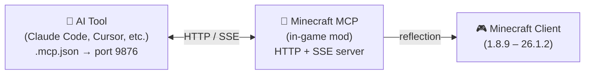

<!-- markdownlint-disable MD033 MD041 MD036 -->
<div align="center">


# Minecraft MCP

**멀티 버전, 멀티 모드로더 Minecraft MCP (Model Context Protocol) 모드 — 모드 빌드를 위해**

[](../../LICENSE-MIT)
[](https://www.java.com/)
[](https://github.com/langyo/minecraft-mod-mcp/releases)

**[English](../en/README.md)** &bull; **[简体中文](../zhs/README.md)** &bull; **[繁體中文](../zht/README.md)** &bull; **[日本語](../ja/README.md)** &bull; **[한국어](../ko/README.md)** &bull; **[Français](../fr/README.md)** &bull; **[Español](../es/README.md)** &bull; **[Русский](../ru/README.md)**

</div>
<!-- markdownlint-enable MD033 MD041 MD036 -->

## Minecraft MCP란?

Minecraft MCP는 AI 어시스턴트와 마인크래프트 사이의 다리 역할을 합니다. 게임 내에서 모드로 실행되며, AI 도구들이 표준 MCP 프로토콜을 통해 연결할 수 있는 HTTP 서버를 노출합니다. 이 다리를 통해 AI는 게임을 보고, 버튼을 클릭하고, 명령어를 입력하고, 세계와 상호작용할 수 있습니다.

> AI가 성을 짓게 하고 싶으신가요? 스모크 테스트를 실행하고 싶으신가요? 모드팩 메뉴를 탐색하고 싶으신가요? Minecraft MCP가 가능하게 합니다.

- **보기** — 좌표 격자가 포함된 스크린샷 캡처
- **행동하기** — 클릭, 타이핑, 스크롤, 드래그 및 모든 키 입력
- **알기** — 플레이어 위치, 세계 정보, 화면 버튼, 디버그 필드 조회
- **기록하기** — SSE를 통한 실시간 이벤트 스트리밍, 비디오 프레임 캡처

[AI 도구 연동 가이드 →](./AI-TOOLS.md)

## 지원 버전

| MC 버전 | Forge | Fabric | NeoForge |
|------------|:-----:|:------:|:--------:|
| 1.8.9 | ✓ | — | — |
| 1.9.4 | ✓ | — | — |
| 1.10.2 | ✓ | — | — |
| 1.11.2 | ✓ | — | — |
| 1.12.2 | ✓ | — | — |
| 1.13.2 | ✓ | — | — |
| 1.14.4 | ✓ | 🚧 | — |
| 1.15.2 | ✓ | 🚧 | — |
| 1.16.5 | ✓ | 🚧 | — |
| 1.17.1 | ✓ | 🚧 | — |
| 1.18.2 | ✓ | 🚧 | — |
| 1.19.4 | ✓ | 🚧 | — |
| 1.20.6 | ✓ | 🚧 | 🚧 |
| 1.21.7 | ✓ | — | — |
| 26.1.2 | ✓ | — | 🚧 |

> 🚧 = 작업 진행 중

## 빠른 시작

### 사전 준비

- JDK 21 (Corretto 권장)

### 설정 및 빌드

```bash
# 의존성 설치
pip install -r scripts/requirements.txt

# 전체 빌드
just full
```

### 실행

```bash
# 데몬 시작 및 마인크래프트 실행
just daemon
just launch 1.21.7 forge

# 또는 엔드투엔드 스모크 테스트 실행
just smoke 1.21.7
```

## 작동 원리



이 모드는 마인크래프트 내에서 포트 9876으로 HTTP 서버를 실행합니다. AI 도구는 표준 MCP 프로토콜(SSE 전송)을 통해 연결되며, 클릭, 타이핑, 스크린샷 등 모든 명령어는 Java 리플렉션을 사용하여 버전별 코드 없이 모든 마인크래프트 버전에서 작동합니다.

## 기여하기

이슈와 풀 리퀘스트를 환영합니다.

## 라이선스

다음 중 하나의 라이선스에 따라 이용할 수 있습니다:

- Apache License, Version 2.0 ([LICENSE-APACHE](../../LICENSE-APACHE) 또는 http://www.apache.org/licenses/LICENSE-2.0)
- MIT License ([LICENSE-MIT](../../LICENSE-MIT) 또는 http://opensource.org/licenses/MIT)

선택하여 적용할 수 있습니다.
