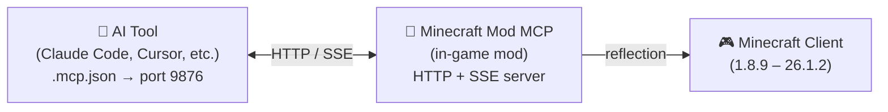

<!-- markdownlint-disable MD033 MD041 MD036 -->
<div align="center">


# Minecraft Mod MCP

**AI가 Minecraft를 플레이하게 하세요**

[](../../LICENSE-MIT)
[](https://www.java.com/)
[](https://github.com/langyo/minecraft-mod-mcp/releases)
[](https://www.npmjs.com/package/minecraft-mod-mcp)

**[English](../../README.md)** &bull; **[简体中文](../zhs/README.md)** &bull; **[繁體中文](../zht/README.md)** &bull; **[日本語](../ja/README.md)** &bull; **한국어** &bull; **[Français](../fr/README.md)** &bull; **[Español](../es/README.md)** &bull; **[Русский](../ru/README.md)**

</div>
<!-- markdownlint-enable MD033 MD041 MD036 -->

## 🤖 AI를 Minecraft에 연결하기

**이 링크를 복사하여 AI 에이전트에 붙여넣으세요 — 자동으로 설정됩니다:**

```
https://github.com/langyo/minecraft-mod-mcp/blob/main/docs/guides/ko/AI-TOOLS.md
```

AI가 가이드를 읽고 MCP 연결을 설정한 뒤 게임을 제어합니다. 수동 설정이 필요하지 않습니다.

> 이미 모드를 설치하셨나요? 이 링크 하나면 충분합니다.

---

## Minecraft Mod MCP란?

Minecraft Mod MCP는 AI 어시스턴트와 마인크래프트 사이의 다리 역할을 합니다. 게임 내에서 모드로 실행되며, AI 도구들이 표준 MCP 프로토콜을 통해 연결할 수 있는 HTTP 서버를 노출합니다. 이 다리를 통해 AI는 게임을 보고, 버튼을 클릭하고, 명령어를 입력하고, 세계와 상호작용할 수 있습니다.

- **보기** — 좌표 격자가 포함된 스크린샷 캡처
- **행동하기** — 클릭, 타이핑, 스크롤, 드래그 및 모든 키 입력
- **알기** — 플레이어 위치, 세계 정보, 화면 버튼, 디버그 필드 조회
- **기록하기** — SSE를 통한 실시간 이벤트 스트리밍, 비디오 프레임 캡처

> AI가 성을 짓게 하고 싶으신가요? 스모크 테스트를 실행하고 싶으신가요? 모드팩 메뉴를 탐색하고 싶으신가요? Minecraft Mod MCP가 가능하게 합니다.

---

## 지원 버전

| MC 버전 | Forge | Fabric | NeoForge |
|------------|:-----:|:------:|:--------:|
| 1.8.9 | [⬇](https://github.com/langyo/minecraft-mod-mcp/releases/latest/download/minecraft-mcp-1.8.9-forge.jar) | — | — |
| 1.9.4 | [⬇](https://github.com/langyo/minecraft-mod-mcp/releases/latest/download/minecraft-mcp-1.9.4-forge.jar) | — | — |
| 1.10.2 | [⬇](https://github.com/langyo/minecraft-mod-mcp/releases/latest/download/minecraft-mcp-1.10.2-forge.jar) | — | — |
| 1.11.2 | [⬇](https://github.com/langyo/minecraft-mod-mcp/releases/latest/download/minecraft-mcp-1.11.2-forge.jar) | — | — |
| 1.12.2 | [⬇](https://github.com/langyo/minecraft-mod-mcp/releases/latest/download/minecraft-mcp-1.12.2-forge.jar) | — | — |
| 1.13.2 | [⬇](https://github.com/langyo/minecraft-mod-mcp/releases/latest/download/minecraft-mcp-1.13.2-forge.jar) | — | — |
| 1.14.4 | [⬇](https://github.com/langyo/minecraft-mod-mcp/releases/latest/download/minecraft-mcp-1.14.4-forge.jar) | [⬇](https://github.com/langyo/minecraft-mod-mcp/releases/latest/download/minecraft-mcp-1.14.4-fabric.jar) | — |
| 1.15.2 | [⬇](https://github.com/langyo/minecraft-mod-mcp/releases/latest/download/minecraft-mcp-1.15.2-forge.jar) | [⬇](https://github.com/langyo/minecraft-mod-mcp/releases/latest/download/minecraft-mcp-1.15.2-fabric.jar) | — |
| 1.16.5 | [⬇](https://github.com/langyo/minecraft-mod-mcp/releases/latest/download/minecraft-mcp-1.16.5-forge.jar) | [⬇](https://github.com/langyo/minecraft-mod-mcp/releases/latest/download/minecraft-mcp-1.16.5-fabric.jar) | — |
| 1.17.1 | [⬇](https://github.com/langyo/minecraft-mod-mcp/releases/latest/download/minecraft-mcp-1.17.1-forge.jar) | [⬇](https://github.com/langyo/minecraft-mod-mcp/releases/latest/download/minecraft-mcp-1.17.1-fabric.jar) | — |
| 1.18.2 | [⬇](https://github.com/langyo/minecraft-mod-mcp/releases/latest/download/minecraft-mcp-1.18.2-forge.jar) | [⬇](https://github.com/langyo/minecraft-mod-mcp/releases/latest/download/minecraft-mcp-1.18.2-fabric.jar) | — |
| 1.19.4 | [⬇](https://github.com/langyo/minecraft-mod-mcp/releases/latest/download/minecraft-mcp-1.19.4-forge.jar) | [⬇](https://github.com/langyo/minecraft-mod-mcp/releases/latest/download/minecraft-mcp-1.19.4-fabric.jar) | — |
| 1.20.6 | [⬇](https://github.com/langyo/minecraft-mod-mcp/releases/latest/download/minecraft-mcp-1.20.6-forge.jar) | [⬇](https://github.com/langyo/minecraft-mod-mcp/releases/latest/download/minecraft-mcp-1.20.6-fabric.jar) | [⬇](https://github.com/langyo/minecraft-mod-mcp/releases/latest/download/minecraft-mcp-1.20.6-neoforge.jar) |
| 1.21.11 | [⬇](https://github.com/langyo/minecraft-mod-mcp/releases/latest/download/minecraft-mcp-1.21.11-forge.jar) | [⬇](https://github.com/langyo/minecraft-mod-mcp/releases/latest/download/minecraft-mcp-1.21.11-fabric.jar) | [⬇](https://github.com/langyo/minecraft-mod-mcp/releases/latest/download/minecraft-mcp-1.21.11-neoforge.jar) |
| 26.1.2 | [⬇](https://github.com/langyo/minecraft-mod-mcp/releases/latest/download/minecraft-mcp-26.1.2-forge.jar) | — | [⬇](https://github.com/langyo/minecraft-mod-mcp/releases/latest/download/minecraft-mcp-26.1.2-neoforge.jar) |

---

## 시작하기

### 1. 모드 설치

[GitHub Releases](https://github.com/langyo/minecraft-mod-mcp/releases)에서 JAR 파일을 다운로드하여 Minecraft `mods` 폴더에 넣으세요.

- **Forge**, **Fabric**, 또는 **NeoForge** 필요 (위 지원 버전 참조)
- Minecraft **1.8.9**부터 **26.1.2**까지 지원

### 2. MCP 브릿지 설치

```bash
npm install -g minecraft-mod-mcp
```

또는 설치 없이 실행:

```bash
npx minecraft-mod-mcp
```

### 3. Minecraft 실행

모드로더로 게임을 실행하세요. 모드가 자동으로 포트 9876에서 HTTP 서버를 시작합니다.

### 4. AI 연결하기

**[→ AI 도구 연동 가이드](./AI-TOOLS.md)** — Claude Code, Cursor, Cline, Copilot 등 20개 이상의 AI 도구별 설정 방법.

또는 이 링크를 AI 에이전트에 붙여넣고 설정을 맡기세요:

```
https://github.com/langyo/minecraft-mod-mcp/blob/main/docs/guides/ko/AI-TOOLS.md
```

---

## 작동 원리



이 모드는 마인크래프트 내에서 포트 9876으로 HTTP 서버를 실행합니다. AI 도구는 표준 MCP 프로토콜(SSE 전송)을 통해 연결되며, 클릭, 타이핑, 스크린샷 등 모든 명령어는 Java 리플렉션을 사용하여 버전별 코드 없이 모든 마인크래프트 버전에서 작동합니다.

---

## 소스에서 빌드하기

> 이 섹션은 기여자를 위한 것입니다. 모드를 사용하기만 하려면 위의 [시작하기](#시작하기)를 참조하세요.

[CONTRIBUTING.md](../../CONTRIBUTING.md)에서 개발 설정, 프로젝트 구조, 가이드라인을 확인하세요.

---

## 라이선스

다음 중 하나의 라이선스에 따라 이용할 수 있습니다:

- Apache License, Version 2.0 ([LICENSE-APACHE](../../LICENSE-APACHE) 또는 http://www.apache.org/licenses/LICENSE-2.0)
- MIT License ([LICENSE-MIT](../../LICENSE-MIT) 또는 http://opensource.org/licenses/MIT)

선택하여 적용할 수 있습니다.
