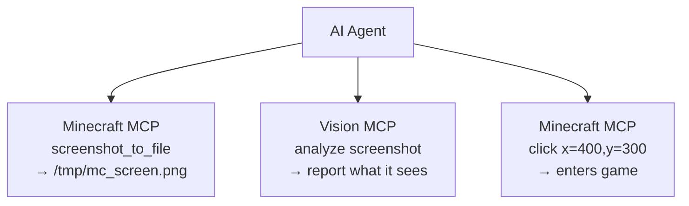

# Руководство по интеграции с AI-инструментами

**[English](../en/AI-TOOLS.md)** &bull; **[简体中文](../zhs/AI-TOOLS.md)** &bull; **[繁體中文](../zht/AI-TOOLS.md)** &bull; **[日本語](../ja/AI-TOOLS.md)** &bull; **[한국어](../ko/AI-TOOLS.md)** &bull; **[Français](../fr/AI-TOOLS.md)** &bull; **[Español](../es/AI-TOOLS.md)** &bull; **Русский**

> **Совет**: Вы можете просто попросить вашего ИИ-агента прочитать это руководство напрямую по URL из этого репозитория. В большинстве случаев агент настроит MCP-подключение автоматически — ручная настройка с вашей стороны не требуется.

Это руководство объясняет, как настроить основные AI-инструменты для программирования для подключения к серверу Minecraft MCP через HTTP.

## HTTP-эндпоинты Minecraft MCP

Сервер Minecraft MCP предоставляет следующие HTTP-эндпоинты (порт по умолчанию: **9876**):

| Эндпоинт | Метод | Описание |
|----------|--------|-------------|
| `/api/status` | GET | Проверка работоспособности |
| `/api/cmd` | POST | Диспетчеризация JSON-RPC команд (тело: `{"cmd":"...", "params":{...}}`) |
| `/api/screenshot` | GET | Сделать скриншот, возвращает PNG в base64 |
| `/api/events` | GET | Поток SSE (Server-Sent Events) для истории вызовов в реальном времени |
| `/api/calls` | GET | Возвращает последние 50 событий вызовов в виде JSON-массива |

> **Предварительные требования**: Убедитесь, что демон Minecraft MCP запущен и клиент Minecraft с модом MCP подключён. Выполните `just daemon`, затем `just launch <version> <loader>`.

---

## Методы интеграции

Большинство AI-инструментов для программирования поддерживают **Model Context Protocol (MCP)** для подключения к внешним серверам. К серверу Minecraft MCP можно подключиться через:

- **SSE Transport**: Направьте MCP-клиент инструмента на `http://localhost:9876/api/events`
- **HTTP REST API**: Отправляйте POST-запросы напрямую на `http://localhost:9876/api/cmd`

В разделах ниже приведены инструкции по настройке для конкретных инструментов.

---

## Инструменты для агентов программирования

### Claude Code

Терминальный AI-ассистент для программирования от Anthropic.

**Настройка**: Создайте или отредактируйте `.mcp.json` в корне проекта:

```json
{
  "mcpServers": {
    "minecraft-mcp": {
      "type": "sse",
      "url": "http://localhost:9876/api/events"
    }
  }
}
```

Либо используйте `claude mcp add minecraft-mcp --transport sse http://localhost:9876/api/events`.

### Claude Desktop / Claude for IDE

Настольное приложение и версии плагинов для VS Code/JetBrains IDE.

**Настройка**: Отредактируйте `claude_desktop_config.json`:

- **macOS**: `~/Library/Application Support/Claude/claude_desktop_config.json`
- **Windows**: `%APPDATA%\Claude\claude_desktop_config.json`

```json
{
  "mcpServers": {
    "minecraft-mcp": {
      "type": "sse",
      "url": "http://localhost:9876/api/events"
    }
  }
}
```

Для **Claude for IDE** (VS Code / JetBrains) настройка такая же — используйте файл `.mcp.json` в корне проекта.

### OpenCode

Терминальный агент программирования с открытым исходным кодом.

**Настройка**: Создайте `.opencode.json` в корне проекта или отредактируйте `~/.config/opencode/config.json`:

```json
{
  "mcpServers": {
    "minecraft-mcp": {
      "type": "sse",
      "url": "http://localhost:9876/api/events"
    }
  }
}
```

### Cursor

AI-ориентированный редактор кода с поддержкой пользовательских моделей.

**Настройка**: Создайте `.cursor/mcp.json` в корне проекта:

```json
{
  "mcpServers": {
    "minecraft-mcp": {
      "url": "http://localhost:9876/api/events",
      "transport": "sse"
    }
  }
}
```

Или через интерфейс: **Cursor Settings → MCP → Add new MCP Server**, выберите тип транспорта **SSE** и введите URL.

### Cline

Расширение AI для программирования в VS Code.

**Настройка**: Откройте настройки VS Code (`Ctrl+,`), найдите `cline.mcpServers` или добавьте в `settings.json`:

```json
{
  "cline.mcpServers": {
    "minecraft-mcp": {
      "url": "http://localhost:9876/api/events",
      "transport": "sse"
    }
  }
}
```

### Roo Code

Интеллектуальное расширение VS Code для написания и рефакторинга кода.

**Настройка**: Добавьте в `settings.json` VS Code (тот же формат, что и для Cline):

```json
{
  "roo.mcpServers": {
    "minecraft-mcp": {
      "url": "http://localhost:9876/api/events",
      "transport": "sse"
    }
  }
}
```

### Kilo Code

Эффективный плагин VS Code для генерации кода и управления проектами.

**Настройка**: Добавьте в `settings.json` VS Code:

```json
{
  "kilo.mcpServers": {
    "minecraft-mcp": {
      "url": "http://localhost:9876/api/events",
      "transport": "sse"
    }
  }
}
```

### GitHub Copilot

AI-парный программист от GitHub в VS Code.

**Настройка**: Создайте `.github/copilot-instructions.md` в рабочем пространстве или настройте MCP через настройки VS Code:

```json
{
  "github.copilot.mcpServers": {
    "minecraft-mcp": {
      "url": "http://localhost:9876/api/events",
      "transport": "sse"
    }
  }
}
```

### GitHub Copilot CLI

GitHub Copilot для командной строки.

**Настройка**: Установите переменные окружения или используйте `gh copilot config`:

```bash
export MCP_SERVER_URL="http://localhost:9876/api/events"
```

### CodeBuddy / WorkBuddy

AI-инструмент для полнофункционального интеллектуального программирования.

**Настройка**: Создайте `mcp.json` в корне проекта или рабочем пространстве:

```json
{
  "mcpServers": {
    "minecraft-mcp": {
      "url": "http://localhost:9876/api/events",
      "transport": "sse"
    }
  }
}
```

### TRAE

AI-редактор, способный самостоятельно выполнять различные задачи разработки.

**Настройка**: Перейдите в **Settings → MCP Servers → Add Server**:

- **Name**: `minecraft-mcp`
- **Transport**: SSE
- **URL**: `http://localhost:9876/api/events`

### ZCode

Объединяет мощные AI-агенты с существующими инструментальными цепочками.

**Настройка**: Отредактируйте `~/.zcode/config.json`:

```json
{
  "mcpServers": {
    "minecraft-mcp": {
      "type": "sse",
      "url": "http://localhost:9876/api/events"
    }
  }
}
```

### Lingma

Интеллектуальный ассистент для программирования.

**Настройка**: Перейдите в **Settings → MCP → Add Server**:

- **Name**: `minecraft-mcp`
- **Transport**: SSE
- **URL**: `http://localhost:9876/api/events`

### Qoder

Платформа агентного программирования для реального программного обеспечения.

**Настройка**: Отредактируйте `~/.qoder/mcp.json`:

```json
{
  "mcpServers": {
    "minecraft-mcp": {
      "type": "sse",
      "url": "http://localhost:9876/api/events"
    }
  }
}
```

### Droid

Терминальный AI-агент для программирования корпоративного уровня для сквозных рабочих процессов.

**Настройка**: Отредактируйте `~/.droid/mcp.json`:

```json
{
  "mcpServers": {
    "minecraft-mcp": {
      "type": "sse",
      "url": "http://localhost:9876/api/events"
    }
  }
}
```

### Crush

Терминальный AI-инструмент для программирования с поддержкой интерфейсов CLI и TUI.

**Настройка**: Отредактируйте `~/.crush/config.json`:

```json
{
  "mcpServers": {
    "minecraft-mcp": {
      "type": "sse",
      "url": "http://localhost:9876/api/events"
    }
  }
}
```

### Goose

AI-агент с поддержкой локального выполнения и автоматизированных инженерных задач.

**Настройка**: Отредактируйте `~/.config/goose/mcp.json`:

```json
{
  "mcpServers": {
    "minecraft-mcp": {
      "type": "sse",
      "url": "http://localhost:9876/api/events"
    }
  }
}
```

### Deep Code

Ассистент для программирования на базе DeepSeek.

**Настройка**: Отредактируйте `~/.deepcode/config.json`:

```json
{
  "mcpServers": {
    "minecraft-mcp": {
      "type": "sse",
      "url": "http://localhost:9876/api/events"
    }
  }
}
```

### Reasonix

AI-инструмент для программирования, ориентированный на рассуждения.

**Настройка**: Отредактируйте `~/.reasonix/config.json`:

```json
{
  "mcpServers": {
    "minecraft-mcp": {
      "type": "sse",
      "url": "http://localhost:9876/api/events"
    }
  }
}
```

### Langcli

AI-ассистент для программирования на основе CLI.

**Настройка**: Отредактируйте `~/.langcli/config.yaml`:

```yaml
mcp_servers:
  minecraft-mcp:
    type: sse
    url: http://localhost:9876/api/events
```

### Oh My Pi

Универсальная платформа AI-агентов.

**Настройка**: Отредактируйте `~/.oh-my-pi/mcp.json`:

```json
{
  "mcpServers": {
    "minecraft-mcp": {
      "type": "sse",
      "url": "http://localhost:9876/api/events"
    }
  }
}
```

### Pi

Лёгкий AI-компаньон для программирования.

**Настройка**: Отредактируйте `~/.pi/config.json`:

```json
{
  "mcpServers": {
    "minecraft-mcp": {
      "type": "sse",
      "url": "http://localhost:9876/api/events"
    }
  }
}
```

---

## Инструменты общего назначения для агентов

### OpenClaw

AI-ассистент с открытым исходным кодом, работающий локально с расширяемостью через Skills.

**Настройка**: Отредактируйте `openclaw.json` в рабочем пространстве:

```json
{
  "mcpServers": {
    "minecraft-mcp": {
      "type": "sse",
      "url": "http://localhost:9876/api/events"
    }
  }
}
```

### Cherry Studio

AI-приложение IDE с поддержкой интеграции множества моделей.

**Настройка**: Перейдите в **Settings → MCP Servers → Add**:

- **Name**: `minecraft-mcp`
- **Transport**: SSE
- **URL**: `http://localhost:9876/api/events`

### Hermes Agent

Саморазвивающийся AI-агент с открытым исходным кодом и постоянной памятью.

**Настройка**: Отредактируйте `~/.hermes/config.json`:

```json
{
  "mcpServers": {
    "minecraft-mcp": {
      "type": "sse",
      "url": "http://localhost:9876/api/events"
    }
  }
}
```

### AstrBot

Фреймворк для ботов на базе AI.

**Настройка**: Отредактируйте `astrbot_config.json`:

```json
{
  "mcp_servers": {
    "minecraft-mcp": {
      "type": "sse",
      "url": "http://localhost:9876/api/events"
    }
  }
}
```

### nanobot

Лёгкий AI-агент для различных задач.

**Настройка**: Отредактируйте `~/.nanobot/config.json`:

```json
{
  "mcpServers": {
    "minecraft-mcp": {
      "type": "sse",
      "url": "http://localhost:9876/api/events"
    }
  }
}
```

---

## Прямой доступ через HTTP REST API

Для инструментов, которые не поддерживают протокол MCP нативно, вы можете взаимодействовать с сервером Minecraft MCP напрямую через его HTTP REST API:

```bash
# Проверка работоспособности
curl http://localhost:9876/api/status

# Выполнение команды
curl -X POST http://localhost:9876/api/cmd \
  -H "Content-Type: application/json" \
  -d '{"cmd":"screenshot","params":{}}'

# Сделать скриншот
curl http://localhost:9876/api/screenshot

# Подписка на события (поток SSE)
curl http://localhost:9876/api/events
```

### Основные команды

| Команда | Описание |
|---------|-------------|
| `screenshot` | Сделать скриншот окна Minecraft |
| `screenshot_to_file` | Сделать скриншот и сохранить в локальный файл (`{"cmd":"screenshot_to_file","params":{"path":"/tmp/mc.png"}}`) |
| `click` | Кликнуть по координатам (x, y) |
| `press_key` | Нажать клавишу клавиатуры |
| `type_text` | Ввести текстовую строку |
| `scroll` | Выполнить прокрутку колёсиком мыши |
| `execute_command` | Выполнить команду Minecraft через слэш |
| `get_player_info` | Получить позицию и состояние игрока |
| `get_world_info` | Получить информацию о мире |

---

## Интеграция визуального распознавания

Вы можете использовать Minecraft MCP вместе с **MCP-серверами с поддержкой компьютерного зрения**, чтобы AI-агенты могли *видеть и понимать*, что происходит в игре — читать текст интерфейса, диагностировать ошибки, анализировать расположение элементов и многое другое.

### Как это работает

1. Minecraft MCP делает скриншот и сохраняет его в локальный файл через `screenshot_to_file`
2. Vision MCP-сервер читает этот файл и анализирует его
3. AI-агент координирует оба сервера — скриншот → анализ → действие



### GLM Vision MCP Server

[GLM Vision MCP Server](https://docs.bigmodel.cn/cn/coding-plan/mcp/vision-mcp-server) (`@z_ai/mcp-server`) — это локальный MCP-сервер на базе GLM-4.6V, предоставляющий:

| Tool | Use Case |
|------|----------|
| `ui_to_artifact` | Преобразование скриншотов интерфейса в код, промпты или спецификации дизайна |
| `extract_text_from_screenshot` | OCR текста из игрового интерфейса (чат, таблички, меню) |
| `diagnose_error_screenshot` | Анализ диалогов ошибок и стек-трейсов в игре |
| `understand_technical_diagram` | Чтение редстоун-схем и чертежей |
| `analyze_data_visualization` | Чтение игровой статистики и панелей показателей |
| `image_analysis` | Общее визуальное понимание игровых сцен |
| `ui_diff_check` | Сравнение скриншотов до/после |

**Установка** (требуется Node.js >= 18):

```bash
# Claude Code
claude mcp add -s user zai-mcp-server --env Z_AI_API_KEY=<your_zhipu_api_key> -- npx -y "@z_ai/mcp-server"

# Manual config (Cline, Roo Code, Kilo Code, etc.)
{
  "mcpServers": {
    "zai-mcp-server": {
      "type": "stdio",
      "command": "npx",
      "args": ["-y", "@z_ai/mcp-server"],
      "env": {
        "Z_AI_API_KEY": "<your_zhipu_api_key>",
        "Z_AI_MODE": "ZHIPU"
      }
    }
  }
}
```

---

## Устранение неполадок

1. **Connection refused**: Убедитесь, что демон MCP запущен (`just daemon`) и клиент Minecraft запущен.
2. **SSE timeout**: Некоторые инструменты могут отключаться от SSE после периода бездействия. Перезапустите инструмент или SSE-соединение.
3. **Port conflict**: Если порт 9876 занят, настройте другой порт через переменную окружения `MCP_PORT` или системное свойство `mcp.server.port`.
4. **Firewall**: Убедитесь, что ваш брандмауэр разрешает подключения к `localhost:9876`.

> По вопросам и проблемам открывайте issue в [GitHub-репозитории](https://github.com/langyo/minecraft-mod-mcp).
