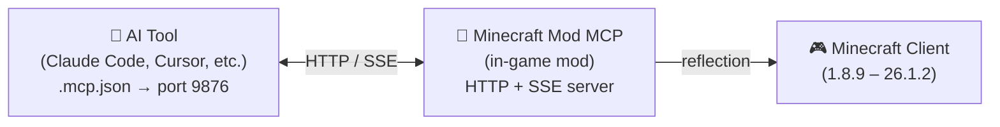

<!-- markdownlint-disable MD033 MD041 MD036 -->
<div align="center">


# Minecraft Mod MCP

**Инструментарий разработки модов на базе ИИ**

[](../../LICENSE-MIT)
[](https://www.java.com/)
[](https://github.com/langyo/minecraft-mod-mcp/releases)
[](https://www.npmjs.com/package/minecraft-mod-mcp)

**[English](../../README.md)** &bull; **[简体中文](../zhs/README.md)** &bull; **[繁體中文](../zht/README.md)** &bull; **[日本語](../ja/README.md)** &bull; **[한국어](../ko/README.md)** &bull; **[Français](../fr/README.md)** &bull; **[Español](../es/README.md)** &bull; **Русский**

</div>
<!-- markdownlint-enable MD033 MD041 MD036 -->

## 🤖 Подключите ИИ к Minecraft

**Скопируйте эту ссылку и вставьте её вашему ИИ-агенту — он настроится автоматически:**

```
https://github.com/langyo/minecraft-mod-mcp/blob/main/docs/guides/ru/AI-TOOLS.md
```

Ваш ИИ прочитает руководство, настроит MCP-подключение и начнёт управлять игрой. Ручная настройка не требуется.

> Уже установили мод? Достаточно одной этой ссылки.

---

## Что такое Minecraft Mod MCP

Minecraft Mod MCP — инструмент ИИ-поддержки **для разработчиков модов**. Поместите JAR в папку `mods`, запустите игру, и ваш ИИ сможет видеть игру, нажимать кнопки GUI, вводить команды и взаимодействовать с миром — всё через стандартный протокол MCP. Спроектирован для тестирования модов, проверки поведения и автоматизации повторяющихся задач.

- **Видеть** — делать скриншоты с координатной сеткой
- **Действовать** — кликать, вводить текст, прокручивать, перетаскивать и нажимать любые клавиши
- **Знать** — запрашивать позицию игрока, информацию о мире, кнопки на экране и отладочные поля
- **Записывать** — транслировать события в реальном времени через SSE, захватывать видеокадры

> Хотите, чтобы ИИ протестировал GUI вашего мода? Провёл smoke-тест? Проверил логику взаимодействия нового блока? Minecraft Mod MCP делает это возможным.

---

## Поддерживаемые версии

| Версия MC | Forge | Fabric | NeoForge |
|-----------|:-----:|:------:|:--------:|
| 26.1.2 | [⬇](https://github.com/langyo/minecraft-mod-mcp/releases/latest/download/minecraft-mcp-26.1.2-forge.jar) | — | [⬇](https://github.com/langyo/minecraft-mod-mcp/releases/latest/download/minecraft-mcp-26.1.2-neoforge.jar) |
| 1.21.11 | [⬇](https://github.com/langyo/minecraft-mod-mcp/releases/latest/download/minecraft-mcp-1.21.11-forge.jar) | [⬇](https://github.com/langyo/minecraft-mod-mcp/releases/latest/download/minecraft-mcp-1.21.11-fabric.jar) | [⬇](https://github.com/langyo/minecraft-mod-mcp/releases/latest/download/minecraft-mcp-1.21.11-neoforge.jar) |

> Предыдущие версии (1.8.9 – 1.20.6) доступны на [странице releases](https://github.com/langyo/minecraft-mod-mcp/releases).

---

## Начало работы

### 1. Установите мод

Скачайте JAR-файл из [GitHub Releases](https://github.com/langyo/minecraft-mod-mcp/releases) и поместите его в папку `mods` вашего Minecraft.

- Требуется **Forge**, **Fabric** или **NeoForge** (см. поддерживаемые версии выше)
- Работает с Minecraft от **1.8.9** до **26.1.2**

### 2. Установите MCP Bridge

```bash
npm install -g minecraft-mod-mcp
```

Или запустите без установки:

```bash
npx minecraft-mod-mcp
```

### 3. Запустите Minecraft

Запустите игру с вашим загрузчиком модов. Мод автоматически запускает HTTP-сервер на порту 9876.

### 4. Подключите ваш ИИ

**[→ Руководство по интеграции ИИ-инструментов](./AI-TOOLS.md)** — пошаговая инструкция для Claude Code, Cursor, Cline, Copilot и более 20 других инструментов.

Или вставьте эту ссылку вашему ИИ-агенту, и он всё настроит сам:

```
https://github.com/langyo/minecraft-mod-mcp/blob/main/docs/guides/ru/AI-TOOLS.md
```

---

## Советы по использованию

### Работа параллельно с модом

Обычно при переключении из Minecraft открывается экран паузы, что может прерывать команды MCP. Используйте один из способов, чтобы этого избежать:

- **Экран паузы**: Нажмите `Esc` для открытия экрана паузы, затем нажмите кнопку **освободить мышь** на MCP-оверлее. Это позволит свободно переключаться между окнами без повторного срабатывания паузы.
- **Внутриигровой оверлей**: В 3D-режиме нажмите кнопку MCP-оверлея в **правом верхнем углу**, чтобы временно отсоединить курсор. После этого можно переключаться по `Alt+Tab`, и игра не будет автоматически ставиться на паузу — идеально для работы в IDE или AI-инструменте при активном MCP-соединении.

### Порт и HTTP-сервер

При загрузке игры мод запускает HTTP-сервер. По умолчанию он пытается занять порт **9876**; если порт занят, перебирает **9875 → 9874 → ... → 9000**, пока не найдёт свободный. Можно задать порт явно через `-Dmcp.port=XXXX` (аргумент JVM) или `MC_MCP_PORT` (переменная окружения).

Как узнать, какой порт был выбран:
- В консоль выводится `[MCP-MOD] Debug page: http://127.0.0.1:{port}/debug`
- В игровой чат приходит кликабельное сообщение с URL отладочной страницы
- `GET /api/status` возвращает `version`, `loader`, `port`, `pid`, `uptime` — Node.js-мост использует это для автоматического обнаружения
- Откройте `http://localhost:{port}/debug` в браузере для интерактивной панели с MCP-логами, SSE-событиями и статусом соединения

Версия MC и загрузчик подтверждаются при рукопожатии через `/api/status`, так что и мост, и страница отладки знают, с каким MC-окружением они работают.

---

## Как это работает

<details>
<summary>📸 Скриншот — нажмите, чтобы развернуть</summary>


</details>



Мод запускает HTTP-сервер на порту 9876 внутри Minecraft. Ваш ИИ-инструмент подключается через стандартный протокол MCP (транспорт SSE), и каждая команда — клик, ввод текста, скриншот и т.д. — использует Java reflection для работы во всех версиях Minecraft без версионно-зависимого кода.

---

## Сборка из исходников

> Этот раздел предназначен для контрибьюторов. Если вы просто хотите использовать мод, см. [Начало работы](#начало-работы) выше.

Подробности о настройке среды разработки, структуре проекта и правилах участия см. в [CONTRIBUTING.md](../../CONTRIBUTING.md).

---

## Лицензия

Распространяется под одной из следующих лицензий:

- Apache License, Version 2.0 ([LICENSE-APACHE](../../LICENSE-APACHE) или http://www.apache.org/licenses/LICENSE-2.0)
- MIT License ([LICENSE-MIT](../../LICENSE-MIT) или http://opensource.org/licenses/MIT)

на ваш выбор.
