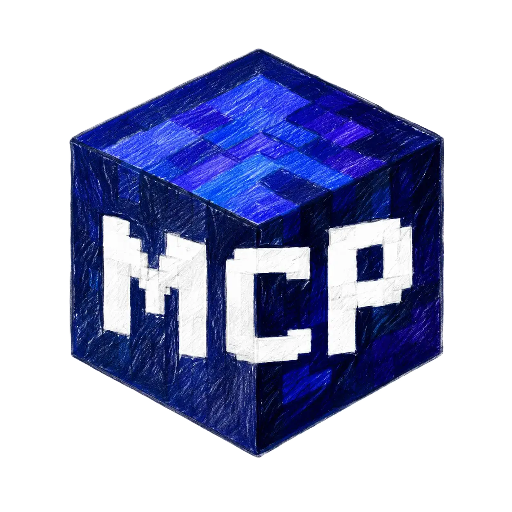
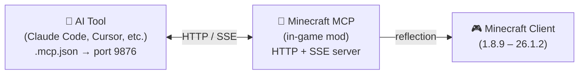

<!-- markdownlint-disable MD033 MD041 MD036 -->
<div align="center">



# Minecraft MCP

**Пусть ИИ играет в Minecraft — Управляйте любой версией, любым загрузчиком модов**

[](../../LICENSE-MIT)
[](https://www.java.com/)
[](https://github.com/langyo/minecraft-mod-mcp/releases)

**English** &bull; **[简体中文](../zhs/README.md)** &bull; **[繁體中文](../zht/README.md)** &bull; **[日本語](../ja/README.md)** &bull; **[한국어](../ko/README.md)** &bull; **[Français](../fr/README.md)** &bull; **[Español](../es/README.md)** &bull; **[Русский](../ru/README.md)**

</div>
<!-- markdownlint-enable MD033 MD041 MD036 -->

## Что такое Minecraft MCP

Minecraft MCP — это мост между ИИ-ассистентами и Minecraft. Он работает как мод внутри игры, предоставляя HTTP-сервер, к которому ИИ-инструменты могут подключаться через стандартный протокол MCP. Через этот мост ИИ может видеть игру, нажимать кнопки, вводить команды и взаимодействовать с миром.

> Хотите, чтобы ИИ построил замок? Провёл smoke-тест? Разобрался в меню сборки модов? Minecraft MCP делает это возможным.

- **Видеть** — делать скриншоты с координатной сеткой
- **Действовать** — кликать, вводить текст, прокручивать, перетаскивать и нажимать любые клавиши
- **Знать** — запрашивать позицию игрока, информацию о мире, кнопки на экране и отладочные поля
- **Записывать** — транслировать события в реальном времени через SSE, захватывать видеокадры

[Руководство по интеграции ИИ-инструментов →](./AI-TOOLS.md)

## Поддерживаемые версии

| Версия MC | Forge | Fabric | NeoForge |
|-----------|:-----:|:------:|:--------:|
| 1.8.9 | ✓ | — | — |
| 1.9.4 | ✓ | — | — |
| 1.10.2 | ✓ | — | — |
| 1.11.2 | ✓ | — | — |
| 1.12.2 | ✓ | — | — |
| 1.13.2 | ✓ | — | — |
| 1.14.4 | ✓ | 🚧 | — |
| 1.15.2 | ✓ | 🚧 | — |
| 1.16.5 | ✓ | 🚧 | — |
| 1.17.1 | ✓ | 🚧 | — |
| 1.18.2 | ✓ | 🚧 | — |
| 1.19.4 | ✓ | 🚧 | — |
| 1.20.6 | ✓ | 🚧 | 🚧 |
| 1.21.7 | ✓ | — | — |
| 26.1.2 | ✓ | — | 🚧 |

> 🚧 = В разработке

## Быстрый старт

### Необходимые условия

- JDK 21 (рекомендуется Corretto)

### Установка и сборка

```bash
# Установка зависимостей
pip install -r scripts/requirements.txt

# Полная сборка
just full
```

### Запуск

```bash
# Запуск демона и Minecraft
just daemon
just launch 1.21.7 forge

# Или запуск сквозного smoke-теста
just smoke 1.21.7
```

## Как это работает



Мод запускает HTTP-сервер на порту 9876 внутри Minecraft. Ваш ИИ-инструмент подключается через стандартный протокол MCP (транспорт SSE), и каждая команда — клик, ввод текста, скриншот и т.д. — использует Java reflection для работы во всех версиях Minecraft без версионно-зависимого кода.

## Участие в проекте

Мы рады Issues и pull request'ам.

## Лицензия

Распространяется под одной из следующих лицензий:

- Apache License, Version 2.0 ([LICENSE-APACHE](../../LICENSE-APACHE) или http://www.apache.org/licenses/LICENSE-2.0)
- MIT License ([LICENSE-MIT](../../LICENSE-MIT) или http://opensource.org/licenses/MIT)

на ваш выбор.
