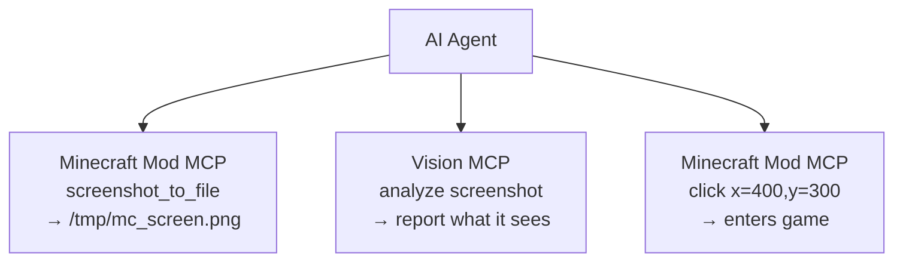

# AI 工具集成指南

**[English](../en/AI-TOOLS.md)** &bull; **简体中文** &bull; **[繁體中文](../zht/AI-TOOLS.md)** &bull; **[日本語](../ja/AI-TOOLS.md)** &bull; **[한국어](../ko/AI-TOOLS.md)** &bull; **[Français](../fr/AI-TOOLS.md)** &bull; **[Español](../es/AI-TOOLS.md)** &bull; **[Русский](../ru/AI-TOOLS.md)**

> **🤖 致 AI Agent**：如果有用户要求你接入 Minecraft，请添加以下 MCP 服务器配置，然后使用本指南末尾列出的 35+ 工具：
>
> ```json
> {
>   "mcpServers": {
>     "minecraft-mcp": {
>       "type": "sse",
>       "url": "http://localhost:9876/api/events"
>     }
>   }
> }
> ```
>
> **致用户**：你可以直接把本页链接粘贴给你的 AI Agent，它会自行完成配置，无需手动操作。

---

## 快速配置

大多数 AI 编程工具使用相同的基于 SSE 的 MCP 配置。将其添加到你的工具配置文件中：

```json
{
  "mcpServers": {
    "minecraft-mcp": {
      "type": "sse",
      "url": "http://localhost:9876/api/events"
    }
  }
}
```

常见配置文件位置：

| 工具 | 配置文件 |
|------|-------------|
| Claude Code、OpenCode、CodeBuddy、WorkBuddy | 项目根目录下的 `.mcp.json` |
| Cursor | 项目根目录下的 `.cursor/mcp.json` |
| Cline、Roo Code、Kilo Code | VS Code `settings.json` |
| Claude Desktop | `claude_desktop_config.json`（系统路径见下方） |
| 其他 | 见下方各工具的详细说明 |

> 查看[各工具详细配置](#编程-agent-工具)以获取具体路径、界面配置和特定工具格式。

---

## Minecraft Mod MCP HTTP 端点

Minecraft Mod MCP 服务器提供以下 HTTP 端点（默认端口：**9876**）：

| 端点 | 方法 | 说明 |
|----------|--------|-------------|
| `/api/status` | GET | 健康检查 |
| `/api/cmd` | POST | JSON-RPC 命令调度（请求体：`{"cmd":"...", "params":{...}}`） |
| `/api/screenshot` | GET | 截取屏幕截图，返回 PNG base64 |
| `/api/events` | GET | SSE（服务器发送事件）流，用于实时获取调用历史 |
| `/api/calls` | GET | 返回最近 50 条调用事件，格式为 JSON 数组 |

> **前置条件**：请确保 Minecraft Mod MCP 守护进程正在运行，并且装有 MCP 模组的 Minecraft 客户端已连接。运行 `just daemon`，然后执行 `just launch <version> <loader>`。

---

## 集成方式

大多数 AI 编程工具支持通过 **模型上下文协议（MCP）** 连接到外部服务器。Minecraft Mod MCP 服务器可通过以下方式连接：

- **SSE 传输**：将工具的 MCP 客户端指向 `http://localhost:9876/api/events`
- **HTTP REST API**：直接向 `http://localhost:9876/api/cmd` 发送 POST 请求

以下各节提供了各工具的具体配置说明。

---

## 编程 Agent 工具

### Claude Code

Anthropic 的终端 AI 编程助手。

**配置**：在项目根目录中创建或编辑 `.mcp.json`：

```json
{
  "mcpServers": {
    "minecraft-mcp": {
      "type": "sse",
      "url": "http://localhost:9876/api/events"
    }
  }
}
```

或者使用 `claude mcp add minecraft-mcp --transport sse http://localhost:9876/api/events`。

### Claude Desktop / Claude for IDE

Claude 的桌面应用版和 VS Code / JetBrains IDE 插件版。

**配置**：编辑 `claude_desktop_config.json`：

- **macOS**：`~/Library/Application Support/Claude/claude_desktop_config.json`
- **Windows**：`%APPDATA%\Claude\claude_desktop_config.json`

```json
{
  "mcpServers": {
    "minecraft-mcp": {
      "type": "sse",
      "url": "http://localhost:9876/api/events"
    }
  }
}
```

对于 **Claude for IDE**（VS Code / JetBrains），配置方式相同——在项目根目录中使用 `.mcp.json` 文件即可。

### OpenCode

开源的终端编程 Agent。

**配置**：在项目根目录中创建 `.opencode.json`，或编辑 `~/.config/opencode/config.json`：

```json
{
  "mcpServers": {
    "minecraft-mcp": {
      "type": "sse",
      "url": "http://localhost:9876/api/events"
    }
  }
}
```

### Cursor

支持自定义模型的 AI 优先代码编辑器。

**配置**：在项目根目录中创建 `.cursor/mcp.json`：

```json
{
  "mcpServers": {
    "minecraft-mcp": {
      "url": "http://localhost:9876/api/events",
      "transport": "sse"
    }
  }
}
```

或通过界面配置：**Cursor Settings → MCP → Add new MCP Server**，将传输类型设为 **SSE** 并输入 URL。

### Cline

VS Code AI 编程扩展。

**配置**：打开 VS Code 设置（`Ctrl+,`），搜索 `cline.mcpServers`，或在 `settings.json` 中添加：

```json
{
  "cline.mcpServers": {
    "minecraft-mcp": {
      "url": "http://localhost:9876/api/events",
      "transport": "sse"
    }
  }
}
```

### Roo Code

用于代码编写和重构的智能 VS Code 扩展。

**配置**：在 VS Code 的 `settings.json` 中添加（格式与 Cline 相同）：

```json
{
  "roo.mcpServers": {
    "minecraft-mcp": {
      "url": "http://localhost:9876/api/events",
      "transport": "sse"
    }
  }
}
```

### Kilo Code

用于代码生成和项目管理的高效 VS Code 插件。

**配置**：在 VS Code 的 `settings.json` 中添加：

```json
{
  "kilo.mcpServers": {
    "minecraft-mcp": {
      "url": "http://localhost:9876/api/events",
      "transport": "sse"
    }
  }
}
```

### GitHub Copilot

VS Code 中的 GitHub AI 结对编程工具。

**配置**：在工作区创建 `.github/copilot-instructions.md`，或通过 VS Code 设置配置 MCP：

```json
{
  "github.copilot.mcpServers": {
    "minecraft-mcp": {
      "url": "http://localhost:9876/api/events",
      "transport": "sse"
    }
  }
}
```

### GitHub Copilot CLI

命令行版的 GitHub Copilot。

**配置**：设置环境变量或使用 `gh copilot config`：

```bash
export MCP_SERVER_URL="http://localhost:9876/api/events"
```

### CodeBuddy / WorkBuddy

AI 驱动的全栈智能编程工具。

**配置**：在项目根目录或工作区中创建 `mcp.json`：

```json
{
  "mcpServers": {
    "minecraft-mcp": {
      "url": "http://localhost:9876/api/events",
      "transport": "sse"
    }
  }
}
```

### TRAE

能够独立完成各种开发任务的 AI 编辑器。

**配置**：进入 **设置 → MCP 服务器 → 添加服务器**：

- **名称**：`minecraft-mcp`
- **传输方式**：SSE
- **URL**：`http://localhost:9876/api/events`

### ZCode

将强大的 AI Agent 与现有工具链相结合。

**配置**：编辑 `~/.zcode/config.json`：

```json
{
  "mcpServers": {
    "minecraft-mcp": {
      "type": "sse",
      "url": "http://localhost:9876/api/events"
    }
  }
}
```

### Lingma

智能编程助手。

**配置**：进入 **设置 → MCP → 添加服务器**：

- **名称**：`minecraft-mcp`
- **传输方式**：SSE
- **URL**：`http://localhost:9876/api/events`

### Qoder

面向真实软件开发的 Agent 编程平台。

**配置**：编辑 `~/.qoder/mcp.json`：

```json
{
  "mcpServers": {
    "minecraft-mcp": {
      "type": "sse",
      "url": "http://localhost:9876/api/events"
    }
  }
}
```

### Droid

面向端到端工作流的企业级终端 AI 编程 Agent。

**配置**：编辑 `~/.droid/mcp.json`：

```json
{
  "mcpServers": {
    "minecraft-mcp": {
      "type": "sse",
      "url": "http://localhost:9876/api/events"
    }
  }
}
```

### Crush

支持 CLI 和 TUI 界面的终端 AI 编程工具。

**配置**：编辑 `~/.crush/config.json`：

```json
{
  "mcpServers": {
    "minecraft-mcp": {
      "type": "sse",
      "url": "http://localhost:9876/api/events"
    }
  }
}
```

### Goose

支持本地执行和自动化工程任务的 AI Agent 工具。

**配置**：编辑 `~/.config/goose/mcp.json`：

```json
{
  "mcpServers": {
    "minecraft-mcp": {
      "type": "sse",
      "url": "http://localhost:9876/api/events"
    }
  }
}
```

### Deep Code

基于 DeepSeek 的编程助手。

**配置**：编辑 `~/.deepcode/config.json`：

```json
{
  "mcpServers": {
    "minecraft-mcp": {
      "type": "sse",
      "url": "http://localhost:9876/api/events"
    }
  }
}
```

### Reasonix

专注于推理的 AI 编程工具。

**配置**：编辑 `~/.reasonix/config.json`：

```json
{
  "mcpServers": {
    "minecraft-mcp": {
      "type": "sse",
      "url": "http://localhost:9876/api/events"
    }
  }
}
```

### Langcli

基于 CLI 的 AI 编程助手。

**配置**：编辑 `~/.langcli/config.yaml`：

```yaml
mcp_servers:
  minecraft-mcp:
    type: sse
    url: http://localhost:9876/api/events
```

### Oh My Pi

多功能的 AI Agent 平台。

**配置**：编辑 `~/.oh-my-pi/mcp.json`：

```json
{
  "mcpServers": {
    "minecraft-mcp": {
      "type": "sse",
      "url": "http://localhost:9876/api/events"
    }
  }
}
```

### Pi

轻量级 AI 编程伴侣。

**配置**：编辑 `~/.pi/config.json`：

```json
{
  "mcpServers": {
    "minecraft-mcp": {
      "type": "sse",
      "url": "http://localhost:9876/api/events"
    }
  }
}
```

---

## 通用 Agent 工具

### OpenClaw

支持 Skills 可扩展性的开源本地 AI 助手。

**配置**：在工作区编辑 `openclaw.json`：

```json
{
  "mcpServers": {
    "minecraft-mcp": {
      "type": "sse",
      "url": "http://localhost:9876/api/events"
    }
  }
}
```

### Cherry Studio

支持多种模型集成的 AI 应用 IDE。

**配置**：进入 **设置 → MCP 服务器 → 添加**：

- **名称**：`minecraft-mcp`
- **传输方式**：SSE
- **URL**：`http://localhost:9876/api/events`

### Hermes Agent

具有持久记忆的开源自进化 AI Agent。

**配置**：编辑 `~/.hermes/config.json`：

```json
{
  "mcpServers": {
    "minecraft-mcp": {
      "type": "sse",
      "url": "http://localhost:9876/api/events"
    }
  }
}
```

### AstrBot

AI 驱动的机器人框架。

**配置**：编辑 `astrbot_config.json`：

```json
{
  "mcp_servers": {
    "minecraft-mcp": {
      "type": "sse",
      "url": "http://localhost:9876/api/events"
    }
  }
}
```

### nanobot

用于各种任务的轻量级 AI Agent。

**配置**：编辑 `~/.nanobot/config.json`：

```json
{
  "mcpServers": {
    "minecraft-mcp": {
      "type": "sse",
      "url": "http://localhost:9876/api/events"
    }
  }
}
```

---

## 直接 HTTP REST API 访问

对于不原生支持 MCP 协议的工具，可以直接通过 Minecraft Mod MCP 服务器的 HTTP REST API 与之交互：

```bash
# 健康检查
curl http://localhost:9876/api/status

# 执行命令
curl -X POST http://localhost:9876/api/cmd \
  -H "Content-Type: application/json" \
  -d '{"cmd":"screenshot","params":{}}'

# 截取屏幕截图
curl http://localhost:9876/api/screenshot

# 订阅事件（SSE 流）
curl http://localhost:9876/api/events
```

### 常用命令

| 命令 | 说明 |
|---------|-------------|
| `screenshot` | 截取屏幕截图，返回 base64 数据 URI |
| `screenshot_to_file` | 截取屏幕截图并保存到本地文件（`{"cmd":"screenshot_to_file","params":{"path":"/tmp/mc.png"}}`） |
| `click` | 在 (x, y) 坐标处点击 |
| `press_key` | 按下键盘按键 |
| `type_text` | 输入文本字符串 |
| `scroll` | 执行鼠标滚轮操作 |
| `execute_command` | 执行 Minecraft 斜杠命令 |
| `get_player_info` | 获取玩家位置和状态 |
| `get_world_info` | 获取世界信息 |

---

## 视觉识别集成

你可以将 Minecraft Mod MCP 与**支持视觉能力的 MCP 服务器**配合使用，让 AI 代理能够*查看并理解*游戏中正在发生的事情——读取 UI 文本、诊断错误、分析布局等。

### 工作原理

1. Minecraft Mod MCP 通过 `screenshot_to_file` 截取屏幕截图并保存到本地文件
2. 视觉 MCP 服务器读取该文件并进行分析
3. AI 代理协调两者——截图 → 分析 → 行动



### GLM 视觉 MCP 服务器

[GLM Vision MCP Server](https://docs.bigmodel.cn/cn/coding-plan/mcp/vision-mcp-server)（`@z_ai/mcp-server`）是一个由 GLM-4.6V 驱动的本地 MCP 服务器，提供以下功能：

| 工具 | 用途 |
|------|----------|
| `ui_to_artifact` | 将 UI 截图转换为代码、提示词或设计规格 |
| `extract_text_from_screenshot` | 从游戏 UI（聊天、告示牌、菜单）中 OCR 提取文字 |
| `diagnose_error_screenshot` | 解析游戏中的错误对话框和堆栈跟踪 |
| `understand_technical_diagram` | 解读红石电路、原理图 |
| `analyze_data_visualization` | 读取游戏内统计数据、仪表盘 |
| `image_analysis` | 对游戏场景进行通用视觉理解 |
| `ui_diff_check` | 对比前后截图差异 |

**安装**（需要 Node.js >= 18）：

```bash
# Claude Code
claude mcp add -s user zai-mcp-server --env Z_AI_API_KEY=<your_zhipu_api_key> -- npx -y "@z_ai/mcp-server"

# 手动配置（Cline、Roo Code、Kilo Code 等）
{
  "mcpServers": {
    "zai-mcp-server": {
      "type": "stdio",
      "command": "npx",
      "args": ["-y", "@z_ai/mcp-server"],
      "env": {
        "Z_AI_API_KEY": "<your_zhipu_api_key>",
        "Z_AI_MODE": "ZHIPU"
      }
    }
  }
}
```

> **注意**：视觉 MCP 会从磁盘读取文件，因此在调用视觉工具之前，请务必先使用 `screenshot_to_file`（而非 `screenshot`）。你的 AI Agent 可以在调用 `screenshot_to_file` 时指定文件路径。

### 操作示例

1. 向你的 AI Agent 提问：*"截取 Minecraft 的屏幕截图，保存到 `/tmp/mc.png`，然后分析屏幕上的内容，告诉我该按哪个按钮来开始新游戏。"*
2. Agent 调用 `minecraft-mcp` → `screenshot_to_file` → 文件已保存
3. Agent 调用 `zai-mcp-server` → `extract_text_from_screenshot` → 读取 UI 文字
4. Agent 告诉你它看到了什么，以及下一步该做什么

### 其他视觉工具

| 工具 | 说明 |
|------|------|
| [Claude built-in vision](https://docs.anthropic.com/en/docs/claude/vision) | Claude 原生理解图片 — 直接粘贴或引用截图文件 |
| [GPT-4o / GPT-4V](https://platform.openai.com/docs/guides/vision) | OpenAI 视觉模型，可通过任何 OpenAI 兼容客户端使用 |
| [Gemini Vision](https://ai.google.dev/gemini-api/docs/vision) | Google 的视觉 API，可在 Gemini 兼容工具中使用 |
| [Qwen-VL](https://github.com/QwenLM/Qwen-VL) | 开源视觉语言模型，适用于自托管环境 |

> 任何具备视觉能力的 LLM 或 MCP 服务器都可以用于相同流程 — 关键是使用 `screenshot_to_file` 先将截图保存到磁盘。

---

## 故障排除

1. **连接被拒绝**：确保 MCP 守护进程正在运行（`just daemon`）且 Minecraft 客户端已启动。
2. **SSE 超时**：某些工具在闲置一段时间后可能会断开 SSE 连接。请重启该工具或 SSE 连接。
3. **端口冲突**：如果端口 9876 被占用，请通过 `MCP_PORT` 环境变量或系统属性 `mcp.server.port` 配置其他端口。
4. **防火墙**：确保防火墙允许连接到 `localhost:9876`。

> 如有问题或疑问，请在 [GitHub 仓库](https://github.com/langyo/minecraft-mod-mcp) 上提交 issue。
