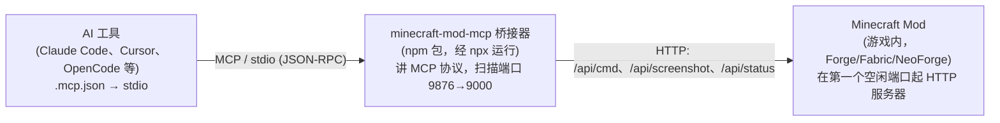
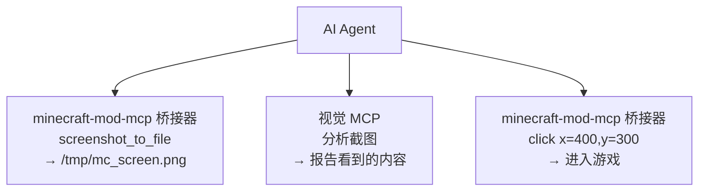

# AI 工具集成指南

**[English](../en/AI-TOOLS.md)** &bull; **简体中文** &bull; **[繁體中文](../zht/AI-TOOLS.md)** &bull; **[日本語](../ja/AI-TOOLS.md)** &bull; **[한국어](../ko/AI-TOOLS.md)** &bull; **[Français](../fr/AI-TOOLS.md)** &bull; **[Español](../es/AI-TOOLS.md)** &bull; **[Русский](../ru/AI-TOOLS.md)**

> **🤖 致 AI Agent —— 请先阅读本段**
>
> 接入 Minecraft 必须通过 **`minecraft-mod-mcp` stdio 桥接器（bridge）**，**不要**直接把 MCP/SSE 客户端指向某个端口。桥接器是本项目里唯一真正讲 MCP 协议的组件；它还会自动扫描、发现正在运行的游戏用的是哪个端口，因此你完全不用猜端口。
>
> 请添加下面的 MCP 服务器配置（stdio，通过 `npx` 启动），然后使用桥接器暴露的 45 个工具：
>
> ```json
> {
>   "mcpServers": {
>     "minecraft-mod-mcp": {
>       "type": "local",
>       "command": ["npx", "-y", "minecraft-mod-mcp"]
>     }
>   }
> }
> ```
>
> **为什么要用桥接器，而不是直接填 URL？** 游戏内的 mod 运行了一个 HTTP 服务器，但它**并不**实现 MCP 协议。把 `"type":"sse"` / `"url"` 直接指向 mod，会导致无法列出工具、无法调用工具。`npx minecraft-mod-mcp` 桥接器才是真正讲 MCP（经 stdio）并把每次调用转发给 mod 的组件。
>
> **致用户**：把本页链接粘贴给你的 AI Agent，它会自行配置好桥接器。除此之外它只需要一个装了 mod 的 Minecraft 客户端在运行——桥接器甚至能替你启动它（见[启动 Minecraft](#启动-minecraft)）。

---

## 实际工作原理



1. 你的 AI 工具把桥接器作为子进程拉起（`npx -y minecraft-mod-mcp`），经 stdio 与它讲 MCP。
2. 桥接器扫描端口 **9876 → 9000**，逐个访问 `/api/status`，锁定第一个返回 `type:"minecraft-mod"` 的端口。这样即便 9876 被占用也能找到游戏。
3. 每个一次 MCP 工具调用（`screenshot`、`click`、`execute_command` 等）都会被翻译成一次对 mod 的 HTTP 请求。桥接器还提供 `launch_minecraft` / `serve` 工具，可以自己启动游戏。

> **关键点**：桥接器是「我正在和哪个 Minecraft 客户端通信」的唯一权威来源。它在发现阶段从 `/api/status` 读出 `version`、`loader`、`pid`、`port`。你**永远不需要**硬编码端口。

---

## 快速配置

### 1. 把桥接器加进你的 AI 工具

大多数支持 MCP 的工具会读取项目根目录的配置文件。请使用 **stdio** 形式：

```json
{
  "mcpServers": {
    "minecraft-mod-mcp": {
      "type": "local",
      "command": ["npx", "-y", "minecraft-mod-mcp"]
    }
  }
}
```

如果你想先全局安装（`npm install -g minecraft-mod-mcp`），命令可以简化为 `["minecraft-mod-mcp"]`。

常见配置文件位置：

| 工具 | 配置文件 |
|------|-------------|
| Claude Code、OpenCode、CodeBuddy、WorkBuddy | 项目根目录下的 `.mcp.json` |
| Cursor | 项目根目录下的 `.cursor/mcp.json` |
| Cline、Roo Code、Kilo Code | VS Code `settings.json` |
| Claude Desktop | `claude_desktop_config.json`（系统路径见下方） |
| 其他 | 见[编程 Agent 工具](#编程-agent-工具) |

### 2. 让一个装了 mod 的 Minecraft 客户端跑起来

你可以自己启动游戏（从 [Releases](https://github.com/langyo/minecraft-mod-mcp/releases) 下载 mod JAR 放进 `mods` 目录），也可以**让桥接器代劳**——连上后调用 `launch_minecraft` 工具：

```
launch_minecraft(version="1.21.7", loader="forge")
```

桥接器会下载对应版本、选一个空闲的 MCP 端口、注入 mod 并启动客户端。详见[启动 Minecraft](#启动-minecraft)。

### 3. 验证连接

调用 `ping` 或 `get_minecraft_status` 工具。桥接器会报告是否找到了 mod、在哪个端口。也可以直接跑 CLI：

```bash
npx -y minecraft-mod-mcp status
```

---

## 环境要求

- **Node.js ≥ 20**（用于 `npx` 桥接器）。Deno、Bun 同样可用。
- **一个装了 mod 的 Minecraft 客户端**——或者干脆让桥接器启动一个（`launch_minecraft` / `serve`），此时还需要 **Java**（桥接器会按版本自动下载对应 JDK）。
- **不需要 Python，不需要 `just`。** 仓库里的 `just`/Python 命令只面向项目贡献者，与终端用户和 AI Agent 无关。

> ⚠️ **不要遵循旧文档里 `just daemon` 的说法。** 那条命令（`scripts/mc_vtty.py`）是项目内部的开发/测试脚手架，不属于对外发布的工具链。桥接器已经完全取代了它。

---

## Linux 与无图形界面环境

`npx` 桥接器本身是**完全无头（headless）**的——它是一个 stdio 进程，自身没有任何 GUI。在 SSH、容器、WSL 里都能跑。只有两点需要留意：

### 桥接器只要有 Node 就行

```bash
# 没有 DISPLAY 也能运行：
npx -y minecraft-mod-mcp status
npx -y minecraft-mod-mcp mcp --no-discover   # 启动 stdio 服务器，不需要游戏
```

你可以喂一个握手请求来确认 MCP 服务器存活（即使没有任何游戏在跑，桥接器也会返回工具列表）：

```bash
printf '%s\n' \
  '{"jsonrpc":"2.0","id":1,"method":"initialize","params":{"protocolVersion":"2025-06-18","capabilities":{},"clientInfo":{"name":"t","version":"1"}}}' \
  '{"jsonrpc":"2.0","method":"notifications/initialized"}' \
  '{"jsonrpc":"2.0","id":2,"method":"tools/list","params":{}}' \
  | npx -y minecraft-mod-mcp mcp --no-discover
```

### Minecraft *客户端* 需要显示器

Minecraft 是图形程序。在无显示器的 Linux 机器上跑它，需要以下之一：

- 真实的 X11/Wayland 会话（例如 XFCE 桌面——`echo $DISPLAY` 应有值，如 `:0`）。
- **Xvfb**（虚拟帧缓冲），当没有物理/远程显示器时：
  ```bash
  xvfb-run -a -s "-screen 0 1280x720x24" npx -y minecraft-mod-mcp launch 1.21.7 --loader forge
  ```
  在 Xvfb 下截图照样可用，所以足以支撑自动化 / Agent 驱动的测试。
- 只跑独立服务端（不要客户端 GUI）：用 `server` / `launch_server` 工具，或 `npx minecraft-mod-mcp server <version>`。完全不需要显示器。

如果 `launch_minecraft` 报显示器/AWT 错误，请设置 `DISPLAY` 或用 `xvfb-run` 包一层。桥接器会继承你的环境，所以通常只要 `export DISPLAY=:0`（或在 XFCE 会话里运行）就够了。

---

## 启动 Minecraft

桥接器可以通过 MCP 工具或 CLI 拉起一整套游戏会话——无需手动折腾版本和加载器：

| 目标 | MCP 工具 | CLI 等价命令 |
|------|----------|----------------|
| 列出支持的版本 | `list_supported_versions` | `npx minecraft-mod-mcp list` |
| 安装版本+加载器 | `install_version` | `npx minecraft-mod-mcp install 1.21.7 --loader forge` |
| 启动客户端 | `launch_minecraft` | `npx minecraft-mod-mcp launch 1.21.7 --loader forge` |
| 启动独立服务端 | `launch_server` | `npx minecraft-mod-mcp server 1.21.7` |
| 服务端 + 自动连接的客户端 | `serve` | `npx minecraft-mod-mcp serve 1.21.7` |
| 创建离线账号 | `create_offline_account` | `npx minecraft-mod-mcp auth offline Player` |
| 关闭运行中的客户端 | `kill_minecraft` | — |

完整 CLI 参考：**[CLI 使用指南](./CLI.md)**。

> `launch_minecraft` 之后，桥接器会自动发现刚启动的 mod（每次工具调用都会扫描 9876→9000 直到找到）。你不需要告诉它端口。

---

## 编程 Agent 工具

### Claude Code

**配置**（项目根目录 `.mcp.json`）：

```json
{
  "mcpServers": {
    "minecraft-mod-mcp": {
      "type": "local",
      "command": ["npx", "-y", "minecraft-mod-mcp"]
    }
  }
}
```

或用 CLI：`claude mcp add minecraft-mod-mcp -- npx -y minecraft-mod-mcp`。

### Claude Desktop / Claude for IDE

**配置**（`claude_desktop_config.json`）：

- **macOS**：`~/Library/Application Support/Claude/claude_desktop_config.json`
- **Windows**：`%APPDATA%\Claude\claude_desktop_config.json`

```json
{
  "mcpServers": {
    "minecraft-mod-mcp": {
      "command": "npx",
      "args": ["-y", "minecraft-mod-mcp"]
    }
  }
}
```

**Claude for IDE**（VS Code / JetBrains）与 Claude Code 一样，用项目根目录的 `.mcp.json`。

### OpenCode

**配置**：项目根目录 `.opencode.json`，或 `~/.config/opencode/config.json`：

```json
{
  "mcpServers": {
    "minecraft-mod-mcp": {
      "type": "local",
      "command": ["npx", "-y", "minecraft-mod-mcp"]
    }
  }
}
```

### Cursor

**配置**（项目根目录 `.cursor/mcp.json`）：

```json
{
  "mcpServers": {
    "minecraft-mod-mcp": {
      "command": "npx",
      "args": ["-y", "minecraft-mod-mcp"]
    }
  }
}
```

或经界面：**Cursor Settings → MCP → Add new MCP Server**，类型选 **stdio**，命令 `npx -y minecraft-mod-mcp`。

### Cline

**配置**（VS Code `settings.json`）：

```json
{
  "cline.mcpServers": {
    "minecraft-mod-mcp": {
      "command": "npx",
      "args": ["-y", "minecraft-mod-mcp"],
      "disabled": false,
      "autoApprove": []
    }
  }
}
```

### Roo Code

**配置**（VS Code `settings.json`，结构与 Cline 相同）：

```json
{
  "roo.mcpServers": {
    "minecraft-mod-mcp": {
      "command": "npx",
      "args": ["-y", "minecraft-mod-mcp"]
    }
  }
}
```

### Kilo Code

**配置**（VS Code `settings.json`）：

```json
{
  "kilo.mcpServers": {
    "minecraft-mod-mcp": {
      "command": "npx",
      "args": ["-y", "minecraft-mod-mcp"]
    }
  }
}
```

### GitHub Copilot

**配置**（VS Code `settings.json`）：

```json
{
  "github.copilot.mcpServers": {
    "minecraft-mod-mcp": {
      "command": "npx",
      "args": ["-y", "minecraft-mod-mcp"]
    }
  }
}
```

### CodeBuddy / WorkBuddy

**配置**（项目根目录 `mcp.json`）：

```json
{
  "mcpServers": {
    "minecraft-mod-mcp": {
      "type": "local",
      "command": ["npx", "-y", "minecraft-mod-mcp"]
    }
  }
}
```

### TRAE

**设置 → MCP 服务器 → 添加**：

- **名称**：`minecraft-mod-mcp`
- **传输方式**：stdio
- **命令**：`npx -y minecraft-mod-mcp`

### ZCode

**配置**（`~/.zcode/config.json`）：

```json
{
  "mcpServers": {
    "minecraft-mod-mcp": {
      "type": "local",
      "command": ["npx", "-y", "minecraft-mod-mcp"]
    }
  }
}
```

### Lingma

**设置 → MCP → 添加服务器**：

- **名称**：`minecraft-mod-mcp`
- **传输方式**：stdio
- **命令**：`npx -y minecraft-mod-mcp`

### Qoder

**配置**（`~/.qoder/mcp.json`）：

```json
{
  "mcpServers": {
    "minecraft-mod-mcp": {
      "type": "local",
      "command": ["npx", "-y", "minecraft-mod-mcp"]
    }
  }
}
```

### Droid

**配置**（`~/.droid/mcp.json`）：

```json
{
  "mcpServers": {
    "minecraft-mod-mcp": {
      "type": "local",
      "command": ["npx", "-y", "minecraft-mod-mcp"]
    }
  }
}
```

### Crush

**配置**（`~/.crush/config.json`）：

```json
{
  "mcpServers": {
    "minecraft-mod-mcp": {
      "type": "local",
      "command": ["npx", "-y", "minecraft-mod-mcp"]
    }
  }
}
```

### Goose

**配置**（`~/.config/goose/mcp.json`）：

```json
{
  "mcpServers": {
    "minecraft-mod-mcp": {
      "type": "local",
      "command": ["npx", "-y", "minecraft-mod-mcp"]
    }
  }
}
```

### Deep Code

**配置**（`~/.deepcode/config.json`）：

```json
{
  "mcpServers": {
    "minecraft-mod-mcp": {
      "type": "local",
      "command": ["npx", "-y", "minecraft-mod-mcp"]
    }
  }
}
```

### Reasonix

**配置**（`~/.reasonix/config.json`）：

```json
{
  "mcpServers": {
    "minecraft-mod-mcp": {
      "type": "local",
      "command": ["npx", "-y", "minecraft-mod-mcp"]
    }
  }
}
```

### Langcli

**配置**（`~/.langcli/config.yaml`）：

```yaml
mcp_servers:
  minecraft-mod-mcp:
    type: stdio
    command: ["npx", "-y", "minecraft-mod-mcp"]
```

### Oh My Pi

**配置**（`~/.oh-my-pi/mcp.json`）：

```json
{
  "mcpServers": {
    "minecraft-mod-mcp": {
      "type": "local",
      "command": ["npx", "-y", "minecraft-mod-mcp"]
    }
  }
}
```

### Pi

**配置**（`~/.pi/config.json`）：

```json
{
  "mcpServers": {
    "minecraft-mod-mcp": {
      "type": "local",
      "command": ["npx", "-y", "minecraft-mod-mcp"]
    }
  }
}
```

---

## 通用 Agent 工具

### OpenClaw

**配置**（工作区 `openclaw.json`）：

```json
{
  "mcpServers": {
    "minecraft-mod-mcp": {
      "type": "local",
      "command": ["npx", "-y", "minecraft-mod-mcp"]
    }
  }
}
```

### Cherry Studio

**设置 → MCP 服务器 → 添加**：

- **名称**：`minecraft-mod-mcp`
- **传输方式**：stdio
- **命令**：`npx -y minecraft-mod-mcp`

### Hermes Agent

**配置**（`~/.hermes/config.json`）：

```json
{
  "mcpServers": {
    "minecraft-mod-mcp": {
      "type": "local",
      "command": ["npx", "-y", "minecraft-mod-mcp"]
    }
  }
}
```

### AstrBot

**配置**（`astrbot_config.json`）：

```json
{
  "mcp_servers": {
    "minecraft-mod-mcp": {
      "type": "local",
      "command": ["npx", "-y", "minecraft-mod-mcp"]
    }
  }
}
```

### nanobot

**配置**（`~/.nanobot/config.json`）：

```json
{
  "mcpServers": {
    "minecraft-mod-mcp": {
      "type": "local",
      "command": ["npx", "-y", "minecraft-mod-mcp"]
    }
  }
}
```

---

## 直接 HTTP REST API（进阶）

如果你完全不用 MCP，可以直接用 `curl` 和 mod 的 HTTP 服务器通信。你必须先找到端口（桥接器会扫描 9876→9000；`/api/status` 能告诉你哪个是 mod）：

```bash
# 找到正在运行的 mod 的端口
for p in $(seq 9876 -1 9000); do
  curl -s "http://localhost:$p/api/status" | grep -q '"type":"minecraft-mod"' && echo "mod 在端口 $p" && break
done

# 健康检查
curl http://localhost:9876/api/status

# 执行命令
curl -X POST http://localhost:9876/api/cmd \
  -H "Content-Type: application/json" \
  -d '{"cmd":"screenshot","params":{}}'

# 截取屏幕截图
curl http://localhost:9876/api/screenshot
```

> **注意**：`/api/events` 端点是一个**纯调试用 SSE 流**，推送的是调用历史（供游戏内 `/debug` 面板使用），它**不是** MCP 传输层——**不要**把它配置成 MCP 的 `"type":"sse"` 服务器。要用 MCP 请用上面的 stdio 桥接器。

### 常用命令

| 命令 | 说明 |
|---------|-------------|
| `screenshot` | 截取屏幕截图，返回 base64 数据 URI |
| `screenshot_to_file` | 截取屏幕截图并保存到本地文件（`{"cmd":"screenshot_to_file","params":{"path":"/tmp/mc.png"}}`） |
| `click` | 在 (x, y) 坐标处点击 |
| `press_key` | 按下键盘按键 |
| `type_text` | 输入文本字符串 |
| `scroll` | 执行鼠标滚轮操作 |
| `execute_command` | 执行 Minecraft 斜杠命令 |
| `get_player_info` | 获取玩家位置和状态 |
| `get_world_info` | 获取世界信息 |

---

## 视觉识别集成

你可以将 Minecraft Mod MCP 与**支持视觉能力的 MCP 服务器**配合使用，让 AI 代理能够*查看并理解*游戏中正在发生的事情——读取 UI 文本、诊断错误、分析布局等。

### 工作原理

1. 桥接器的 `screenshot_to_file` 工具把一帧画面保存到磁盘。
2. 视觉 MCP 服务器读取该文件并进行分析。
3. Agent 协调两者——截图 → 分析 → 行动。



### GLM 视觉 MCP 服务器

[GLM Vision MCP Server](https://docs.bigmodel.cn/cn/coding-plan/mcp/vision-mcp-server)（`@z_ai/mcp-server`）是一个由 GLM-4.6V 驱动的本地 MCP 服务器：

| 工具 | 用途 |
|------|----------|
| `ui_to_artifact` | 将 UI 截图转换为代码、提示词或设计规格 |
| `extract_text_from_screenshot` | 从游戏 UI（聊天、告示牌、菜单）中 OCR 提取文字 |
| `diagnose_error_screenshot` | 解析游戏中的错误对话框和堆栈跟踪 |
| `understand_technical_diagram` | 解读红石电路、原理图 |
| `analyze_data_visualization` | 读取游戏内统计数据、仪表盘 |
| `image_analysis` | 对游戏场景进行通用视觉理解 |
| `ui_diff_check` | 对比前后截图差异 |

**配置**（需要 Node.js ≥ 18）：

```bash
# Claude Code
claude mcp add -s user zai-mcp-server --env Z_AI_API_KEY=<your_zhipu_api_key> -- npx -y "@z_ai/mcp-server"

# 手动配置（Cline、Roo Code、Kilo Code 等）
{
  "mcpServers": {
    "zai-mcp-server": {
      "type": "local",
      "command": ["npx", "-y", "@z_ai/mcp-server"],
      "env": {
        "Z_AI_API_KEY": "<your_zhipu_api_key>",
        "Z_AI_MODE": "ZHIPU"
      }
    }
  }
}
```

> **注意**：视觉 MCP 会从磁盘读取文件，因此调用视觉工具前请务必先用 `screenshot_to_file`（而非 `screenshot`）。你的 Agent 可以在调用 `screenshot_to_file` 时指定文件路径。

### 操作示例

1. 向你的 AI Agent 提问：*"截取 Minecraft 的屏幕截图，保存到 `/tmp/mc.png`，然后分析屏幕上的内容，告诉我该按哪个按钮来开始新游戏。"*
2. Agent 调用 `minecraft-mod-mcp` → `screenshot_to_file` → 文件已保存。
3. Agent 调用 `zai-mcp-server` → `extract_text_from_screenshot` → 读取 UI 文字。
4. Agent 告诉你它看到了什么，以及下一步该做什么。

### 其他视觉工具

| 工具 | 说明 |
|------|------|
| [Claude built-in vision](https://docs.anthropic.com/en/docs/claude/vision) | Claude 原生理解图片 — 直接粘贴或引用截图文件 |
| [GPT-4o / GPT-4V](https://platform.openai.com/docs/guides/vision) | OpenAI 视觉模型，可通过任何 OpenAI 兼容客户端使用 |
| [Gemini Vision](https://ai.google.dev/gemini-api/docs/vision) | Google 的视觉 API，可在 Gemini 兼容工具中使用 |
| [Qwen-VL](https://github.com/QwenLM/Qwen-VL) | 开源视觉语言模型，适用于自托管环境 |

> 任何具备视觉能力的 LLM 或 MCP 服务器都可以用于相同流程 — 关键是先用 `screenshot_to_file` 把截图保存到磁盘。

---

## 故障排除

1. **"Mod not connected" / 工具全部不可用**
   确保装了 mod 的 Minecraft 客户端正在运行。用 `npx -y minecraft-mod-mcp status` 检查。桥接器每次工具调用都会扫描 9876→9000；如果没有响应，请先启动客户端（`launch_minecraft` 工具或 `npx minecraft-mod-mcp launch <version>`）。

2. **端口不对 / "我到底在控制哪个客户端？"**
   端口不由你选——桥接器来选。它扫描 9876→9000，锁定第一个 `/api/status` 返回 `type:"minecraft-mod"` 的，并报告该客户端的 `version`、`loader`、`pid`。如果同时跑了多个客户端，只会控制最先找到的那个；关掉多余的，或用 `-Dmcp.port=<port>` / `MC_MCP_PORT` 固定端口。

3. **配置了 `"type":"sse"` / `"url":"http://localhost:9876/api/events"` 却什么都不能用**
   这套配置是错的。mod 的 `/api/events` 是调试事件流，不是 MCP 传输层。请改用[快速配置](#快速配置)里的 **stdio 桥接器**（`npx -y minecraft-mod-mcp`）。

4. **找不到 npx / 桥接器起不来**
   安装 Node.js ≥ 20。用 `npx -y minecraft-mod-mcp --help` 验证。首次 `npx` 会下载包，请确保能联网。

5. **无头 Linux 上客户端起不来**
   Minecraft 需要显示器。请在 X11/Wayland 会话里运行（`export DISPLAY=:0`），或用 Xvfb 包一层：`xvfb-run -a -s "-screen 0 1280x720x24" npx -y minecraft-mod-mcp launch <version>`。独立服务端（`launch_server` / `server` 命令）不需要显示器。

6. **9876 端口冲突**
   对桥接器不是问题——它会自动回退到 9875、9874……9000。要固定端口，请传 JVM 参数 `-Dmcp.port=<port>` 或设置 `MC_MCP_PORT`。

7. **防火墙**
   桥接器与 mod 只通过回环（`127.0.0.1`）通信。除非你刻意把 mod 的 HTTP 服务器暴露出去，否则不需要任何外部防火墙规则。

> 如有问题或疑问，请在 [GitHub 仓库](https://github.com/langyo/minecraft-mod-mcp) 上提交 issue。
