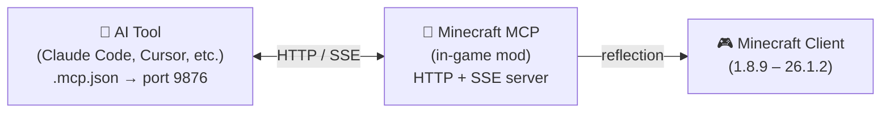

<!-- markdownlint-disable MD033 MD041 MD036 -->
<div align="center">


# Minecraft MCP

**让 AI 畅玩 Minecraft —— 支持任意版本、任意模组加载器**

[](../../LICENSE-MIT)
[](https://www.java.com/)
[](https://github.com/langyo/minecraft-mod-mcp/releases)

**[English](../en/README.md)** &bull; **简体中文** &bull; **[繁體中文](../zht/README.md)** &bull; **[日本語](../ja/README.md)** &bull; **[한국어](../ko/README.md)** &bull; **[Français](../fr/README.md)** &bull; **[Español](../es/README.md)** &bull; **[Русский](../ru/README.md)**

</div>
<!-- markdownlint-enable MD033 MD041 MD036 -->

## 什么是 Minecraft MCP

Minecraft MCP 是 AI 助手与 Minecraft 之间的桥梁。它以游戏内模组的形式运行，启动一个 HTTP 服务器，使 AI 工具 可以通过标准 MCP 协议连接到它。通过这座桥梁，AI 可以看到游戏画面、点击按钮、输入命令并与世界交互。

> 想让你的 AI 建造一座城堡？运行冒烟测试？浏览整合包菜单？Minecraft MCP 让这一切成为可能。

- **看** —— 截取带有坐标网格的屏幕截图
- **动** —— 点击、输入、滚动、拖拽、按下任意按键
- **知** —— 查询玩家位置、世界信息、屏幕按钮和调试字段
- **录** —— 通过 SSE 实时推送事件流，捕获视频帧

[AI 工具集成指南 →](./AI-TOOLS.md)

## 支持的版本

| MC 版本 | Forge | Fabric | NeoForge |
|---------|:-----:|:------:|:--------:|
| 1.8.9 | ✓ | — | — |
| 1.9.4 | ✓ | — | — |
| 1.10.2 | ✓ | — | — |
| 1.11.2 | ✓ | — | — |
| 1.12.2 | ✓ | — | — |
| 1.13.2 | ✓ | — | — |
| 1.14.4 | ✓ | 🚧 | — |
| 1.15.2 | ✓ | 🚧 | — |
| 1.16.5 | ✓ | 🚧 | — |
| 1.17.1 | ✓ | 🚧 | — |
| 1.18.2 | ✓ | 🚧 | — |
| 1.19.4 | ✓ | 🚧 | — |
| 1.20.6 | ✓ | 🚧 | 🚧 |
| 1.21.7 | ✓ | — | — |
| 26.1.2 | ✓ | — | 🚧 |

> 🚧 = 开发中

## 快速开始

### 环境要求

- JDK 21（推荐使用 Corretto）

### 安装与构建

```bash
# 安装依赖
pip install -r scripts/requirements.txt

# 构建全部内容
just full
```

### 运行

```bash
# 启动守护进程并启动 Minecraft
just daemon
just launch 1.21.7 forge

# 或者运行端到端冒烟测试
just smoke 1.21.7
```

## 工作原理



该模组在 Minecraft 内部运行一个 HTTP 服务器（端口 9876）。你的 AI 工具通过标准 MCP 协议（SSE 传输）连接，每条命令 —— 点击、输入、截图等 —— 都通过 Java 反射机制实现，无需针对特定版本编写代码，跨所有 Minecraft 版本通用。

## 参与贡献

欢迎提交 Issue 和 Pull Request。

## 许可证

根据你的选择，采用以下任一许可证：

- Apache License, Version 2.0（[LICENSE-APACHE](../../LICENSE-APACHE) 或 http://www.apache.org/licenses/LICENSE-2.0）
- MIT License（[LICENSE-MIT](../../LICENSE-MIT) 或 http://opensource.org/licenses/MIT）
