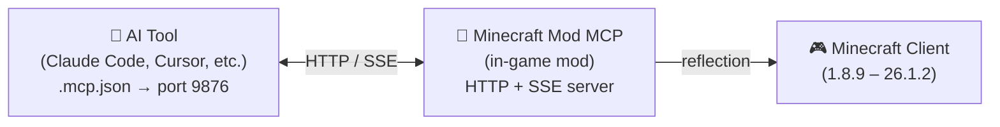

<!-- markdownlint-disable MD033 MD041 MD036 -->
<div align="center">


# Minecraft Mod MCP

**让 AI 玩 Minecraft**

[](../../LICENSE-MIT)
[](https://www.java.com/)
[](https://github.com/langyo/minecraft-mod-mcp/releases)
[](https://www.npmjs.com/package/minecraft-mod-mcp)

**[English](../../README.md)** &bull; **简体中文** &bull; **[繁體中文](../zht/README.md)** &bull; **[日本語](../ja/README.md)** &bull; **[한국어](../ko/README.md)** &bull; **[Français](../fr/README.md)** &bull; **[Español](../es/README.md)** &bull; **[Русский](../ru/README.md)**

</div>
<!-- markdownlint-enable MD033 MD041 MD036 -->

## 🤖 让你的 AI 接入 Minecraft

**复制这个链接粘贴给你的 AI Agent——它会自动完成配置：**

```
https://github.com/langyo/minecraft-mod-mcp/blob/main/docs/guides/zhs/AI-TOOLS.md
```

你的 AI 会自行阅读指南、配置 MCP 连接，然后开始操控游戏。无需手动配置。

> 已经安装了模组？只需这一个链接就够了。

---

## 什么是 Minecraft Mod MCP

Minecraft Mod MCP 是一个让 AI 助手操控 Minecraft 的模组。把它放入你的 `mods` 文件夹，启动游戏，你的 AI 就能看到游戏画面、点击按钮、输入命令、与世界交互——全部通过标准的 MCP 协议。

- **看** —— 截取带有坐标网格的屏幕截图
- **动** —— 点击、输入、滚动、拖拽、按下任意按键
- **知** —— 查询玩家位置、世界信息、屏幕按钮和调试字段
- **录** —— 通过 SSE 实时推送事件流，捕获视频帧

> 想让你的 AI 建造一座城堡？运行冒烟测试？浏览整合包菜单？Minecraft Mod MCP 让这一切成为可能。

---

## 支持的版本

| MC 版本 | Forge | Fabric | NeoForge |
|---------|:-----:|:------:|:--------:|
| 1.8.9 | [⬇](https://github.com/langyo/minecraft-mod-mcp/releases/latest/download/minecraft-mcp-1.8.9-forge.jar) | — | — |
| 1.9.4 | [⬇](https://github.com/langyo/minecraft-mod-mcp/releases/latest/download/minecraft-mcp-1.9.4-forge.jar) | — | — |
| 1.10.2 | [⬇](https://github.com/langyo/minecraft-mod-mcp/releases/latest/download/minecraft-mcp-1.10.2-forge.jar) | — | — |
| 1.11.2 | [⬇](https://github.com/langyo/minecraft-mod-mcp/releases/latest/download/minecraft-mcp-1.11.2-forge.jar) | — | — |
| 1.12.2 | [⬇](https://github.com/langyo/minecraft-mod-mcp/releases/latest/download/minecraft-mcp-1.12.2-forge.jar) | — | — |
| 1.13.2 | [⬇](https://github.com/langyo/minecraft-mod-mcp/releases/latest/download/minecraft-mcp-1.13.2-forge.jar) | — | — |
| 1.14.4 | [⬇](https://github.com/langyo/minecraft-mod-mcp/releases/latest/download/minecraft-mcp-1.14.4-forge.jar) | [⬇](https://github.com/langyo/minecraft-mod-mcp/releases/latest/download/minecraft-mcp-1.14.4-fabric.jar) | — |
| 1.15.2 | [⬇](https://github.com/langyo/minecraft-mod-mcp/releases/latest/download/minecraft-mcp-1.15.2-forge.jar) | [⬇](https://github.com/langyo/minecraft-mod-mcp/releases/latest/download/minecraft-mcp-1.15.2-fabric.jar) | — |
| 1.16.5 | [⬇](https://github.com/langyo/minecraft-mod-mcp/releases/latest/download/minecraft-mcp-1.16.5-forge.jar) | [⬇](https://github.com/langyo/minecraft-mod-mcp/releases/latest/download/minecraft-mcp-1.16.5-fabric.jar) | — |
| 1.17.1 | [⬇](https://github.com/langyo/minecraft-mod-mcp/releases/latest/download/minecraft-mcp-1.17.1-forge.jar) | [⬇](https://github.com/langyo/minecraft-mod-mcp/releases/latest/download/minecraft-mcp-1.17.1-fabric.jar) | — |
| 1.18.2 | [⬇](https://github.com/langyo/minecraft-mod-mcp/releases/latest/download/minecraft-mcp-1.18.2-forge.jar) | [⬇](https://github.com/langyo/minecraft-mod-mcp/releases/latest/download/minecraft-mcp-1.18.2-fabric.jar) | — |
| 1.19.4 | [⬇](https://github.com/langyo/minecraft-mod-mcp/releases/latest/download/minecraft-mcp-1.19.4-forge.jar) | [⬇](https://github.com/langyo/minecraft-mod-mcp/releases/latest/download/minecraft-mcp-1.19.4-fabric.jar) | — |
| 1.20.6 | [⬇](https://github.com/langyo/minecraft-mod-mcp/releases/latest/download/minecraft-mcp-1.20.6-forge.jar) | [⬇](https://github.com/langyo/minecraft-mod-mcp/releases/latest/download/minecraft-mcp-1.20.6-fabric.jar) | [⬇](https://github.com/langyo/minecraft-mod-mcp/releases/latest/download/minecraft-mcp-1.20.6-neoforge.jar) |
| 1.21.11 | [⬇](https://github.com/langyo/minecraft-mod-mcp/releases/latest/download/minecraft-mcp-1.21.11-forge.jar) | [⬇](https://github.com/langyo/minecraft-mod-mcp/releases/latest/download/minecraft-mcp-1.21.11-fabric.jar) | [⬇](https://github.com/langyo/minecraft-mod-mcp/releases/latest/download/minecraft-mcp-1.21.11-neoforge.jar) |
| 26.1.2 | [⬇](https://github.com/langyo/minecraft-mod-mcp/releases/latest/download/minecraft-mcp-26.1.2-forge.jar) | — | [⬇](https://github.com/langyo/minecraft-mod-mcp/releases/latest/download/minecraft-mcp-26.1.2-neoforge.jar) |

---

## 快速开始

### 1. 安装模组

从 [GitHub Releases](https://github.com/langyo/minecraft-mod-mcp/releases) 下载 JAR 文件，放入你的 Minecraft `mods` 文件夹。

- 需要 **Forge** / **Fabric** / **NeoForge**（见上方支持版本）
- 兼容 Minecraft **1.8.9** 至 **26.1.2**

### 2. 安装 MCP 桥接

```bash
npm install -g minecraft-mod-mcp
```

或无需安装直接运行：

```bash
npx minecraft-mod-mcp
```

### 3. 启动 Minecraft

通过你的模组加载器启动游戏。模组会自动在 9876 端口启动 HTTP 服务器。

### 4. 连接你的 AI

**[→ AI 工具集成指南](./AI-TOOLS.md)** —— 包含 Claude Code、Cursor、Cline、Copilot 等 20+ 工具的详细配置步骤。

或者直接把这段链接粘贴给你的 AI Agent，让它自动配置：

```
https://github.com/langyo/minecraft-mod-mcp/blob/main/docs/guides/zhs/AI-TOOLS.md
```

---

## 工作原理



该模组在 Minecraft 内部运行一个 HTTP 服务器（端口 9876）。你的 AI 工具通过标准 MCP 协议（SSE 传输）连接，每条命令 —— 点击、输入、截图等 —— 都通过 Java 反射机制实现，无需针对特定版本编写代码，跨所有 Minecraft 版本通用。

---

## 从源码构建

> 本节面向贡献者。如果你只想使用模组，请查看上方的[快速开始](#快速开始)。

详见 [CONTRIBUTING.md](../../CONTRIBUTING.md)，了解开发环境搭建、项目结构和贡献指南。

---

## 许可证

根据你的选择，采用以下任一许可证：

- Apache License, Version 2.0（[LICENSE-APACHE](../../LICENSE-APACHE) 或 http://www.apache.org/licenses/LICENSE-2.0）
- MIT License（[LICENSE-MIT](../../LICENSE-MIT) 或 http://opensource.org/licenses/MIT）
