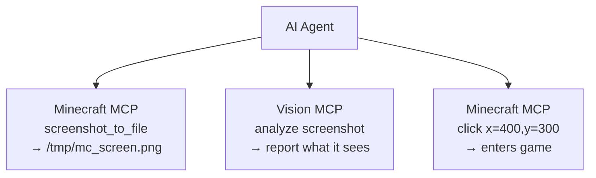

# AI 工具整合指南

**[English](../en/AI-TOOLS.md)** &bull; **[简体中文](../zhs/AI-TOOLS.md)** &bull; **繁體中文** &bull; **[日本語](../ja/AI-TOOLS.md)** &bull; **[한국어](../ko/AI-TOOLS.md)** &bull; **[Français](../fr/AI-TOOLS.md)** &bull; **[Español](../es/AI-TOOLS.md)** &bull; **[Русский](../ru/AI-TOOLS.md)**

> **🤖 致 AI Agent**：如果有使用者要求你接入 Minecraft，請添加以下 MCP 伺服器設定，然後使用本指南末尾列出的 35+ 工具：
>
> ```json
> {
>   "mcpServers": {
>     "minecraft-mcp": {
>       "type": "sse",
>       "url": "http://localhost:9876/api/events"
>     }
>   }
> }
> ```
>
> **致使用者**：你可以直接把本頁連結貼給你的 AI Agent，它會自行完成設定，無需手動操作。

---

## 快速設定

大多數 AI 編碼工具使用相同的基於 SSE 的 MCP 設定。將其添加到你的工具設定檔中：

```json
{
  "mcpServers": {
    "minecraft-mcp": {
      "type": "sse",
      "url": "http://localhost:9876/api/events"
    }
  }
}
```

常見設定檔位置：

| 工具 | 設定檔 |
|------|-------------|
| Claude Code、OpenCode、CodeBuddy、WorkBuddy | 專案根目錄下的 `.mcp.json` |
| Cursor | 專案根目錄下的 `.cursor/mcp.json` |
| Cline、Roo Code、Kilo Code | VS Code `settings.json` |
| Claude Desktop | `claude_desktop_config.json`（系統路徑見下方） |
| 其他 | 見下方各工具的詳細說明 |

> 查看[各工具詳細設定](#編碼-agent-工具)以取得具體路徑、界面設定和特定工具格式。

---

## Minecraft MCP HTTP 端點

Minecraft MCP 伺服器提供以下 HTTP 端點（預設連接埠：**9876**）：

| 端點 | 方法 | 說明 |
|----------|--------|-------------|
| `/api/status` | GET | 健康檢查 |
| `/api/cmd` | POST | JSON-RPC 指令分派（主體：`{"cmd":"...", "params":{...}}`） |
| `/api/screenshot` | GET | 截取螢幕截圖，回傳 PNG base64 |
| `/api/events` | GET | SSE（伺服器推送事件）串流，用於即時呼叫歷史記錄 |
| `/api/calls` | GET | 回傳最近 50 筆呼叫事件為 JSON 陣列 |

> **前置條件**：確保 Minecraft MCP 守護程序正在執行，且已連接安裝 MCP 模組的 Minecraft 客戶端。執行 `just daemon` 然後 `just launch <version> <loader>`。

---

## 整合方式

大多數 AI 編碼工具支援 **模型上下文協議（MCP）** 來連接外部伺服器。Minecraft MCP 伺服器可透過以下方式連接：

- **SSE 傳輸**：將工具的 MCP 客戶端指向 `http://localhost:9876/api/events`
- **HTTP REST API**：直接發送 POST 請求至 `http://localhost:9876/api/cmd`

以下章節提供各工具的設定說明。

---

## 編碼代理工具

### Claude Code

Anthropic 的終端機 AI 編碼助手。

**設定**：在專案根目錄中建立或編輯 `.mcp.json`：

```json
{
  "mcpServers": {
    "minecraft-mcp": {
      "type": "sse",
      "url": "http://localhost:9876/api/events"
    }
  }
}
```

或者，使用 `claude mcp add minecraft-mcp --transport sse http://localhost:9876/api/events`。

### Claude Desktop / Claude for IDE

Claude 的桌面應用程式以及 VS Code/JetBrains IDE 外掛版本。

**設定**：編輯 `claude_desktop_config.json`：

- **macOS**：`~/Library/Application Support/Claude/claude_desktop_config.json`
- **Windows**：`%APPDATA%\Claude\claude_desktop_config.json`

```json
{
  "mcpServers": {
    "minecraft-mcp": {
      "type": "sse",
      "url": "http://localhost:9876/api/events"
    }
  }
}
```

對於 **Claude for IDE**（VS Code / JetBrains），設定方式相同 — 使用專案根目錄中的 `.mcp.json` 檔案。

### OpenCode

開源終端機編碼代理。

**設定**：在專案根目錄中建立 `.opencode.json`，或編輯 `~/.config/opencode/config.json`：

```json
{
  "mcpServers": {
    "minecraft-mcp": {
      "type": "sse",
      "url": "http://localhost:9876/api/events"
    }
  }
}
```

### Cursor

支援自訂模型的 AI 優先程式碼編輯器。

**設定**：在專案根目錄中建立 `.cursor/mcp.json`：

```json
{
  "mcpServers": {
    "minecraft-mcp": {
      "url": "http://localhost:9876/api/events",
      "transport": "sse"
    }
  }
}
```

或透過 UI 操作：**Cursor 設定 → MCP → 新增 MCP 伺服器**，傳輸類型設為 **SSE** 並輸入 URL。

### Cline

VS Code AI 編碼擴充功能。

**設定**：開啟 VS Code 設定（`Ctrl+,`），搜尋 `cline.mcpServers`，或新增至 `settings.json`：

```json
{
  "cline.mcpServers": {
    "minecraft-mcp": {
      "url": "http://localhost:9876/api/events",
      "transport": "sse"
    }
  }
}
```

### Roo Code

用於程式碼編寫與重構的智慧型 VS Code 擴充功能。

**設定**：新增至 VS Code `settings.json`（格式與 Cline 相同）：

```json
{
  "roo.mcpServers": {
    "minecraft-mcp": {
      "url": "http://localhost:9876/api/events",
      "transport": "sse"
    }
  }
}
```

### Kilo Code

用於程式碼生成與專案管理的高效 VS Code 外掛。

**設定**：新增至 VS Code `settings.json`：

```json
{
  "kilo.mcpServers": {
    "minecraft-mcp": {
      "url": "http://localhost:9876/api/events",
      "transport": "sse"
    }
  }
}
```

### GitHub Copilot

GitHub 在 VS Code 中的 AI 配對程式設計師。

**設定**：在您的工作區中建立 `.github/copilot-instructions.md`，或透過 VS Code 設定進行 MCP 設定：

```json
{
  "github.copilot.mcpServers": {
    "minecraft-mcp": {
      "url": "http://localhost:9876/api/events",
      "transport": "sse"
    }
  }
}
```

### GitHub Copilot CLI

命令列版本的 GitHub Copilot。

**設定**：設定環境變數或使用 `gh copilot config`：

```bash
export MCP_SERVER_URL="http://localhost:9876/api/events"
```

### CodeBuddy / WorkBuddy

AI 驅動的全端智慧型程式開發工具。

**設定**：在專案根目錄或工作區中建立 `mcp.json`：

```json
{
  "mcpServers": {
    "minecraft-mcp": {
      "url": "http://localhost:9876/api/events",
      "transport": "sse"
    }
  }
}
```

### TRAE

能夠獨立完成各種開發任務的 AI 編輯器。

**設定**：前往 **設定 → MCP 伺服器 → 新增伺服器**：

- **名稱**：`minecraft-mcp`
- **傳輸**：SSE
- **URL**：`http://localhost:9876/api/events`

### ZCode

將強大的 AI 代理與現有工具鏈相結合。

**設定**：編輯 `~/.zcode/config.json`：

```json
{
  "mcpServers": {
    "minecraft-mcp": {
      "type": "sse",
      "url": "http://localhost:9876/api/events"
    }
  }
}
```

### Lingma

智慧型程式開發助手。

**設定**：前往 **設定 → MCP → 新增伺服器**：

- **名稱**：`minecraft-mcp`
- **傳輸**：SSE
- **URL**：`http://localhost:9876/api/events`

### Qoder

用於真實軟體開發的代理程式平台。

**設定**：編輯 `~/.qoder/mcp.json`：

```json
{
  "mcpServers": {
    "minecraft-mcp": {
      "type": "sse",
      "url": "http://localhost:9876/api/events"
    }
  }
}
```

### Droid

用於端到端工作流程的企業級終端機 AI 編碼代理。

**設定**：編輯 `~/.droid/mcp.json`：

```json
{
  "mcpServers": {
    "minecraft-mcp": {
      "type": "sse",
      "url": "http://localhost:9876/api/events"
    }
  }
}
```

### Crush

支援 CLI 與 TUI 介面的終端機 AI 程式開發工具。

**設定**：編輯 `~/.crush/config.json`：

```json
{
  "mcpServers": {
    "minecraft-mcp": {
      "type": "sse",
      "url": "http://localhost:9876/api/events"
    }
  }
}
```

### Goose

支援本機執行與自動化工程任務的 AI 代理工具。

**設定**：編輯 `~/.config/goose/mcp.json`：

```json
{
  "mcpServers": {
    "minecraft-mcp": {
      "type": "sse",
      "url": "http://localhost:9876/api/events"
    }
  }
}
```

### Deep Code

DeepSeek 驅動的編碼助手。

**設定**：編輯 `~/.deepcode/config.json`：

```json
{
  "mcpServers": {
    "minecraft-mcp": {
      "type": "sse",
      "url": "http://localhost:9876/api/events"
    }
  }
}
```

### Reasonix

專注於推理的 AI 編碼工具。

**設定**：編輯 `~/.reasonix/config.json`：

```json
{
  "mcpServers": {
    "minecraft-mcp": {
      "type": "sse",
      "url": "http://localhost:9876/api/events"
    }
  }
}
```

### Langcli

基於 CLI 的 AI 編碼助手。

**設定**：編輯 `~/.langcli/config.yaml`：

```yaml
mcp_servers:
  minecraft-mcp:
    type: sse
    url: http://localhost:9876/api/events
```

### Oh My Pi

多功能 AI 代理平台。

**設定**：編輯 `~/.oh-my-pi/mcp.json`：

```json
{
  "mcpServers": {
    "minecraft-mcp": {
      "type": "sse",
      "url": "http://localhost:9876/api/events"
    }
  }
}
```

### Pi

輕量級 AI 編碼夥伴。

**設定**：編輯 `~/.pi/config.json`：

```json
{
  "mcpServers": {
    "minecraft-mcp": {
      "type": "sse",
      "url": "http://localhost:9876/api/events"
    }
  }
}
```

---

## 通用代理工具

### OpenClaw

在本機執行的開源 AI 助手，具備 Skills 擴展性。

**設定**：編輯工作區中的 `openclaw.json`：

```json
{
  "mcpServers": {
    "minecraft-mcp": {
      "type": "sse",
      "url": "http://localhost:9876/api/events"
    }
  }
}
```

### Cherry Studio

支援多模型整合的 AI 應用 IDE。

**設定**：前往 **設定 → MCP 伺服器 → 新增**：

- **名稱**：`minecraft-mcp`
- **傳輸**：SSE
- **URL**：`http://localhost:9876/api/events`

### Hermes Agent

具備持久記憶的開源自進化 AI 代理。

**設定**：編輯 `~/.hermes/config.json`：

```json
{
  "mcpServers": {
    "minecraft-mcp": {
      "type": "sse",
      "url": "http://localhost:9876/api/events"
    }
  }
}
```

### AstrBot

AI 驅動的機器人框架。

**設定**：編輯 `astrbot_config.json`：

```json
{
  "mcp_servers": {
    "minecraft-mcp": {
      "type": "sse",
      "url": "http://localhost:9876/api/events"
    }
  }
}
```

### nanobot

用於各種任務的輕量級 AI 代理。

**設定**：編輯 `~/.nanobot/config.json`：

```json
{
  "mcpServers": {
    "minecraft-mcp": {
      "type": "sse",
      "url": "http://localhost:9876/api/events"
    }
  }
}
```

---

## 直接 HTTP REST API 存取

對於本身不支援 MCP 協議的工具，您可以透過 HTTP REST API 直接與 Minecraft MCP 伺服器互動：

```bash
# 健康檢查
curl http://localhost:9876/api/status

# 執行指令
curl -X POST http://localhost:9876/api/cmd \
  -H "Content-Type: application/json" \
  -d '{"cmd":"screenshot","params":{}}'

# 截取螢幕截圖
curl http://localhost:9876/api/screenshot

# 訂閱事件（SSE 串流）
curl http://localhost:9876/api/events
```

### 常用指令

| 指令 | 說明 |
|---------|-------------|
| `screenshot` | 截取 Minecraft 視窗的螢幕截圖，回傳 base64 資料 URI |
| `screenshot_to_file` | 截取螢幕截圖並儲存為本地檔案 (`{"cmd":"screenshot_to_file","params":{"path":"/tmp/mc.png"}}`) |
| `click` | 在 (x, y) 座標點擊 |
| `press_key` | 按下鍵盤按鍵 |
| `type_text` | 輸入文字字串 |
| `scroll` | 執行滑鼠滾輪捲動 |
| `execute_command` | 執行 Minecraft 斜線指令 |
| `get_player_info` | 取得玩家位置與狀態 |
| `get_world_info` | 取得世界資訊 |

---

## 視覺辨識整合

你可以將 Minecraft MCP 與**具備視覺能力的 MCP 伺服器**搭配使用，讓 AI 代理能夠*看見並理解*遊戲中發生的事情 — 讀取 UI 文字、診斷錯誤、分析版面配置等。

### 運作原理

1. Minecraft MCP 擷取螢幕截圖，並透過 `screenshot_to_file` 儲存為本地檔案
2. 視覺 MCP 伺服器讀取該檔案並進行分析
3. AI 代理協調兩者 — 截圖 → 分析 → 行動



### GLM Vision MCP 伺服器

[GLM Vision MCP Server](https://docs.bigmodel.cn/cn/coding-plan/mcp/vision-mcp-server) (`@z_ai/mcp-server`) 是一個由 GLM-4.6V 驅動的本地 MCP 伺服器，提供以下功能：

| 工具 | 用途 |
|------|----------|
| `ui_to_artifact` | 將 UI 截圖轉換為程式碼、提示詞或設計規格 |
| `extract_text_from_screenshot` | 從遊戲 UI 中 OCR 文字（聊天、告示牌、選單） |
| `diagnose_error_screenshot` | 解析遊戲中的錯誤對話框和堆疊追蹤 |
| `understand_technical_diagram` | 讀取紅石電路、結構示意圖 |
| `analyze_data_visualization` | 讀取遊戲內統計資料、儀表板 |
| `image_analysis` | 遊戲場景的通用視覺理解 |
| `ui_diff_check` | 比較前後截圖差異 |

**安裝**（需要 Node.js >= 18）：

```bash
# Claude Code
claude mcp add -s user zai-mcp-server --env Z_AI_API_KEY=<your_zhipu_api_key> -- npx -y "@z_ai/mcp-server"

# 手動設定（Cline、Roo Code、Kilo Code 等）
{
  "mcpServers": {
    "zai-mcp-server": {
      "type": "stdio",
      "command": "npx",
      "args": ["-y", "@z_ai/mcp-server"],
      "env": {
        "Z_AI_API_KEY": "<your_zhipu_api_key>",
        "Z_AI_MODE": "ZHIPU"
      }
    }
  }
}
```

> **注意**：視覺 MCP 會從磁碟讀取檔案，因此在呼叫視覺工具之前，請務必先使用 `screenshot_to_file`（而非 `screenshot`）。你的 AI 代理可以在呼叫 `screenshot_to_file` 時指定檔案路徑。

### 操作範例

1. 向你的 AI 代理提問：*"擷取 Minecraft 的螢幕截圖，儲存到 `/tmp/mc.png`，然後分析螢幕上的內容，告訴我該按哪個按鈕來開始新遊戲。"*
2. 代理呼叫 `minecraft-mcp` → `screenshot_to_file` → 檔案已儲存
3. 代理呼叫 `zai-mcp-server` → `extract_text_from_screenshot` → 讀取 UI 文字
4. 代理告訴你它看到了什麼，以及下一步該做什麼

### 其他視覺工具

| 工具 | 說明 |
|------|-------------|
| [Claude built-in vision](https://docs.anthropic.com/en/docs/claude/vision) | Claude 原生理解圖片 — 直接貼上或引用截圖檔案 |
| [GPT-4o / GPT-4V](https://platform.openai.com/docs/guides/vision) | OpenAI 視覺模型，可透過任何 OpenAI 相容客戶端使用 |
| [Gemini Vision](https://ai.google.dev/gemini-api/docs/vision) | Google 的視覺 API，可在 Gemini 相容工具中使用 |
| [Qwen-VL](https://github.com/QwenLM/Qwen-VL) | 開源視覺語言模型，適用於自託管環境 |

> 任何具備視覺能力的 LLM 或 MCP 伺服器都可以用於相同流程 — 關鍵是使用 `screenshot_to_file` 先將截圖儲存到磁碟。

---

## 疑難排解

1. **連線被拒絕**：確保 MCP 守護程序正在執行（`just daemon`）且 Minecraft 客戶端已啟動。
2. **SSE 逾時**：某些工具在閒置一段時間後可能中斷 SSE 連線。重新啟動工具或 SSE 連線。
3. **連接埠衝突**：如果連接埠 9876 已被使用，請透過 `MCP_PORT` 環境變數或系統屬性 `mcp.server.port` 設定不同的連接埠。
4. **防火牆**：確保您的防火牆允許 `localhost:9876` 的連線。

> 如有問題或疑問，請在 [GitHub 儲存庫](https://github.com/langyo/minecraft-mod-mcp) 上提交 issue。
