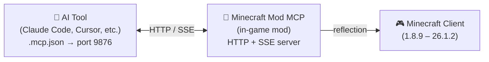

<!-- markdownlint-disable MD033 MD041 MD036 -->
<div align="center">


# Minecraft Mod MCP

**讓 AI 玩 Minecraft**

[](../../LICENSE-MIT)
[](https://www.java.com/)
[](https://github.com/langyo/minecraft-mod-mcp/releases)
[](https://www.npmjs.com/package/minecraft-mod-mcp)

**[English](../../README.md)** &bull; **[简体中文](../zhs/README.md)** &bull; **繁體中文** &bull; **[日本語](../ja/README.md)** &bull; **[한국어](../ko/README.md)** &bull; **[Français](../fr/README.md)** &bull; **[Español](../es/README.md)** &bull; **[Русский](../ru/README.md)**

</div>
<!-- markdownlint-enable MD033 MD041 MD036 -->

## 🤖 讓你的 AI 接入 Minecraft

**複製這個連結貼給你的 AI Agent——它會自動完成設定：**

```
https://github.com/langyo/minecraft-mod-mcp/blob/main/docs/guides/zht/AI-TOOLS.md
```

你的 AI 會自行閱讀指南、設定 MCP 連接，然後開始操控遊戲。無需手動設定。

> 已經安裝了模組？只需這一個連結就夠了。

---

## 什麼是 Minecraft Mod MCP

Minecraft Mod MCP 是一個讓 AI 助手操控 Minecraft 的模組。把它放入你的 `mods` 資料夾，啟動遊戲，你的 AI 就能看到遊戲畫面、點擊按鈕、輸入指令、與世界互動——全部透過標準的 MCP 協定。

- **觀察** —— 擷取帶有座標網格的螢幕截圖
- **操作** —— 點擊、輸入、滾動、拖曳及按下任意按鍵
- **了解** —— 查詢玩家位置、世界資訊、畫面按鈕及除錯欄位
- **記錄** —— 透過 SSE 即時串流事件、擷取影片幀

> 想要讓你的 AI 建造一座城堡？執行煙霧測試？操作模組包選單？Minecraft Mod MCP 讓這一切成為可能。

---

## 支援的版本

| MC 版本 | Forge | Fabric | NeoForge |
|------------|:-----:|:------:|:--------:|
| 1.8.9 | ✓ | — | — |
| 1.9.4 | ✓ | — | — |
| 1.10.2 | ✓ | — | — |
| 1.11.2 | ✓ | — | — |
| 1.12.2 | ✓ | — | — |
| 1.13.2 | ✓ | — | — |
| 1.14.4 | ✓ | 🚧 | — |
| 1.15.2 | ✓ | 🚧 | — |
| 1.16.5 | ✓ | 🚧 | — |
| 1.17.1 | ✓ | 🚧 | — |
| 1.18.2 | ✓ | 🚧 | — |
| 1.19.4 | ✓ | 🚧 | — |
| 1.20.6 | ✓ | 🚧 | 🚧 |
| 1.21.7 | ✓ | — | — |
| 26.1.2 | ✓ | — | 🚧 |

> 🚧 = 開發中

---

## 快速開始

### 1. 安裝模組

從 [GitHub Releases](https://github.com/langyo/minecraft-mod-mcp/releases) 下載 JAR 檔案，放入你的 Minecraft `mods` 資料夾。

- 需要 **Forge** / **Fabric** / **NeoForge**（見上方支援版本）
- 相容 Minecraft **1.8.9** 至 **26.1.2**

### 2. 安裝 MCP 橋接

```bash
npm install -g minecraft-mod-mcp
```

或無需安裝直接執行：

```bash
npx minecraft-mod-mcp
```

### 3. 啟動 Minecraft

透過你的模組載入器啟動遊戲。模組會自動在 9876 連接埠啟動 HTTP 伺服器。

### 4. 連接你的 AI

**[→ AI 工具整合指南](./AI-TOOLS.md)** —— 包含 Claude Code、Cursor、Cline、Copilot 等 20+ 工具的詳細設定步驟。

或者直接把這段連結貼給你的 AI Agent，讓它自動設定：

```
https://github.com/langyo/minecraft-mod-mcp/blob/main/docs/guides/zht/AI-TOOLS.md
```

---

## 運作原理



此模組在 Minecraft 內部於連接埠 9876 執行一個 HTTP 伺服器。你的 AI 工具透過標準的 MCP 協定（SSE 傳輸）連接，而每個指令——點擊、輸入、截圖等——都使用 Java 反射技術，無需針對特定版本編寫程式碼即可在所有 Minecraft 版本上運作。

---

## 從原始碼建置

> 本節面向貢獻者。如果你只想使用模組，請查看上方的[快速開始](#快速開始)。

詳見 [CONTRIBUTING.md](../../CONTRIBUTING.md)，了解開發環境搭建、專案結構和貢獻指南。

---

## 授權條款

依據以下任一授權條款：

- Apache License, Version 2.0（[LICENSE-APACHE](../../LICENSE-APACHE) 或 http://www.apache.org/licenses/LICENSE-2.0）
- MIT License（[LICENSE-MIT](../../LICENSE-MIT) 或 http://opensource.org/licenses/MIT）

任君選擇。
