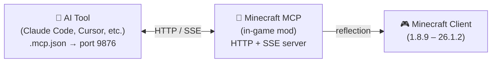

<!-- markdownlint-disable MD033 MD041 MD036 -->
<div align="center">


# Minecraft MCP

**讓 AI 玩 Minecraft — 控制任何版本、任何模組載入器**

[](../../LICENSE-MIT)
[](https://www.java.com/)
[](https://github.com/langyo/minecraft-mcp/releases)

**[English](../en/README.md)** &bull; **[简体中文](../zhs/README.md)** &bull; **繁體中文** &bull; **[日本語](../ja/README.md)** &bull; **[한국어](../ko/README.md)** &bull; **[Français](../fr/README.md)** &bull; **[Español](../es/README.md)** &bull; **[Русский](../ru/README.md)**

</div>
<!-- markdownlint-enable MD033 MD041 MD036 -->

## 什麼是 Minecraft MCP

Minecraft MCP 是 AI 助手與 Minecraft 之間的橋樑。它以遊戲內模組的方式執行，暴露一個 HTTP 伺服器，讓 AI 工具——**Claude Code、Cursor、Cline、GitHub Copilot 以及其他 20 多種**——能夠透過標準的 MCP 協定連接。透過這座橋樑，AI 可以觀察遊戲畫面、點擊按鈕、輸入指令，並與世界互動。

> 想要讓你的 AI 建造一座城堡？執行煙霧測試？操作模組包選單？Minecraft MCP 讓這一切成為可能。

- **觀察** — 擷取帶有座標網格的螢幕截圖
- **操作** — 點擊、輸入、滾動、拖曳及按下任意按鍵
- **了解** — 查詢玩家位置、世界資訊、畫面按鈕及除錯欄位
- **記錄** — 透過 SSE 即時串流事件、擷取影片幀

[AI 工具整合指南 →](./AI-TOOLS.md)

## 支援的版本

| MC 版本 | Forge | Fabric | NeoForge |
|------------|:-----:|:------:|:--------:|
| 1.8.9 | ✓ | | |
| 1.9.4 | ✓ | | |
| 1.10.2 | ✓ | | |
| 1.11.2 | ✓ | | |
| 1.12.2 | ✓ | | |
| 1.13.2 | ✓ | | |
| 1.14.4 | ✓ | 🚧 | |
| 1.15.2 | ✓ | 🚧 | |
| 1.16.5 | ✓ | 🚧 | |
| 1.17.1 | ✓ | 🚧 | |
| 1.18.2 | ✓ | 🚧 | |
| 1.19.4 | ✓ | 🚧 | |
| 1.20.6 | ✓ | 🚧 | 🚧 |
| 1.21.7 | ✓ | | |
| 26.1.2 | ✓ | | 🚧 |

> 🚧 = 開發中

## 快速開始

### 前置需求

- JDK 21（建議使用 Corretto）

### 設定與建置

```bash
# 安裝依賴
pip install -r scripts/requirements.txt

# 建置所有項目
just full
```

### 執行

```bash
# 啟動守護程序並執行 Minecraft
just daemon
just launch 1.21.7 forge

# 或執行端對端煙霧測試
just smoke 1.21.7
```

## 運作原理



此模組在 Minecraft 內部於連接埠 9876 執行一個 HTTP 伺服器。你的 AI 工具透過標準的 MCP 協定（SSE 傳輸）連接，而每個指令——點擊、輸入、截圖等——都使用 Java 反射技術，無需針對特定版本編寫程式碼即可在所有 Minecraft 版本上運作。

## 貢獻

歡迎提出 Issue 和 Pull Request。

## 授權條款

依據以下任一授權條款：

- Apache License, Version 2.0（[LICENSE-APACHE](../../LICENSE-APACHE) 或 http://www.apache.org/licenses/LICENSE-2.0）
- MIT License（[LICENSE-MIT](../../LICENSE-MIT) 或 http://opensource.org/licenses/MIT）

任君選擇。
