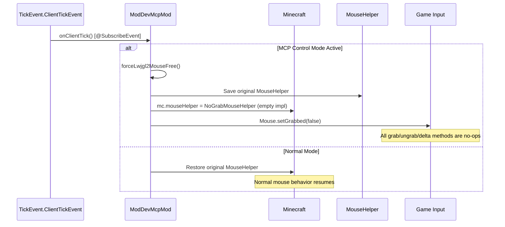
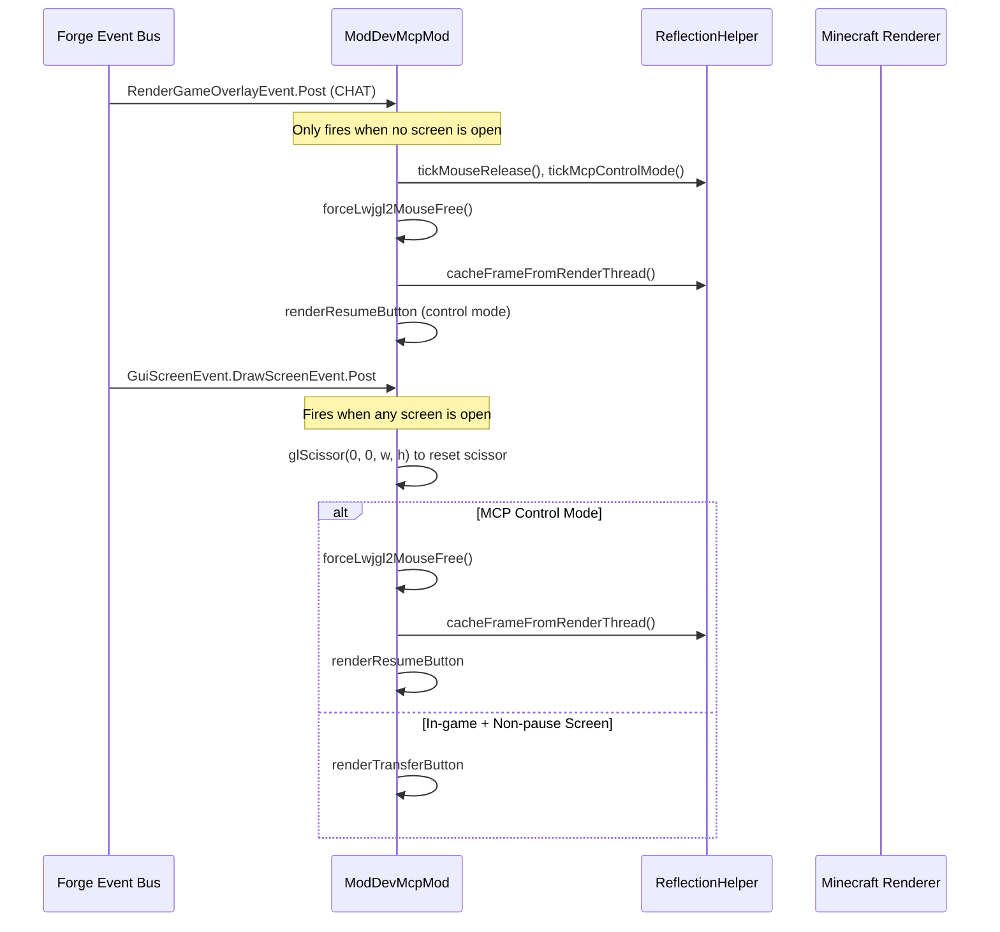
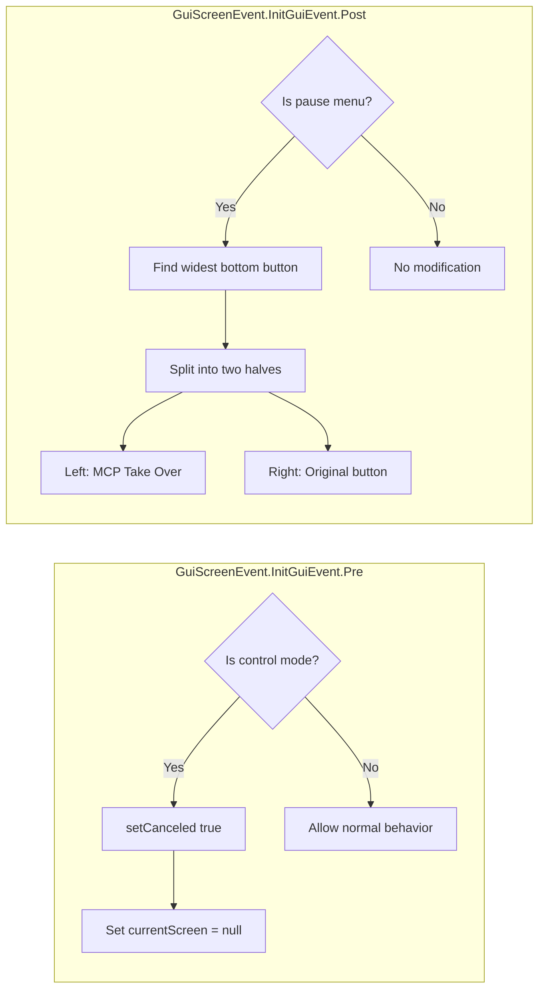

# Minecraft 1.11.2 Forge Injection Principle

[English](1.11.2+forge.md) | [中文](../zh-CN/1.11.2+forge.md)

## Overview

MCP Mod for Minecraft 1.11.2 Forge uses the **Forge Event Bus** system for injection. This is the legacy Forge era (ForgeGradle 2.x) which predates `mods.toml` and uses `@Mod.EventHandler` annotations instead. The injection relies entirely on `@SubscribeEvent` listeners and a custom `MouseHelper` replacement for input control. There are **no Mixins** and **no coremods** — everything is event-driven.

## Entry Point

The mod is declared via the `@Mod` annotation:

```java
@Mod(modid = "mcpmod", name = "ModDev MCP", version = "1.0")
public class ModDevMcpMod {
    @Mod.Instance("mcpmod")
    public static ModDevMcpMod instance;
```

There is **no `mods.toml`** — this was introduced in Forge 1.13+. The `@Mod` annotation alone registers the mod.

### Initialization

```java
@Mod.EventHandler
public void init(FMLInitializationEvent event) {
    INSTANCE = this;
    // Start HTTP server on background thread (5s delay)
    new Thread(() -> {
        Thread.sleep(5000);
        ReflectedInputHandler handler = new ReflectedInputHandler(...);
        httpServer = new McpHttpServer(handler, McpConfig.getServerPort());
        httpServer.start();
    }, "MCP-HTTP").start();
    
    // Register ALL event handlers on the MinecraftForge EVENT_BUS
    MinecraftForge.EVENT_BUS.register(this);
}
```

Key architectural difference from modern Forge: `MinecraftForge.EVENT_BUS.register(this)` registers the entire class instance, and all `@SubscribeEvent` methods are discovered via annotation scanning.

## Event Bus Injection

```mermaid
flowchart TD
    subgraph "Forge Mod Loading"
        MOD[@Mod annotation] --> INIT[init: FMLInitializationEvent]
        INIT --> BUS[MinecraftForge.EVENT_BUS.register]
    end
    subgraph "Registered Event Handlers"
        BUS --> E1[onGuiInitPre: GuiScreenEvent.InitGuiEvent.Pre]
        BUS --> E2[onGuiInit: GuiScreenEvent.InitGuiEvent.Post]
        BUS --> E3[onRenderOverlay: RenderGameOverlayEvent.Post]
        BUS --> E4[onDrawScreen: GuiScreenEvent.DrawScreenEvent.Post]
        BUS --> E5[onMouseInput: MouseEvent]
        BUS --> E6[onGuiMouseInputPre: GuiScreenEvent.MouseInputEvent.Pre]
        BUS --> E7[onClientTick: TickEvent.ClientTickEvent]
    end
    E3 -->|Chat layer| RENDER[Frame cache + resume button]
    E4 -->|Post draw| SCREEN[Transfer/resume buttons]
    E5 -->|Raw mouse| BLOCK_MOUSE[Block input in control mode]
    E7 -->|Every tick| TICK[Tick + force mouse free]
```

### Legacy Forge Event Categories

| Event | Phase | Purpose |
|-------|-------|---------|
| `GuiScreenEvent.InitGuiEvent.Pre` | Before screen init | Block pause screen in MCP control mode (`event.setCanceled(true)`) |
| `GuiScreenEvent.InitGuiEvent.Post` | After screen init | Patch pause screen to add "MCP Take Over" button |
| `RenderGameOverlayEvent.Post` | After HUD render (CHAT layer) | Frame caching + resume button rendering |
| `GuiScreenEvent.DrawScreenEvent.Post` | After screen draw | Transfer/resume button rendering |
| `MouseEvent` | Raw mouse input | Block mouse in control mode |
| `GuiScreenEvent.MouseInputEvent.Pre` | Screen mouse input | Block screen mouse in control mode |
| `TickEvent.ClientTickEvent` | Client tick (START + END) | Force mouse free, tick logic, video capture |

## Input Interception — MouseHelper Replacement (LWJGL2)

This is the **most distinctive feature** of legacy Forge injection. Since Minecraft 1.11.2 uses **LWJGL2** (not GLFW), the mouse is managed through `net.minecraft.util.MouseHelper` rather than GLFW callbacks.



### NoGrabMouseHelper

```java
private static class NoGrabMouseHelper extends net.minecraft.util.MouseHelper {
    @Override public void grabMouseCursor() {}        // No-op
    @Override public void ungrabMouseCursor() {        // Only un-grab
        try { Mouse.setGrabbed(false); } catch (Exception ignored) {}
    }
    @Override public void mouseXYChange() {            // Zero out deltas
        deltaX = 0;
        deltaY = 0;
    }
}
```

**How it works**:
1. When entering MCP control mode, the original `Minecraft.mouseHelper` is saved
2. A `NoGrabMouseHelper` instance replaces it — all grab/ungrab/delta methods are neutralized
3. `Mouse.setGrabbed(false)` forcibly releases the cursor from the game window
4. `Mouse.next()` is called in a loop to drain the LWJGL2 mouse event queue
5. When exiting control mode, the original `MouseHelper` is restored by direct field assignment

This is a **reflection-free field swap** — the `mouseHelper` field is public and directly accessible in these Minecraft versions.

## Render Pipeline



## Pause Screen Patching



The pause screen patching:
1. Finds the widest button with width >= 150 at the bottom of the pause screen via reflection over field lists
2. Splits it in half (with 8px gap)
3. Right half: retains the original button (e.g. "Return to Game")
4. Left half: adds a new "MCP Take Over" button that calls `ReflectionHelper.enterMcpControlMode()` then closes the screen

## Translation System (Legacy)

Unlike modern versions which use Minecraft's `Component.translatable()`, legacy Forge uses a manual translation map:

```java
private static Map<String, String> translations = new HashMap<>();
// Loads from /assets/mcpmod/lang/{{locale}}.lang via manual file I/O
```

## HTTP Server Bridge

```mermaid
flowchart LR
    AI[AI Agent] -->|HTTP JSON-RPC| HTTP[McpHttpServer :9876]
    HTTP --> MSG[McpMessageHandler]
    MSG --> RI[ReflectedInputHandler]
    RI --> RF[ReflectionHelper]
    RF --> GAME[Minecraft via Reflection]
    Note over RF: Uses ScaledResolution for coordinate mapping
```

## Version-Specific Notes

- **Forge 1.11.2** uses ForgeGradle 2.x and LWJGL2
- No `mods.toml` — uses `@Mod` annotation exclusively
- No Mixin support — purely event-driven
- `MouseHelper` field is **public** and directly replaceable
- Uses `Minecraft.getMinecraft()` (singleton) not `Minecraft.getInstance()`
- Uses `ScaledResolution` for coordinate mapping (not `Window.getGuiScaledWidth()`)
- Uses `Gui.drawRect()` for rectangle filling (not `DrawContext.fill()`)
- Uses `mc.ingameGUI` instead of `mc.gui`, `mc.fontRenderer` instead of `mc.font`
- `ClickEvent` uses `ClickEvent.Action.OPEN_URL` from legacy net.minecraft.util.text.event package
- **1.11.2**: Forge 1.11.2-13.20.1.2588, LWJGL 2.9.1, Java 8

## Key Differences from Modern Forge

| Feature | Legacy Forge (1.8-1.12) | Modern Forge (1.13+) |
|---------|------------------------|---------------------|
| Mod declaration | `@Mod` annotation only | `@Mod` + `mods.toml` |
| Event registration | `MinecraftForge.EVENT_BUS.register(this)` | `MinecraftForge.EVENT_BUS.addListener(lambda)` |
| Event handler discovery | `@SubscribeEvent` annotation scanning | Lambda registration in constructor |
| Mouse management | `MouseHelper` field swap (LWJGL2) | GLFW callback interceptor |
| Rendering API | `Gui.drawRect()`, `ScaledResolution` | `GuiGraphics.fill()` / `DrawContext` |
| Translation | Manual `.lang` file parser | `Component.translatable()` |
| Minecraft access | `Minecraft.getMinecraft()` | `Minecraft.getInstance()` |
| Login phase | `FMLInitializationEvent` | `FMLJavaModLoadingContext.get().getModEventBus()` |

## Key Files

| File | Role |
|------|------|
| `src/main/java/.../ModDevMcpMod.java` | Main mod class with all event handlers (~346 lines for 1.12.2) |
| `build.gradle` | ForgeGradle 2.x build configuration |
