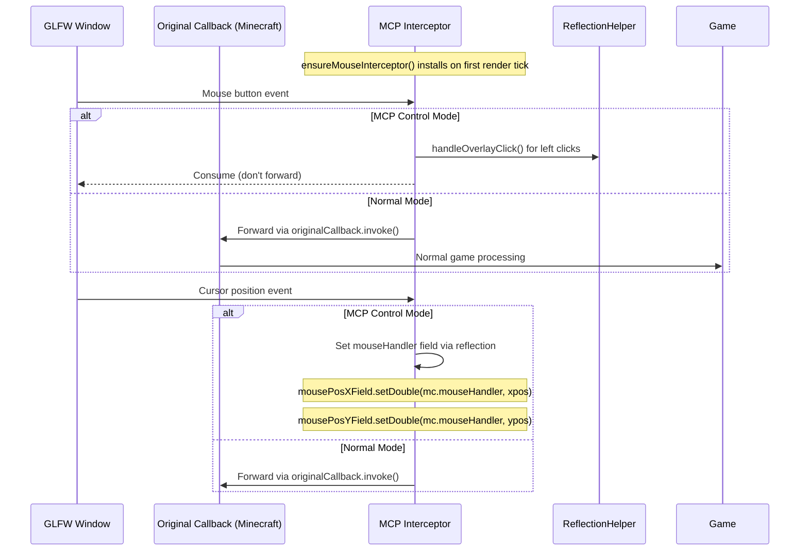
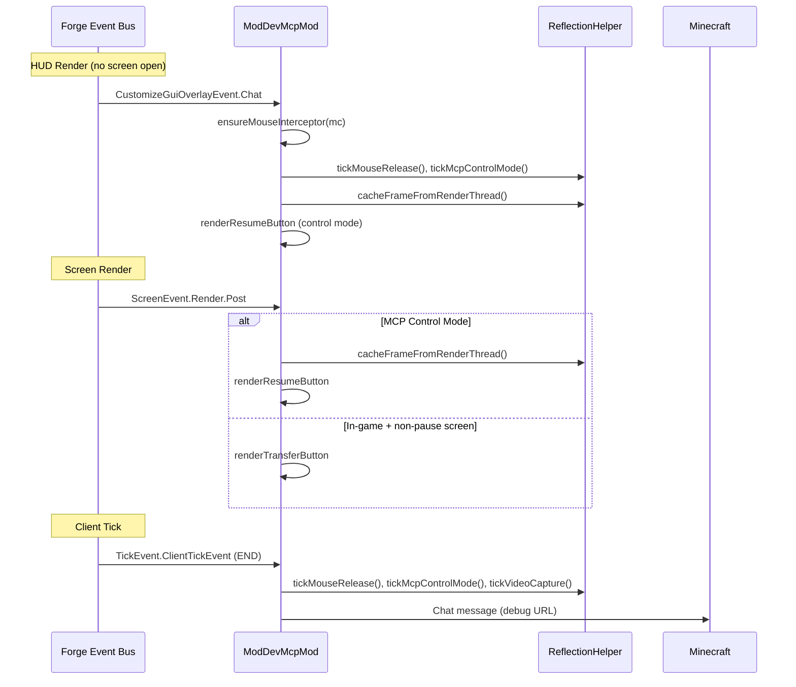
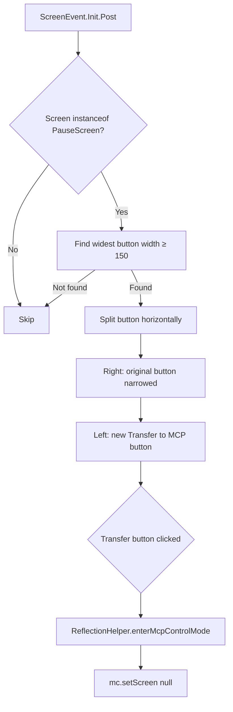
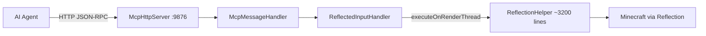

# Minecraft 1.13.2 Forge Injection Principle

[English](1.13.2+forge.md) | [中文](../zh-CN/1.13.2+forge.md)

## Overview

MCP Mod for Minecraft 1.13.2 Forge uses the **Forge Event Bus** system with **GLFW backends**. This is the modern Forge era (ForgeGradle 3+) which introduces `mods.toml`, lambda-based event registration via `FMLJavaModLoadingContext`, and GLFW mouse management. The transition from LWJGL2 to GLFW (which began in 1.13) fundamentally changes how mouse input is handled — replacing the `MouseHelper` field swap pattern with GLFW callback interception.

## Entry Point

### mods.toml

```toml
modLoader="javafml"
loaderVersion="[25,)"
license="MIT"

[[mods]]
modId="mcpmod"
version="0.1.0"
displayName="ModDev MCP"
```

### Mod Class Constructor

```java
@Mod("mcpmod")
public class ModDevMcpMod {
    public ModDevMcpMod() {
        INSTANCE = this;
        
        // Modern way: register on mod event bus via FMLJavaModLoadingContext
        FMLJavaModLoadingContext.get().getModEventBus().addListener(this::setup);
        
        // Start HTTP server (background thread, 5s delay)
        new Thread("MCP-HTTP") { ... }.start();
        
        // Register game event listeners via LAMBDAS
        MinecraftForge.EVENT_BUS.addListener((ScreenEvent.Opening event) -> { ... });
        MinecraftForge.EVENT_BUS.addListener((ScreenEvent.Init.Post event) -> { ... });
        // ... etc
    }
}
```

Key differences from legacy Forge:
1. **`mods.toml`** file is required (located at `META-INF/mods.toml`)
2. **Lambda-based registration** instead of `@SubscribeEvent` annotations — each event handler is an explicit lambda in the constructor
3. **`FMLJavaModLoadingContext`** for mod lifecycle events
4. **GLFW** replaces LWJGL2 for window/mouse management

## Event Bus Injection (Minecraft 1.13-1.17)

```mermaid
flowchart TD
    subgraph "Forge Mod Loading"
        MOD[@Mod annotation] --> CTR[Constructor]
        CTR --> FML[FMLJavaModLoadingContext.getModEventBus]
    end
    subgraph "Event Handlers (all in constructor)"
        CTR --> E1[ScreenEvent.Opening]
        CTR --> E2[ScreenEvent.Init.Post]
        CTR --> E3[CustomizeGuiOverlayEvent.Chat]
        CTR --> E4[ScreenEvent.Render.Post]
        CTR --> E5[InputEvent.MouseButton.Pre]
        CTR --> E6[TickEvent.ClientTickEvent]
    end
    E1 --> BLOCK_PAUSE[Block pause screen in control mode]
    E2 --> PATCH[Patch pause screen with MCP button]
    E3 --> HUD[HUD: frame cache + resume button + GLFW intercept]
    E4 --> SCREEN[Screen: transfer/resume buttons]
    E5 --> MOUSE[Input: intercept mouse in control mode]
    E6 --> TICK[Tick: video + chat + mouse release]
```

### Registered Event Handlers

| Event | Purpose |
|-------|---------|
| `ScreenEvent.Opening` | Block pause screen opening in MCP control mode (`event.setCanceled(true)`) |
| `ScreenEvent.Init.Post` | After screen init: find widest pause button, split in half, add MCP transfer button |
| `CustomizeGuiOverlayEvent.Chat` | HUD render layer: cache frame, render resume button, ensure GLFW mouse interceptor |
| `ScreenEvent.Render.Post` | After screen render: render transfer or resume buttons on non-pause screens |
| `InputEvent.MouseButton.Pre` | Before mouse processing: intercept clicks in control mode, handle overlay clicks |
| `TickEvent.ClientTickEvent` | Client tick (END phase): tick logic, chat message, video capture |

## GLFW Mouse Callback Interception

This is the **key architectural difference** from legacy Forge. Since 1.13, Minecraft uses GLFW, which means mouse input goes through callbacks registered via `GLFW.glfwSetMouseButtonCallback()` and `GLFW.glfwSetCursorPosCallback()`.

**NOTE**: In 1.13.2 specifically, the GLFW mouse interceptor was **not yet implemented**. This transitional version relies solely on event cancellation (e.g., `ScreenEvent.Opening.setCanceled(true)`) to block input. The full GLFW callback interceptor (`ensureMouseInterceptor()`) was introduced starting from 1.14.4.



**How `ensureMouseInterceptor()` works** (1.14.4-1.17.1):
1. On first HUD render tick, the interceptor is installed lazily
2. `GLFW.glfwSetMouseButtonCallback()` replaces the GLFW-level mouse button callback
3. `GLFW.glfwSetCursorPosCallback()` replaces the GLFW-level cursor position callback
4. The original callbacks are saved and forwarded to in normal mode
5. In MCP control mode, events are consumed without forwarding
6. Cursor position is still updated via reflection (so Minecraft knows where the cursor is but can't use it for gameplay)

## Render Pipeline



## Pause Screen Button Patching



The pause screen is patched by:
1. Finding the widest AbstractWidget with width >= 150 using reflection over childList fields
2. Setting the original button to occupy the right half (with 8px gap)
3. Adding a new Button.builder() on the left half labeled "Transfer to MCP" / "MCP Take Over"
4. The new button's onClick calls ReflectionHelper.enterMcpControlMode() and closes the screen

## HTTP Server Architecture



The HTTP server starts 5 seconds after mod initialization (to ensure Minecraft is fully loaded).

## Version-Specific Notes

- **1.13.2**: Forge 25.0.223, Java 8. First GLFW-based version (transitional). Simpler mouse handling — relies on event cancellation, not GLFW callback interception. No `ensureMouseInterceptor()`.
- **1.14.4**: Forge 28.2.28, Java 8. GLFW mouse interceptor introduced. Uses `GuiGraphics` for rendering.
- **1.15.2**: Forge 31.2.60, Java 8. ForgeGradle 6.0+.
- **1.16.5**: Forge 36.2.34, Java 8. Stable modern Forge.
- **1.17.1**: Forge 37.1.1, Java 16. Depth-based rendering changes begin.

## Key Differences: Legacy vs Modern Forge

| Feature | Legacy (1.8-1.12) | Modern (1.13+) |
|---------|-------------------|----------------|
| Window system | LWJGL2 | GLFW |
| Mod metadata | `@Mod` only | `@Mod` + `mods.toml` |
| Event registration | `@SubscribeEvent` + `.register(this)` | Lambda in constructor |
| Mouse control | `MouseHelper` field swap | GLFW callback interceptor |
| Mouse grabbed state | `Mouse.setGrabbed(false)` | `GLFW.glfwSetInputMode(..., GLFW_CURSOR, GLFW_CURSOR_NORMAL)` |
| Rendering | `Gui.drawRect()` | `GuiGraphics.fill()` |
| Minecraft access | `Minecraft.getMinecraft()` | `Minecraft.getInstance()` |
| Translation | Manual `.lang` parsing | `Component.translatable()` |
| Screen fields | `mc.currentScreen` | `mc.screen` |

## Key Files

| File | Role |
|------|------|
| `src/main/resources/META-INF/mods.toml` | Forge mod metadata |
| `src/main/java/.../ModDevMcpMod.java` | Main mod class with all event listeners (~250-300 lines) |
| `build.gradle` | ForgeGradle build configuration |
