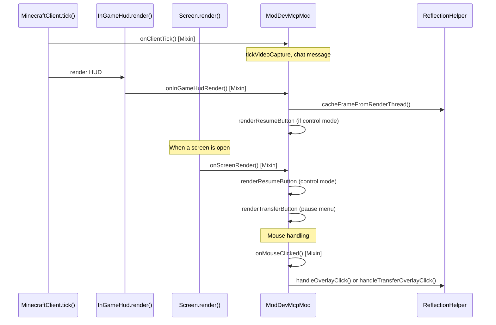
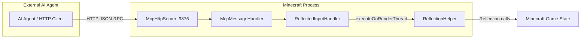

# Minecraft 1.15.2 Fabric Injection Principle

[English](1.15.2+fabric.md) | [中文](../zh-CN/1.15.2+fabric.md)

## Overview

MCP Mod for Minecraft 1.15.2 Fabric uses **SpongePowered Mixin** bytecode injection to hook into the vanilla Minecraft client rendering loop and input handling. The Mixin framework applies compile-time bytecode weaving via the Fabric Loader, redirecting method calls through annotated mixin classes.

## Entry Point

The Fabric mod is loaded through `fabric.mod.json` which declares:

```json
{
  "entrypoints": {
    "client": ["xyz.langyo.minecraft.mcp.mod.ModDevMcpMod"]
  },
  "mixins": ["mcpmod.mixins.json"]
}
```

The `ModDevMcpMod` class implements `ClientModInitializer`. Fabric Loader calls `onInitializeClient()` during client startup, which:
1. Spawns a background thread (`MCP-HTTP`) that waits 5 seconds then starts `McpHttpServer` on port 9876
2. The HTTP server hosts `/api/screenshot`, `/api/cmd`, `/api/events` (SSE), `/api/calls`, `/api/status`, `/debug`

## Mixin Configuration

`mcpmod.mixins.json` for this version:

```json
{
  "required": true,
  "package": "xyz.langyo.minecraft.mcp.mod.mixin",
  "compatibilityLevel": "JAVA_8",
  "client": [
    "InGameHudMixin",
    "ScreenMixin",
    "MouseMixin",
    "MinecraftClientMixin"
  ],
  "injectors": { "defaultRequire": 1 }
}
```

## Mixin Hooks

```mermaid
flowchart TD
    subgraph "Fabric Loader Bootstrap"
        FL[Fabric Loader] --> CI[ClientModInitializer.onInitializeClient]
    end
    subgraph "Mixin Weaving"
        MI[Mixin Config] --> M1[InGameHudMixin]
        MI --> M2[ScreenMixin]
        MI --> M3[MouseMixin]
        MI --> M4[MinecraftClientMixin]
    end
    subgraph "Injection Targets"
        T1[InGameHud.render]
        T2[Screen.render]
        T3[Mouse.onMouseButton]
        T4[MinecraftClient.tick]
    end
    M1 -->|@Inject TAIL| T1
    M2 -->|@Inject TAIL| T2
    M3 -->|@Inject HEAD cancellable| T3
    M4 -->|@Inject TAIL| T4
    T1 --> CO[Cache frame + render overlay buttons]
    T2 --> SR[Render transfer/resume buttons on GUI screens]
    T3 --> II[Intercept mouse input in MCP control mode]
    T4 --> TR[Tick logic: video capture, mouse release, chat send]
```

### InGameHudMixin

```java
@Mixin(InGameHud.class)
public class InGameHudMixin {
    @Inject(method = "render", at = @At("TAIL"))
    private void onRender(DrawContext ctx, float tickDelta, CallbackInfo ci) {
        ModDevMcpMod.INSTANCE.onInGameHudRender(ctx, tickDelta);
    }
}
```

**Purpose**: Injects after the HUD render to:
- Cache the OpenGL frame buffer for screenshot API (`ReflectionHelper.cacheFrameFromRenderThread`)
- Render the "Resume Manual Control" button when in MCP control mode
- Tick mouse release and control mode state

### ScreenMixin

```java
@Mixin(Screen.class)
public class ScreenMixin {
    @Inject(method = "render", at = @At("TAIL"))
    private void onRender(DrawContext ctx, int mouseX, int mouseY, float delta, CallbackInfo ci) {
        ModDevMcpMod.INSTANCE.onScreenRender(ctx, (Screen)(Object)this, mouseX, mouseY, delta);
    }
}
```

**Purpose**: Injects after any screen render to:
- Display "Resume Manual Control" button during MCP control mode on any screen
- Display "MCP Take Over" / "Transfer to MCP" button on non-pause screens during gameplay
- Cache frames during control mode for the screenshot API

### MouseMixin

```java
@Mixin(Mouse.class)
public class MouseMixin {
    @Inject(method = "onMouseButton", at = @At("HEAD"), cancellable = true)
    private void onMouseButton(long window, int button, int action, int mods, CallbackInfo ci) {
        if (ModDevMcpMod.INSTANCE.onMouseClicked(mouse, button, action)) {
            ci.cancel();
        }
    }
}
```

**Purpose**: Intercepts raw GLFW mouse events at the `Mouse` class level:
- In MCP control mode: blocks all mouse events from reaching the game, routes clicks to `ReflectionHelper.handleOverlayClick` for the overlay button
- On screens with transfer overlay: routes clicks on the "Transfer to MCP" button to `ReflectionHelper.handleTransferOverlayClick`
- Suppresses all input when `shouldSuppressInput()` is true

### MinecraftClientMixin

```java
@Mixin(MinecraftClient.class)
public class MinecraftClientMixin {
    @Inject(method = "tick", at = @At("TAIL"))
    private void onTick(CallbackInfo ci) {
        ModDevMcpMod.INSTANCE.onClientTick();
    }
}
```

**Purpose**: Injects after the main game loop tick to:
- Tick video capture state (`ReflectionHelper.tickVideoCapture`)
- Handle overlay mouse polling via `GLFW.glfwGetMouseButton` for direct HUD overlay clicks
- Send the debug URL chat message once on first tick

## Render Pipeline



## Input Interception

In MCP control mode, the `MouseMixin` cancels the GLFW callback at `Mouse.onMouseButton`:
1. `MouseMixin.onMouseButton` fires at `@HEAD` before the game processes the click
2. If in MCP control mode, `ci.cancel()` prevents the game from processing the input
3. Clicks on the "Resume" overlay button exit control mode
4. The Fabric 1.14.4-1.18.2 approach targets `Mouse.onMouseButton()` directly -- in 1.19.4+ this changes to `MouseClickMixin` targeting `ParentElement.mouseClicked`

## HTTP Server Bridge



## Version-Specific Notes

- **Java 8** (but Java 16 compile): Version 1.15.2 uses `JAVA_8` compatibility level with Java 16 compilation
- Uses `MouseMixin` targeting `Mouse.onMouseButton()` -- this is the pre-1.19.4 approach
- Fabric Loader: 0.11.3

## Key Files

| File | Role |
|------|------|
| `src/main/resources/fabric.mod.json` | Fabric mod manifest - declares entrypoint and mixin config |
| `src/main/resources/mcpmod.mixins.json` | Mixin configuration - lists mixin classes and Java compatibility |
| `src/main/java/.../mixin/InGameHudMixin.java` | Mixin for HUD render hook |
| `src/main/java/.../mixin/ScreenMixin.java` | Mixin for GUI screen render hook |
| `src/main/java/.../mixin/MouseMixin.java` | Mixin for mouse input interception (pre-1.19.4) |
| `src/main/java/.../mixin/MinecraftClientMixin.java` | Mixin for game tick hook |
| `src/main/java/.../ModDevMcpMod.java` | ClientModInitializer entrypoint (~180 lines) |
