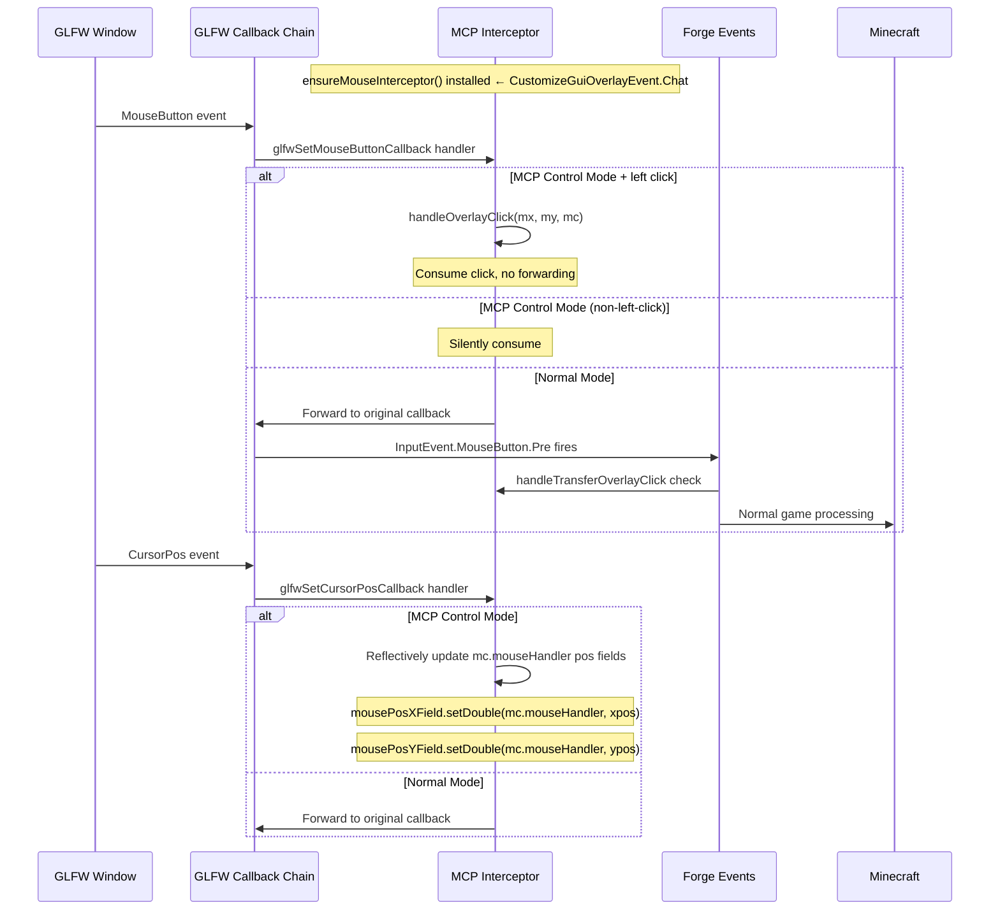
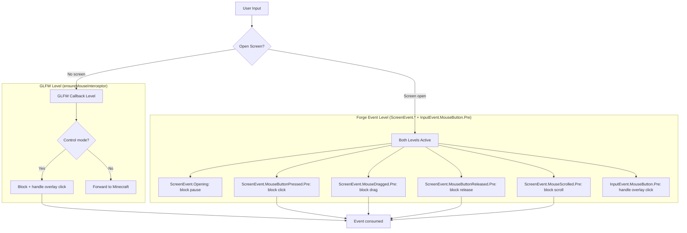
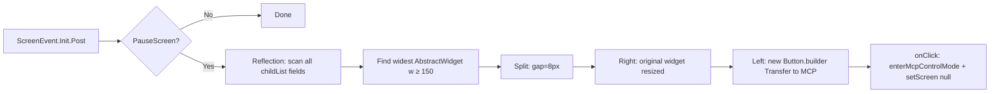

# Minecraft 1.18.2 Forge Injection Principle

[English](1.18.2+forge.md) | [中文](../zh-CN/1.18.2+forge.md)

## Overview

MCP Mod for Minecraft 1.18.2 Forge uses the **Forge Event Bus** system with **GLFW callback interception** for full mouse control. This is the mature modern Forge era (ForgeGradle 6.x) with `mods.toml`, lambda-based event registration, and comprehensive GLFW-level mouse management. Version 1.18.2 represents the most complex Forge injection implementation due to the comprehensive mouse input interception system.

## Entry Point

### mods.toml

```toml
modLoader="javafml"
loaderVersion="[50,)"
license="MIT"

[[mods]]
modId="mcpmod"
version="0.1.0"
displayName="ModDev MCP"
```

### Mod Class Constructor

```java
@Mod("mcpmod")
public class ModDevMcpMod {
    public ModDevMcpMod() {
        INSTANCE = this;
        FMLJavaModLoadingContext.get().getModEventBus().addListener(this::setup);
        
        // HTTP server on background thread (5s delay)
        new Thread("MCP-HTTP") { ... }.start();
        
        // All game event listeners registered as lambdas in constructor:
        MinecraftForge.EVENT_BUS.addListener((ScreenEvent.Opening event) -> { ... });
        MinecraftForge.EVENT_BUS.addListener((ScreenEvent.Init.Post event) -> { ... });
        MinecraftForge.EVENT_BUS.addListener((CustomizeGuiOverlayEvent.Chat event) -> { ... });
        MinecraftForge.EVENT_BUS.addListener((ScreenEvent.Render.Post event) -> { ... });
        MinecraftForge.EVENT_BUS.addListener((ScreenEvent.MouseButtonPressed.Pre event) -> { ... });
        MinecraftForge.EVENT_BUS.addListener((ScreenEvent.MouseDragged.Pre event) -> { ... });
        MinecraftForge.EVENT_BUS.addListener((ScreenEvent.MouseButtonReleased.Pre event) -> { ... });
        MinecraftForge.EVENT_BUS.addListener((ScreenEvent.MouseScrolled.Pre event) -> { ... });
        MinecraftForge.EVENT_BUS.addListener((InputEvent.MouseButton.Pre event) -> { ... });
        MinecraftForge.EVENT_BUS.addListener((TickEvent.ClientTickEvent event) -> { ... });
    }
}
```

## Complete Event Handler Map

```mermaid
flowchart TD
    subgraph "Forge Event Bus - 1.18.2"
        CTR[Mod Constructor] --> FML[FMLJavaModLoadingContext]
    end
    
    subgraph "Screen Lifecycle"
        OPEN[ScreenEvent.Opening] -->|Block pause in control mode| B1[setCanceled true]
        INIT[ScreenEvent.Init.Post] -->|Patch pause screen| B2[Add Transfer button]
    end
    
    subgraph "HUD Rendering"
        CHAT[CustomizeGuiOverlayEvent.Chat] -->|HUD layer| H1[ensureMouseInterceptor]
        CHAT --> H2[tickMouseRelease + tickMcpControlMode]
        CHAT --> H3[cacheFrameFromRenderThread]
        CHAT --> H4[renderResumeButton in control mode]
    end
    
    subgraph "Screen Rendering"
        RPOST[ScreenEvent.Render.Post] -->|After screen draw| S1[cacheFrame in control mode]
        RPOST --> S2[renderResumeButton or renderTransferButton]
    end
    
    subgraph "Screen Mouse Events"
        MPRE[ScreenEvent.MouseButtonPressed.Pre] -->|Control mode only| M1[handleOverlayClick + setCanceled]
        MDRA[ScreenEvent.MouseDragged.Pre] -->|Control mode| M2[setCanceled true]
        MREL[ScreenEvent.MouseButtonReleased.Pre] -->|Control mode| M3[setCanceled true]
        MSCRL[ScreenEvent.MouseScrolled.Pre] -->|Control mode| M4[setCanceled true]
    end
    
    subgraph "Raw Input"
        IPRE[InputEvent.MouseButton.Pre] -->|All mouse| I1[Check shouldSuppressInput]
        IPRE --> I2[handleOverlayClick in control mode]
        IPRE --> I3[handleTransferOverlayClick on screens]
    end
    
    subgraph "Game Tick"
        TICK[TickEvent.ClientTickEvent END] -->|Every tick| T1[tickMouseRelease + tickMcpControlMode]
        TICK --> T2[tickVideoCapture]
        TICK --> T3[Send chat debug URL message once]
    end
```



### Full Event Handler List

| Event | Priority | Purpose |
|-------|----------|---------|
| `ScreenEvent.Opening` | - | Cancel pause screen opening in MCP control mode |
| `ScreenEvent.Init.Post` | - | Find widest pause button, split in half, add MCP transfer button |
| `CustomizeGuiOverlayEvent.Chat` | CHAT layer | HUD: frame cache, resume button, ensure GLFW mouse interceptor |
| `ScreenEvent.Render.Post` | POST | Screen overlay: transfer/resume buttons |
| `ScreenEvent.MouseButtonPressed.Pre` | PRE | Block screen mouse clicks in control mode |
| `ScreenEvent.MouseDragged.Pre` | PRE | Block drag in control mode |
| `ScreenEvent.MouseButtonReleased.Pre` | PRE | Block release in control mode |
| `ScreenEvent.MouseScrolled.Pre` | PRE | Block scroll in control mode |
| `InputEvent.MouseButton.Pre` | PRE | Raw mouse button intercept (game + screen) |
| `TickEvent.ClientTickEvent` | END | Per-tick logic, video capture, chat message |

## GLFW Mouse Callback Interception (Advanced)

This version has the **most comprehensive mouse interception** — combining GLFW callback hijacking with Forge event cancellation.



### GLFW Interceptor Implementation

```java
private static void ensureMouseInterceptor(Minecraft mc) {
    if (mouseInterceptorInstalled) return;
    
    long handle = mc.getWindow().getWindow();
    
    // Replace mouse button callback
    originalMouseButtonCallback = GLFW.glfwSetMouseButtonCallback(handle, (window, button, action, mods) -> {
        if (ReflectionHelper.isMcpControlMode()) {
            if (button == 0 && action == 1) {  // Left click release
                double mx = getMouseX(mc);
                double my = getMouseY(mc);
                ReflectionHelper.handleOverlayClick((int)mx, (int)my, mc);
            }
            return;  // Consume: don't forward to game
        }
        if (originalMouseButtonCallback != null) {
            originalMouseButtonCallback.invoke(window, button, action, mods);
        }
    });
    
    // Replace cursor position callback
    originalCursorCallback = GLFW.glfwSetCursorPosCallback(handle, (window, xpos, ypos) -> {
        if (ReflectionHelper.isMcpControlMode()) {
            // Silently update position fields via reflection
            // so Minecraft knows cursor position but can't process it
            mousePosXField.setDouble(mc.mouseHandler, xpos);
            mousePosYField.setDouble(mc.mouseHandler, ypos);
            return;
        }
        if (originalCursorCallback != null) {
            originalCursorCallback.invoke(window, xpos, ypos);
        }
    });
    
    // Find the double fields in MouseHandler by type inspection
    // (field names vary across versions)
    for (Field f : mc.mouseHandler.getClass().getDeclaredFields()) {
        if (f.getType() == double.class) {
            if (firstDouble == null) firstDouble = f;
            else { secondDouble = f; break; }
        }
    }
    mouseInterceptorInstalled = true;
}
```

**Key design choices**:
1. **Lazy installation** — interceptor installed on first HUD render tick (not in constructor)
2. **Two levels of interception** — GLFW callback hijacking (for in-game/inventory) + Forge screen events (for GUI screens)
3. **Cursor position passthrough** — cursor position fields are updated silently via reflection so the game doesn't think the mouse is frozen
4. **Original callback saving** — the chain is preserved so normal mode works correctly

## Two-Tier Input Blocking Architecture



## Pause Screen Patching



Uses `ScreenEvent.Init.Post` with `event.getScreen()` and `event.addListener(transferBtn)` to add the button.

## HTTP Server Architecture

```mermaid
flowchart LR
    AI[AI Agent] -->|HTTP| HTTP[McpHttpServer :9876]
    HTTP --> MSG[McpMessageHandler]
    MSG --> RI[ReflectedInputHandler]
    RI -->|RenderThread| RF[ReflectionHelper]
    RF --> GAME[Minecraft State via Reflection]
    
    HTTP --> SSE[SSE /api/events]
    HTTP --> SS[/api/screenshot]
    HTTP --> CMD[/api/cmd]
    HTTP --> STATUS[/api/status]
```

## Version-Specific Notes

- **1.18.2**: Forge 40.2.0, Java 17. Same architecture as 1.20.6 but on Java 17.

## Key Files

| File | Role |
|------|------|
| `src/main/resources/META-INF/mods.toml` | Mod metadata (required) |
| `src/main/java/.../ModDevMcpMod.java` | Main class with all event listeners (~250-303 lines depending on version) |
| `build.gradle` | ForgeGradle 6.x configuration |
