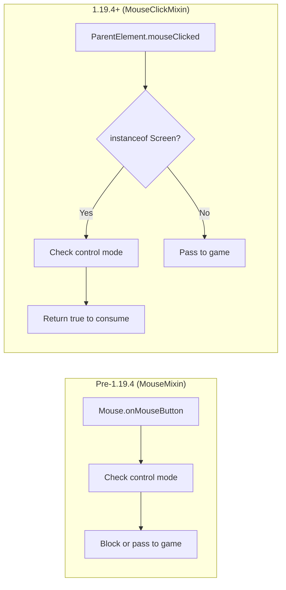
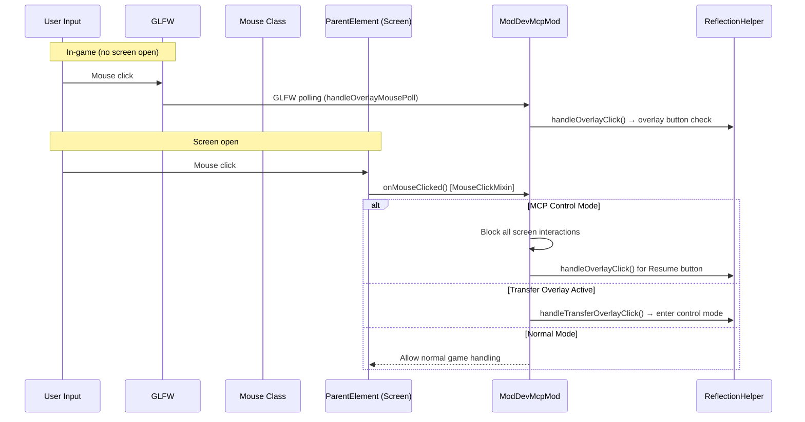
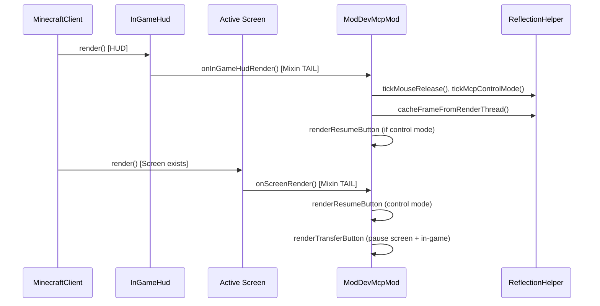

# Minecraft 1.19.4 Fabric Injection Principle

[English](1.19.4+fabric.md) | [中文](../zh-CN/1.19.4+fabric.md)

## Overview

MCP Mod for Minecraft 1.19.4 Fabric uses **SpongePowered Mixin** bytecode injection to hook into the vanilla Minecraft client. This version introduces the `MouseClickMixin` pattern (replacing the older `MouseMixin`) which targets `ParentElement.mouseClicked()` instead of `Mouse.onMouseButton()`.

## Entry Point

The Fabric mod is loaded through `fabric.mod.json`:

```json
{
  "schemaVersion": 1,
  "id": "mcpmod",
  "version": "0.1.0",
  "name": "ModDev MCP",
  "environment": "client",
  "entrypoints": {
    "client": ["xyz.langyo.minecraft.mcp.mod.ModDevMcpMod"]
  },
  "mixins": ["mcpmod.mixins.json"]
}
```

The `ModDevMcpMod` implements `ClientModInitializer`. In `onInitializeClient()`:
1. Stores `INSTANCE` reference
2. Spawns `MCP-HTTP` background thread (5-second delay then starts McpHttpServer on port 9876)
3. Prints debug URL to stdout

## Mixin Configuration

`mcpmod.mixins.json` for 1.19.4:

```json
{
  "required": true,
  "package": "xyz.langyo.minecraft.mcp.mod.mixin",
  "compatibilityLevel": "JAVA_17",
  "client": [
    "InGameHudMixin",
    "ScreenMixin",
    "MouseClickMixin",
    "MinecraftClientMixin"
  ],
  "injectors": { "defaultRequire": 1 }
}
```

## Mixin Hooks

```mermaid
flowchart TD
    subgraph "Fabric Loader Bootstrap"
        FL[Fabric Loader] --> CI[ClientModInitializer.onInitializeClient]
    end
    subgraph "Mixin Weaving (1.19.4)"
        MI[Mixin Config] --> M1[InGameHudMixin]
        MI --> M2[ScreenMixin]
        MI --> M3[MouseClickMixin]
        MI --> M4[MinecraftClientMixin]
    end
    subgraph "Injection Targets"
        T1[InGameHud.render]
        T2[Screen.render]
        T3[ParentElement.mouseClicked]
        T4[MinecraftClient.tick]
    end
    M1 -->|@Inject TAIL| T1
    M2 -->|@Inject TAIL| T2
    M3 -->|@Inject HEAD cancellable| T3
    M4 -->|@Inject TAIL| T4
    T1 --> CO[Cache GL framebuffer + render overlay]
    T2 --> SR[Render transfer/resume buttons]
    T3 --> II[Screen-level mouse interception]
    T4 --> TR[Tick: video, mouse release, chat]
```

### InGameHudMixin

```java
@Mixin(InGameHud.class)
public class InGameHudMixin {
    @Inject(method = "render", at = @At("TAIL"))
    private void onRender(DrawContext context, float tickDelta, CallbackInfo ci) {
        ModDevMcpMod.INSTANCE.onInGameHudRender(context, tickDelta);
    }
}
```

Hooks into `InGameHud.render()` at TAIL to:
- Cache OpenGL framebuffer for `/api/screenshot`
- Tick mouse release and MCP control mode
- Render "Resume Manual Control" overlay button in control mode
- Skip rendering when `mc.currentScreen != null`

### ScreenMixin

```java
@Mixin(Screen.class)
public class ScreenMixin {
    @Inject(method = "render", at = @At("TAIL"))
    private void onRender(DrawContext ctx, int mouseX, int mouseY, float delta, CallbackInfo ci) {
        ModDevMcpMod.INSTANCE.onScreenRender(ctx, (Screen)(Object)this, mouseX, mouseY, delta);
    }
}
```

Hooks into all screen rendering at TAIL to:
- Display "Resume Manual Control" button on any screen during control mode
- Display "Transfer to MCP" button on non-pause screens when in-game
- Cache frames during control mode

### MouseClickMixin (NEW in 1.19.4+)

```java
@Mixin(ParentElement.class)
public interface MouseClickMixin {
    @Inject(method = "mouseClicked", at = @At("HEAD"), cancellable = true)
    default void onMouseClicked(double mouseX, double mouseY, int button, CallbackInfoReturnable<Boolean> cir) {
        var self = (Object) this;
        if (self instanceof Screen) {
            double[] pos = new double[]{mouseX, mouseY};
            if (ModDevMcpMod.INSTANCE != null && ModDevMcpMod.INSTANCE.onMouseClicked(pos)) {
                cir.setReturnValue(true);
            }
        }
    }
}
```

**Key innovation**: This is an **interface mixin** targeting `ParentElement` (which all `Screen` implementations extend). This is a more elegant architecture because:
- It targets the abstract GUI element hierarchy rather than the raw input layer
- It only fires when the click target is a `Screen` instance (not in-game mouse)
- It returns `true` to signal the click was handled (consuming the event)
- This replaced `MouseMixin.onMouseButton` which targeted the low-level `Mouse` class

### MinecraftClientMixin

```java
@Mixin(MinecraftClient.class)
public class MinecraftClientMixin {
    @Inject(method = "tick", at = @At("TAIL"))
    private void onTick(CallbackInfo ci) {
        ModDevMcpMod.INSTANCE.onClientTick();
    }
}
```

Injects after `MinecraftClient.tick()` to:
- Tick video capture (`ReflectionHelper.tickVideoCapture`)
- Poll overlay mouse via `GLFW.glfwGetMouseButton` (handles HUD overlay clicks outside screens)
- Send debug URL chat message on first tick
- Track previous left-button state for edge detection (`prevLeftPressed` tracking)

## MouseClickMixin vs MouseMixin Comparison



**Advantages of MouseClickMixin**:
1. **Interface mixin** — no need to extend concrete class, works on all Screen implementations
2. **Targets GUI layer** — only intercepts screen clicks, not raw game mouse events
3. **Cleaner event consumption** — returns boolean instead of calling `ci.cancel()`
4. **Context-aware** — only fires on Screen instances via `instanceof` check

## Input Interception Flow



## Render Pipeline



## HTTP Server Architecture

```mermaid
flowchart LR
    subgraph "AI Agent"
        AI[External Process]
    end
    subgraph "Minecraft JVM"
        HTTP[McpHttpServer :9876]
        MSG[McpMessageHandler]
        RI[ReflectedInputHandler]
        RF[ReflectionHelper core ~3200 lines]
        MIX[Mixin Hooks]
    end
    AI -->|JSON-RPC over HTTP| HTTP
    HTTP --> MSG
    MSG --> RI
    RI -->|RenderThread.execute| RF
    RF -->|GL readbacks + reflection| GAME[Minecraft State]
    MIX -->|@Inject callbacks| MOD[ModDevMcpMod]
    MOD --> RF
    RF -.->|SSE events| HTTP
```

## Version-Specific Notes

- **Java 17**: Both 1.19.4 and 1.20.6+ use `JAVA_17` compatibility level (though 1.20.6 actually compiles with Java 21)
- **MouseClickMixin**: The key architectural change from 1.18.2 to 1.19.4. Targets `ParentElement.mouseClicked()` instead of `Mouse.onMouseButton()`
- **1.19.4**: Fabric Loader 0.15.6, Java 17 compile
- **1.20.6**: Fabric Loader 0.16.0, Java 21 compile, uses `ParentElement` interface mixin
- **1.20.6**: Updated API for chat components — uses `Component.translatable()` and `ClickEvent.Action.OPEN_URL`

## Key Files

| File | Role |
|------|------|
| `src/main/resources/fabric.mod.json` | Declares ClientModInitializer entrypoint + mixin config |
| `src/main/resources/mcpmod.mixins.json` | Mixin configuration (JAVA_17) |
| `src/main/java/.../mixin/InGameHudMixin.java` | HUD render tail injection |
| `src/main/java/.../mixin/ScreenMixin.java` | Screen render tail injection |
| `src/main/java/.../mixin/MouseClickMixin.java` | ParentElement interface mixin for mouse interception |
| `src/main/java/.../mixin/MinecraftClientMixin.java` | Client tick tail injection |
| `src/main/java/.../ModDevMcpMod.java` | ClientModInitializer (~180 lines) |
