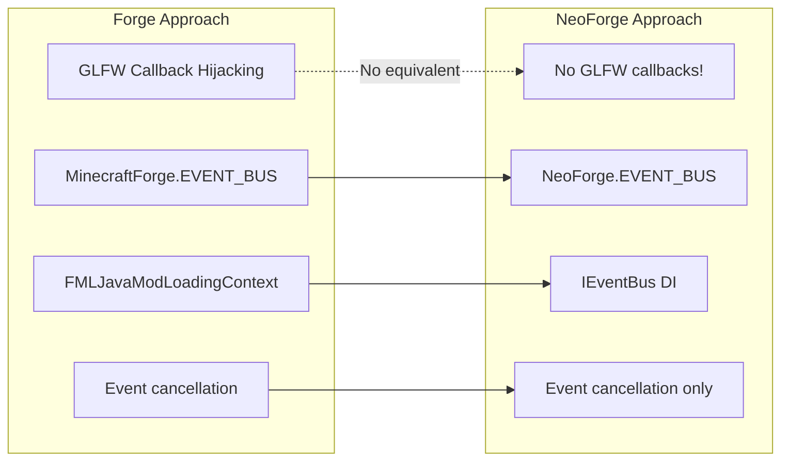
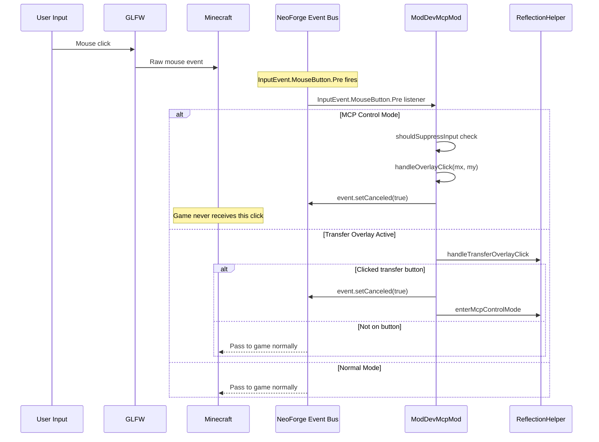
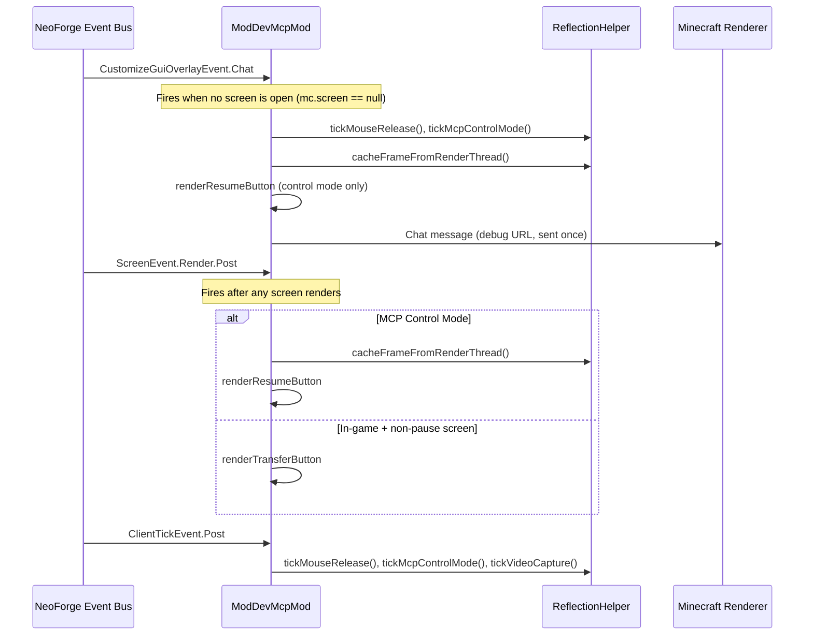
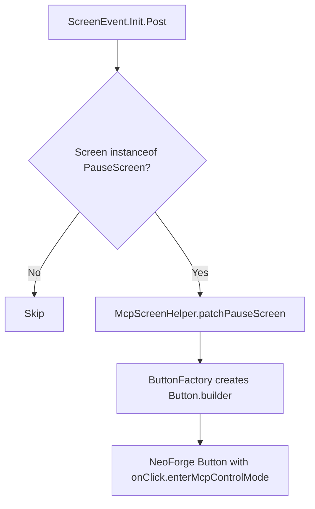
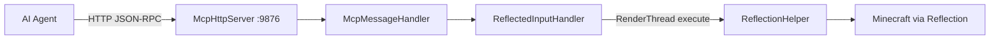

# Minecraft 1.20.6 NeoForge Injection Principle

[English](1.20.6+neoforge.md) | [中文](../zh-CN/1.20.6+neoforge.md)

## Overview

MCP Mod for Minecraft 1.20.6 NeoForge uses the **NeoForge Event Bus** system with **pure event-driven injection** — no Mixins, no GLFW callback hijacking. Unlike Forge, NeoForge relies entirely on event cancellation through its `IEventBus` dependency injection pattern. This makes the injection cleaner but means mouse control is limited to what events can cancel.

## Entry Point

### neoforge.mods.toml

```toml
modLoader="javafml"
loaderVersion="[4,)"
license="MIT"

[[mods]]
modId="mcpmod"
version="1.0.0"
displayName="ModDev MCP"
```

**NOTE**: NeoForge uses `neoforge.mods.toml` (not `mods.toml` like Forge).

### Mod Class with Dependency Injection

```java
@Mod("mcpmod")
public class ModDevMcpMod {
    public ModDevMcpMod(IEventBus modBus) {  // IEventBus injected by NeoForge
        INSTANCE = this;
        
        // Mod lifecycle event
        modBus.addListener(this::setup);
        
        // HTTP server on background thread (5s delay)
        new Thread("MCP-HTTP") { ... }.start();
        
        // Register game event listeners via NeoForge.EVENT_BUS:
        NeoForge.EVENT_BUS.addListener((ScreenEvent.Init.Post event) -> { ... });
        NeoForge.EVENT_BUS.addListener((CustomizeGuiOverlayEvent.Chat event) -> { ... });
        NeoForge.EVENT_BUS.addListener((ScreenEvent.Render.Post event) -> { ... });
        NeoForge.EVENT_BUS.addListener((InputEvent.MouseButton.Pre event) -> { ... });
        NeoForge.EVENT_BUS.addListener((ClientTickEvent.Post event) -> { ... });
    }
}
```

**Key NeoForge differences from Forge**:
1. **Dependency Injection**: Constructor receives `IEventBus modBus` — no `FMLJavaModLoadingContext`
2. **`NeoForge.EVENT_BUS`** instead of `MinecraftForge.EVENT_BUS` (different package: `net.neoforged.neoforge.common.NeoForge`)
3. **`ClientTickEvent.Post`** instead of `TickEvent.ClientTickEvent` — NeoForge has its own tick event hierarchy
4. **No GLFW callback interception** — purely event-based input blocking
5. **`neoforge.mods.toml`** instead of `mods.toml`

## Event Handler Architecture

```mermaid
flowchart TD
    subgraph "NeoForge DI System"
        MOD[@Mod annotation] --> CTR[Constructor:IEventBus modBus]
        CTR --> MODBUS[modBus.addListener]
        CTR --> NEOBUS[NeoForge.EVENT_BUS.addListener]
    end
    
    subgraph "Registered Event Handlers"
        NEOBUS --> E1[ScreenEvent.Init.Post]
        NEOBUS --> E2[CustomizeGuiOverlayEvent.Chat]
        NEOBUS --> E3[ScreenEvent.Render.Post]
        NEOBUS --> E4[InputEvent.MouseButton.Pre]
        NEOBUS --> E5[ClientTickEvent.Post]
    end
    
    E1 -->|Pause screen| PATCH[Patch with MCP Take Over button]
    E2 -->|HUD| TICK[tickMouseRelease + tickMcpControlMode]
    E2 -->|HUD| CACHE[cacheFrameFromRenderThread]
    E2 -->|HUD| RESUME[renderResumeButton]
    E3 -->|Screen| SR_BUTTONS[renderResume/Transfer buttons]
    E4 -->|Input| INPUT[shouldSuppressInput + overlay click + transfer click]
    E5 -->|Tick| TICK_ALL[tickMouseRelease + tickMcpControlMode + tickVideoCapture + chat]
```

### Event Handler Details

| Event (NeoForge) | Equivalent (Forge) | Purpose |
|-----------------|-------------------|---------|
| `ScreenEvent.Init.Post` | `ScreenEvent.Init.Post` | Patch pause screen with MCP button |
| `CustomizeGuiOverlayEvent.Chat` | `CustomizeGuiOverlayEvent.Chat` | HUD: frame cache, resume button, tick logic |
| `ScreenEvent.Render.Post` | `ScreenEvent.Render.Post` | Screen overlay buttons |
| `InputEvent.MouseButton.Pre` | `InputEvent.MouseButton.Pre` | Mouse input interception |
| `ClientTickEvent.Post` | `TickEvent.ClientTickEvent` | Per-tick logic + chat message |

## NeoForge vs Forge: Injection Comparison



**Why NeoForge doesn't need GLFW hooks**: NeoForge's event system provides more comprehensive input events that can be canceled at higher levels. By canceling `InputEvent.MouseButton.Pre`, all mouse processing in the game is stopped — no need for GLFW-level interception.

## Input Interception (Pure Event Approach)



The key advantage of this approach: it's **simpler** (no GLFW callback management) but has the limitation that it cannot control the mouse cursor position independently — it can only block events, not redirect cursor movement.

## Render Pipeline



## Pause Screen Patching



In NeoForge, the `McpScreenHelper.patchPauseScreen()` method works the same as Forge but uses NeoForge's `Button.builder()`:

```java
NeoForge.EVENT_BUS.addListener((ScreenEvent.Init.Post event) -> {
    if (event.getScreen() instanceof PauseScreen pauseScreen) {
        McpScreenHelper.patchPauseScreen(pauseScreen, new McpScreenHelper.ButtonFactory() {
            @Override public Object createButton(String translationKey, Runnable onClick, int x, int y, int w, int h) {
                return Button.builder(Component.translatable(translationKey), btn -> onClick.run())
                    .bounds(x, y, w, h).build();
            }
        });
    }
});
```

## HTTP Server Architecture



## Version-Specific Details

- **NeoForge 20.6.139**, Minecraft 1.20.6, NeoGradle 2.0.141, Java 21
- **No GLFW callback interception** — this is the cleaner NeoForge approach. All mouse control is done through `InputEvent.MouseButton.Pre` cancellation.
- Only 5 event handlers (minimum set): Screen init, HUD overlay, screen render, mouse input, client tick
- No screen-level mouse events needed (`MouseButtonPressed.Pre`, `MouseDragged.Pre`, etc.) because the single `InputEvent.MouseButton.Pre` cancellation blocks everything
- `ModDevMcpMod` is only 171 lines — significantly shorter than the Forge equivalent (303 lines)
- Uses standard `GuiGraphics` (not `GuiGraphicsExtractor`)
- `McpScreenHelper.patchPauseScreen()` is used for pause screen patching (shared utility)
- Chat messages sent directly via `mc.gui.getChat().addMessage(Component)`

## Key Differences: NeoForge vs Forge Summary

| Feature | Forge 1.20.6 | NeoForge 1.20.6 |
|---------|-------------|------------------------|
| Mod metadata | `mods.toml` | `neoforge.mods.toml` |
| Constructor | No params + `FMLJavaModLoadingContext` | `IEventBus modBus` parameter |
| Event bus | `MinecraftForge.EVENT_BUS` | `NeoForge.EVENT_BUS` |
| Tick event | `TickEvent.ClientTickEvent` | `ClientTickEvent.Post` |
| Mouse strategy | GLFW callback hijacking + events | Events only (no GLFW) |
| Package prefix | `net.minecraftforge.*` | `net.neoforged.neoforge.*` |
| Rendering class | `GuiGraphics` (1.20.6) / `GuiGraphicsExtractor` (26.1.2) | `GuiGraphics` |
| Keyboard intercept | Not used | Not implemented |
| Chat send | Direct `mc.gui.getChat().addMessage()` | Direct `mc.gui.getChat().addMessage(Component)` call |

## Key Files

| File | Role |
|------|------|
| `src/main/resources/META-INF/neoforge.mods.toml` | NeoForge mod metadata |
| `src/main/java/.../ModDevMcpMod.java` | Main mod class (~171-207 lines) |
| `build.gradle` | NeoGradle 2.0.141 configuration |
