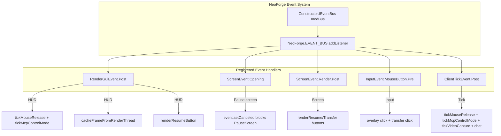
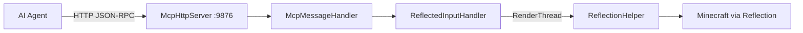

# Minecraft 1.21.11 NeoForge Injection Notes

[English](1.21.11+neoforge.md) | [中文](../zh-CN/1.21.11+neoforge.md)

## Overview

MCP Mod for Minecraft 1.21.11 NeoForge uses the **NeoForge Event Bus** with **pure event-driven injection** — no Mixin, no GLFW callback hijacking. The architecture matches 26.1.2 NeoForge but uses `GuiGraphics` (not 26.x's `GuiGraphicsExtractor`). API changes in 1.21.11 include `Window.handle()` (replacing `getWindow()`) and `ClickEvent.OpenUrl` (replacing `ClickEvent(Action.OPEN_URL, url)`).

## Entry Point

### neoforge.mods.toml

```toml
modLoader="javafml"
loaderVersion="[3,)"
license="MIT"

[[mods]]
modId="mcpmod"
version="0.1.0"
displayName="ModDev MCP"
```

### Mod Class with Dependency Injection

```java
@Mod("mcpmod")
public class ModDevMcpMod {
    public ModDevMcpMod(IEventBus modBus) {
        INSTANCE = this;
        
        new Thread("MCP-HTTP") { ... }.start();
        
        NeoForge.EVENT_BUS.addListener((RenderGuiEvent.Post event) -> { ... });
        NeoForge.EVENT_BUS.addListener((ScreenEvent.Opening event) -> { ... });
        NeoForge.EVENT_BUS.addListener((ScreenEvent.Render.Post event) -> { ... });
        NeoForge.EVENT_BUS.addListener((InputEvent.MouseButton.Pre event) -> { ... });
        NeoForge.EVENT_BUS.addListener((ClientTickEvent.Post event) -> { ... });
    }
}
```

## Event Handler Architecture



### Event Handler Details

| Event | Purpose |
|-------|---------|
| `RenderGuiEvent.Post` | HUD: frame cache, resume button, tick logic |
| `ScreenEvent.Opening` | Block PauseScreen from opening (in control mode) |
| `ScreenEvent.Render.Post` | Screen overlay buttons |
| `InputEvent.MouseButton.Pre` | Mouse input interception |
| `ClientTickEvent.Post` | Per-tick logic + chat message |

## Differences from 26.1.2 NeoForge

| Feature | 26.1.2 NeoForge | 1.21.11 NeoForge |
|---------|----------------|-----------------|
| Rendering class | `GuiGraphicsExtractor` | `GuiGraphics` |
| Window handle | `getWindow().handle()` | `getWindow().handle()` (same) |
| ClickEvent | `ClickEvent.OpenUrl(URI)` | `ClickEvent.OpenUrl(URI)` (same) |
| Font rendering | Reflective `drawInBatch()` | Direct `g.drawString()` |
| Chat sending | Reflective `addMessage()` | Direct `mc.gui.getChat().addMessage()` |
| HUD event | `CustomizeGuiOverlayEvent.Chat` | `RenderGuiEvent.Post` |
| Pause screen | `ScreenEvent.Opening` cancel | `ScreenEvent.Opening` cancel (same) |

**Note**: 1.21.11 uses official Mojang mappings, so direct API calls work without reflection. 26.1.2 also uses official mappings but uses `GuiGraphicsExtractor` (an MC 26.x API change).

## HTTP Server Architecture



## Version-Specific Details

- **NeoForge 21.11.42**, Java 21, NeoGradle 2.0.141
- Uses **`GuiGraphics`** (not 26.x's `GuiGraphicsExtractor`)
- `Window.handle()` replaces `Window.getWindow()` (MC 1.21.11 API change)
- `ClickEvent.OpenUrl(java.net.URI)` replaces `ClickEvent(Action.OPEN_URL, url)` (MC 1.21.11 API change)
- Uses `RenderGuiEvent.Post` instead of `CustomizeGuiOverlayEvent.Chat` (avoids scissor clipping)
- Pause screen blocked via `ScreenEvent.Opening` + `event.setCanceled(true)` (no flash)
- Direct `g.drawString(mc.font, ...)` call, no reflection needed
- Direct `mc.gui.getChat().addMessage(msg)` call, no reflection needed
- 200 lines total

## Known Limitations

### Left-click cannot break blocks in MCP control mode

In MCP control mode (3D first-person view), left-clicks are consumed by the `InputEvent.MouseButton.Pre` event handler for overlay button interaction and are not forwarded to Minecraft's block breaking logic. This means block breaking and entity attacking do not work via left-click during MCP control.

**Cause**: NeoForge's `InputEvent.MouseButton.Pre` cancellation mechanism fully prevents the game from receiving the click event. Forwarding non-overlay clicks causes cursor state inconsistency (the game attempts to switch to cursor-visible mode), leading to unpredictable behavior.

**Impact**: This issue is consistent with the Forge version. In MCP control mode, right-click works normally; left-click is only used for overlay buttons (resume manual control). To break blocks under MCP control, use HTTP API commands (`press_key` / `left_click`).

## Key Files

| File | Role |
|------|------|
| `src/main/resources/META-INF/neoforge.mods.toml` | NeoForge mod metadata |
| `src/main/java/.../ModDevMcpMod.java` | Main mod class (~200 lines) |
| `build.gradle` | NeoGradle 2.0.141 configuration |
