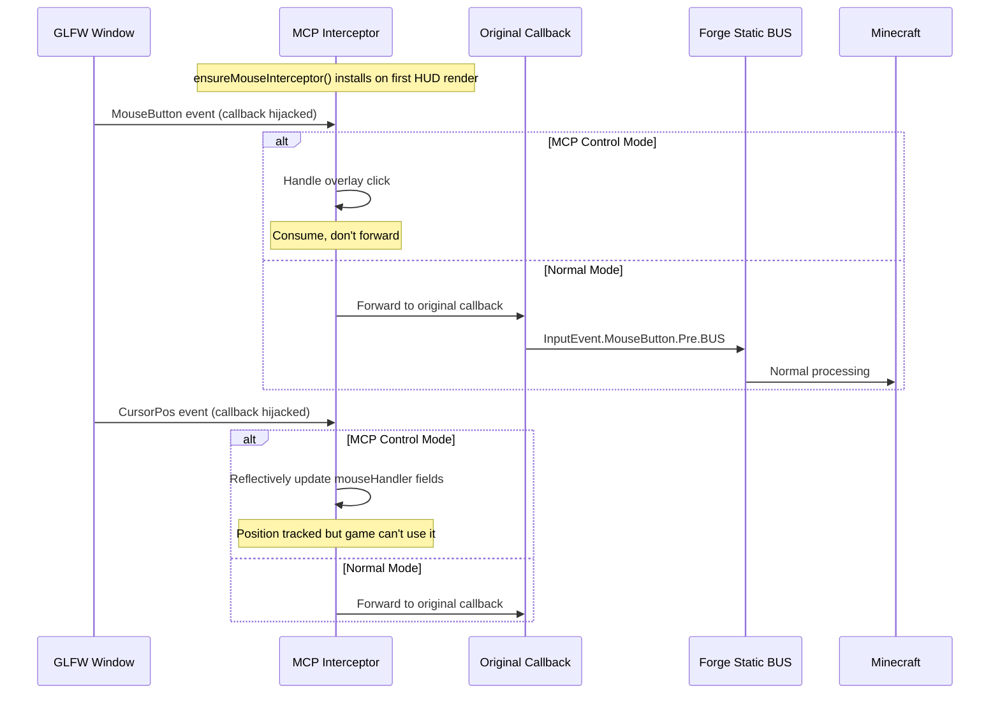
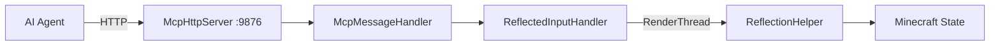

# Minecraft 1.21.7 Forge Injection Principle

[English](1.21.7+forge.md) | [中文](../zh-CN/1.21.7+forge.md)

## Overview

MCP Mod for Minecraft 1.21.7 Forge uses the **Forge Event Bus** with the **new static BUS API**. This is the newest Forge era (ForgeGradle 7+) which introduces static event bus references (e.g., `ScreenEvent.Opening.BUS`) replacing the deprecated `FMLJavaModLoadingContext` approach. This represents a significant API modernization in the injection pipeline.

## Entry Point

### mods.toml

```toml
modLoader="javafml"
loaderVersion="[7.0.23,8)"
license="MIT"

[[mods]]
modId="mcpmod"
version="1.0.0"
displayName="ModDev MCP"
```

### Mod Class Constructor (New Static BUS API)

```java
@Mod("mcpmod")
public class ModDevMcpMod {
    public ModDevMcpMod() {
        INSTANCE = this;
        
        // NOTE: No FMLJavaModLoadingContext! Uses new static BUS references.
        
        // HTTP server on background thread
        new Thread("MCP-HTTP") { ... }.start();
        
        // Static BUS references with lambda listeners:
        ScreenEvent.Opening.BUS.addListener(event -> { ... });
        ScreenEvent.Init.Post.BUS.addListener(event -> { ... });
        CustomizeGuiOverlayEvent.Chat.BUS.addListener(event -> { ... });
        ScreenEvent.Render.Post.BUS.addListener(event -> { ... });
        ScreenEvent.MouseButtonPressed.Pre.BUS.addListener(event -> { ... });
        ScreenEvent.MouseDragged.Pre.BUS.addListener(event -> { ... });
        ScreenEvent.MouseButtonReleased.Pre.BUS.addListener(event -> { ... });
        ScreenEvent.MouseScrolled.Pre.BUS.addListener(event -> { ... });
        InputEvent.MouseButton.Pre.BUS.addListener(event -> { ... });
        TickEvent.ClientTickEvent.BUS.addListener(event -> { ... });
    }
}
```

## Static BUS API vs. Old API

```mermaid
flowchart LR
    subgraph "Old API (1.13-1.20)"
        OLD_FML[FMLJavaModLoadingContext.get().getModEventBus()]
        OLD_FORGE[MinecraftForge.EVENT_BUS.addListener]
    end
    subgraph "New Static BUS API (1.21+)"
        NEW_SO[ScreenEvent.Opening.BUS]
        NEW_SI[ScreenEvent.Init.Post.BUS]
        NEW_CO[CustomizeGuiOverlayEvent.Chat.BUS]
        NEW_SR[ScreenEvent.Render.Post.BUS]
        NEW_IM[InputEvent.MouseButton.Pre.BUS]
        NEW_TC[TickEvent.ClientTickEvent.BUS]
    end
    
    OLD_FORGE -- "Deprecated" --> NEW_SO & NEW_SI & NEW_CO & NEW_SR & NEW_IM & NEW_TC
```

**Key change**: Each event class now defines its own static `BUS` field. Instead of one global `MinecraftForge.EVENT_BUS`, events are registered directly on their specific bus. This allows:
1. Better compile-time type safety
2. Easier IDE support (autocomplete on `.BUS`)
3. No dependency on `MinecraftForge.EVENT_BUS` for these events
4. Listener return types matter — `boolean` return can cancel the event (new pattern)

### Boolean Return Pattern

In the new API, some BUS listeners return a boolean instead of calling `event.setCanceled(true)`:

```java
// Old API (1.20.6):
MinecraftForge.EVENT_BUS.addListener((ScreenEvent.MouseButtonPressed.Pre event) -> {
    if (controlMode) {
        event.setCanceled(true);  // Side-effect
    }
});

// New API (1.21.7):
ScreenEvent.MouseButtonPressed.Pre.BUS.addListener(event -> {
    if (controlMode) {
        return true;  // Return value signals cancellation
    }
    return false;
});
```

## Complete Event Handler Map

```mermaid
flowchart TD
    subgraph "Forge Static BUS API - 1.21.7"
        CTR[Mod Constructor] --> SO[ScreenEvent.Opening.BUS]
        CTR --> SI[ScreenEvent.Init.Post.BUS]
        CTR --> CO[CustomizeGuiOverlayEvent.Chat.BUS]
        CTR --> SR[ScreenEvent.Render.Post.BUS]
        CTR --> SM[ScreenEvent.MouseButtonPressed.Pre.BUS]
        CTR --> SD[ScreenEvent.MouseDragged.Pre.BUS]
        CTR --> SRB[ScreenEvent.MouseButtonReleased.Pre.BUS]
        CTR --> SS[ScreenEvent.MouseScrolled.Pre.BUS]
        CTR --> IM[InputEvent.MouseButton.Pre.BUS]
        CTR --> TC[TickEvent.ClientTickEvent.BUS]
    end
    
    SO -->|Control mode| BLOCK[Block pause screen via setNewScreen null]
    SI -->|Pause screen| PATCH[Patch with MCP Take Over button]
    
    subgraph "HUD Layer"
        CO --> ENSURE[ensureMouseInterceptor: GLFW callbacks]
        CO --> TICK[tickMouseRelease + tickMcpControlMode]
        CO --> CACHE[cacheFrameFromRenderThread]
        CO --> RESUME[renderResumeButton]
    end
    
    subgraph "Screen Overlay"
        SR --> SRB_CACHE[cacheFrame in control mode]
        SR --> SRB_BTN[renderResume or renderTransfer button]
    end
    
    subgraph "Input Blocking"
        SM -->|return true| SM_BLOCK[Block screen clicks]
        SD -->|return true| SD_BLOCK[Block screen drags]
        SRB -->|return true| SRB_BLOCK[Block screen releases]
        SS -->|return true| SS_BLOCK[Block screen scrolls]
        IM --> IM_LOGIC[shouldSuppressInput + overlay click + transfer click]
    end
    
    TC --> TC_TICK[tickMouseRelease + tickMcpControlMode + tickVideoCapture]
    TC --> TC_CHAT[Chat debug URL message]
```



## GLFW Mouse Callback Interception

Same GLFW callback interception pattern as 1.20.6. The `ensureMouseInterceptor()` method saves the original `GLFWMouseButtonCallbackI` and `GLFWCursorPosCallbackI`, replaces them with MCP handlers, and finds the `double` fields in `MouseHandler` via type introspection.



## Pause Screen Patching

Same approach as 1.20.6 but uses new API:
```java
ScreenEvent.Init.Post.BUS.addListener(event -> {
    if (event.getScreen() instanceof PauseScreen) {
        // Find widest button, split, add MCP button
        event.addListener(transferBtn);  // Modern API uses addListener()
    }
});
```

## HTTP Server Bridge



## Version-Specific Details

Forge 57.0.2, ForgeGradle 7.0.23+, Java 21. Uses official Mojang mappings. The static BUS API is the defining feature of this version. `ScreenEvent.Opening` uses `event.getNewScreen()` and `event.setNewScreen(null)` instead of `getScreen()`/`setCanceled()`. `InputEvent.MouseButton.Pre.BUS` listeners return boolean (true = cancel). 294 lines in ModDevMcpMod. `ClickEvent.OpenUrl` requires a `java.net.URI` object.

## Known Limitations

### Left-click blocked in MCP control mode

While in MCP control mode, all left-clicks (button 0) are consumed by the GLFW interceptor and never forwarded to Minecraft's original callback. This means attack, block placement, and other left-click actions do not work during MCP control. Right-click is unaffected and works normally.

**Cause**: 1.21.7 Forge's static `BUS` API causes dual event handling with the GLFW callback. If non-overlay left-clicks are forwarded to MC's original callback, the cursor teleports to the center and triggers unpredictable state transitions (e.g., auto-exiting MCP then re-entering). To ensure overlay button clicks (resume/menu) remain stable, the current implementation fully blocks left-clicks during MCP control.

**Impact**: In MCP control mode, right-click works normally; left-click is only used for overlay buttons (resume manual control / open system menu).

## Key Differences Summary

| Feature | Old Forge (1.20.6) | New Forge (1.21.7+) |
|---------|-------------------|---------------------|
| Event registration | `MinecraftForge.EVENT_BUS.addListener()` | `EventClass.SubEvent.BUS.addListener()` |
| Mod lifecycle | `FMLJavaModLoadingContext.get()` | Not used (deprecated) |
| Cancel pattern | `event.setCanceled(true)` | `return true` (boolean) |
| Pause screen blocking | `event.setCanceled(true)` + manual screen close | `event.setNewScreen(null)` |
| ClickEvent | `ClickEvent.Action.OPEN_URL` | `ClickEvent.OpenUrl(URI)` |

## Key Files

| File | Role |
|------|------|
| `src/main/resources/META-INF/mods.toml` | Mod metadata |
| `src/main/java/.../ModDevMcpMod.java` | Main mod class (~280-294 lines) |
| `build.gradle` | ForgeGradle 7.x configuration |
