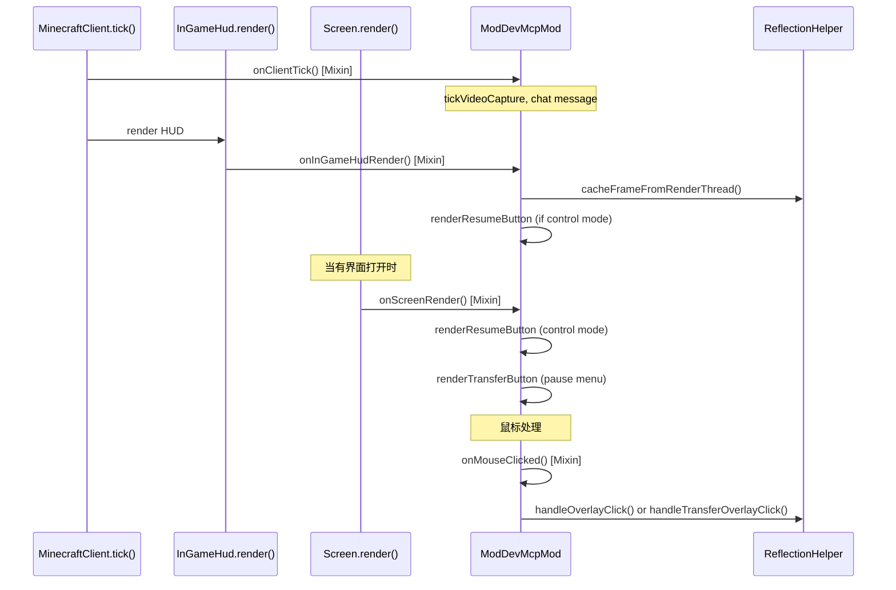
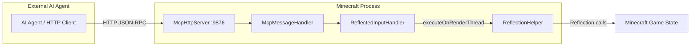

# Minecraft 1.17.1 Fabric 注入原理

[English](../en/1.17.1+fabric.md) | [中文](1.17.1+fabric.md)

## 概述

Minecraft 1.17.1 Fabric 的 MCP 模组使用 **SpongePowered Mixin** 字节码注入来挂钩原版 Minecraft 客户端的渲染循环和输入处理。Mixin 框架通过 Fabric Loader 在编译期进行字节码织入，通过带注解的混入类将方法调用重定向。

## 入口点

Fabric 模组通过 `fabric.mod.json` 加载，声明如下：

```json
{
  "entrypoints": {
    "client": ["xyz.langyo.minecraft.mcp.mod.ModDevMcpMod"]
  },
  "mixins": ["mcpmod.mixins.json"]
}
```

`ModDevMcpMod` 类实现了 `ClientModInitializer`。Fabric Loader 在客户端启动时调用 `onInitializeClient()`，执行以下操作：
1. 生成一个后台线程（`MCP-HTTP`），等待 5 秒后在 9876 端口启动 `McpHttpServer`
2. HTTP 服务器托管 `/api/screenshot`、`/api/cmd`、`/api/events`（SSE）、`/api/calls`、`/api/status`、`/debug` 端点

## Mixin 配置

此版本的 `mcpmod.mixins.json`：

```json
{
  "required": true,
  "package": "xyz.langyo.minecraft.mcp.mod.mixin",
  "compatibilityLevel": "JAVA_16",
  "client": [
    "InGameHudMixin",
    "ScreenMixin",
    "MouseMixin",
    "MinecraftClientMixin"
  ],
  "injectors": { "defaultRequire": 1 }
}
```

## Mixin 钩子

```mermaid
flowchart TD
    subgraph "Fabric Loader Bootstrap"
        FL[Fabric Loader] --> CI[ClientModInitializer.onInitializeClient]
    end
    subgraph "Mixin Weaving"
        MI[Mixin Config] --> M1[InGameHudMixin]
        MI --> M2[ScreenMixin]
        MI --> M3[MouseMixin]
        MI --> M4[MinecraftClientMixin]
    end
    subgraph "Injection Targets"
        T1[InGameHud.render]
        T2[Screen.render]
        T3[Mouse.onMouseButton]
        T4[MinecraftClient.tick]
    end
    M1 -->|@Inject TAIL| T1
    M2 -->|@Inject TAIL| T2
    M3 -->|@Inject HEAD cancellable| T3
    M4 -->|@Inject TAIL| T4
    T1 --> CO[缓存帧画面 + 渲染覆盖按钮]
    T2 --> SR[在 GUI 界面上渲染控制转移/恢复按钮]
    T3 --> II[在 MCP 控制模式下拦截鼠标输入]
    T4 --> TR[Tick 逻辑：视频捕获、鼠标释放、聊天发送]
```

### InGameHudMixin

```java
@Mixin(InGameHud.class)
public class InGameHudMixin {
    @Inject(method = "render", at = @At("TAIL"))
    private void onRender(DrawContext ctx, float tickDelta, CallbackInfo ci) {
        ModDevMcpMod.INSTANCE.onInGameHudRender(ctx, tickDelta);
    }
}
```

**用途**：在 HUD 渲染之后注入，用于：
- 为截图 API 缓存 OpenGL 帧缓冲区（`ReflectionHelper.cacheFrameFromRenderThread`）
- 在 MCP 控制模式下渲染"恢复手动控制"按钮
- 处理鼠标释放和控制模式状态

### ScreenMixin

```java
@Mixin(Screen.class)
public class ScreenMixin {
    @Inject(method = "render", at = @At("TAIL"))
    private void onRender(DrawContext ctx, int mouseX, int mouseY, float delta, CallbackInfo ci) {
        ModDevMcpMod.INSTANCE.onScreenRender(ctx, (Screen)(Object)this, mouseX, mouseY, delta);
    }
}
```

**用途**：在任何界面渲染之后注入，用于：
- 在 MCP 控制模式下，在任何界面上显示"恢复手动控制"按钮
- 在游戏过程中的非暂停界面上显示"MCP 接管" / "转移至 MCP"按钮
- 在控制模式下为截图 API 缓存帧画面

### MouseMixin

```java
@Mixin(Mouse.class)
public class MouseMixin {
    @Inject(method = "onMouseButton", at = @At("HEAD"), cancellable = true)
    private void onMouseButton(long window, int button, int action, int mods, CallbackInfo ci) {
        if (ModDevMcpMod.INSTANCE.onMouseClicked(mouse, button, action)) {
            ci.cancel();
        }
    }
}
```

**用途**：在 `Mouse` 类级别拦截原始 GLFW 鼠标事件：
- MCP 控制模式下：阻止所有鼠标事件到达游戏，将点击路由到 `ReflectionHelper.handleOverlayClick` 以处理覆盖按钮
- 在有控制转移覆盖层的界面上：将对"MCP 接管"按钮的点击路由到 `ReflectionHelper.handleTransferOverlayClick`
- 当 `shouldSuppressInput()` 为 true 时抑制所有输入

### MinecraftClientMixin

```java
@Mixin(MinecraftClient.class)
public class MinecraftClientMixin {
    @Inject(method = "tick", at = @At("TAIL"))
    private void onTick(CallbackInfo ci) {
        ModDevMcpMod.INSTANCE.onClientTick();
    }
}
```

**用途**：在主游戏循环 tick 之后注入，用于：
- 处理视频捕获状态（`ReflectionHelper.tickVideoCapture`）
- 通过 `GLFW.glfwGetMouseButton` 进行覆盖鼠标轮询，处理直接的 HUD 覆盖点击
- 在首次 tick 时发送调试 URL 聊天消息

## 渲染管线



## 输入拦截

在 MCP 控制模式下，`MouseMixin` 在 `Mouse.onMouseButton` 处取消 GLFW 回调：
1. `MouseMixin.onMouseButton` 在游戏处理点击之前的 `@HEAD` 处触发
2. 如果处于 MCP 控制模式，`ci.cancel()` 阻止游戏处理输入
3. 对"恢复"覆盖按钮的点击会退出控制模式
4. Fabric 1.14.4-1.18.2 的方法直接针对 `Mouse.onMouseButton()` —— 在 1.19.4+ 中，这变为 `MouseClickMixin` 针对 `ParentElement.mouseClicked`

## HTTP 服务器桥接



## 版本特定说明

- **Java 16**：1.17.1 版本使用 `JAVA_16` 兼容级别
- 1.17 中引入了基于深度的渲染变更
- 使用 `MouseMixin` 针对 `Mouse.onMouseButton()` —— 这是 1.19.4 之前的方法
- Fabric Loader：0.14.9

## 关键文件

| 文件 | 作用 |
|------|------|
| `src/main/resources/fabric.mod.json` | Fabric 模组清单 - 声明入口点和 Mixin 配置 |
| `src/main/resources/mcpmod.mixins.json` | Mixin 配置 - 列出混入类和 Java 兼容级别 |
| `src/main/java/.../mixin/InGameHudMixin.java` | HUD 渲染钩子的 Mixin |
| `src/main/java/.../mixin/ScreenMixin.java` | GUI 界面渲染钩子的 Mixin |
| `src/main/java/.../mixin/MouseMixin.java` | 鼠标输入拦截的 Mixin（1.19.4 之前） |
| `src/main/java/.../mixin/MinecraftClientMixin.java` | 游戏 tick 钩子的 Mixin |
| `src/main/java/.../ModDevMcpMod.java` | ClientModInitializer 入口点（约 180 行） |
