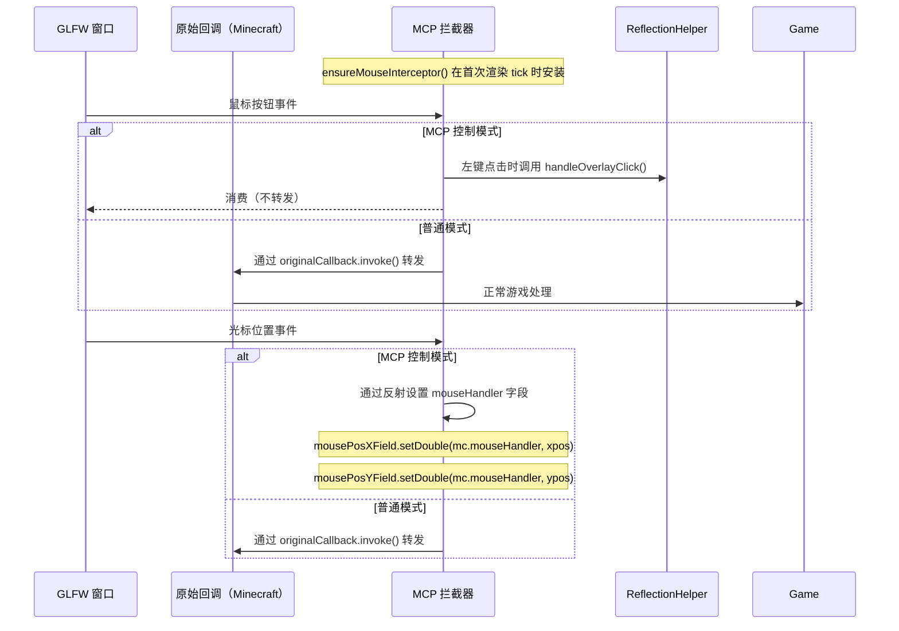
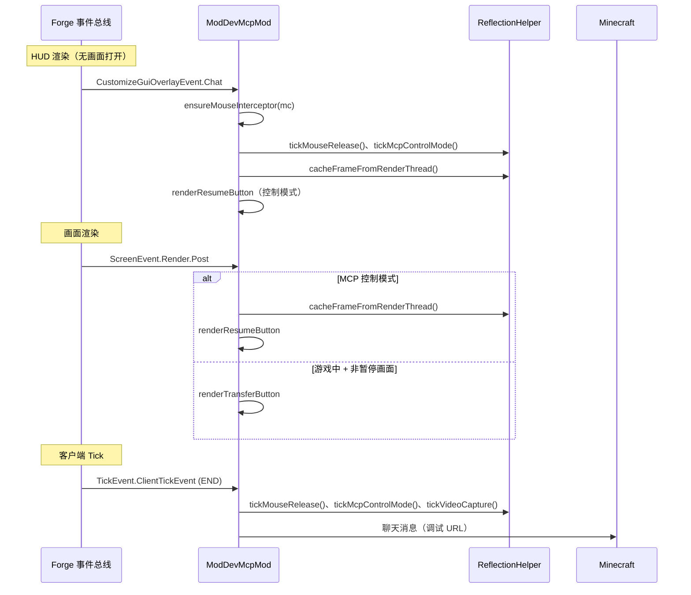
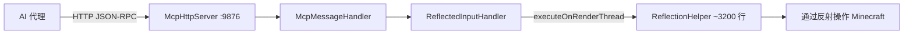

# Minecraft 1.17.1 Forge 注入原理

[English](../en/1.17.1+forge.md) | [中文](1.17.1+forge.md)

## 概述

适用于 Minecraft 1.17.1 Forge 的 MCP 模组使用 **Forge 事件总线**系统与 **GLFW 后端**。这是现代 Forge 时代（ForgeGradle 3+），引入了 `mods.toml`、通过 `FMLJavaModLoadingContext` 进行基于 Lambda 表达式的事件注册，以及 GLFW 鼠标管理。从 LWJGL2 到 GLFW 的过渡（始于 1.13）从根本上改变了鼠标输入的处理方式——用 GLFW 回调拦截取代了 `MouseHelper` 字段替换模式。

## 入口点

### mods.toml

```toml
modLoader="javafml"
loaderVersion="[37,)"
license="MIT"

[[mods]]
modId="mcpmod"
version="1.0.0"
displayName="ModDev MCP"
```

### 模组类构造函数

```java
@Mod("mcpmod")
public class ModDevMcpMod {
    public ModDevMcpMod() {
        INSTANCE = this;
        
        // Modern way: register on mod event bus via FMLJavaModLoadingContext
        FMLJavaModLoadingContext.get().getModEventBus().addListener(this::setup);
        
        // Start HTTP server (background thread, 5s delay)
        new Thread("MCP-HTTP") { ... }.start();
        
        // Register game event listeners via LAMBDAS
        MinecraftForge.EVENT_BUS.addListener((ScreenEvent.Opening event) -> { ... });
        MinecraftForge.EVENT_BUS.addListener((ScreenEvent.Init.Post event) -> { ... });
        // ... etc
    }
}
```

与旧版 Forge 的主要区别：
1. **`mods.toml`** 文件是必需的（位于 `META-INF/mods.toml`）
2. **基于 Lambda 的注册**替代了 `@SubscribeEvent` 注解——每个事件处理器都是构造函数中的显式 Lambda 表达式
3. **`FMLJavaModLoadingContext`** 用于模组生命周期事件
4. **GLFW** 替代 LWJGL2 进行窗口/鼠标管理

## 事件总线注入（Minecraft 1.13-1.17）

```mermaid
flowchart TD
    subgraph "Forge 模组加载"
        MOD[@Mod 注解] --> CTR[构造函数]
        CTR --> FML[FMLJavaModLoadingContext.getModEventBus]
    end
    subgraph "事件处理器（均在构造函数中）"
        CTR --> E1[ScreenEvent.Opening]
        CTR --> E2[ScreenEvent.Init.Post]
        CTR --> E3[CustomizeGuiOverlayEvent.Chat]
        CTR --> E4[ScreenEvent.Render.Post]
        CTR --> E5[InputEvent.MouseButton.Pre]
        CTR --> E6[TickEvent.ClientTickEvent]
    end
    E1 --> BLOCK_PAUSE[在控制模式下拦截暂停画面]
    E2 --> PATCH[为暂停画面打上 MCP 按钮补丁]
    E3 --> HUD[HUD：帧缓存 + 恢复按钮 + GLFW 拦截]
    E4 --> SCREEN[画面：转移/恢复按钮]
    E5 --> MOUSE[输入：在控制模式下拦截鼠标]
    E6 --> TICK[Tick：视频 + 聊天 + 鼠标释放]
```

### 已注册的事件处理器

| 事件 | 用途 |
|-------|---------|
| `ScreenEvent.Opening` | 在 MCP 控制模式下拦截暂停画面打开（`event.setCanceled(true)`） |
| `ScreenEvent.Init.Post` | 画面初始化后：找到最宽的暂停按钮，分割为两半，添加 MCP 转移按钮 |
| `CustomizeGuiOverlayEvent.Chat` | HUD 渲染层：缓存帧、渲染恢复按钮、确保 GLFW 鼠标拦截器就位 |
| `ScreenEvent.Render.Post` | 画面渲染后：在非暂停画面上渲染转移或恢复按钮 |
| `InputEvent.MouseButton.Pre` | 鼠标处理前：在控制模式下拦截点击，处理叠加层点击 |
| `TickEvent.ClientTickEvent` | 客户端 tick（END 阶段）：tick 逻辑、聊天消息、视频捕获 |

## GLFW 鼠标回调拦截

这是与旧版 Forge 之间的**关键架构差异**。从 1.13 开始，Minecraft 使用 GLFW，这意味着鼠标输入通过 `GLFW.glfwSetMouseButtonCallback()` 和 `GLFW.glfwSetCursorPosCallback()` 注册的回调进行。



**`ensureMouseInterceptor()` 工作原理**（1.14.4-1.17.1）：
1. 在首次 HUD 渲染 tick 时，拦截器被延迟安装
2. `GLFW.glfwSetMouseButtonCallback()` 替换 GLFW 级别的鼠标按钮回调
3. `GLFW.glfwSetCursorPosCallback()` 替换 GLFW 级别的光标位置回调
4. 保存原始回调，在普通模式下转发给它们
5. 在 MCP 控制模式下，事件被消费而不转发
6. 光标位置仍通过反射更新（以便 Minecraft 知道光标位置但无法将其用于游戏操作）

## 渲染管线



## 暂停画面按钮补丁

```mermaid
flowchart TD
    EVENT[ScreenEvent.Init.Post] --> CHECK{Screen instanceof PauseScreen?}
    CHECK -->|否| SKIP[跳过]
    CHECK -->|是| FIND[找到最宽按钮，宽度 ≥ 150]
    FIND -->|未找到| SKIP
    FIND -->|找到| SPLIT[水平分割按钮]
    SPLIT --> SET[右侧：原始按钮变窄]
    SET --> ADD[左侧：新增"转移至 MCP"按钮]
    ADD --> CLICK{转移按钮被点击}
    CLICK --> ENTER[ReflectionHelper.enterMcpControlMode]
    ENTER --> CLOSE[mc.setScreen null]
```

暂停画面补丁通过以下方式实现：
1. 通过反射遍历 childList 字段，找到宽度 >= 150 的最宽 AbstractWidget
2. 设置原始按钮占据右半部分（留 8px 间距）
3. 在左半部分添加一个新的 Button.builder()，标签为 "Transfer to MCP" / "MCP Take Over"
4. 新按钮的 onClick 调用 ReflectionHelper.enterMcpControlMode() 并关闭画面

## HTTP 服务器架构



HTTP 服务器在模组初始化 5 秒后启动（以确保 Minecraft 完全加载）。

## 版本特定说明

- **1.13.2**：Forge 25.0.223，Java 8。首个基于 GLFW 的版本（过渡性）。鼠标处理更简单——依赖事件取消，而非 GLFW 回调拦截。
- **1.14.4**：Forge 28.2.28，Java 8。引入了 GLFW 鼠标拦截器。使用 `GuiGraphics` 进行渲染。
- **1.15.2**：Forge 31.2.60，Java 8。ForgeGradle 6.0+。
- **1.16.5**：Forge 36.2.34，Java 8。稳定的现代 Forge。
- **1.17.1**：Forge 37.1.1，Java 16。需要 Java 16+（JVM 要求重大变更）。基于深度的渲染变更开始。Minecraft 开始使用更多现代 Java 特性（records、pattern matching 预览）。由于 Java 16 强封装，反射字段访问可能有所不同。

## 关键区别：旧版 vs 现代 Forge

| 特性 | 旧版 (1.8-1.12) | 现代 (1.13+) |
|---------|-------------------|----------------|
| 窗口系统 | LWJGL2 | GLFW |
| 模组元数据 | 仅 `@Mod` | `@Mod` + `mods.toml` |
| 事件注册 | `@SubscribeEvent` + `.register(this)` | 构造函数中的 Lambda 表达式 |
| 鼠标控制 | `MouseHelper` 字段替换 | GLFW 回调拦截器 |
| 鼠标抓取状态 | `Mouse.setGrabbed(false)` | `GLFW.glfwSetInputMode(..., GLFW_CURSOR, GLFW_CURSOR_NORMAL)` |
| 渲染 | `Gui.drawRect()` | `GuiGraphics.fill()` |
| Minecraft 访问 | `Minecraft.getMinecraft()` | `Minecraft.getInstance()` |
| 翻译 | 手动 `.lang` 解析 | `Component.translatable()` |
| 画面字段 | `mc.currentScreen` | `mc.screen` |

## 关键文件

| 文件 | 角色 |
|------|------|
| `src/main/resources/META-INF/mods.toml` | Forge 模组元数据 |
| `src/main/java/.../ModDevMcpMod.java` | 包含所有事件监听器的主模组类（约 250-300 行） |
| `build.gradle` | ForgeGradle 构建配置 |
