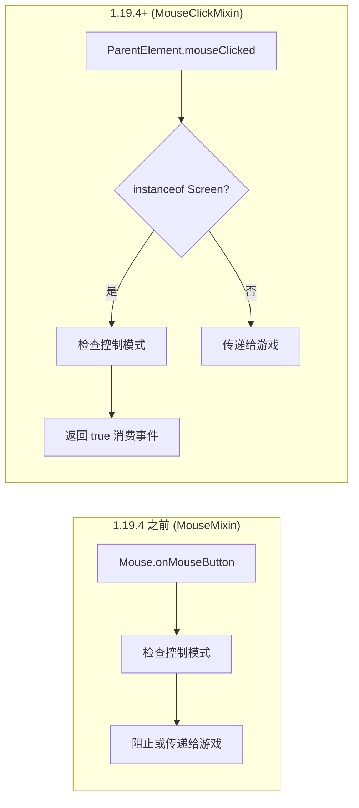
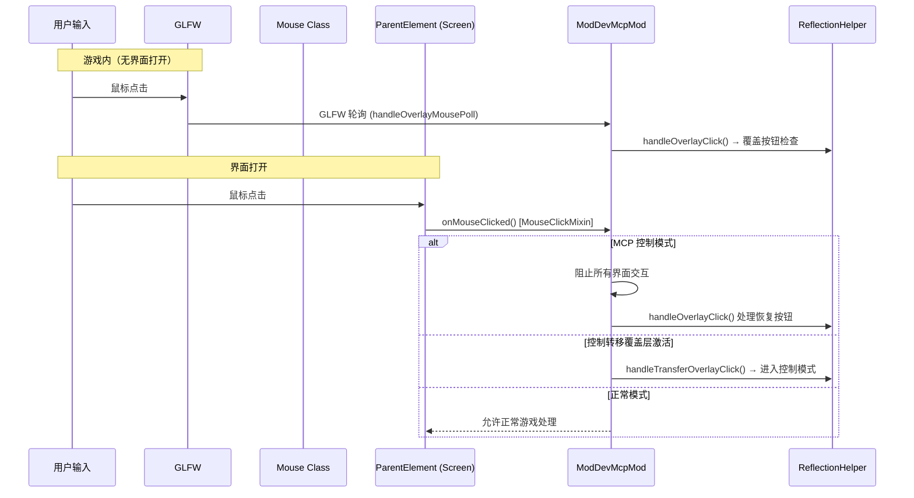
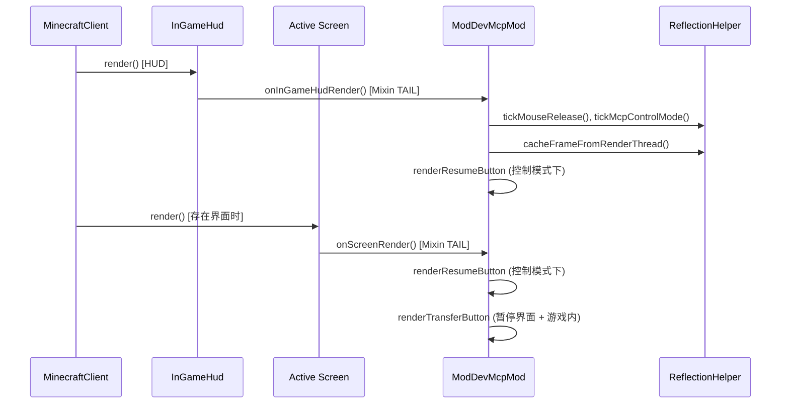

# Minecraft 1.20.6 Fabric 注入原理

[English](../en/1.20.6+fabric.md) | [中文](1.20.6+fabric.md)

## 概述

Minecraft 1.20.6 Fabric 的 MCP 模组使用 **SpongePowered Mixin** 字节码注入来挂钩原版 Minecraft 客户端。此版本使用了 `MouseClickMixin` 模式（在 1.19.4 中引入），该模式针对 `ParentElement.mouseClicked()` 而非 `Mouse.onMouseButton()`。

## 入口点

Fabric 模组通过 `fabric.mod.json` 加载：

```json
{
  "schemaVersion": 1,
  "id": "mcpmod",
  "version": "1.0.0",
  "name": "ModDev MCP",
  "environment": "client",
  "entrypoints": {
    "client": ["xyz.langyo.minecraft.mcp.mod.ModDevMcpMod"]
  },
  "mixins": ["mcpmod.mixins.json"]
}
```

`ModDevMcpMod` 实现了 `ClientModInitializer`。在 `onInitializeClient()` 中：
1. 存储 `INSTANCE` 引用
2. 生成 `MCP-HTTP` 后台线程（延迟 5 秒后在 9876 端口启动 McpHttpServer）
3. 将调试 URL 打印到 stdout

## Mixin 配置

1.20.6 的 `mcpmod.mixins.json`：

```json
{
  "required": true,
  "package": "xyz.langyo.minecraft.mcp.mod.mixin",
  "compatibilityLevel": "JAVA_21",
  "client": [
    "InGameHudMixin",
    "ScreenMixin",
    "MouseClickMixin",
    "MinecraftClientMixin"
  ],
  "injectors": { "defaultRequire": 1 }
}
```

## Mixin 钩子

```mermaid
flowchart TD
    subgraph "Fabric Loader Bootstrap"
        FL[Fabric Loader] --> CI[ClientModInitializer.onInitializeClient]
    end
    subgraph "Mixin Weaving (1.20.6)"
        MI[Mixin Config] --> M1[InGameHudMixin]
        MI --> M2[ScreenMixin]
        MI --> M3[MouseClickMixin]
        MI --> M4[MinecraftClientMixin]
    end
    subgraph "Injection Targets"
        T1[InGameHud.render]
        T2[Screen.render]
        T3[ParentElement.mouseClicked]
        T4[MinecraftClient.tick]
    end
    M1 -->|@Inject TAIL| T1
    M2 -->|@Inject TAIL| T2
    M3 -->|@Inject HEAD cancellable| T3
    M4 -->|@Inject TAIL| T4
    T1 --> CO[缓存 GL 帧缓冲区 + 渲染覆盖层]
    T2 --> SR[渲染控制转移/恢复按钮]
    T3 --> II[屏幕级鼠标拦截]
    T4 --> TR[Tick：视频、鼠标释放、聊天]
```

### InGameHudMixin

```java
@Mixin(InGameHud.class)
public class InGameHudMixin {
    @Inject(method = "render", at = @At("TAIL"))
    private void onRender(DrawContext context, float tickDelta, CallbackInfo ci) {
        ModDevMcpMod.INSTANCE.onInGameHudRender(context, tickDelta);
    }
}
```

在 `InGameHud.render()` 的 TAIL 处挂钩，用于：
- 为 `/api/screenshot` 缓存 OpenGL 帧缓冲区
- 处理鼠标释放和 MCP 控制模式
- 在控制模式下渲染"恢复手动控制"覆盖按钮
- 当 `mc.currentScreen != null` 时跳过渲染

### ScreenMixin

```java
@Mixin(Screen.class)
public class ScreenMixin {
    @Inject(method = "render", at = @At("TAIL"))
    private void onRender(DrawContext ctx, int mouseX, int mouseY, float delta, CallbackInfo ci) {
        ModDevMcpMod.INSTANCE.onScreenRender(ctx, (Screen)(Object)this, mouseX, mouseY, delta);
    }
}
```

在所有界面渲染的 TAIL 处挂钩，用于：
- 在控制模式下，在任何界面上显示"恢复手动控制"按钮
- 在游戏中的非暂停界面上显示"转移至 MCP"按钮
- 在控制模式下缓存帧画面

### MouseClickMixin

```java
@Mixin(ParentElement.class)
public interface MouseClickMixin {
    @Inject(method = "mouseClicked", at = @At("HEAD"), cancellable = true)
    default void onMouseClicked(double mouseX, double mouseY, int button, CallbackInfoReturnable<Boolean> cir) {
        var self = (Object) this;
        if (self instanceof Screen) {
            double[] pos = new double[]{mouseX, mouseY};
            if (ModDevMcpMod.INSTANCE != null && ModDevMcpMod.INSTANCE.onMouseClicked(pos)) {
                cir.setReturnValue(true);
            }
        }
    }
}
```

这是一个**接口混入**，针对 `ParentElement`（所有 `Screen` 实现都继承自它）。这种架构非常优雅，因为：
- 它针对抽象 GUI 元素层次结构，而非原始输入层
- 仅在点击目标是 `Screen` 实例时触发（而非游戏内鼠标）
- 返回 `true` 表示点击已被处理（消费事件）
- 它替代了针对底层 `Mouse` 类的 `MouseMixin.onMouseButton`

### MinecraftClientMixin

```java
@Mixin(MinecraftClient.class)
public class MinecraftClientMixin {
    @Inject(method = "tick", at = @At("TAIL"))
    private void onTick(CallbackInfo ci) {
        ModDevMcpMod.INSTANCE.onClientTick();
    }
}
```

在 `MinecraftClient.tick()` 之后注入，用于：
- 处理视频捕获（`ReflectionHelper.tickVideoCapture`）
- 通过 `GLFW.glfwGetMouseButton` 轮询覆盖鼠标（处理界面外的 HUD 覆盖点击）
- 在首次 tick 时发送调试 URL 聊天消息
- 跟踪上一次左键状态用于边沿检测（`prevLeftPressed` 跟踪）

## MouseClickMixin 与 MouseMixin 对比



**MouseClickMixin 的优势**：
1. **接口混入** —— 无需继承具体类，适用于所有 Screen 实现
2. **针对 GUI 层** —— 仅拦截界面点击，而非原始游戏鼠标事件
3. **更清晰的事件消费** —— 返回布尔值而非调用 `ci.cancel()`
4. **上下文感知** —— 通过 `instanceof` 检查仅在 Screen 实例上触发

## 输入拦截流程



## 渲染管线



## HTTP 服务器架构

```mermaid
flowchart LR
    subgraph "AI Agent"
        AI[External Process]
    end
    subgraph "Minecraft JVM"
        HTTP[McpHttpServer :9876]
        MSG[McpMessageHandler]
        RI[ReflectedInputHandler]
        RF[ReflectionHelper core ~3200 lines]
        MIX[Mixin Hooks]
    end
    AI -->|JSON-RPC over HTTP| HTTP
    HTTP --> MSG
    MSG --> RI
    RI -->|RenderThread.execute| RF
    RF -->|GL readbacks + reflection| GAME[Minecraft State]
    MIX -->|@Inject callbacks| MOD[ModDevMcpMod]
    MOD --> RF
    RF -.->|SSE events| HTTP
```

## 版本特定说明

- **Java 21**：Minecraft 1.20.6 自带 Java 21，体现在 `JAVA_21` 兼容级别上
- **Fabric Loader 0.16.0**：使用 0.16.x Loader 系列及更新的 Loom 工具链
- **ParentElement 接口混入**：`MouseClickMixin`（在 1.19.4 中引入）作用于 `ParentElement` —— 在官方映射中所有 Screen 实例都继承此接口
- **官方映射**：1.20.6 使用 Mojang 的官方映射（`net.minecraft.*`）而非中间名称
- **聊天组件 API**：使用 `Component.translatable()` 和 `ClickEvent.Action.OPEN_URL`（1.19 中引入的现代 API）
- **1.19.4**：Fabric Loader 0.15.6，Java 17 编译，首个使用 `MouseClickMixin` 的版本

## 关键文件

| 文件 | 作用 |
|------|------|
| `src/main/resources/fabric.mod.json` | 声明 ClientModInitializer 入口点 + Mixin 配置 |
| `src/main/resources/mcpmod.mixins.json` | Mixin 配置（JAVA_21） |
| `src/main/java/.../mixin/InGameHudMixin.java` | HUD 渲染尾部注入 |
| `src/main/java/.../mixin/ScreenMixin.java` | 界面渲染尾部注入 |
| `src/main/java/.../mixin/MouseClickMixin.java` | ParentElement 接口混入，用于鼠标拦截 |
| `src/main/java/.../mixin/MinecraftClientMixin.java` | 客户端 tick 尾部注入 |
| `src/main/java/.../ModDevMcpMod.java` | ClientModInitializer（约 180 行） |
