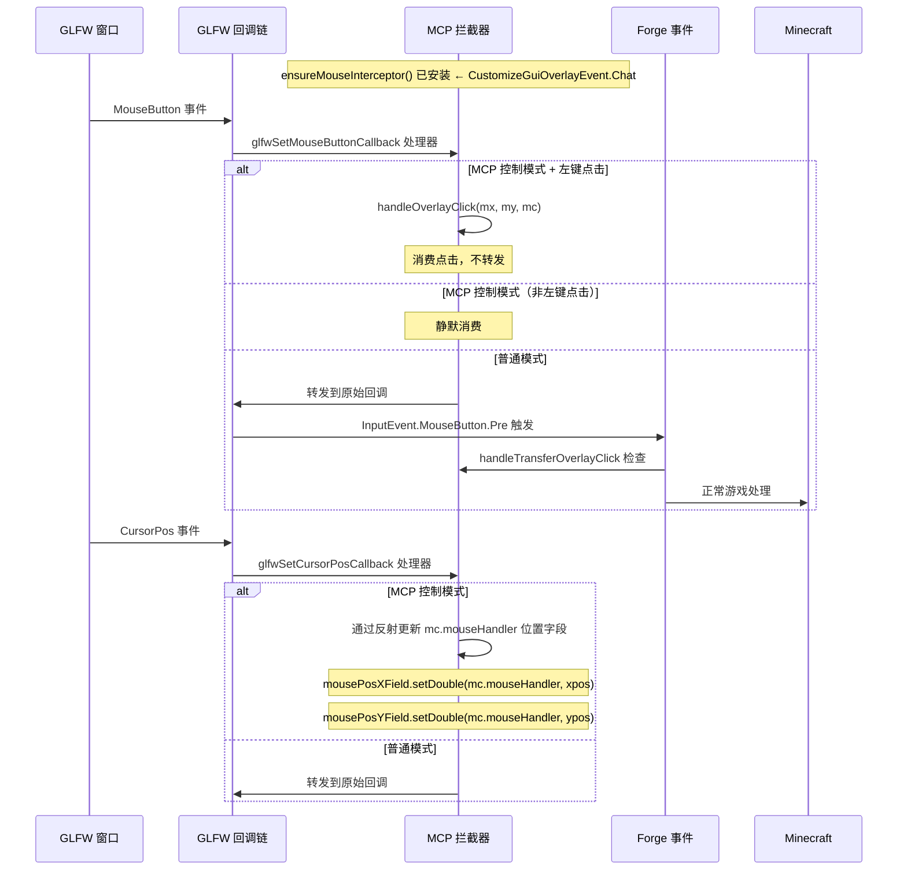
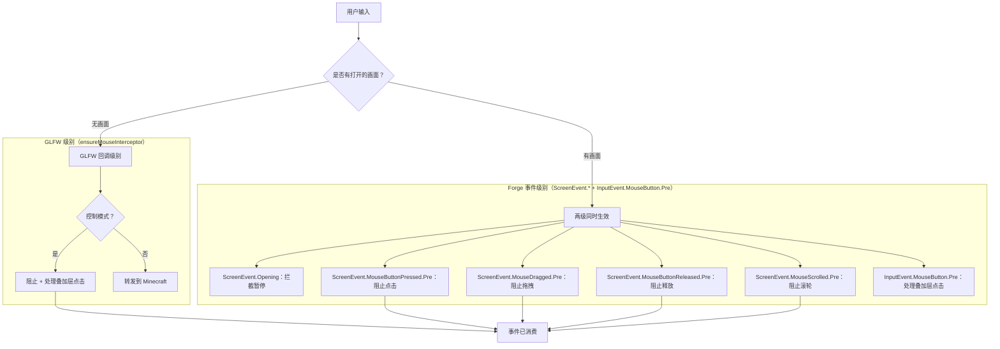

# Minecraft 1.20.6 Forge 注入原理

[English](../en/1.20.6+forge.md) | [中文](1.20.6+forge.md)

## 概述

适用于 Minecraft 1.20.6 Forge 的 MCP 模组使用 **Forge 事件总线**系统与 **GLFW 回调拦截**实现完整的鼠标控制。这是成熟的现代 Forge 时代（ForgeGradle 6.x），包含 `mods.toml`、基于 Lambda 表达式的事件注册，以及全面的 GLFW 级别鼠标管理。由于完备的鼠标输入拦截系统，版本 1.20.6 代表了最复杂的 Forge 注入实现。

## 入口点

### mods.toml

```toml
modLoader="javafml"
loaderVersion="[50,)"
license="MIT"

[[mods]]
modId="mcpmod"
version="1.0.0"
displayName="ModDev MCP"
```

### 模组类构造函数

```java
@Mod("mcpmod")
public class ModDevMcpMod {
    public ModDevMcpMod() {
        INSTANCE = this;
        FMLJavaModLoadingContext.get().getModEventBus().addListener(this::setup);
        
        // HTTP server on background thread (5s delay)
        new Thread("MCP-HTTP") { ... }.start();
        
        // All game event listeners registered as lambdas in constructor:
        MinecraftForge.EVENT_BUS.addListener((ScreenEvent.Opening event) -> { ... });
        MinecraftForge.EVENT_BUS.addListener((ScreenEvent.Init.Post event) -> { ... });
        MinecraftForge.EVENT_BUS.addListener((CustomizeGuiOverlayEvent.Chat event) -> { ... });
        MinecraftForge.EVENT_BUS.addListener((ScreenEvent.Render.Post event) -> { ... });
        MinecraftForge.EVENT_BUS.addListener((ScreenEvent.MouseButtonPressed.Pre event) -> { ... });
        MinecraftForge.EVENT_BUS.addListener((ScreenEvent.MouseDragged.Pre event) -> { ... });
        MinecraftForge.EVENT_BUS.addListener((ScreenEvent.MouseButtonReleased.Pre event) -> { ... });
        MinecraftForge.EVENT_BUS.addListener((ScreenEvent.MouseScrolled.Pre event) -> { ... });
        MinecraftForge.EVENT_BUS.addListener((InputEvent.MouseButton.Pre event) -> { ... });
        MinecraftForge.EVENT_BUS.addListener((TickEvent.ClientTickEvent event) -> { ... });
    }
}
```

## 完整事件处理器映射

```mermaid
flowchart TD
    subgraph "Forge 事件总线 - 1.20.6"
        CTR[模组构造函数] --> FML[FMLJavaModLoadingContext]
    end
    
    subgraph "画面生命周期"
        OPEN[ScreenEvent.Opening] -->|控制模式下拦截暂停| B1[setCanceled true]
        INIT[ScreenEvent.Init.Post] -->|暂停画面补丁| B2[添加转移按钮]
    end
    
    subgraph "HUD 渲染"
        CHAT[CustomizeGuiOverlayEvent.Chat] -->|HUD 层| H1[ensureMouseInterceptor]
        CHAT --> H2[tickMouseRelease + tickMcpControlMode]
        CHAT --> H3[cacheFrameFromRenderThread]
        CHAT --> H4[控制模式下渲染恢复按钮]
    end
    
    subgraph "画面渲染"
        RPOST[ScreenEvent.Render.Post] -->|画面绘制后| S1[控制模式下缓存帧]
        RPOST --> S2[渲染恢复按钮或转移按钮]
    end
    
    subgraph "画面鼠标事件"
        MPRE[ScreenEvent.MouseButtonPressed.Pre] -->|仅控制模式| M1[handleOverlayClick + setCanceled]
        MDRA[ScreenEvent.MouseDragged.Pre] -->|控制模式| M2[setCanceled true]
        MREL[ScreenEvent.MouseButtonReleased.Pre] -->|控制模式| M3[setCanceled true]
        MSCRL[ScreenEvent.MouseScrolled.Pre] -->|控制模式| M4[setCanceled true]
    end
    
    subgraph "原始输入"
        IPRE[InputEvent.MouseButton.Pre] -->|所有鼠标| I1[检查 shouldSuppressInput]
        IPRE --> I2[控制模式下处理叠加层点击]
        IPRE --> I3[画面上处理转移叠加层点击]
    end
    
    subgraph "游戏 Tick"
        TICK[TickEvent.ClientTickEvent END] -->|每 tick| T1[tickMouseRelease + tickMcpControlMode]
        TICK --> T2[tickVideoCapture]
        TICK --> T3[发送聊天调试 URL 消息一次]
    end
```



### 完整事件处理器列表

| 事件 | 优先级 | 用途 |
|-------|----------|---------|
| `ScreenEvent.Opening` | - | 在 MCP 控制模式下取消暂停画面打开 |
| `ScreenEvent.Init.Post` | - | 找到最宽暂停按钮，分割为两半，添加 MCP 转移按钮 |
| `CustomizeGuiOverlayEvent.Chat` | CHAT 层 | HUD：帧缓存、恢复按钮、确保 GLFW 鼠标拦截器就位 |
| `ScreenEvent.Render.Post` | POST | 画面叠加层：转移/恢复按钮 |
| `ScreenEvent.MouseButtonPressed.Pre` | PRE | 在控制模式下阻止画面鼠标点击 |
| `ScreenEvent.MouseDragged.Pre` | PRE | 在控制模式下阻止拖拽 |
| `ScreenEvent.MouseButtonReleased.Pre` | PRE | 在控制模式下阻止释放 |
| `ScreenEvent.MouseScrolled.Pre` | PRE | 在控制模式下阻止滚轮 |
| `InputEvent.MouseButton.Pre` | PRE | 原始鼠标按钮拦截（游戏 + 画面） |
| `TickEvent.ClientTickEvent` | END | 每 tick 逻辑、视频捕获、聊天消息 |

## GLFW 鼠标回调拦截（高级）

此版本拥有**最全面的鼠标拦截**——结合了 GLFW 回调劫持与 Forge 事件取消。



### GLFW 拦截器实现

```java
private static void ensureMouseInterceptor(Minecraft mc) {
    if (mouseInterceptorInstalled) return;
    
    long handle = mc.getWindow().getWindow();
    
    // Replace mouse button callback
    originalMouseButtonCallback = GLFW.glfwSetMouseButtonCallback(handle, (window, button, action, mods) -> {
        if (ReflectionHelper.isMcpControlMode()) {
            if (button == 0 && action == 1) {  // Left click release
                double mx = getMouseX(mc);
                double my = getMouseY(mc);
                ReflectionHelper.handleOverlayClick((int)mx, (int)my, mc);
            }
            return;  // Consume: don't forward to game
        }
        if (originalMouseButtonCallback != null) {
            originalMouseButtonCallback.invoke(window, button, action, mods);
        }
    });
    
    // Replace cursor position callback
    originalCursorCallback = GLFW.glfwSetCursorPosCallback(handle, (window, xpos, ypos) -> {
        if (ReflectionHelper.isMcpControlMode()) {
            // Silently update position fields via reflection
            // so Minecraft knows cursor position but can't process it
            mousePosXField.setDouble(mc.mouseHandler, xpos);
            mousePosYField.setDouble(mc.mouseHandler, ypos);
            return;
        }
        if (originalCursorCallback != null) {
            originalCursorCallback.invoke(window, xpos, ypos);
        }
    });
    
    // Find the double fields in MouseHandler by type inspection
    // (field names vary across versions)
    for (Field f : mc.mouseHandler.getClass().getDeclaredFields()) {
        if (f.getType() == double.class) {
            if (firstDouble == null) firstDouble = f;
            else { secondDouble = f; break; }
        }
    }
    mouseInterceptorInstalled = true;
}
```

**关键设计选择**：
1. **延迟安装**——拦截器在首次 HUD 渲染 tick 时安装（而非在构造函数中）
2. **两级拦截**——GLFW 回调劫持（用于游戏中/物品栏）+ Forge 画面事件（用于 GUI 画面）
3. **光标位置透传**——光标位置字段通过反射静默更新，这样游戏不会认为鼠标被冻结了
4. **原始回调保存**——回调链被保留以确保普通模式正常工作

## 双层输入阻止架构



## 暂停画面补丁

```mermaid
flowchart LR
    EVENT[ScreenEvent.Init.Post] --> SCREEN{是 PauseScreen？}
    SCREEN -->|否| DONE[完成]
    SCREEN -->|是| SCAN[反射：扫描所有 childList 字段]
    SCAN --> FIND[找到最宽 AbstractWidget，宽度 ≥ 150]
    FIND --> SPLIT[分割：间隙 = 8px]
    SPLIT --> REPOSITION[右侧：原始组件调整大小]
    REPOSITION --> ADD[左侧：新建 Button.builder，标签"转移至 MCP"]
    ADD --> CALLBACK[onClick: enterMcpControlMode + setScreen null]
```

使用 `ScreenEvent.Init.Post` 配合 `event.getScreen()` 和 `event.addListener(transferBtn)` 来添加按钮。

## HTTP 服务器架构

```mermaid
flowchart LR
    AI[AI 代理] -->|HTTP| HTTP[McpHttpServer :9876]
    HTTP --> MSG[McpMessageHandler]
    MSG --> RI[ReflectedInputHandler]
    RI -->|RenderThread| RF[ReflectionHelper]
    RF --> GAME[通过反射操作 Minecraft 状态]
    
    HTTP --> SSE[SSE /api/events]
    HTTP --> SS[/api/screenshot]
    HTTP --> CMD[/api/cmd]
    HTTP --> STATUS[/api/status]
```

## 版本特定说明

- **1.20.6**：Forge 50.2.8，Java 21。最复杂的 Forge 注入——ModDevMcpMod 共 303 行。使用官方 Mojang 映射。使用 `Component.translatable()` 进行国际化。

## 关键文件

| 文件 | 角色 |
|------|------|
| `src/main/resources/META-INF/mods.toml` | 模组元数据（必需） |
| `src/main/java/.../ModDevMcpMod.java` | 包含所有事件监听器的主类（约 250-303 行，取决于版本） |
| `build.gradle` | ForgeGradle 6.x 配置 |
