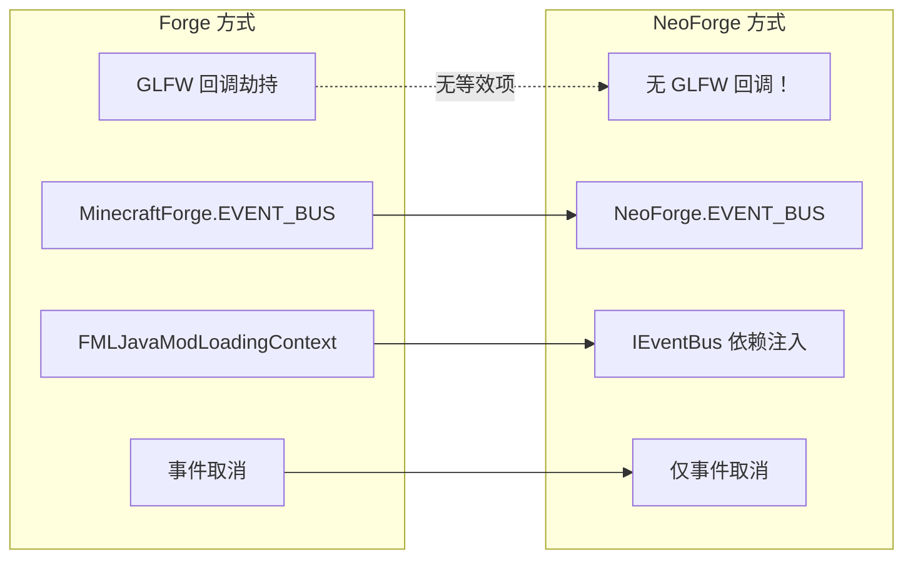
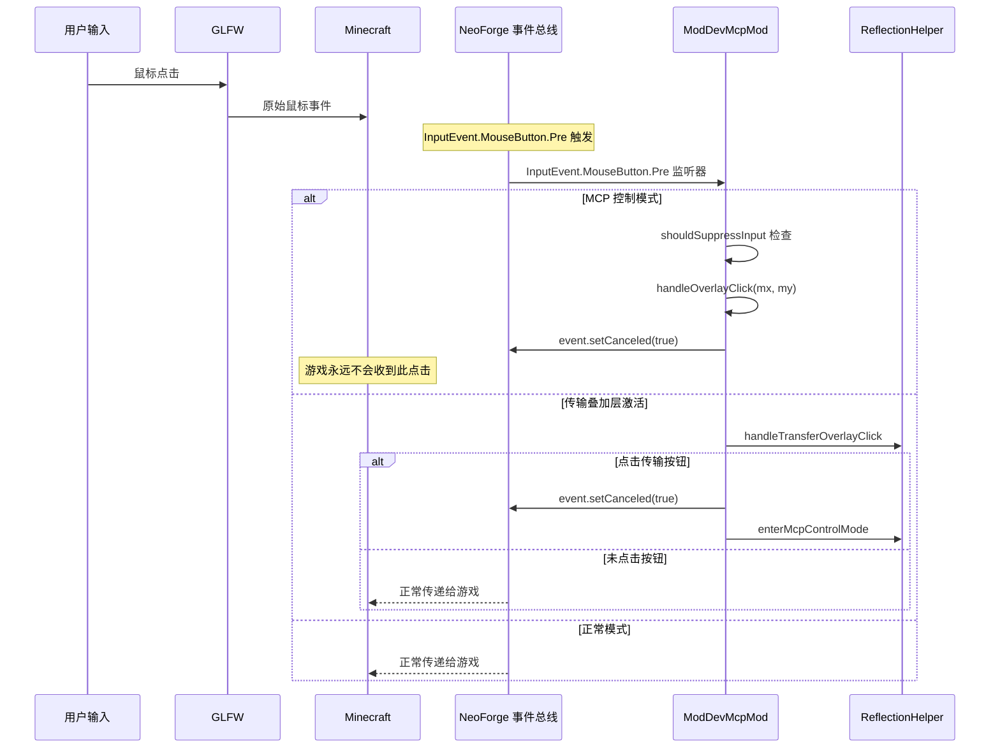
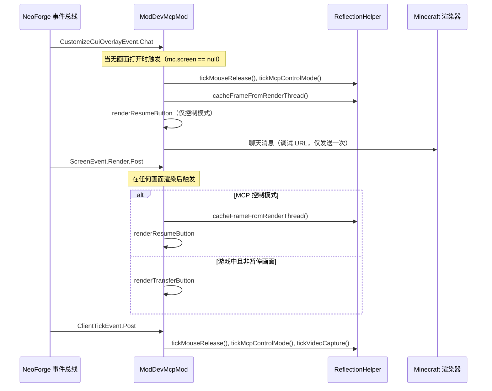
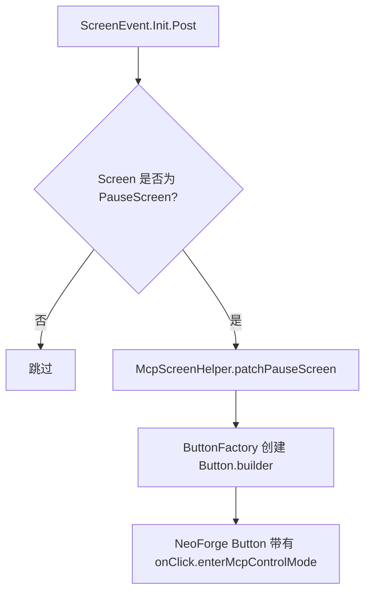
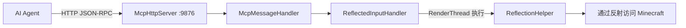

# Minecraft 1.20.6 NeoForge 注入原理

[English](../en/1.20.6+neoforge.md) | [中文](1.20.6+neoforge.md)

## 概述

MCP Mod 在 Minecraft 1.20.6 NeoForge 中使用 **NeoForge 事件总线**系统配合**纯事件驱动注入** —— 无 Mixin，无 GLFW 回调劫持。与 Forge 不同，NeoForge 完全依赖通过其 `IEventBus` 依赖注入模式进行事件取消。这使得注入更加简洁，但意味着鼠标控制仅限于事件能够取消的范围。

## 入口点

### neoforge.mods.toml

```toml
modLoader="javafml"
loaderVersion="[4,)"
license="MIT"

[[mods]]
modId="mcpmod"
version="0.1.0"
displayName="ModDev MCP"
```

**注意**：NeoForge 使用 `neoforge.mods.toml`（而不是 Forge 的 `mods.toml`）。

### 使用依赖注入的 Mod 类

```java
@Mod("mcpmod")
public class ModDevMcpMod {
    public ModDevMcpMod(IEventBus modBus) {  // IEventBus 由 NeoForge 注入
        INSTANCE = this;
        
        // Mod 生命周期事件
        modBus.addListener(this::setup);
        
        // 在后台线程上启动 HTTP 服务器（延时 5 秒）
        new Thread("MCP-HTTP") { ... }.start();
        
        // 通过 NeoForge.EVENT_BUS 注册游戏事件监听器：
        NeoForge.EVENT_BUS.addListener((ScreenEvent.Init.Post event) -> { ... });
        NeoForge.EVENT_BUS.addListener((CustomizeGuiOverlayEvent.Chat event) -> { ... });
        NeoForge.EVENT_BUS.addListener((ScreenEvent.Render.Post event) -> { ... });
        NeoForge.EVENT_BUS.addListener((InputEvent.MouseButton.Pre event) -> { ... });
        NeoForge.EVENT_BUS.addListener((ClientTickEvent.Post event) -> { ... });
    }
}
```

**NeoForge 与 Forge 的主要差异**：
1. **依赖注入**：构造函数接收 `IEventBus modBus` —— 不使用 `FMLJavaModLoadingContext`
2. **`NeoForge.EVENT_BUS`** 替代 `MinecraftForge.EVENT_BUS`（不同的包：`net.neoforged.neoforge.common.NeoForge`）
3. **`ClientTickEvent.Post`** 替代 `TickEvent.ClientTickEvent` —— NeoForge 有自己独立的 tick 事件层级
4. **无 GLFW 回调拦截** —— 纯事件驱动的输入拦截
5. **`neoforge.mods.toml`** 替代 `mods.toml`

## 事件处理器架构

```mermaid
flowchart TD
    subgraph "NeoForge 依赖注入系统"
        MOD[@Mod 注解] --> CTR[构造函数:IEventBus modBus]
        CTR --> MODBUS[modBus.addListener]
        CTR --> NEOBUS[NeoForge.EVENT_BUS.addListener]
    end
    
    subgraph "已注册的事件处理器"
        NEOBUS --> E1[ScreenEvent.Init.Post]
        NEOBUS --> E2[CustomizeGuiOverlayEvent.Chat]
        NEOBUS --> E3[ScreenEvent.Render.Post]
        NEOBUS --> E4[InputEvent.MouseButton.Pre]
        NEOBUS --> E5[ClientTickEvent.Post]
    end
    
    E1 -->|暂停画面| PATCH[注入 MCP 接管按钮]
    E2 -->|HUD| TICK[tickMouseRelease + tickMcpControlMode]
    E2 -->|HUD| CACHE[cacheFrameFromRenderThread]
    E2 -->|HUD| RESUME[renderResumeButton]
    E3 -->|画面| SR_BUTTONS[renderResume/Transfer 按钮]
    E4 -->|输入| INPUT[shouldSuppressInput + 叠加层点击 + 传输点击]
    E5 -->|Tick| TICK_ALL[tickMouseRelease + tickMcpControlMode + tickVideoCapture + chat]
```

### 事件处理器详情

| 事件（NeoForge） | 等效事件（Forge） | 用途 |
|-----------------|-------------------|------|
| `ScreenEvent.Init.Post` | `ScreenEvent.Init.Post` | 向暂停画面注入 MCP 按钮 |
| `CustomizeGuiOverlayEvent.Chat` | `CustomizeGuiOverlayEvent.Chat` | HUD：帧缓存、恢复按钮、tick 逻辑 |
| `ScreenEvent.Render.Post` | `ScreenEvent.Render.Post` | 画面叠加层按钮 |
| `InputEvent.MouseButton.Pre` | `InputEvent.MouseButton.Pre` | 鼠标输入拦截 |
| `ClientTickEvent.Post` | `TickEvent.ClientTickEvent` | 每 tick 逻辑 + 聊天消息 |

## NeoForge 与 Forge：注入对比



**为什么 NeoForge 不需要 GLFW 钩子**：NeoForge 的事件系统提供了更全面的输入事件，可以在更高层级进行取消。通过取消 `InputEvent.MouseButton.Pre`，游戏中的所有鼠标处理都被停止 —— 无需 GLFW 级别的拦截。

## 输入拦截（纯事件方式）



这种方式的主要优势：**更简单**（无需 GLFW 回调管理），但有限制：它无法独立控制鼠标光标位置 —— 只能阻止事件，不能重定向光标移动。

## 渲染管线



## 暂停画面注入



在 NeoForge 中，`McpScreenHelper.patchPauseScreen()` 方法与 Forge 的工作方式相同，但使用 NeoForge 的 `Button.builder()`：

```java
NeoForge.EVENT_BUS.addListener((ScreenEvent.Init.Post event) -> {
    if (event.getScreen() instanceof PauseScreen pauseScreen) {
        McpScreenHelper.patchPauseScreen(pauseScreen, new McpScreenHelper.ButtonFactory() {
            @Override public Object createButton(String translationKey, Runnable onClick, int x, int y, int w, int h) {
                return Button.builder(Component.translatable(translationKey), btn -> onClick.run())
                    .bounds(x, y, w, h).build();
            }
        });
    }
});
```

## HTTP 服务器架构



## 版本特定细节

- **NeoForge 20.6.139**，Minecraft 1.20.6，NeoGradle 2.0.141，Java 21
- **无 GLFW 回调拦截** —— 这是更简洁的 NeoForge 方式。所有鼠标控制通过 `InputEvent.MouseButton.Pre` 取消完成。
- 仅 5 个事件处理器（最小集合）：画面初始化、HUD 叠加层、画面渲染、鼠标输入、客户端 tick
- 不需要画面级别的鼠标事件（`MouseButtonPressed.Pre`、`MouseDragged.Pre` 等），因为单个 `InputEvent.MouseButton.Pre` 取消即可阻止一切
- `ModDevMcpMod` 仅 171 行 —— 明显短于 Forge 等效版本（303 行）
- 使用标准 `GuiGraphics`（而非 `GuiGraphicsExtractor`）
- 使用 `McpScreenHelper.patchPauseScreen()` 进行暂停画面注入（共享工具类）
- 聊天消息直接通过 `mc.gui.getChat().addMessage(Component)` 发送

## 关键差异：NeoForge 与 Forge 总结

| 特性 | Forge 1.20.6 | NeoForge 1.20.6 |
|------|-------------|------------------------|
| Mod 元数据 | `mods.toml` | `neoforge.mods.toml` |
| 构造函数 | 无参数 + `FMLJavaModLoadingContext` | `IEventBus modBus` 参数 |
| 事件总线 | `MinecraftForge.EVENT_BUS` | `NeoForge.EVENT_BUS` |
| Tick 事件 | `TickEvent.ClientTickEvent` | `ClientTickEvent.Post` |
| 鼠标策略 | GLFW 回调劫持 + 事件 | 仅事件（无 GLFW） |
| 包前缀 | `net.minecraftforge.*` | `net.neoforged.neoforge.*` |
| 渲染类 | `GuiGraphics`（1.20.6）/ `GuiGraphicsExtractor`（26.1.2） | `GuiGraphics` |
| 键盘拦截 | 未使用 | 未实现 |
| 聊天发送 | 直接 `mc.gui.getChat().addMessage()` | 直接 `mc.gui.getChat().addMessage(Component)` 调用 |

## 关键文件

| 文件 | 作用 |
|------|------|
| `src/main/resources/META-INF/neoforge.mods.toml` | NeoForge Mod 元数据 |
| `src/main/java/.../ModDevMcpMod.java` | 主 Mod 类（约 171-207 行） |
| `build.gradle` | NeoGradle 2.0.141 配置 |
