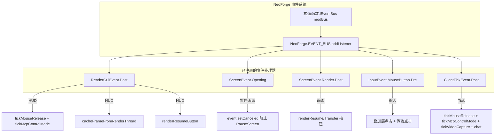
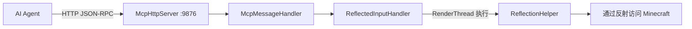

# Minecraft 1.21.11 NeoForge 注入原理

[English](../en/1.21.11+neoforge.md) | [中文](1.21.11+neoforge.md)

## 概述

MCP Mod 在 Minecraft 1.21.11 NeoForge 中使用 **NeoForge 事件总线**系统配合**纯事件驱动注入** —— 无 Mixin，无 GLFW 回调劫持。架构与 26.1.2 NeoForge 一致，但使用 `GuiGraphics`（非 26.x 的 `GuiGraphicsExtractor`）。1.21.11 版本的 API 变化包括 `Window.handle()`（替代 `getWindow()`）和 `ClickEvent.OpenUrl`（替代 `ClickEvent(Action.OPEN_URL, url)`）。

## 入口点

### neoforge.mods.toml

```toml
modLoader="javafml"
loaderVersion="[3,)"
license="MIT"

[[mods]]
modId="mcpmod"
version="0.1.0"
displayName="ModDev MCP"
```

### 使用依赖注入的 Mod 类

```java
@Mod("mcpmod")
public class ModDevMcpMod {
    public ModDevMcpMod(IEventBus modBus) {
        INSTANCE = this;
        
        new Thread("MCP-HTTP") { ... }.start();
        
        NeoForge.EVENT_BUS.addListener((RenderGuiEvent.Post event) -> { ... });
        NeoForge.EVENT_BUS.addListener((ScreenEvent.Opening event) -> { ... });
        NeoForge.EVENT_BUS.addListener((ScreenEvent.Render.Post event) -> { ... });
        NeoForge.EVENT_BUS.addListener((InputEvent.MouseButton.Pre event) -> { ... });
        NeoForge.EVENT_BUS.addListener((ClientTickEvent.Post event) -> { ... });
    }
}
```

## 事件处理器架构



### 事件处理器详情

| 事件 | 用途 |
|------|------|
| `RenderGuiEvent.Post` | HUD：帧缓存、恢复按钮、tick 逻辑 |
| `ScreenEvent.Opening` | 阻止 PauseScreen 打开（控制模式下） |
| `ScreenEvent.Render.Post` | 画面叠加层按钮 |
| `InputEvent.MouseButton.Pre` | 鼠标输入拦截 |
| `ClientTickEvent.Post` | 每 tick 逻辑 + 聊天消息 |

## 与 26.1.2 NeoForge 的差异

| 特性 | 26.1.2 NeoForge | 1.21.11 NeoForge |
|------|----------------|-----------------|
| 渲染类 | `GuiGraphicsExtractor` | `GuiGraphics` |
| Window handle | `getWindow().handle()` | `getWindow().handle()`（相同） |
| ClickEvent | `ClickEvent.OpenUrl(URI)` | `ClickEvent.OpenUrl(URI)`（相同） |
| 字体渲染 | 反射调用 `drawInBatch()` | 直接 `g.drawString()` |
| 聊天发送 | 反射调用 `addMessage()` | 直接 `mc.gui.getChat().addMessage()` |
| HUD 事件 | `CustomizeGuiOverlayEvent.Chat` | `RenderGuiEvent.Post` |
| 暂停画面 | `ScreenEvent.Opening` 取消 | `ScreenEvent.Opening` 取消（相同） |

**说明**：1.21.11 使用官方 Mojang 映射，因此可以直接调用 API 而不需要反射。26.1.2 同样使用官方映射但使用了 `GuiGraphicsExtractor`（MC 26.x 的 API 变化）。

## HTTP 服务器架构



## 版本特定细节

- **NeoForge 21.11.42**，Java 21，NeoGradle 2.0.141
- 使用 **`GuiGraphics`**（不是 26.x 的 `GuiGraphicsExtractor`）
- `Window.handle()` 替代 `Window.getWindow()`（MC 1.21.11 API 变化）
- `ClickEvent.OpenUrl(java.net.URI)` 替代 `ClickEvent(Action.OPEN_URL, url)`（MC 1.21.11 API 变化）
- 使用 `RenderGuiEvent.Post` 替代 `CustomizeGuiOverlayEvent.Chat`（避免剪刀裁剪）
- 暂停画面通过 `ScreenEvent.Opening` + `event.setCanceled(true)` 阻止（无闪烁）
- 直接 `g.drawString(mc.font, ...)` 调用，无需反射
- 直接 `mc.gui.getChat().addMessage(msg)` 调用，无需反射
- 共 200 行

## 已知限制

### MCP 控制模式下左键点击无法破坏方块

在 MCP 控制模式下（3D 第一人称视角），左键点击被 `InputEvent.MouseButton.Pre` 事件消费用于 overlay 按钮交互，不会传递给 Minecraft 的方块破坏逻辑。这导致在 MCP 控制期间无法通过左键破坏方块或攻击实体。

**原因**：NeoForge 的 `InputEvent.MouseButton.Pre` 取消机制会完全阻止游戏接收该点击事件。如果将非 overlay 区域的点击放行，会导致光标状态不一致（游戏尝试切换到光标可见模式），引发不可预期的行为。

**影响**：该问题与 Forge 版本一致。MCP 控制模式下右键正常，左键仅用于点击 overlay 按钮（恢复手动控制）。若需在 MCP 控制下破坏方块，需通过 HTTP API 发送 `press_key` / `left_click` 命令实现。

## 关键文件

| 文件 | 作用 |
|------|------|
| `src/main/resources/META-INF/neoforge.mods.toml` | NeoForge Mod 元数据 |
| `src/main/java/.../ModDevMcpMod.java` | 主 Mod 类（约 200 行） |
| `build.gradle` | NeoGradle 2.0.141 配置 |
