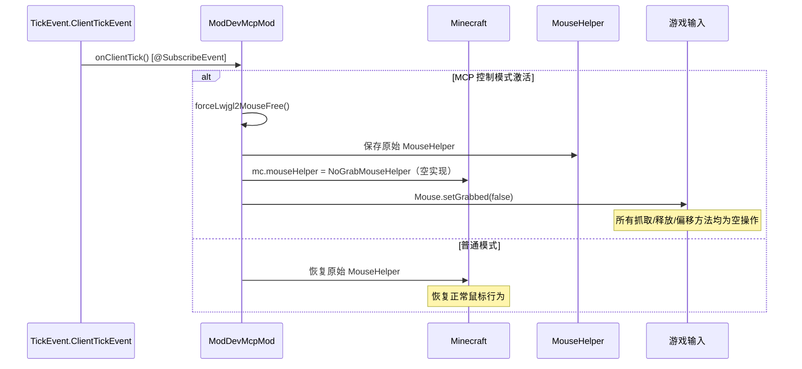
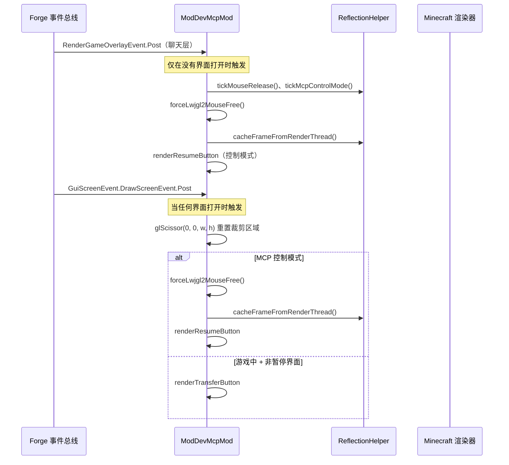
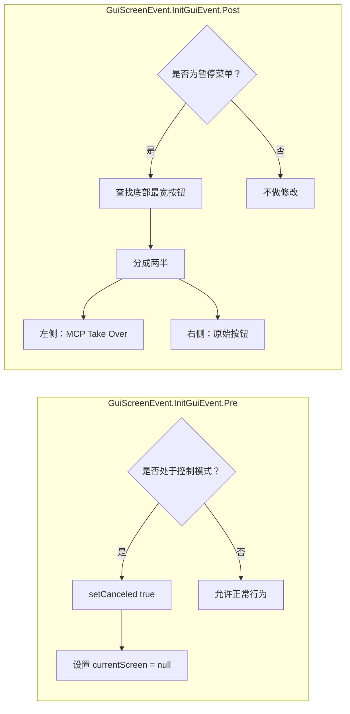

# Minecraft 1.8.9 Forge 注入原理

[English](../en/1.8.9+forge.md) | [中文](1.8.9+forge.md)

## 概述

Minecraft 1.8.9 Forge 的 MCP 模组使用 **Forge 事件总线** 系统进行注入。这属于旧版 Forge 时代（ForgeGradle 2.x），早于 `mods.toml` 的引入，使用 `@Mod.EventHandler` 注解代替。注入完全依赖 `@SubscribeEvent` 监听器和一个自定义的 `MouseHelper` 替换来实现输入控制。**没有使用 Mixin**，也**没有 coremod**——一切完全由事件驱动。

## 入口点

模组通过 `@Mod` 注解声明：

```java
@Mod(modid = "mcpmod", name = "ModDev MCP", version = "1.0")
public class ModDevMcpMod {
    @Mod.Instance("mcpmod")
    public static ModDevMcpMod instance;
```

**没有 `mods.toml`**——该特性是在 Forge 1.13+ 中引入的。`@Mod` 注解本身即可注册模组。

### 初始化

```java
@Mod.EventHandler
public void init(FMLInitializationEvent event) {
    INSTANCE = this;
    // 在后台线程上启动 HTTP 服务器（延迟 5 秒）
    new Thread(() -> {
        Thread.sleep(5000);
        ReflectedInputHandler handler = new ReflectedInputHandler(...);
        httpServer = new McpHttpServer(handler, McpConfig.getServerPort());
        httpServer.start();
    }, "MCP-HTTP").start();
    
    // 将所有事件处理器注册到 MinecraftForge 的 EVENT_BUS 上
    MinecraftForge.EVENT_BUS.register(this);
}
```

与现代 Forge 的关键架构差异：`MinecraftForge.EVENT_BUS.register(this)` 注册整个类实例，所有 `@SubscribeEvent` 方法通过注解扫描被发现。

## 事件总线注入

```mermaid
flowchart TD
    subgraph "Forge 模组加载"
        MOD[@Mod 注解] --> INIT[init: FMLInitializationEvent]
        INIT --> BUS[MinecraftForge.EVENT_BUS.register]
    end
    subgraph "已注册的事件处理器"
        BUS --> E1[onGuiInitPre: GuiScreenEvent.InitGuiEvent.Pre]
        BUS --> E2[onGuiInit: GuiScreenEvent.InitGuiEvent.Post]
        BUS --> E3[onRenderOverlay: RenderGameOverlayEvent.Post]
        BUS --> E4[onDrawScreen: GuiScreenEvent.DrawScreenEvent.Post]
        BUS --> E5[onMouseInput: MouseEvent]
        BUS --> E6[onGuiMouseInputPre: GuiScreenEvent.MouseInputEvent.Pre]
        BUS --> E7[onClientTick: TickEvent.ClientTickEvent]
    end
    E3 -->|聊天层| RENDER[帧缓存 + 恢复按钮]
    E4 -->|绘制后| SCREEN[传送/恢复按钮]
    E5 -->|原始鼠标| BLOCK_MOUSE[控制模式下阻止输入]
    E7 -->|每帧| TICK[帧更新 + 强制鼠标释放]
```

### 旧版 Forge 事件分类

| 事件 | 阶段 | 用途 |
|-------|-------|---------|
| `GuiScreenEvent.InitGuiEvent.Pre` | 界面初始化前 | 在 MCP 控制模式下阻止暂停界面（`event.setCanceled(true)`） |
| `GuiScreenEvent.InitGuiEvent.Post` | 界面初始化后 | 修改暂停界面，添加"MCP 接管"按钮 |
| `RenderGameOverlayEvent.Post` | HUD 渲染后（聊天层） | 帧缓存 + 恢复按钮渲染 |
| `GuiScreenEvent.DrawScreenEvent.Post` | 界面绘制后 | 传送/恢复按钮渲染 |
| `MouseEvent` | 原始鼠标输入 | 控制模式下阻止鼠标 |
| `GuiScreenEvent.MouseInputEvent.Pre` | 界面鼠标输入 | 控制模式下阻止界面鼠标 |
| `TickEvent.ClientTickEvent` | 客户端帧更新（开始 + 结束） | 强制释放鼠标、帧逻辑、视频捕获 |

## 输入拦截——MouseHelper 替换（LWJGL2）

这是旧版 Forge 注入**最显著的特征**。由于 Minecraft 1.8.9 使用 **LWJGL2**（而非 GLFW），鼠标通过 `net.minecraft.util.MouseHelper` 管理，而不是 GLFW 回调。



### NoGrabMouseHelper

```java
private static class NoGrabMouseHelper extends net.minecraft.util.MouseHelper {
    @Override public void grabMouseCursor() {}        // 空操作
    @Override public void ungrabMouseCursor() {        // 仅释放
        try { Mouse.setGrabbed(false); } catch (Exception ignored) {}
    }
    @Override public void mouseXYChange() {            // 清零偏移量
        deltaX = 0;
        deltaY = 0;
    }
}
```

**工作原理**：
1. 进入 MCP 控制模式时，保存原始的 `Minecraft.mouseHelper`
2. 用 `NoGrabMouseHelper` 实例替换——所有抓取/释放/偏移方法被中和
3. `Mouse.setGrabbed(false)` 强制将光标从游戏窗口中释放
4. 循环调用 `Mouse.next()` 以清空 LWJGL2 鼠标事件队列
5. 退出控制模式时，通过直接字段赋值恢复原始 `MouseHelper`

这是一个**无需反射的字段交换**——在这些 Minecraft 版本中，`mouseHelper` 字段是 public 的，可以直接访问。

## 渲染管线



## 暂停界面修改



暂停界面修改流程：
1. 通过反射遍历字段列表，在暂停界面底部找到宽度 >= 150 的最宽按钮
2. 将其分成两半（间隔 8px）
3. 右半部分：保留原始按钮（例如"返回游戏"）
4. 左半部分：添加一个新的"MCP Take Over"按钮，调用 `ReflectionHelper.enterMcpControlMode()` 后关闭界面

## 翻译系统（旧版）

与现代版本使用 Minecraft 的 `Component.translatable()` 不同，旧版 Forge 使用手动翻译映射：

```java
private static Map<String, String> translations = new HashMap<>();
// 通过手动文件 I/O 从 /assets/mcpmod/lang/{{locale}}.lang 加载
```

## HTTP 服务器桥接

```mermaid
flowchart LR
    AI[AI Agent] -->|HTTP JSON-RPC| HTTP[McpHttpServer :9876]
    HTTP --> MSG[McpMessageHandler]
    MSG --> RI[ReflectedInputHandler]
    RI --> RF[ReflectionHelper]
    RF --> GAME[通过反射操作 Minecraft]
    Note over RF: 使用 ScaledResolution 进行坐标映射
```

## 版本特定说明

- **Forge 1.8.9** 使用 ForgeGradle 2.x 和 LWJGL2
- 没有 `mods.toml`——仅使用 `@Mod` 注解
- 不支持 Mixin——纯粹由事件驱动
- `MouseHelper` 字段为 **public**，可直接替换
- 使用 `Minecraft.getMinecraft()`（单例），而非 `Minecraft.getInstance()`
- 使用 `ScaledResolution` 进行坐标映射（而非 `Window.getGuiScaledWidth()`）
- 使用 `Gui.drawRect()` 填充矩形（而非 `DrawContext.fill()`）
- 使用 `mc.ingameGUI` 代替 `mc.gui`，`mc.fontRenderer` 代替 `mc.font`
- `ClickEvent` 使用旧版 net.minecraft.util.text.event 包中的 `ClickEvent.Action.OPEN_URL`
- **1.8.9**：Forge 1.8.9-11.15.1.2318，LWJGL 2.9.1，Java 8

## 与现代 Forge 的关键区别

| 特性 | 旧版 Forge（1.8-1.12） | 现代 Forge（1.13+） |
|---------|------------------------|---------------------|
| 模组声明 | 仅 `@Mod` 注解 | `@Mod` + `mods.toml` |
| 事件注册 | `MinecraftForge.EVENT_BUS.register(this)` | `MinecraftForge.EVENT_BUS.addListener(lambda)` |
| 事件处理器发现 | `@SubscribeEvent` 注解扫描 | 构造函数中通过 Lambda 注册 |
| 鼠标管理 | `MouseHelper` 字段交换（LWJGL2） | GLFW 回调拦截器 |
| 渲染 API | `Gui.drawRect()`、`ScaledResolution` | `GuiGraphics.fill()` / `DrawContext` |
| 翻译系统 | 手动 `.lang` 文件解析 | `Component.translatable()` |
| Minecraft 访问方式 | `Minecraft.getMinecraft()` | `Minecraft.getInstance()` |
| 加载阶段 | `FMLInitializationEvent` | `FMLJavaModLoadingContext.get().getModEventBus()` |

## 关键文件

| 文件 | 角色 |
|------|------|
| `src/main/java/.../ModDevMcpMod.java` | 主模组类，包含所有事件处理器（1.12.2 版本约 346 行） |
| `build.gradle` | ForgeGradle 2.x 构建配置 |
