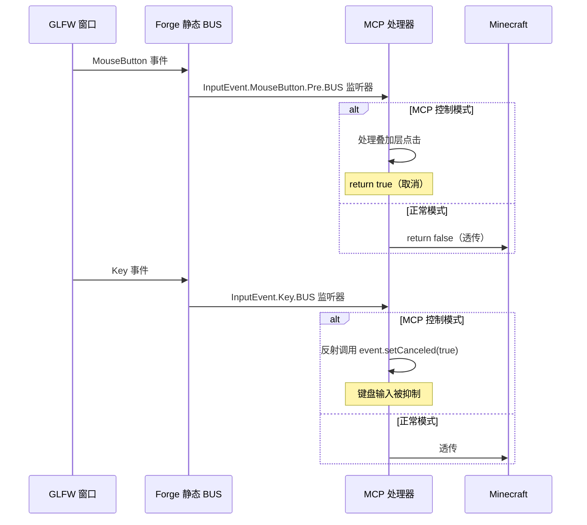
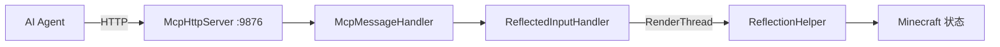

# Minecraft 26.1.2 Forge 注入原理

[English](../en/26.1.2+forge.md) | [中文](26.1.2+forge.md)

## 概述

MCP Mod 在 Minecraft 26.1.2 Forge 中使用 **Forge 事件总线**配合**新的静态 BUS API**。这是最新的 Forge 时代（ForgeGradle 7+），引入了静态事件总线引用（例如 `ScreenEvent.Opening.BUS`），取代了已弃用的 `FMLJavaModLoadingContext` 方式。这代表了注入流程中的一次重大 API 现代化。

## 入口点

### mods.toml

```toml
modLoader="javafml"
loaderVersion="[7.0.23,8)"
license="MIT"

[[mods]]
modId="mcpmod"
version="0.1.0"
displayName="ModDev MCP"
```

### Mod 类构造函数（新的静态 BUS API）

```java
@Mod("mcpmod")
public class ModDevMcpMod {
    public ModDevMcpMod() {
        INSTANCE = this;
        
        // 注意：没有 FMLJavaModLoadingContext！使用新的静态 BUS 引用。
        
        // 在后台线程上启动 HTTP 服务器
        new Thread("MCP-HTTP") { ... }.start();
        
        // 使用 Lambda 监听器的静态 BUS 引用：
        ScreenEvent.Opening.BUS.addListener(event -> { ... });
        ScreenEvent.Init.Post.BUS.addListener(event -> { ... });
        CustomizeGuiOverlayEvent.Chat.BUS.addListener(event -> { ... });
        ScreenEvent.Render.Post.BUS.addListener(event -> { ... });
        ScreenEvent.MouseButtonPressed.Pre.BUS.addListener(event -> { ... });
        ScreenEvent.MouseDragged.Pre.BUS.addListener(event -> { ... });
        ScreenEvent.MouseButtonReleased.Pre.BUS.addListener(event -> { ... });
        ScreenEvent.MouseScrolled.Pre.BUS.addListener(event -> { ... });
        InputEvent.MouseButton.Pre.BUS.addListener(event -> { ... });
        InputEvent.Key.BUS.addListener(event -> { ... }) （新增 — 键盘拦截已添加）
        TickEvent.ClientTickEvent.BUS.addListener(event -> { ... });
    }
}
```

## 静态 BUS API 与旧 API 对比

```mermaid
flowchart LR
    subgraph "旧 API（1.13-1.20）"
        OLD_FML[FMLJavaModLoadingContext.get().getModEventBus()]
        OLD_FORGE[MinecraftForge.EVENT_BUS.addListener]
    end
    subgraph "新静态 BUS API（1.21+）"
        NEW_SO[ScreenEvent.Opening.BUS]
        NEW_SI[ScreenEvent.Init.Post.BUS]
        NEW_CO[CustomizeGuiOverlayEvent.Chat.BUS]
        NEW_SR[ScreenEvent.Render.Post.BUS]
        NEW_IM[InputEvent.MouseButton.Pre.BUS]
        NEW_TC[TickEvent.ClientTickEvent.BUS]
    end
    
    OLD_FORGE -- "已弃用" --> NEW_SO & NEW_SI & NEW_CO & NEW_SR & NEW_IM & NEW_TC
```

**关键变化**：每个事件类现在都定义了自己的静态 `BUS` 字段。事件不再通过一个全局的 `MinecraftForge.EVENT_BUS` 注册，而是直接注册到其专用总线上。这使得：
1. 更好的编译时类型安全
2. 更便捷的 IDE 支持（`.BUS` 上的自动补全）
3. 对于这些事件不再依赖 `MinecraftForge.EVENT_BUS`
4. 监听器返回类型变得有意义 —— `boolean` 返回值可以取消事件（新模式）

### 布尔返回值模式

在新 API 中，某些 BUS 监听器返回一个布尔值，而不是调用 `event.setCanceled(true)`：

```java
// 旧 API（1.20.6）：
MinecraftForge.EVENT_BUS.addListener((ScreenEvent.MouseButtonPressed.Pre event) -> {
    if (controlMode) {
        event.setCanceled(true);  // 副作用
    }
});

// 新 API（26.1.2）：
ScreenEvent.MouseButtonPressed.Pre.BUS.addListener(event -> {
    if (controlMode) {
        return true;  // 返回值表示取消
    }
    return false;
});
```

## 完整事件处理器映射

```mermaid
flowchart TD
    subgraph "Forge 静态 BUS API - 26.1.2"
        CTR[Mod 构造函数] --> SO[ScreenEvent.Opening.BUS]
        CTR --> SI[ScreenEvent.Init.Post.BUS]
        CTR --> CO[CustomizeGuiOverlayEvent.Chat.BUS]
        CTR --> SR[ScreenEvent.Render.Post.BUS]
        CTR --> SM[ScreenEvent.MouseButtonPressed.Pre.BUS]
        CTR --> SD[ScreenEvent.MouseDragged.Pre.BUS]
        CTR --> SRB[ScreenEvent.MouseButtonReleased.Pre.BUS]
        CTR --> SS[ScreenEvent.MouseScrolled.Pre.BUS]
        CTR --> IM[InputEvent.MouseButton.Pre.BUS]
        CTR --> IK[InputEvent.Key.BUS]
        CTR --> TC[TickEvent.ClientTickEvent.BUS]
    end
    
    SO -->|控制模式| BLOCK[通过 setNewScreen null 阻止暂停画面]
    SI -->|暂停画面| PATCH[注入 MCP 接管按钮]
    
    subgraph "HUD 层"
        CO --> TICK[tickMouseRelease + tickMcpControlMode]
        CO --> CACHE[cacheFrameFromRenderThread]
        CO --> RESUME[renderResumeButton]
    end
    
    subgraph "画面叠加层"
        SR --> SRB_CACHE[控制模式下 cacheFrame]
        SR --> SRB_BTN[renderResume 或 renderTransfer 按钮]
    end
    
    subgraph "输入拦截"
        SM -->|return true| SM_BLOCK[阻止画面点击]
        SD -->|return true| SD_BLOCK[阻止画面拖拽]
        SRB -->|return true| SRB_BLOCK[阻止画面释放]
        SS -->|return true| SS_BLOCK[阻止画面滚轮]
        IM --> IM_LOGIC[shouldSuppressInput + 叠加层点击 + 传输点击]
        IK -->|反射 setCanceled| IK_BLOCK[阻止键盘输入]
    end
    
    TC --> TC_TICK[tickMouseRelease + tickMcpControlMode + tickVideoCapture]
    TC --> TC_CHAT[聊天调试 URL 消息]
```



## GLFW 鼠标回调拦截

**此版本中未使用！** 该版本不使用 GLFW 回调劫持，而是采用不同的策略：通过 `InputEvent.Key.BUS` 配合反射调用 `setCanceled()` 进行键盘输入拦截。鼠标输入完全通过 Forge 事件总线（`InputEvent.MouseButton.Pre.BUS`）处理，无需 GLFW 级别的回调。



## 暂停画面注入

与 1.20.6 方法相同，但使用新 API：
```java
ScreenEvent.Init.Post.BUS.addListener(event -> {
    if (event.getScreen() instanceof PauseScreen) {
        // 找到最宽的按钮，分割后添加 MCP 按钮
        event.addListener(transferBtn);  // 现代 API 使用 addListener()
    }
});
```

## HTTP 服务器网桥



## 版本特定细节

Forge 64.0.8，ForgeGradle 7.0.23+，Java 25。使用**非官方映射**（与使用官方映射的 1.21.7 不同）。`GuiGraphicsExtractor` 类替代了 `GuiGraphics` 来渲染 —— 它提供了 `getScissorStack()` 方法用于手动裁剪区域管理。键盘事件通过 `InputEvent.Key.BUS` 配合反射调用 `setCanceled()` 进行拦截。聊天消息使用反射调用 `addMessage()`（因为 API 签名在非官方映射下有所不同）。ModDevMcpMod 共 280 行。

## 已知限制

### MCP 控制模式下左键点击被屏蔽

与 1.21.7 Forge 相同的限制。在 MCP 控制模式下，所有左键点击（button 0）都会被 GLFW 拦截器消费，不会传递给 Minecraft 原始回调。这导致在 MCP 控制期间无法通过左键进行攻击、放置方块等操作。右键不受影响，可正常使用。

**原因**：26.1.2 Forge 的静态 `BUS` API 与 GLFW 回调存在双重事件处理问题。如果将非 overlay 区域的左键点击传递给原始 MC 回调，MC 会将光标瞬移到窗口中央并触发不可预期的状态切换。为确保 overlay 按钮点击（恢复/菜单）的稳定性，当前实现选择在 MCP 控制模式下完全拦截左键。

**影响**：MCP 控制模式下右键正常，左键仅用于点击 overlay 按钮（恢复手动控制 / 打开系统菜单）。

## 关键差异总结

| 特性 | 旧 Forge（1.20.6） | 新 Forge（26.1.2+） |
|------|-------------------|---------------------|
| 事件注册 | `MinecraftForge.EVENT_BUS.addListener()` | `EventClass.SubEvent.BUS.addListener()` |
| Mod 生命周期 | `FMLJavaModLoadingContext.get()` | 不使用（已弃用） |
| 取消模式 | `event.setCanceled(true)` | `return true`（布尔值） |
| 暂停画面阻止 | `event.setCanceled(true)` + 手动关闭画面 | `event.setNewScreen(null)` |
| ClickEvent | `ClickEvent.Action.OPEN_URL` | `ClickEvent.OpenUrl(URI)` |

## 关键文件

| 文件 | 作用 |
|------|------|
| `src/main/resources/META-INF/mods.toml` | Mod 元数据 |
| `src/main/java/.../ModDevMcpMod.java` | 主 Mod 类（约 280-294 行） |
| `build.gradle` | ForgeGradle 7.x 配置 |
